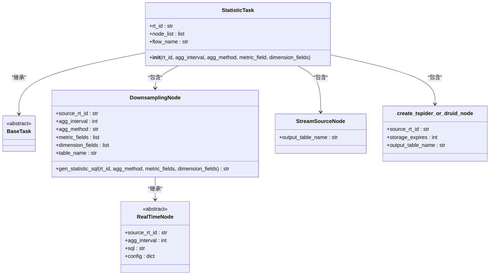
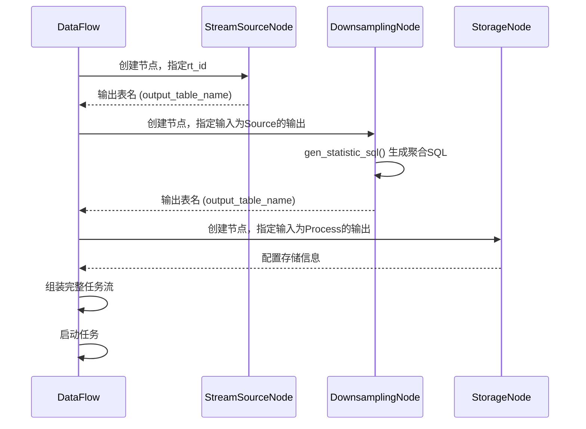

# 降采样

<cite>
**本文档引用的文件**   
- [downsample.py](file://bkmonitor/bkmonitor/dataflow/task/downsample.py)
- [processor.py](file://bkmonitor/bkmonitor/dataflow/node/processor.py)
- [default.py](file://bkmonitor/config/default.py)
- [unify_query.py](file://bkmonitor/packages/monitor_web/grafana/resources/unify_query.py)
- [time_series_unify_query.md](file://bkmonitor/support-files/apigw/docs/zh/time_series_unify_query.md)
</cite>

## 目录
1. [引言](#引言)
2. [降采样机制概述](#降采样机制概述)
3. [核心组件分析](#核心组件分析)
4. [降采样任务执行流程](#降采样任务执行流程)
5. [降采样算法与SQL生成](#降采样算法与sql生成)
6. [配置参数与调优建议](#配置参数与调优建议)
7. [查询层面的降采样](#查询层面的降采样)
8. [与其他组件的协同工作](#与其他组件的协同工作)
9. [总结](#总结)

## 引言

降采样是bk-monitor系统中处理长时间序列数据的关键机制，旨在平衡数据精度与存储成本。本文档全面阐述了该系统的降采样处理策略，详细说明了其目的、适用场景、实现原理以及与其他数据处理环节的协同工作机制。

## 降采样机制概述

降采样（Downsampling）是一种将高频率、高精度的原始监控数据，通过特定的聚合算法，转换为低频率、低精度数据的过程。在bk-monitor系统中，这一机制主要用于解决长期存储和高效查询的矛盾。

**目的**：
- **降低存储成本**：原始监控数据（如每15秒采集一次）会产生海量数据，直接长期存储成本极高。降采样通过聚合，显著减少了需要存储的数据点数量。
- **提升查询性能**：当用户查询数天或数月的历史数据时，如果返回所有原始数据点，不仅传输量大，前端渲染也会非常缓慢。降采样后的数据点更少，能极大提升查询和展示速度。
- **满足不同分析需求**：对于趋势分析、报表生成等场景，分钟级或小时级的聚合数据已经足够，无需使用秒级的原始数据。

**适用场景**：
- 长时间范围（如7天、30天）的监控图表展示。
- 生成日报、周报等周期性统计报告。
- 对历史数据进行趋势分析和容量规划。

## 核心组件分析

降采样功能主要由`bkmonitor`模块下的`dataflow`子系统实现，其核心组件包括`downsample.py`中的`StatisticTask`类和`processor.py`中的`DownsamplingNode`类。



**Diagram sources**
- [downsample.py](file://bkmonitor/bkmonitor/dataflow/task/downsample.py#L1-L63)
- [processor.py](file://bkmonitor/bkmonitor/dataflow/node/processor.py#L138-L181)

**Section sources**
- [downsample.py](file://bkmonitor/bkmonitor/dataflow/task/downsample.py#L1-L63)
- [processor.py](file://bkmonitor/bkmonitor/dataflow/node/processor.py#L106-L181)

## 降采样任务执行流程

降采样任务的执行是一个典型的流式数据处理流程，由`StatisticTask`类定义。其核心流程如下：

1.  **数据源 (StreamSourceNode)**：任务首先创建一个`StreamSourceNode`，指定原始数据所在的计算平台结果表（Result Table, RT）作为输入源。
2.  **降采样处理 (DownsamplingNode)**：接着创建一个`DownsamplingNode`，它作为处理节点，接收来自`StreamSourceNode`的数据流。该节点根据配置的聚合周期（`agg_interval`）、聚合方法（`agg_method`）、指标字段（`metric_field`）和维度字段（`dimension_fields`）来生成聚合SQL。
3.  **数据存储 (Storage Node)**：最后，创建一个存储节点（通过`create_tspider_or_druid_node`函数），将`DownsamplingNode`处理后的聚合结果写入到TSpider或Druid等存储系统中。



**Diagram sources**
- [downsample.py](file://bkmonitor/bkmonitor/dataflow/task/downsample.py#L40-L58)

**Section sources**
- [downsample.py](file://bkmonitor/bkmonitor/dataflow/task/downsample.py#L40-L58)

## 降采样算法与SQL生成

降采样的核心在于聚合算法的选择和SQL的生成。`DownsamplingNode`类负责这一关键逻辑。

**算法选择依据**：
- **平均值 (AVG)**：适用于需要了解指标平均水平的场景，如平均CPU使用率、平均响应时间。
- **最大值 (MAX)**：适用于关注指标峰值的场景，如最大内存占用、最大网络流量，常用于容量规划和告警。
- **最小值 (MIN)**：适用于关注指标低谷的场景，如最低可用内存。
- **求和 (SUM)**：适用于累加型指标，如总请求数、总错误数。
- **计数 (COUNT)**：用于统计事件发生的次数。

在`processor.py`中，`DEFAULT_AGG_METHOD`被定义为`MAX`，这表明系统默认更关注指标的峰值。

**SQL生成逻辑**：
`DownsamplingNode`通过重写`gen_statistic_sql`方法来生成特定的聚合SQL。其逻辑如下：
1.  对于每个指标字段，使用指定的聚合函数（如`MAX`）进行计算，并使用`AS`关键字保留原始字段名。
2.  将所有维度字段直接加入`SELECT`子句。
3.  使用`GROUP BY`子句，按所有维度字段进行分组。
4.  最终生成形如`SELECT MAX(`field1`) as `field1`, dim1, dim2 FROM source_table GROUP BY dim1, dim2`的SQL语句。

```python
def gen_statistic_sql(self, rt_id, agg_method, metric_fields, dimension_fields):
    agg_method = agg_method or self.DEFAULT_AGG_METHOD
    select_fields = []
    for f in metric_fields or []:
        # 为每个指标字段应用聚合函数
        select_fields.append("{}(`{}`) as `{}`".format(agg_method, f, f))

    dimension_fields = dimension_fields or []

    select = ",".join(select_fields + dimension_fields)
    group_by = ",".join(dimension_fields)
    return "SELECT {} FROM {} GROUP BY {}".format(select, rt_id, group_by)
```

**Section sources**
- [processor.py](file://bkmonitor/bkmonitor/dataflow/node/processor.py#L152-L168)

## 配置参数与调优建议

降采样系统的配置主要通过环境配置文件进行管理。

**关键配置参数**：
- `BK_DATA_DATA_EXPIRES_DAYS` (默认30天)：降采样后数据在MySQL（TSpider）中的默认保留天数。
- `BK_DATA_REALTIME_NODE_WAIT_TIME` (默认10秒)：实时计算节点的等待时间，用于处理可能的数据延迟，确保窗口期内的数据完整性。

这些参数定义在`config/default.py`文件中，可以在不同环境（开发、测试、生产）的配置文件中进行覆盖。

**调优建议**：
- **合理设置聚合周期**：聚合周期（`agg_interval`）是降采样的核心。周期过短，存储和查询压力依然很大；周期过长，会丢失过多细节。应根据业务需求和数据量进行权衡，例如，原始数据每15秒一条，可设置为每5分钟或每1小时聚合一次。
- **选择合适的聚合方法**：根据监控指标的业务含义选择聚合方法。对于资源利用率，`MAX`和`AVG`都很重要；对于计数类指标，`SUM`是首选。
- **优化存储策略**：利用`BK_DATA_DATA_EXPIRES_DAYS`和`BK_DATA_DATA_EXPIRES_DAYS_BY_HDFS`配置，对不同级别的数据设置不同的保留策略。例如，原始数据保留7天，5分钟聚合数据保留30天，1小时聚合数据保留180天。

**Section sources**
- [default.py](file://bkmonitor/config/default.py#L882-L891)

## 查询层面的降采样

除了在数据写入时进行的预降采样（Pre-downsampling），bk-monitor系统还支持在查询时进行动态降采样。

在`unify_query.py`中，`down_sample_range`参数被用于控制查询时的降采样行为。当用户查询大时间范围的数据时，系统会根据`down_sample_range`和查询的`interval`（时间间隔）自动判断是否需要进行降采样，并计算空点判断阈值，以保证数据的准确性。

此外，`time_series_unify_query.md`文档明确列出了`down_sample_range`作为API的一个可选参数，允许客户端在查询时指定降采样周期，从而实现更灵活的数据展示。

**Section sources**
- [unify_query.py](file://bkmonitor/packages/monitor_web/grafana/resources/unify_query.py#L197-L230)
- [time_series_unify_query.md](file://bkmonitor/support-files/apigw/docs/zh/time_series_unify_query.md#L7-L25)

## 与其他组件的协同工作

降采样机制并非孤立存在，它与bk-monitor系统的多个组件紧密协同：
- **与数据接入组件协同**：降采样任务依赖于数据接入组件将原始数据写入计算平台的结果表。
- **与告警引擎协同**：告警策略（`AlarmStrategyNode`）继承自`DownsamplingNode`，表明告警计算本身也是一种特殊的降采样过程，它将原始数据聚合为告警判断所需的统计值。
- **与统一查询组件协同**：统一查询服务（Unify Query）是降采样数据的最终消费者，它负责将存储的聚合数据返回给前端进行展示。
- **与计算平台API协同**：`api/bkdata/default.py`中定义了`CreateDataFlowForDownsample`、`StartDataFlowForDownsample`等API，`StatisticTask`正是通过调用这些API来在计算平台上创建、启动和管理降采样任务流。

## 总结

bk-monitor系统的降采样机制是一个高效、灵活的数据处理策略。它通过`StatisticTask`和`DownsamplingNode`等核心组件，在数据写入阶段对原始监控数据进行预聚合，有效降低了存储成本并提升了查询性能。系统支持多种聚合算法，并可通过配置文件进行参数调优。同时，系统还提供了查询时的动态降采样能力，满足了不同场景下的数据展示需求。该机制与数据接入、告警、查询等多个子系统深度集成，共同构成了一个完整的监控数据处理闭环。