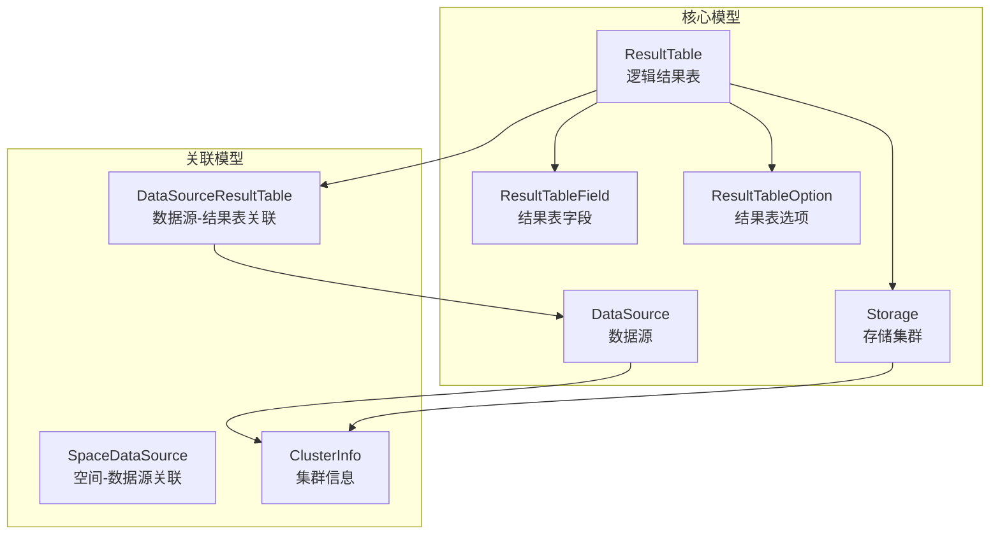
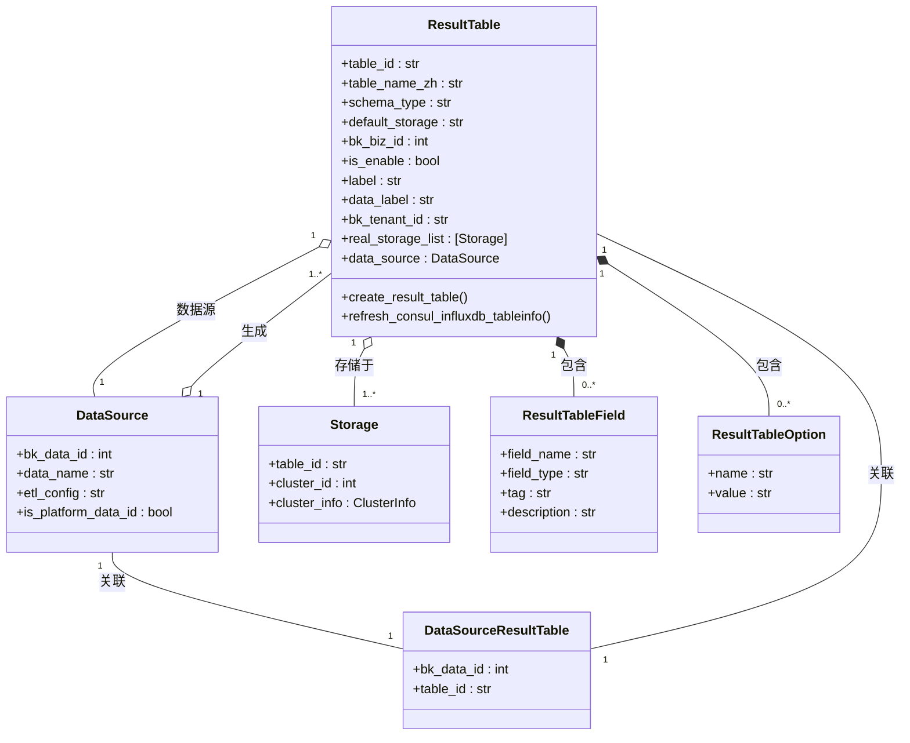
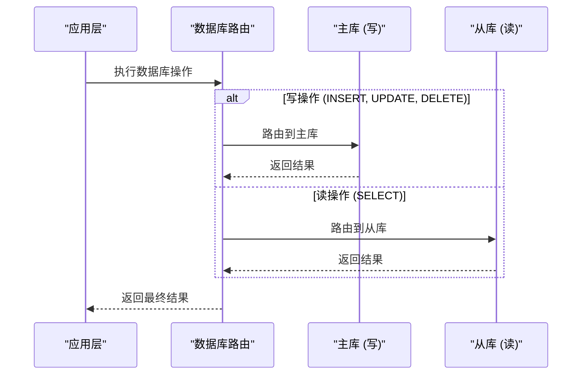

# 关系型数据存储

<cite>
**本文档引用文件**  
- [result_table.py](file://bkmonitor/metadata/models/result_table.py#L0-L600)
- [data_source.py](file://bkmonitor/metadata/models/data_source.py)
- [storage.py](file://bkmonitor/metadata/models/storage.py)
- [config.py](file://bkmonitor/config/mysql.py)
- [db_routers.py](file://bkmonitor/bkmonitor/db_routers.py)
- [constants.py](file://bkmonitor/constants/result_table.py)
- [models.py](file://bkmonitor/metadata/models/__init__.py)
</cite>

## 目录
1. [引言](#引言)
2. [项目结构](#项目结构)
3. [核心数据模型](#核心数据模型)
4. [数据库架构与读写分离](#数据库架构与读写分离)
5. [关键表结构与索引设计](#关键表结构与索引设计)
6. [数据访问模式与查询优化](#数据访问模式与查询优化)
7. [数据库迁移与数据一致性](#数据库迁移与数据一致性)
8. [性能监控与容量规划](#性能监控与容量规划)

## 引言
本文档详细描述了 bk-monitor 系统中基于 MySQL 的关系型数据存储设计。重点涵盖核心数据模型（如结果表、数据源、存储集群）、数据库读写分离架构、连接池配置、索引优化策略、数据迁移机制以及性能监控方案。文档旨在为开发、运维和架构师提供全面的技术参考，确保系统数据层的高可用性、可扩展性和高性能。

## 项目结构
bk-monitor 的数据存储相关代码主要分布在 `bkmonitor/metadata/models/` 目录下，采用 Django ORM 模式进行建模。核心模块包括结果表（ResultTable）、数据源（DataSource）、存储配置（Storage）等。



**图示来源**
- [result_table.py](file://bkmonitor/metadata/models/result_table.py#L0-L600)
- [data_source.py](file://bkmonitor/metadata/models/data_source.py)
- [storage.py](file://bkmonitor/metadata/models/storage.py)

## 核心数据模型

### 结果表（ResultTable）
`ResultTable` 是系统的核心实体，代表一个逻辑上的数据表。它不直接对应物理存储，而是通过 `default_storage` 字段关联到具体的物理存储（如 InfluxDB, ES, Kafka 等）。

**关键字段说明：**
- **table_id**: 结果表唯一标识，格式为 `DB.TABLE_NAME`。
- **table_name_zh**: 结果表中文名，用于前端展示。
- **schema_type**: 模式类型，包括 `free`（无固定字段）、`dynamic`（动态字段）、`fixed`（固定字段）。
- **default_storage**: 默认存储类型，如 `influxdb`, `es`。
- **bk_biz_id**: 所属业务 ID，0 表示全业务共享。
- **is_enable**: 是否启用，用于逻辑删除。
- **label**: 结果表标签，用于分类。
- **data_label**: 数据标签，用于更细粒度的分类。
- **bk_tenant_id**: 租户 ID，支持多租户。

**Section sources**
- [result_table.py](file://bkmonitor/metadata/models/result_table.py#L0-L600)

### 数据源（DataSource）
`DataSource` 代表数据的来源，例如一个通过 GSE Agent 采集的指标流。一个 `DataSource` 可以关联多个 `ResultTable`。

**关键字段说明：**
- **bk_data_id**: 数据源唯一 ID。
- **etl_config**: 数据清洗配置。
- **is_platform_data_id**: 是否为平台级数据源。

### 存储集群（Storage）
`Storage` 模型（如 `InfluxDBStorage`, `ESStorage`）代表物理存储实例。`ResultTable` 通过 `real_storage_list` 属性获取其关联的物理存储。



**图示来源**
- [result_table.py](file://bkmonitor/metadata/models/result_table.py#L0-L600)
- [data_source.py](file://bkmonitor/metadata/models/data_source.py)
- [storage.py](file://bkmonitor/metadata/models/storage.py)

## 数据库架构与读写分离

### 读写分离架构
系统通过自定义的数据库路由（`db_routers.py`）实现读写分离。



**图示来源**
- [db_routers.py](file://bkmonitor/bkmonitor/db_routers.py)

### 连接池配置
数据库连接池配置在 `config/mysql.py` 中定义，通常使用 `pymysql` 或 `mysqlclient` 作为驱动，并通过 `Django DATABASES` 配置项进行管理。连接池由数据库中间件或应用服务器（如 Gunicorn）管理，确保连接的复用和高效。

**Section sources**
- [config/mysql.py](file://bkmonitor/config/mysql.py)
- [db_routers.py](file://bkmonitor/bkmonitor/db_routers.py)

## 关键表结构与索引设计

### ResultTable 表索引
- **主键**: `id` (BigAutoField)
- **唯一索引**: `unique_together = ("table_id", "bk_tenant_id")` 确保租户内表名唯一。
- **普通索引**: `table_id` 字段上的 `db_index=True`，用于快速根据表名查询。

### 查询优化策略
1.  **避免全表扫描**: 所有频繁查询的字段（如 `table_id`, `bk_biz_id`）都应建立索引。
2.  **复合索引**: 对于多条件查询，使用复合索引。例如，查询某个业务下的所有启用的结果表，可考虑 `(bk_biz_id, is_enable)` 复合索引。
3.  **选择性高的字段优先**: 在复合索引中，将选择性高的字段（如 `is_enable`）放在前面。
4.  **避免过度索引**: 索引会增加写操作的开销，只对必要的查询建立索引。

**Section sources**
- [result_table.py](file://bkmonitor/metadata/models/result_table.py#L0-L600)

## 数据访问模式与查询优化

### 核心访问模式
1.  **根据 table_id 查询结果表**: 这是最常见的操作，由 `table_id` 上的索引保证高效。
2.  **根据数据源查询关联的结果表**: 通过 `DataSourceResultTable` 中间表进行关联查询。
3.  **批量创建结果表**: 使用 `create_result_table` 类方法，该方法在一个数据库事务中完成所有关联对象的创建，保证数据一致性。

### 查询优化示例
```python
# 错误：N+1 查询问题
result_tables = ResultTable.objects.filter(bk_biz_id=2)
for rt in result_tables:
    ds = rt.data_source  # 每次循环都查询一次数据库

# 正确：使用 select_related 进行 JOIN 查询
result_tables = ResultTable.objects.select_related('data_source').filter(bk_biz_id=2)
for rt in result_tables:
    ds = rt.data_source  # 数据已通过 JOIN 获取，无需额外查询
```

**Section sources**
- [result_table.py](file://bkmonitor/metadata/models/result_table.py#L400-L600)

## 数据库迁移与数据一致性

### 迁移管理方案
系统使用 Django 的 `migrations` 框架进行数据库模式变更管理。所有模型变更都会生成对应的迁移文件，通过 `manage.py migrate` 命令在不同环境中应用。

### 数据一致性保障机制
1.  **数据库事务**: 在 `create_result_table` 等关键操作中，使用 `@atomic` 装饰器确保所有数据库操作在一个事务中完成，要么全部成功，要么全部回滚。
2.  **外键约束**: Django ORM 会自动创建外键约束，防止出现孤立的关联记录。
3.  **业务逻辑校验**: 在创建 `ResultTable` 前，会进行一系列校验，如检查 `table_id` 是否唯一、`label` 是否存在等，从源头避免脏数据。

**Section sources**
- [result_table.py](file://bkmonitor/metadata/models/result_table.py#L400-L600)

## 性能监控与容量规划

### 性能监控指标
1.  **数据库连接数**: 监控主库和从库的活跃连接数，防止连接池耗尽。
2.  **查询延迟 (Query Latency)**: 监控慢查询日志，识别性能瓶颈。
3.  **锁等待时间**: 监控行锁、表锁的等待情况，避免死锁。
4.  **主从复制延迟**: 监控从库的延迟时间，确保读取到的数据不是过期的。
5.  **表空间使用率**: 监控 `ResultTable` 等核心表的磁盘使用情况。

### 容量规划建议
1.  **分库分表**: 当单表数据量过大（例如超过千万行）时，应考虑按 `bk_biz_id` 或时间进行分库分表。
2.  **定期归档**: 对于历史数据，可以制定归档策略，将不常用的数据迁移到归档库或冷存储。
3.  **硬件升级**: 根据监控指标，定期评估数据库服务器的 CPU、内存、磁盘 I/O 性能，及时进行硬件升级。
4.  **索引维护**: 定期分析和优化索引，删除无效或冗余的索引。