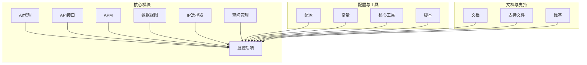
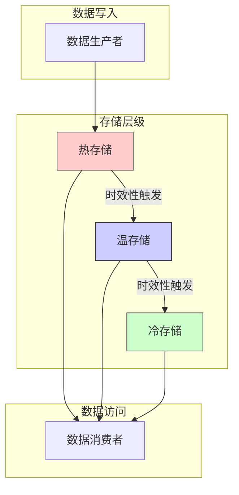
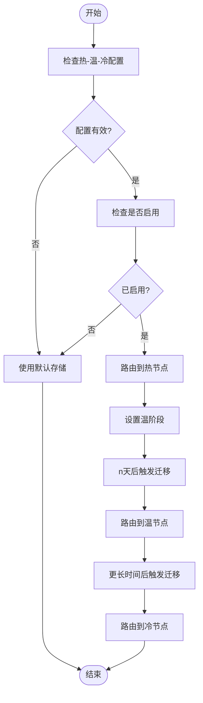
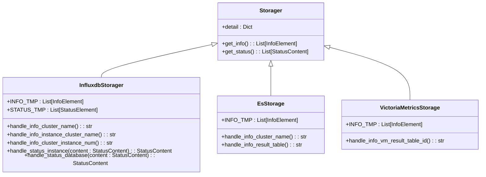
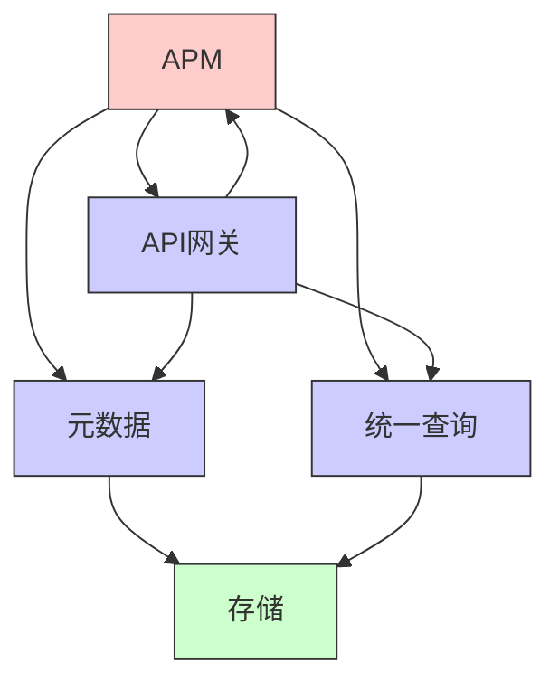

# 存储架构设计

<cite>
**本文档引用文件**   
- [tail_sampling.py](file://bkmonitor/apm/core/handlers/bk_data/tail_sampling.py#L230-L312)
- [datasource.py](file://bkmonitor/apm/models/datasource.py#L619-L648)
- [storage.py](file://bkmonitor/packages/monitor_web/datalink/storage.py#L0-L299)
- [storage.py](file://bkmonitor/metadata/models/storage.py#L173-L191)
</cite>

## 目录
1. [引言](#引言)
2. [项目结构](#项目结构)
3. [核心组件](#核心组件)
4. [架构概述](#架构概述)
5. [详细组件分析](#详细组件分析)
6. [依赖分析](#依赖分析)
7. [性能考虑](#性能考虑)
8. [故障排除指南](#故障排除指南)
9. [结论](#结论)

## 引言
本文档详细描述了bk-monitor系统的热-温-冷存储分层设计原理。系统通过基于数据访问频率和时效性的存储策略决策逻辑，实现了数据在不同存储层级间的高效流转。文档还分析了跨存储系统的数据一致性保障方案，并描述了存储资源监控和容量预警机制，以及存储架构的扩展性和高可用性设计考量。

## 项目结构
bk-monitor系统采用分层架构设计，主要包含以下核心模块：AI代理、监控后端、API接口、APM（应用性能监控）、数据视图、IP选择器、空间管理等。系统通过模块化设计实现了功能的解耦和复用。

**图示来源**
- [项目结构](file://workspace_path)

**本节来源**
- [项目结构](file://project_structure)

## 核心组件
系统的核心组件包括热-温-冷存储分层管理器、数据源处理器、存储资源监控器等。这些组件协同工作，确保数据在不同存储层级间的正确流转和高效管理。

**本节来源**
- [tail_sampling.py](file://bkmonitor/apm/core/handlers/bk_data/tail_sampling.py#L230-L312)
- [datasource.py](file://bkmonitor/apm/models/datasource.py#L619-L648)

## 架构概述
bk-monitor系统采用热-温-冷三级存储架构，根据数据的访问频率和时效性进行分层存储。热存储用于存放最近和频繁访问的数据，温存储用于存放访问频率较低的数据，冷存储用于存放历史数据。

**图示来源**
- [datasource.py](file://bkmonitor/apm/models/datasource.py#L619-L648)

## 详细组件分析

### 热-温-冷存储分层分析
系统通过配置文件中的`hot_warm_config`参数来控制热-温-冷存储分层。当`is_enabled`设置为`True`时，系统会根据数据的保留时间和访问频率自动将数据从热存储迁移到温存储，再迁移到冷存储。

**图示来源**
- [datasource.py](file://bkmonitor/apm/models/datasource.py#L619-L648)

**本节来源**
- [datasource.py](file://bkmonitor/apm/models/datasource.py#L619-L648)

### 存储资源监控分析
系统通过`Storager`基类和具体的存储实现类（如`InfluxdbStorager`、`EsStorage`等）来监控存储资源的状态和容量。监控指标包括存储实例数、磁盘占用量、写入成功率等。

**图示来源**
- [storage.py](file://bkmonitor/packages/monitor_web/datalink/storage.py#L0-L299)

**本节来源**
- [storage.py](file://bkmonitor/packages/monitor_web/datalink/storage.py#L0-L299)

## 依赖分析
系统各组件之间的依赖关系清晰，通过接口和配置文件进行解耦。核心依赖包括元数据管理、统一查询、API网关等。

**图示来源**
- [项目结构](file://project_structure)

**本节来源**
- [项目结构](file://project_structure)

## 性能考虑
系统在设计时充分考虑了性能因素，通过缓存、批量处理、异步操作等技术手段提高系统性能。存储分层设计也有效降低了存储成本，提高了查询效率。

## 故障排除指南
当存储系统出现问题时，可以通过以下步骤进行排查：
1. 检查存储配置是否正确
2. 检查存储实例是否正常运行
3. 检查网络连接是否正常
4. 检查磁盘空间是否充足
5. 检查日志文件中的错误信息

**本节来源**
- [tail_sampling.py](file://bkmonitor/apm/core/handlers/bk_data/tail_sampling.py#L230-L312)
- [storage.py](file://bkmonitor/packages/monitor_web/datalink/storage.py#L0-L299)

## 结论
bk-monitor系统的热-温-冷存储分层设计有效地平衡了数据访问性能和存储成本。通过自动化的数据流转机制和完善的监控预警系统，确保了系统的高可用性和可扩展性。未来可以进一步优化数据迁移策略，提高系统的智能化水平。