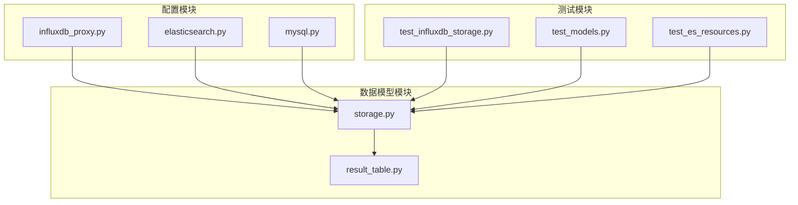
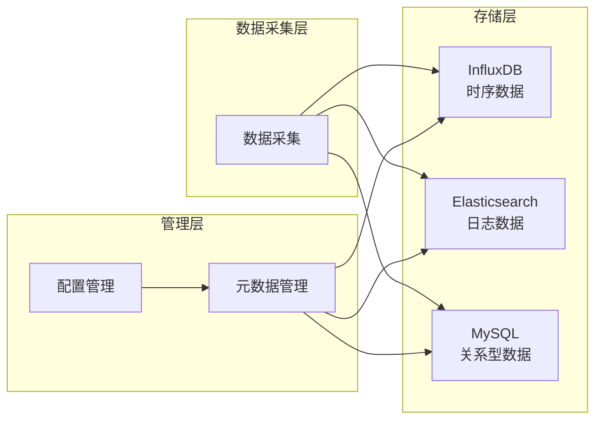
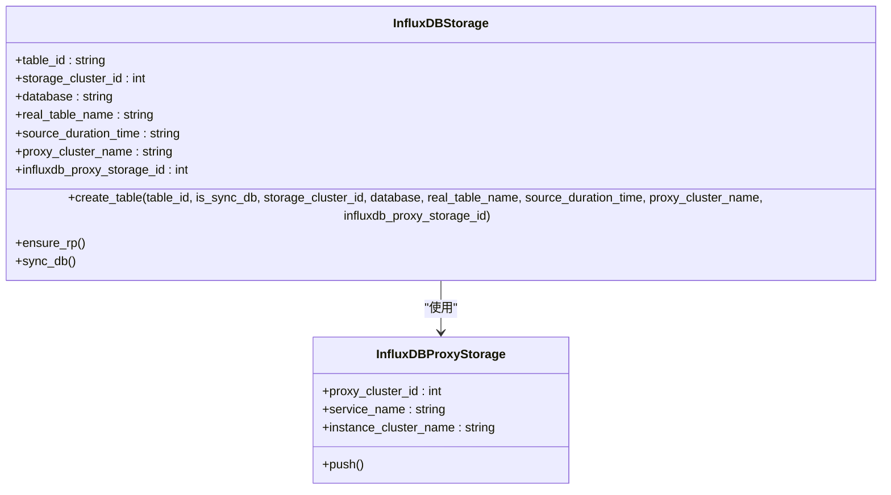
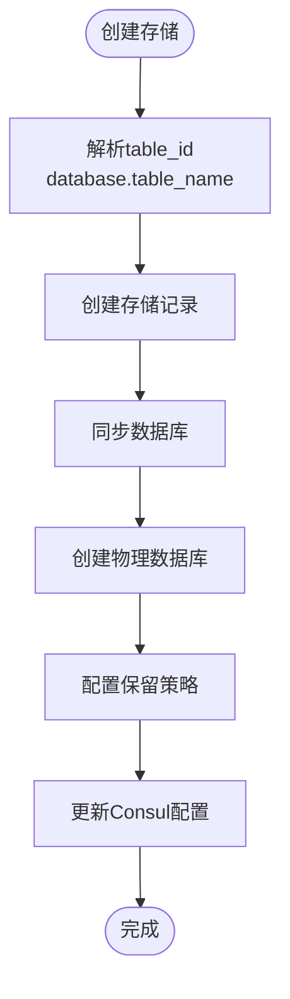
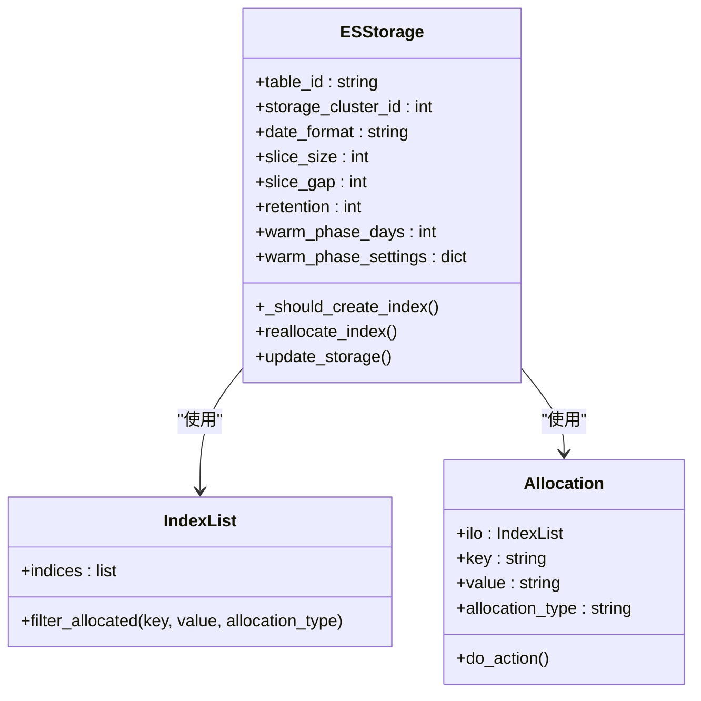
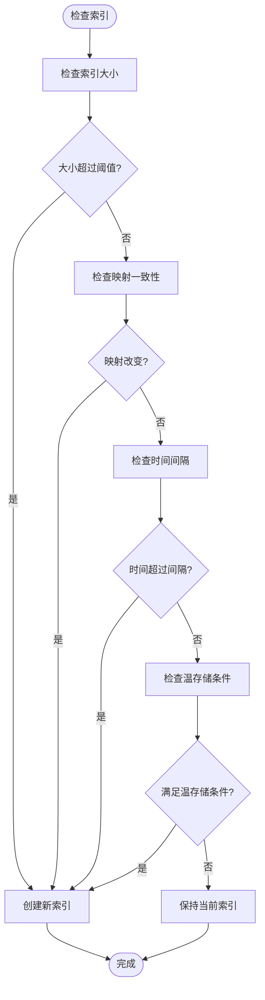
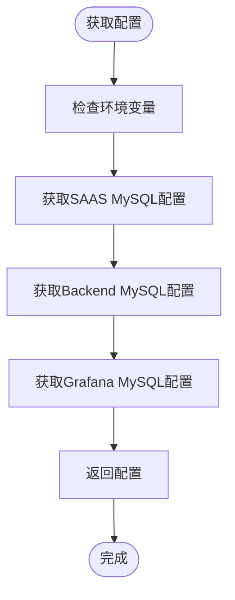
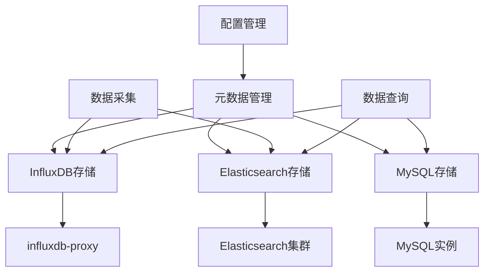
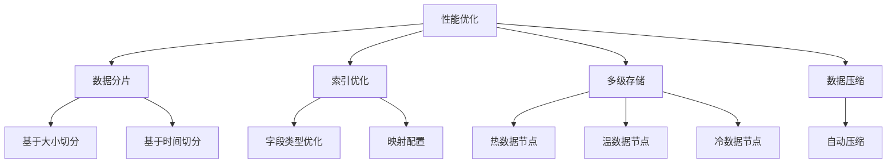

# 数据存储

<cite>
**本文档引用的文件**   
- [influxdb_proxy.py](file://bkmonitor/config/tools/influxdb_proxy.py)
- [elasticsearch.py](file://bkmonitor/config/tools/elasticsearch.py)
- [mysql.py](file://bkmonitor/config/tools/mysql.py)
- [storage.py](file://bkmonitor/metadata/models/storage.py)
- [result_table.py](file://bkmonitor/metadata/models/result_table.py)
- [init_data.json](file://bkmonitor/metadata/data/init_data.json)
- [test_influxdb_storage.py](file://bkmonitor/metadata/tests/influxdb_cluster/test_influxdb_storage.py)
- [test_models.py](file://bkmonitor/metadata/tests/test_models.py)
- [test_es_resources.py](file://bkmonitor/metadata/tests/resources/test_es_resources.py)
- [datasource.py](file://bkmonitor/apm/models/datasource.py)
- [compose_result_table_detail.py](file://bkmonitor/metadata/tests/monitor_router/test_compose_result_table_detail.py)
</cite>

## 目录
1. [引言](#引言)
2. [项目结构](#项目结构)
3. [核心组件](#核心组件)
4. [架构概述](#架构概述)
5. [详细组件分析](#详细组件分析)
6. [依赖分析](#依赖分析)
7. [性能考虑](#性能考虑)
8. [故障排除指南](#故障排除指南)
9. [结论](#结论)

## 引言
本文档详细描述了bk-monitor系统的数据存储架构，涵盖时序数据、日志数据和关系型数据的存储方案与技术选型。文档解释了多级存储架构的设计原理和数据流转机制，并分析了存储性能优化策略，包括数据分片、索引优化和压缩算法等。同时提供了存储容量规划和扩展建议。

## 项目结构
bk-monitor系统采用模块化设计，主要组件包括ai_agent、bkmonitor、api、apm等。数据存储相关的核心模块位于`bkmonitor/metadata/models/`目录下，配置文件位于`bkmonitor/config/tools/`目录中。

**图示来源**
- [influxdb_proxy.py](file://bkmonitor/config/tools/influxdb_proxy.py)
- [elasticsearch.py](file://bkmonitor/config/tools/elasticsearch.py)
- [mysql.py](file://bkmonitor/config/tools/mysql.py)
- [storage.py](file://bkmonitor/metadata/models/storage.py)
- [result_table.py](file://bkmonitor/metadata/models/result_table.py)

**本节来源**
- [influxdb_proxy.py](file://bkmonitor/config/tools/influxdb_proxy.py)
- [elasticsearch.py](file://bkmonitor/config/tools/elasticsearch.py)
- [mysql.py](file://bkmonitor/config/tools/mysql.py)
- [storage.py](file://bkmonitor/metadata/models/storage.py)

## 核心组件
系统的核心数据存储组件包括InfluxDB用于时序数据存储，Elasticsearch用于日志数据存储，以及MySQL用于关系型数据存储。这些组件通过统一的元数据管理模块进行配置和管理。

**本节来源**
- [storage.py](file://bkmonitor/metadata/models/storage.py)
- [result_table.py](file://bkmonitor/metadata/models/result_table.py)

## 架构概述
bk-monitor系统采用多级存储架构，包括热存储、温存储和冷存储。时序数据存储在InfluxDB/VM中，日志数据存储在Elasticsearch中，关系型数据存储在MySQL中。

**图示来源**
- [storage.py](file://bkmonitor/metadata/models/storage.py)
- [result_table.py](file://bkmonitor/metadata/models/result_table.py)

## 详细组件分析

### 时序数据存储分析
时序数据存储在InfluxDB/VM中，通过influxdb-proxy进行路由和管理。系统支持多集群配置和数据保留策略。

#### 时序数据存储类图

**图示来源**
- [storage.py](file://bkmonitor/metadata/models/storage.py#L1006-L1097)
- [test_influxdb_storage.py](file://bkmonitor/metadata/tests/influxdb_cluster/test_influxdb_storage.py#L27-L61)

#### 时序数据存储流程

**本节来源**
- [storage.py](file://bkmonitor/metadata/models/storage.py#L1006-L1097)
- [test_influxdb_storage.py](file://bkmonitor/metadata/tests/influxdb_cluster/test_influxdb_storage.py#L27-L61)

### 日志数据存储分析
日志数据存储在Elasticsearch中，采用基于时间和大小的索引切分策略，并支持热温冷多级存储架构。

#### 日志数据存储类图

**图示来源**
- [storage.py](file://bkmonitor/metadata/models/storage.py#L1920-L1943)
- [test_models.py](file://bkmonitor/metadata/tests/test_models.py#L1425-L1460)

#### 日志数据索引切分流程

**本节来源**
- [storage.py](file://bkmonitor/metadata/models/storage.py#L3276-L3355)
- [test_models.py](file://bkmonitor/metadata/tests/test_models.py#L1487-L1515)

### 关系型数据存储分析
关系型数据存储在MySQL中，主要用于存储系统配置、策略定义和监控元数据。

#### MySQL配置获取流程

**本节来源**
- [mysql.py](file://bkmonitor/config/tools/mysql.py#L0-L78)

## 依赖分析
系统各存储组件之间的依赖关系如下：

**图示来源**
- [storage.py](file://bkmonitor/metadata/models/storage.py)
- [result_table.py](file://bkmonitor/metadata/models/result_table.py)

**本节来源**
- [storage.py](file://bkmonitor/metadata/models/storage.py)
- [result_table.py](file://bkmonitor/metadata/models/result_table.py)

## 性能考虑
系统通过多种策略优化存储性能：

1. **数据分片**：Elasticsearch索引根据大小和时间进行切分
2. **索引优化**：采用合适的字段类型和映射配置
3. **多级存储**：热温冷数据分层存储，优化资源利用
4. **压缩算法**：底层存储系统自动应用数据压缩

**本节来源**
- [storage.py](file://bkmonitor/metadata/models/storage.py#L1920-L1943)
- [datasource.py](file://bkmonitor/apm/models/datasource.py#L619-L648)

## 故障排除指南
常见存储问题及解决方案：

1. **InfluxDB连接失败**：检查influxdb-proxy配置和网络连通性
2. **Elasticsearch索引创建失败**：检查集群状态和磁盘空间
3. **MySQL连接超时**：检查数据库负载和连接池配置
4. **数据写入延迟**：检查网络带宽和存储系统负载

**本节来源**
- [influxdb_proxy.py](file://bkmonitor/config/tools/influxdb_proxy.py)
- [elasticsearch.py](file://bkmonitor/config/tools/elasticsearch.py)
- [mysql.py](file://bkmonitor/config/tools/mysql.py)

## 结论
bk-monitor系统采用多元化的数据存储架构，针对不同类型的数据选择最适合的存储方案。通过多级存储架构和性能优化策略，系统能够高效地处理大规模监控数据。建议根据实际业务需求合理规划存储容量，并定期监控存储系统性能。