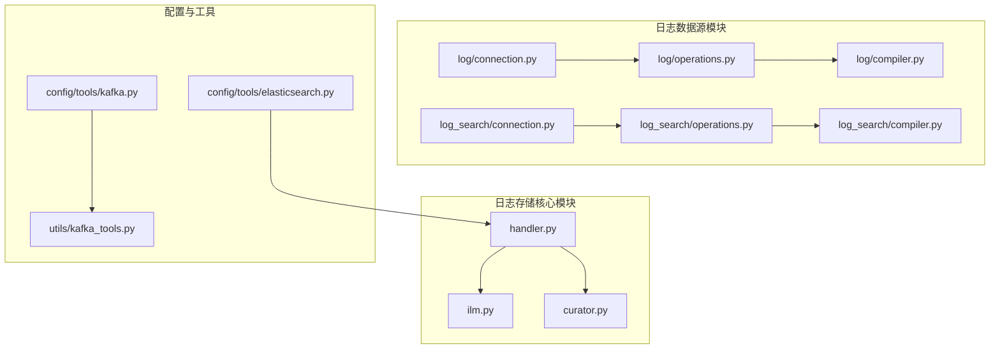
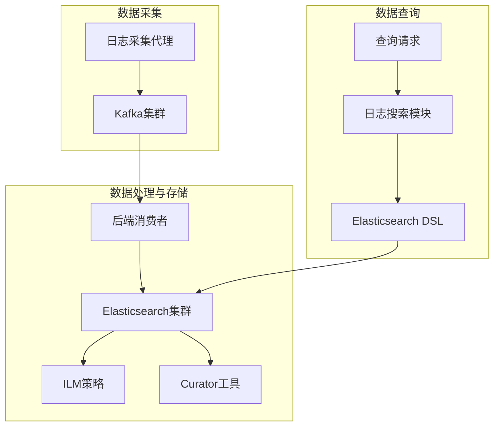
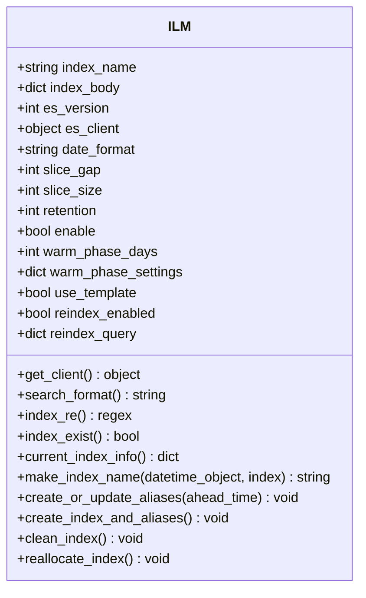
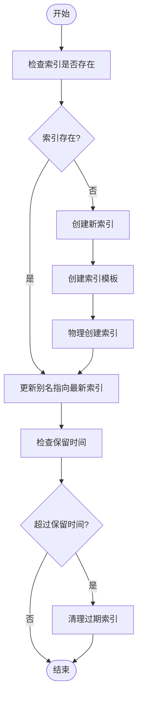
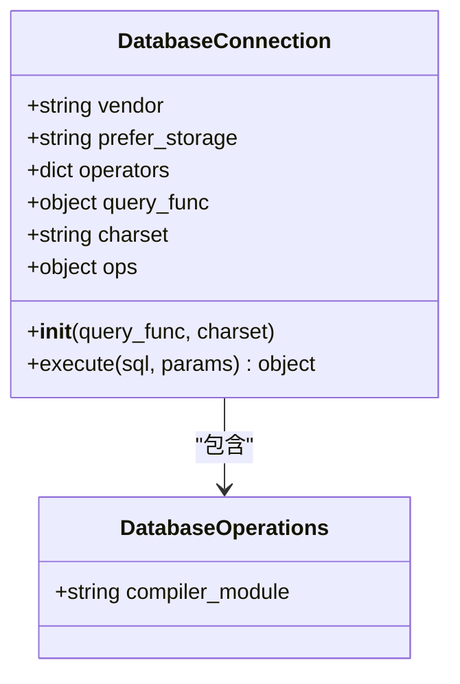
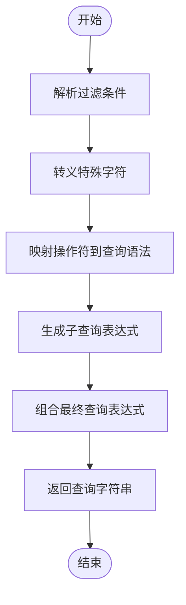
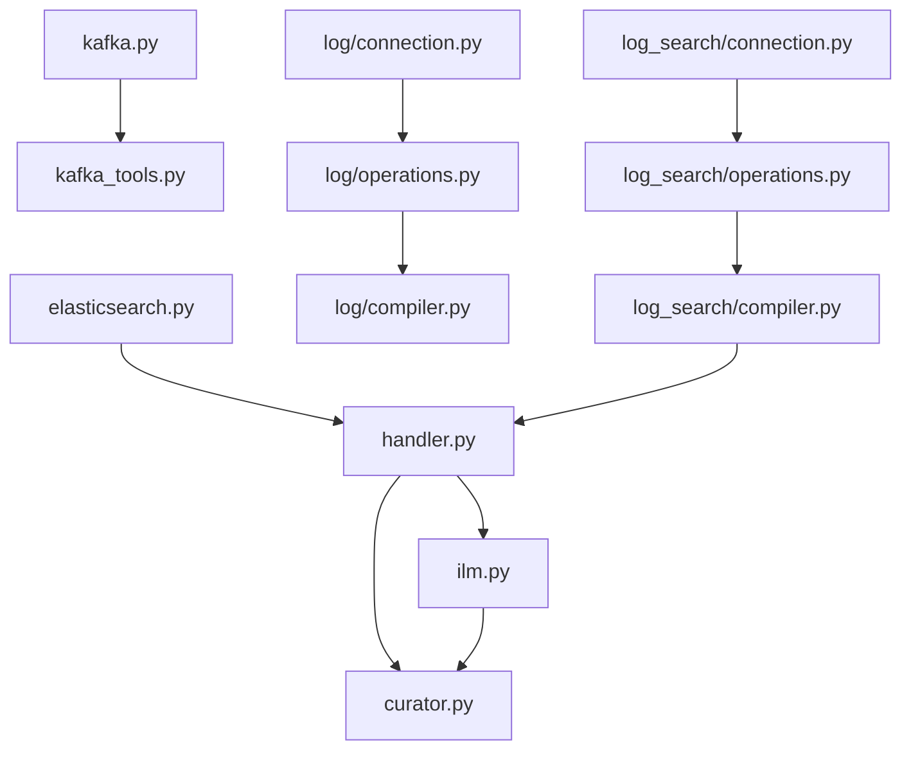

# 日志数据存储

<cite>
**本文档引用的文件**   
- [handler.py](file://bkmonitor/bkmonitor/utils/elasticsearch/handler.py)
- [ilm.py](file://bkmonitor/bkmonitor/utils/elasticsearch/ilm.py)
- [curator.py](file://bkmonitor/bkmonitor/utils/elasticsearch/curator.py)
- [elasticsearch.py](file://bkmonitor/constants/elasticsearch.py)
- [elasticsearch.py](file://bkmonitor/config/tools/elasticsearch.py)
- [connection.py](file://bkmonitor/bkmonitor/data_source/backends/log/connection.py)
- [operations.py](file://bkmonitor/bkmonitor/data_source/backends/log/operations.py)
- [compiler.py](file://bkmonitor/bkmonitor/data_source/backends/log/compiler.py)
- [connection.py](file://bkmonitor/bkmonitor/data_source/backends/log_search/connection.py)
- [operations.py](file://bkmonitor/bkmonitor/data_source/backends/log_search/operations.py)
- [compiler.py](file://bkmonitor/bkmonitor/data_source/backends/log_search/compiler.py)
- [kafka_tools.py](file://bkmonitor/bkmonitor/utils/kafka_tools.py)
- [kafka.py](file://bkmonitor/config/tools/kafka.py)
- [storage.py](file://bkmonitor/metadata/models/storage.py)
- [base.py](file://bkmonitor/bkmonitor/documents/base.py)
</cite>

## 目录
1. [引言](#引言)
2. [项目结构](#项目结构)
3. [核心组件](#核心组件)
4. [架构概述](#架构概述)
5. [详细组件分析](#详细组件分析)
6. [依赖分析](#依赖分析)
7. [性能考虑](#性能考虑)
8. [故障排除指南](#故障排除指南)
9. [结论](#结论)

## 引言
本文档详细描述了蓝鲸监控平台（bk-monitor）中日志数据存储的架构设计，重点分析了Elasticsearch的部署架构、索引管理策略以及日志数据从采集到存储的完整流程。文档涵盖了索引模板设计、分片策略、副本配置、基于时间的索引滚动（index rollover）机制、ILM（Index Lifecycle Management）策略的实现，以及日志查询性能优化方案。

## 项目结构
蓝鲸监控平台的项目结构清晰地划分了不同的功能模块。日志数据存储的核心实现位于`bkmonitor/bkmonitor/utils/elasticsearch/`目录下，主要包括ILM（索引生命周期管理）、Curator（索引管理工具）和处理器（handler）等模块。日志数据源的集成实现位于`bkmonitor/bkmonitor/data_source/backends/log/`和`bkmonitor/bkmonitor/data_source/backends/log_search/`目录下，负责与Elasticsearch的连接、操作和查询编译。Kafka相关的配置和工具位于`bkmonitor/config/tools/kafka.py`和`bkmonitor/bkmonitor/utils/kafka_tools.py`文件中，用于日志数据的采集和传输。

**图源**
- [handler.py](file://bkmonitor/bkmonitor/utils/elasticsearch/handler.py)
- [ilm.py](file://bkmonitor/bkmonitor/utils/elasticsearch/ilm.py)
- [curator.py](file://bkmonitor/bkmonitor/utils/elasticsearch/curator.py)
- [connection.py](file://bkmonitor/bkmonitor/data_source/backends/log/connection.py)
- [operations.py](file://bkmonitor/bkmonitor/data_source/backends/log/operations.py)
- [compiler.py](file://bkmonitor/bkmonitor/data_source/backends/log/compiler.py)
- [connection.py](file://bkmonitor/bkmonitor/data_source/backends/log_search/connection.py)
- [operations.py](file://bkmonitor/bkmonitor/data_source/backends/log_search/operations.py)
- [compiler.py](file://bkmonitor/bkmonitor/data_source/backends/log_search/compiler.py)
- [elasticsearch.py](file://bkmonitor/config/tools/elasticsearch.py)
- [kafka.py](file://bkmonitor/config/tools/kafka.py)
- [kafka_tools.py](file://bkmonitor/bkmonitor/utils/kafka_tools.py)

## 核心组件
日志数据存储的核心组件包括Elasticsearch ILM（索引生命周期管理）模块、Curator工具集成模块、日志数据源连接与操作模块，以及Kafka数据采集与传输模块。这些组件协同工作，实现了日志数据的高效存储、管理和查询。

**本节源**
- [handler.py](file://bkmonitor/bkmonitor/utils/elasticsearch/handler.py)
- [ilm.py](file://bkmonitor/bkmonitor/utils/elasticsearch/ilm.py)
- [curator.py](file://bkmonitor/bkmonitor/utils/elasticsearch/curator.py)
- [connection.py](file://bkmonitor/bkmonitor/data_source/backends/log/connection.py)
- [operations.py](file://bkmonitor/bkmonitor/data_source/backends/log/operations.py)
- [compiler.py](file://bkmonitor/bkmonitor/data_source/backends/log/compiler.py)
- [connection.py](file://bkmonitor/bkmonitor/data_source/backends/log_search/connection.py)
- [operations.py](file://bkmonitor/bkmonitor/data_source/backends/log_search/operations.py)
- [compiler.py](file://bkmonitor/bkmonitor/data_source/backends/log_search/compiler.py)
- [kafka_tools.py](file://bkmonitor/bkmonitor/utils/kafka_tools.py)
- [kafka.py](file://bkmonitor/config/tools/kafka.py)

## 架构概述
蓝鲸监控平台的日志数据存储架构采用Elasticsearch作为核心存储引擎，通过ILM（索引生命周期管理）和Curator工具实现索引的自动化管理。日志数据首先通过Kafka进行采集和缓冲，然后由后端服务消费并写入Elasticsearch。查询请求通过日志搜索数据源模块进行处理，该模块负责将查询条件转换为Elasticsearch DSL，并执行查询。

**图源**
- [kafka_tools.py](file://bkmonitor/bkmonitor/utils/kafka_tools.py)
- [kafka.py](file://bkmonitor/config/tools/kafka.py)
- [handler.py](file://bkmonitor/bkmonitor/utils/elasticsearch/handler.py)
- [ilm.py](file://bkmonitor/bkmonitor/utils/elasticsearch/ilm.py)
- [curator.py](file://bkmonitor/bkmonitor/utils/elasticsearch/curator.py)
- [connection.py](file://bkmonitor/bkmonitor/data_source/backends/log_search/connection.py)
- [operations.py](file://bkmonitor/bkmonitor/data_source/backends/log_search/operations.py)
- [compiler.py](file://bkmonitor/bkmonitor/data_source/backends/log_search/compiler.py)

## 详细组件分析

### Elasticsearch ILM（索引生命周期管理）分析
Elasticsearch ILM模块是日志索引管理的核心，负责索引的创建、滚动、生命周期管理以及过期索引的清理。该模块通过`ILM`类实现，提供了索引存在性检查、当前索引信息获取、索引创建与别名更新、索引清理等关键功能。

#### ILM类结构

**图源**
- [ilm.py](file://bkmonitor/bkmonitor/utils/elasticsearch/ilm.py#L37-L79)

#### 索引生命周期管理流程

**图源**
- [ilm.py](file://bkmonitor/bkmonitor/utils/elasticsearch/ilm.py#L37-L79)
- [base.py](file://bkmonitor/bkmonitor/documents/base.py#L209-L250)

### 日志数据源模块分析
日志数据源模块负责与Elasticsearch的集成，包括连接管理、操作执行和查询编译。该模块分为基础日志和日志搜索两个子模块，分别处理不同的查询需求。

#### 日志搜索连接与操作

**图源**
- [connection.py](file://bkmonitor/bkmonitor/data_source/backends/log_search/connection.py#L46)
- [operations.py](file://bkmonitor/bkmonitor/data_source/backends/log_search/operations.py#L15)

#### 查询编译流程

**图源**
- [compiler.py](file://bkmonitor/bkmonitor/data_source/backends/log_search/compiler.py#L199)

### Kafka集成分析
Kafka作为日志数据的采集和传输通道，通过配置文件和工具类实现与后端服务的集成。

#### Kafka配置与工具

**图源**
- [kafka.py](file://bkmonitor/config/tools/kafka.py#L19)
- [kafka_tools.py](file://bkmonitor/bkmonitor/utils/kafka_tools.py#L23)

## 依赖分析
日志数据存储模块的依赖关系清晰，各组件之间通过明确的接口进行交互。Elasticsearch ILM模块依赖于Curator工具进行索引管理，日志数据源模块依赖于Elasticsearch客户端进行数据操作，Kafka工具类依赖于Django配置获取集群信息。

**图源**
- [kafka.py](file://bkmonitor/config/tools/kafka.py)
- [kafka_tools.py](file://bkmonitor/bkmonitor/utils/kafka_tools.py)
- [elasticsearch.py](file://bkmonitor/config/tools/elasticsearch.py)
- [handler.py](file://bkmonitor/bkmonitor/utils/elasticsearch/handler.py)
- [ilm.py](file://bkmonitor/bkmonitor/utils/elasticsearch/ilm.py)
- [curator.py](file://bkmonitor/bkmonitor/utils/elasticsearch/curator.py)
- [connection.py](file://bkmonitor/bkmonitor/data_source/backends/log/connection.py)
- [operations.py](file://bkmonitor/bkmonitor/data_source/backends/log/operations.py)
- [compiler.py](file://bkmonitor/bkmonitor/data_source/backends/log/compiler.py)
- [connection.py](file://bkmonitor/bkmonitor/data_source/backends/log_search/connection.py)
- [operations.py](file://bkmonitor/bkmonitor/data_source/backends/log_search/operations.py)
- [compiler.py](file://bkmonitor/bkmonitor/data_source/backends/log_search/compiler.py)

## 性能考虑
日志数据存储的性能优化主要体现在以下几个方面：索引分片策略、查询DSL优化、缓存策略和字段映射优化。通过合理的分片大小和时间间隔，可以避免单个索引过大，提高查询效率。查询DSL优化通过减少不必要的字段加载和使用高效的查询语法来提升性能。缓存策略利用Elasticsearch的内置缓存机制，减少重复查询的开销。字段映射优化通过合理设置字段类型和索引选项，提高存储和查询效率。

## 故障排除指南
在日志数据存储过程中可能遇到的常见问题包括索引创建失败、查询性能下降、Kafka消息积压等。对于索引创建失败，应检查Elasticsearch集群状态和ILM配置；对于查询性能下降，应分析查询DSL和索引分片情况；对于Kafka消息积压，应检查消费者处理能力和网络状况。

**本节源**
- [ilm.py](file://bkmonitor/bkmonitor/utils/elasticsearch/ilm.py)
- [handler.py](file://bkmonitor/bkmonitor/utils/elasticsearch/handler.py)
- [kafka_tools.py](file://bkmonitor/bkmonitor/utils/kafka_tools.py)

## 结论
蓝鲸监控平台的日志数据存储架构设计合理，通过Elasticsearch ILM和Curator工具实现了索引的自动化管理，通过Kafka实现了日志数据的高效采集和传输。日志数据源模块提供了灵活的查询接口，支持复杂的查询需求。整体架构具备良好的可扩展性和稳定性，能够满足大规模日志数据的存储和查询需求。