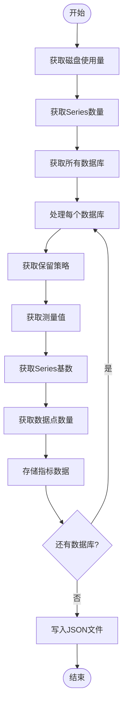

# 时序数据存储

<cite>
**本文档引用的文件**   
- [influxdb_cluster.py](file://bkmonitor/metadata/models/influxdb_cluster.py)
- [storage.py](file://bkmonitor/metadata/models/storage.py)
- [config.py](file://bkmonitor/metadata/models/vm/config.py)
- [influxdb_checker.py](file://bkmonitor/scripts/influxdb_checker.py)
- [vm/record.py](file://bkmonitor/metadata/models/vm/record.py)
</cite>

## 目录
1. [引言](#引言)
2. [项目结构分析](#项目结构分析)
3. [核心组件分析](#核心组件分析)
4. [架构概览](#架构概览)
5. [详细组件分析](#详细组件分析)
6. [依赖分析](#依赖分析)
7. [性能考量](#性能考量)
8. [故障排除指南](#故障排除指南)
9. [结论](#结论)

## 引言

本技术文档详细阐述了bk-monitor系统中时序数据存储的实现机制，重点分析了InfluxDB与VictoriaMetrics（VM）的集成与使用。文档涵盖了时序数据模型设计、数据保留策略配置、InfluxDB代理层实现机制、性能优化方案以及容量规划和监控指标建议。通过深入分析代码实现，为系统维护和优化提供全面的技术指导。

## 项目结构分析

bk-monitor系统的时序数据存储功能主要分布在`metadata`和`scripts`模块中。`metadata`模块负责数据模型定义和存储配置，`scripts`模块包含监控和检查工具。

**图示来源**
- [influxdb_cluster.py](file://bkmonitor/metadata/models/influxdb_cluster.py)
- [storage.py](file://bkmonitor/metadata/models/storage.py)
- [config.py](file://bkmonitor/metadata/models/vm/config.py)
- [influxdb_checker.py](file://bkmonitor/scripts/influxdb_checker.py)

**本节来源**
- [influxdb_cluster.py](file://bkmonitor/metadata/models/influxdb_cluster.py)
- [storage.py](file://bkmonitor/metadata/models/storage.py)
- [config.py](file://bkmonitor/metadata/models/vm/config.py)
- [influxdb_checker.py](file://bkmonitor/scripts/influxdb_checker.py)

## 核心组件分析

系统的核心组件包括InfluxDB集群管理、存储配置模型、VictoriaMetrics集成和容量监控工具。这些组件协同工作，实现了高效的时序数据存储和管理。

**本节来源**
- [influxdb_cluster.py](file://bkmonitor/metadata/models/influxdb_cluster.py#L1-L50)
- [storage.py](file://bkmonitor/metadata/models/storage.py#L1-L50)
- [config.py](file://bkmonitor/metadata/models/vm/config.py#L1-L50)

## 架构概览

系统采用代理层架构，通过InfluxDB Proxy实现查询路由、负载均衡和故障转移。VictoriaMetrics作为后端存储，与InfluxDB兼容，提供高性能的时序数据处理能力。

**图示来源**
- [influxdb_cluster.py](file://bkmonitor/metadata/models/influxdb_cluster.py#L1-L20)
- [storage.py](file://bkmonitor/metadata/models/storage.py#L1-L30)

## 详细组件分析

### InfluxDB集群管理分析

InfluxDB集群管理组件负责集群的配置、状态监控和数据一致性维护。通过Consul和Redis实现配置的分布式存储和实时同步。

#### 集群信息模型

**图示来源**
- [influxdb_cluster.py](file://bkmonitor/metadata/models/influxdb_cluster.py#L400-L600)

**本节来源**
- [influxdb_cluster.py](file://bkmonitor/metadata/models/influxdb_cluster.py#L400-L600)

### 存储配置模型分析

存储配置模型定义了时序数据的组织方式和存储策略，包括measurement、tag、field的组织以及数据保留策略。

#### 存储配置实现

**图示来源**
- [storage.py](file://bkmonitor/metadata/models/storage.py#L1128-L1160)

**本节来源**
- [storage.py](file://bkmonitor/metadata/models/storage.py#L1128-L1327)

### VictoriaMetrics集成分析

VictoriaMetrics通过兼容InfluxDB协议的方式集成到系统中，提供高性能的时序数据存储能力。系统通过配置映射实现两种存储引擎的无缝切换。

#### VM配置模型

**图示来源**
- [config.py](file://bkmonitor/metadata/models/vm/config.py#L205-L259)

**本节来源**
- [config.py](file://bkmonitor/metadata/models/vm/config.py#L205-L259)

### 容量规划与监控分析

系统提供了完善的容量规划和监控工具，通过定期检查脚本收集关键性能指标，为容量规划提供数据支持。

#### 容量检查流程

**图示来源**
- [influxdb_checker.py](file://bkmonitor/scripts/influxdb_checker.py#L0-L77)

**本节来源**
- [influxdb_checker.py](file://bkmonitor/scripts/influxdb_checker.py#L0-L77)

## 依赖分析

系统组件之间存在紧密的依赖关系，通过清晰的接口定义和配置管理实现组件间的松耦合。

**图示来源**
- [influxdb_cluster.py](file://bkmonitor/metadata/models/influxdb_cluster.py)
- [storage.py](file://bkmonitor/metadata/models/storage.py)
- [config.py](file://bkmonitor/metadata/models/vm/config.py)
- [influxdb_checker.py](file://bkmonitor/scripts/influxdb_checker.py)

**本节来源**
- [influxdb_cluster.py](file://bkmonitor/metadata/models/influxdb_cluster.py)
- [storage.py](file://bkmonitor/metadata/models/storage.py)
- [config.py](file://bkmonitor/metadata/models/vm/config.py)
- [influxdb_checker.py](file://bkmonitor/scripts/influxdb_checker.py)

## 性能考量

系统在设计时充分考虑了性能优化，通过合理的数据分片、索引优化和压缩算法提高查询效率。

### 数据分片策略
系统根据数据保留时间自动选择合适的分片策略：
- 保留时间小于2天：分片长度为1小时
- 保留时间2天到180天：分片长度为1天
- 保留时间大于180天：分片长度为7天

### 索引优化
通过tag分区配置实现数据的高效索引，支持基于tag的快速查询和数据路由。

### 压缩算法
VictoriaMetrics后端存储采用高效的压缩算法，显著降低存储空间占用，提高I/O性能。

## 故障排除指南

### 常见问题及解决方案
1. **数据写入延迟高**
   - 检查InfluxDB主机的读取速率限制配置
   - 验证网络连接状况
   - 检查磁盘I/O性能

2. **查询超时**
   - 优化查询语句，避免全表扫描
   - 检查tag索引配置
   - 调整查询时间范围

3. **存储空间不足**
   - 检查数据保留策略配置
   - 分析数据增长趋势
   - 考虑数据归档策略

**本节来源**
- [influxdb_cluster.py](file://bkmonitor/metadata/models/influxdb_cluster.py#L600-L800)
- [storage.py](file://bkmonitor/metadata/models/storage.py#L1128-L1327)

## 结论

bk-monitor系统通过InfluxDB与VictoriaMetrics的集成，构建了一个高性能、可扩展的时序数据存储解决方案。系统采用代理层架构，实现了查询路由、负载均衡和故障转移功能。通过合理的数据模型设计和性能优化策略，确保了系统的稳定性和高效性。完善的容量规划和监控工具为系统的长期运行提供了有力支持。