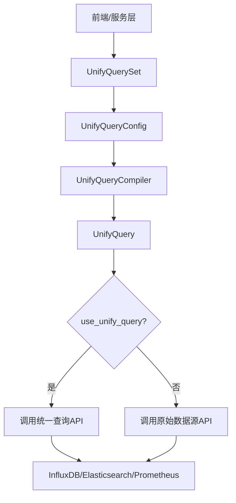
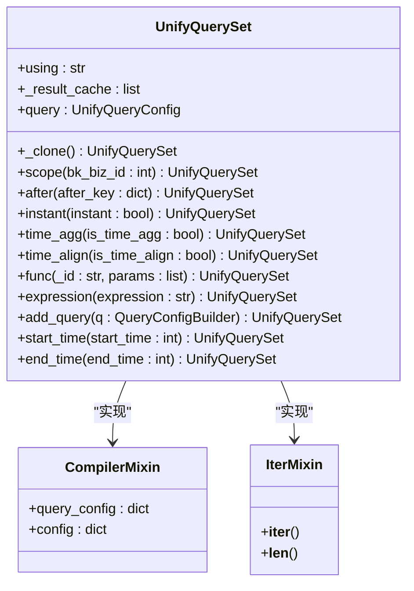
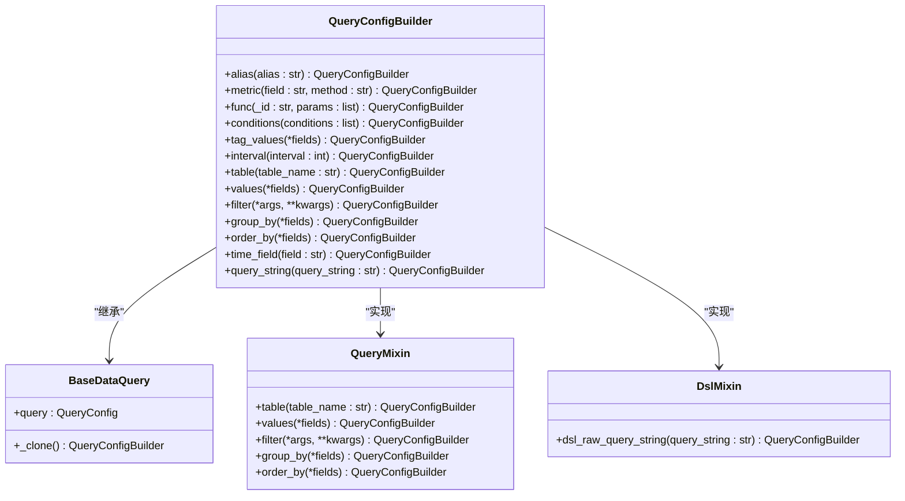
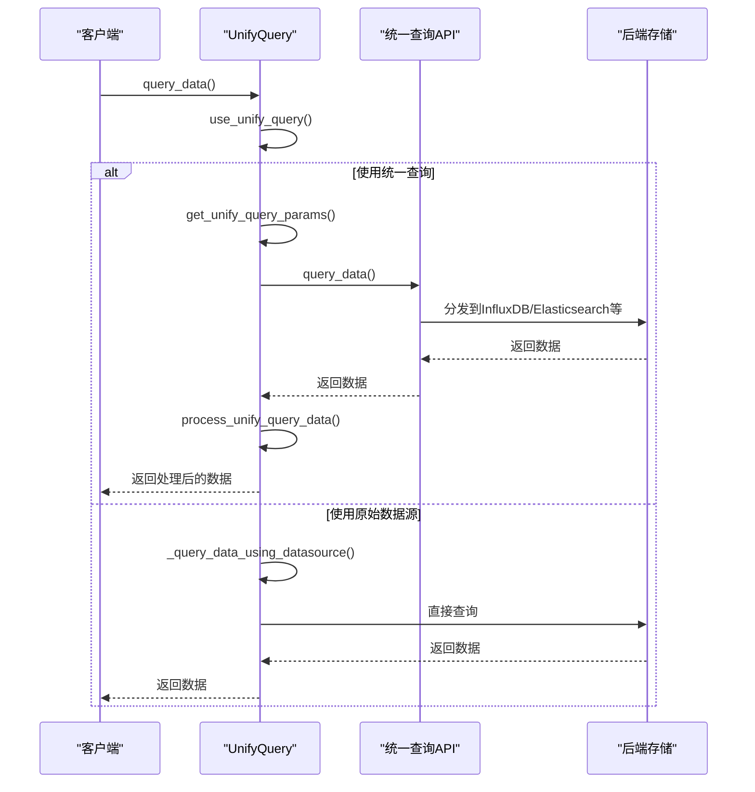
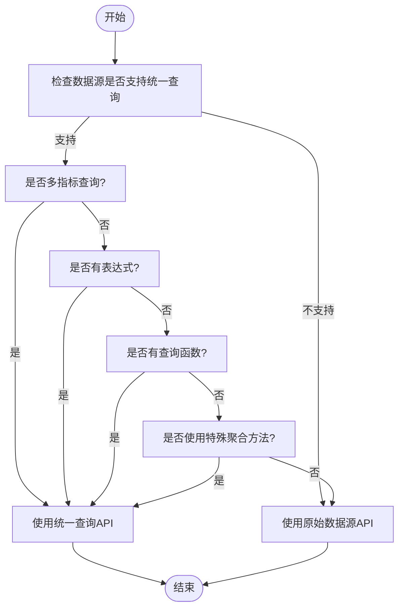
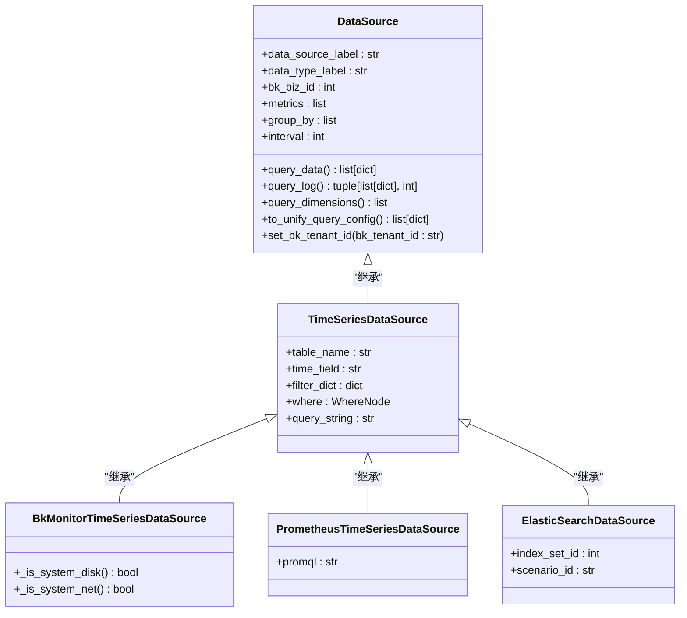

# 多数据源查询

<cite>
**本文档引用的文件**   
- [builder.py](file://bkmonitor\bkmonitor\data_source\unify_query\builder.py)
- [query.py](file://bkmonitor\bkmonitor\data_source\unify_query\query.py)
- [__init__.py](file://bkmonitor\bkmonitor\data_source\data_source\__init__.py)
- [default.py](file://bkmonitor\api\unify_query\default.py)
- [resources.py](file://bkmonitor\packages\monitor_web\data_explorer\resources.py)
</cite>

## 目录
1. [多数据源查询](#多数据源查询)
2. [架构概述](#架构概述)
3. [核心组件分析](#核心组件分析)
4. [查询执行流程](#查询执行流程)
5. [数据源适配器实现](#数据源适配器实现)
6. [最佳实践](#最佳实践)

## 架构概述

**图示来源**
- [builder.py](file://bkmonitor\bkmonitor\data_source\unify_query\builder.py#L400-L533)
- [query.py](file://bkmonitor\bkmonitor\data_source\unify_query\query.py#L596-L625)

## 核心组件分析

### 统一查询构建器 (UnifyQuerySet)

`UnifyQuerySet` 类提供了类ORM的查询接口，允许通过链式调用构建复杂的查询请求。

**图示来源**
- [builder.py](file://bkmonitor\bkmonitor\data_source\unify_query\builder.py#L400-L533)

### 查询配置构建器 (QueryConfigBuilder)

`QueryConfigBuilder` 类用于构建单个数据源的查询配置。

**图示来源**
- [builder.py](file://bkmonitor\bkmonitor\data_source\unify_query\builder.py#L200-L400)

## 查询执行流程

### 统一查询执行流程

**图示来源**
- [query.py](file://bkmonitor\bkmonitor\data_source\unify_query\query.py#L596-L625)
- [query.py](file://bkmonitor\bkmonitor\data_source\unify_query\query.py#L400-L600)

### 查询路由决策流程

**图示来源**
- [query.py](file://bkmonitor\bkmonitor\data_source\unify_query\query.py#L200-L400)

## 数据源适配器实现

### 数据源加载与适配

**图示来源**
- [__init__.py](file://bkmonitor\bkmonitor\data_source\data_source\__init__.py#L0-L200)
- [builder.py](file://bkmonitor\bkmonitor\data_source\unify_query\builder.py#L200-L400)

## 最佳实践

### 性能考量

1. **合理使用统一查询**：当查询涉及多个数据源、复杂表达式或特殊聚合函数时，应使用统一查询。
2. **时间对齐**：启用时间对齐功能可以确保不同数据源的时间戳对齐，提高查询结果的准确性。
3. **分页查询**：对于大量数据的查询，使用 `after` 方法进行分页，避免内存溢出。

### 一致性保证

1. **租户ID管理**：通过 `bk_tenant_id` 确保跨业务查询的一致性。
2. **空间标识**：使用 `space_uid` 进行路由决策，确保查询请求被正确路由到相应的查询服务。
3. **监控指标**：通过 `DATASOURCE_QUERY_TIME` 和 `DATASOURCE_QUERY_COUNT` 监控查询性能和频率。

### 错误处理策略

1. **异常捕获**：在 `query_data` 方法中捕获所有异常，并通过监控指标上报。
2. **部分结果**：当 `is_partial` 为 `True` 时，表示查询结果不完整，需要进行重试或告警。
3. **超时处理**：设置合理的超时时间（60秒），避免长时间阻塞。

**本节来源**
- [query.py](file://bkmonitor\bkmonitor\data_source\unify_query\query.py#L600-L755)
- [default.py](file://bkmonitor\api\unify_query\default.py#L0-L199)