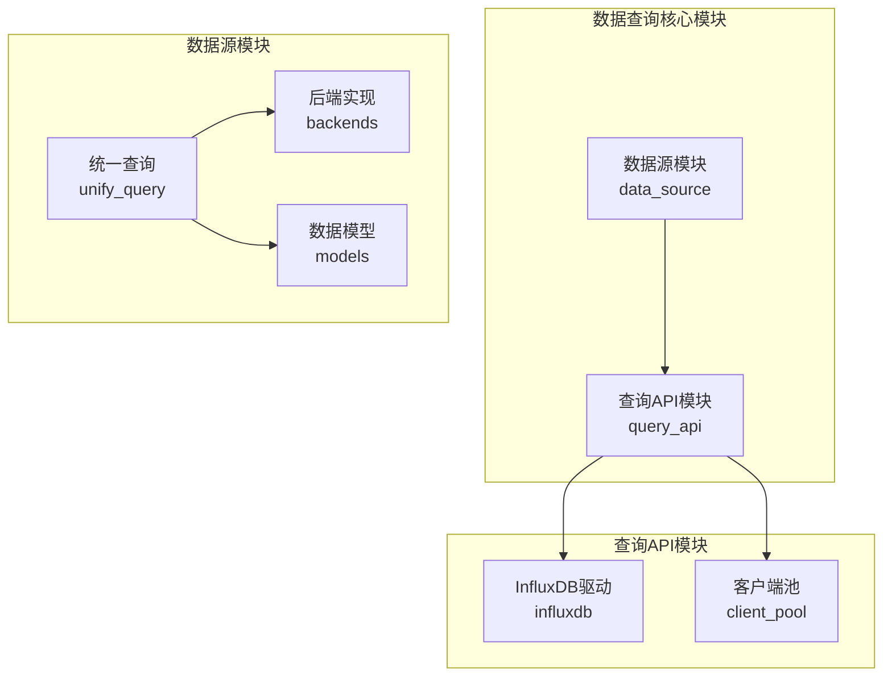
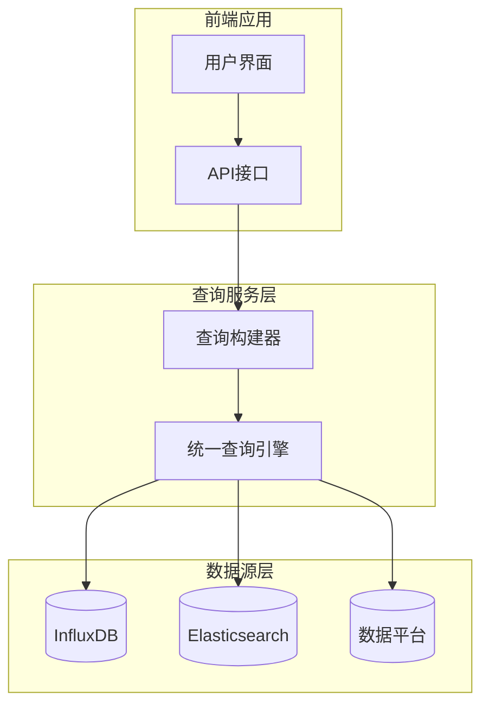
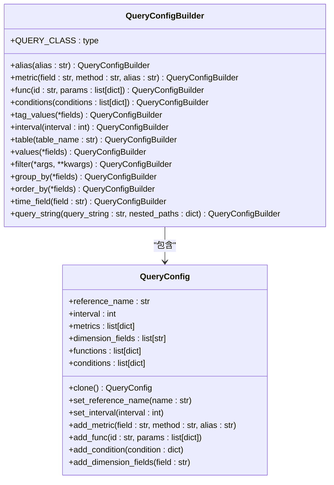
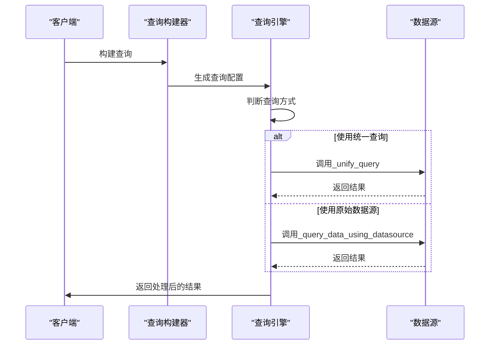
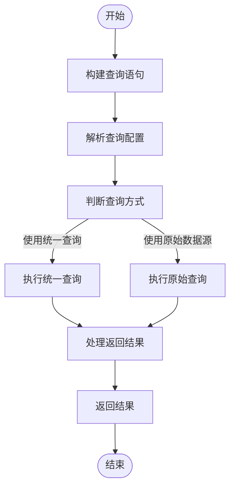
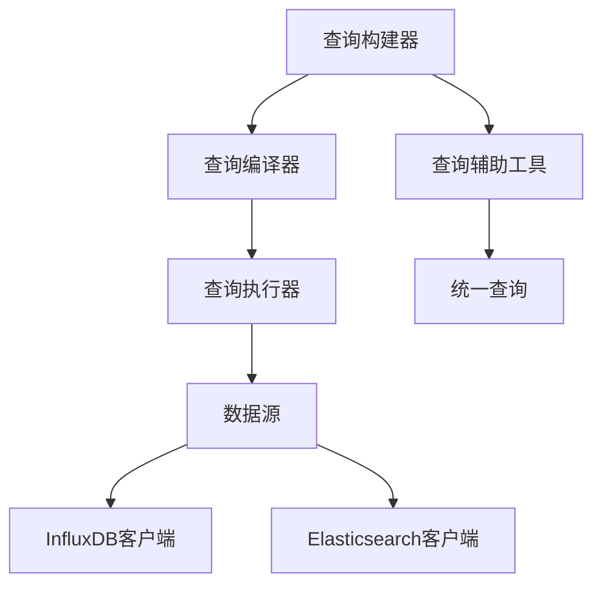

# 数据查询

<cite>
**本文档引用的文件**   
- [client.py](file://bkmonitor/query_api/drivers/influxdb/client.py)
- [builder.py](file://bkmonitor/bkmonitor/data_source/unify_query/builder.py)
- [query.py](file://bkmonitor/bkmonitor/data_source/unify_query/query.py)
- [__init__.py](file://bkmonitor/bkmonitor/data_source/data_source/__init__.py)
</cite>

## 目录
1. [简介](#简介)
2. [项目结构](#项目结构)
3. [核心组件](#核心组件)
4. [架构概述](#架构概述)
5. [详细组件分析](#详细组件分析)
6. [依赖分析](#依赖分析)
7. [性能考虑](#性能考虑)
8. [故障排除指南](#故障排除指南)
9. [结论](#结论)

## 简介
本文档全面描述了bk-monitor系统中监控数据的查询能力与实现方式。重点介绍统一查询接口的设计理念与API规范，支持多数据源联合查询的技术实现。详细解释查询语言（如SQL、PromQL）的解析与执行过程，分析查询性能优化策略，包括查询缓存、预计算、索引利用等。同时提供复杂查询场景的最佳实践，如大规模数据查询、跨时间范围查询、高并发查询等的优化方案。

## 项目结构
bk-monitor系统的数据查询功能主要分布在`bkmonitor`模块下的多个子目录中，核心功能集中在`data_source`和`query_api`两个模块。`data_source`模块负责数据源的抽象与查询构建，`query_api`模块则提供底层驱动支持。

**图示来源**
- [builder.py](file://bkmonitor/bkmonitor/data_source/unify_query/builder.py)
- [client.py](file://bkmonitor/query_api/drivers/influxdb/client.py)

**本节来源**
- [builder.py](file://bkmonitor/bkmonitor/data_source/unify_query/builder.py)
- [client.py](file://bkmonitor/query_api/drivers/influxdb/client.py)

## 核心组件
数据查询系统的核心组件包括统一查询构建器（QueryConfigBuilder）、统一查询执行器（UnifyQuery）和数据源驱动（DataSource）。这些组件共同实现了从查询语句构建到执行结果返回的完整流程。

**本节来源**
- [builder.py](file://bkmonitor/bkmonitor/data_source/unify_query/builder.py)
- [query.py](file://bkmonitor/bkmonitor/data_source/unify_query/query.py)

## 架构概述
bk-monitor的数据查询架构采用分层设计，上层为统一查询接口，下层为具体数据源驱动。系统支持多数据源联合查询，通过统一的查询语言进行表达，并由统一查询引擎进行解析和执行。

**图示来源**
- [builder.py](file://bkmonitor/bkmonitor/data_source/unify_query/builder.py)
- [query.py](file://bkmonitor/bkmonitor/data_source/unify_query/query.py)

## 详细组件分析

### 统一查询构建器分析
统一查询构建器（QueryConfigBuilder）提供了类ORM的查询接口，允许开发者以链式调用的方式构建复杂的查询语句。

**图示来源**
- [builder.py](file://bkmonitor/bkmonitor/data_source/unify_query/builder.py#L50-L150)

**本节来源**
- [builder.py](file://bkmonitor/bkmonitor/data_source/unify_query/builder.py#L50-L199)

### 统一查询执行器分析
统一查询执行器（UnifyQuery）负责将构建好的查询语句转换为具体数据源的查询请求，并处理返回结果。

**图示来源**
- [query.py](file://bkmonitor/bkmonitor/data_source/unify_query/query.py#L200-L400)

**本节来源**
- [query.py](file://bkmonitor/bkmonitor/data_source/unify_query/query.py#L200-L755)

### 查询语言解析与执行
查询语言的解析和执行过程涉及多个组件的协作，从查询语句的构建到最终结果的返回。

**图示来源**
- [builder.py](file://bkmonitor/bkmonitor/data_source/unify_query/builder.py)
- [query.py](file://bkmonitor/bkmonitor/data_source/unify_query/query.py)

## 依赖分析
数据查询系统各组件之间的依赖关系清晰，采用分层架构设计，各层之间通过明确定义的接口进行交互。

**图示来源**
- [builder.py](file://bkmonitor/bkmonitor/data_source/unify_query/builder.py)
- [query.py](file://bkmonitor/bkmonitor/data_source/unify_query/query.py)

**本节来源**
- [builder.py](file://bkmonitor/bkmonitor/data_source/unify_query/builder.py)
- [query.py](file://bkmonitor/bkmonitor/data_source/unify_query/query.py)

## 性能考虑
数据查询系统的性能优化策略包括查询缓存、预计算、索引利用等。系统通过多种机制确保在大规模数据查询、跨时间范围查询、高并发查询等复杂场景下的性能表现。

- **查询缓存**：对频繁查询的结果进行缓存，减少重复查询的开销
- **预计算**：对常用指标进行预计算，提高查询响应速度
- **索引利用**：合理利用数据源的索引机制，加快数据检索速度
- **连接池**：使用连接池管理数据库连接，减少连接建立的开销

**本节来源**
- [client.py](file://bkmonitor/query_api/drivers/influxdb/client.py)
- [builder.py](file://bkmonitor/bkmonitor/data_source/unify_query/builder.py)

## 故障排除指南
当数据查询出现问题时，可以按照以下步骤进行排查：

1. 检查查询语句是否正确
2. 确认数据源配置是否正确
3. 查看系统日志，定位错误信息
4. 检查网络连接是否正常
5. 验证权限配置是否正确

**本节来源**
- [query.py](file://bkmonitor/bkmonitor/data_source/unify_query/query.py)
- [__init__.py](file://bkmonitor/bkmonitor/data_source/data_source/__init__.py)

## 结论
bk-monitor系统的数据查询功能通过统一查询接口的设计，实现了对多数据源的联合查询支持。系统采用分层架构，将查询构建与执行分离，提高了代码的可维护性和可扩展性。通过查询语言的解析和执行过程的优化，系统能够在复杂查询场景下保持良好的性能表现。