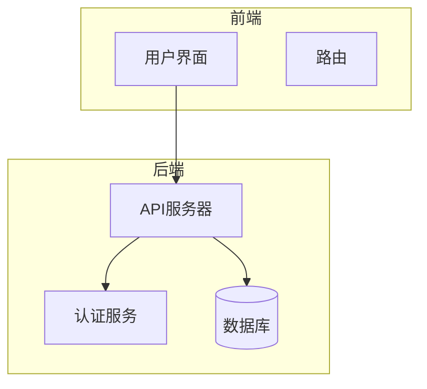
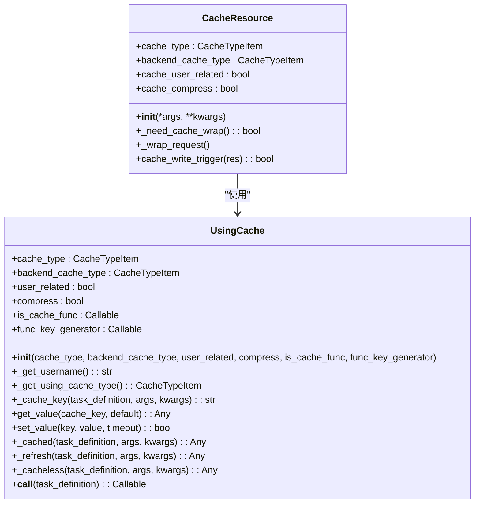
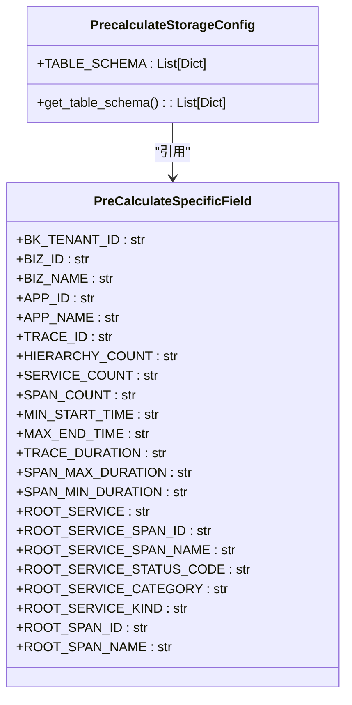
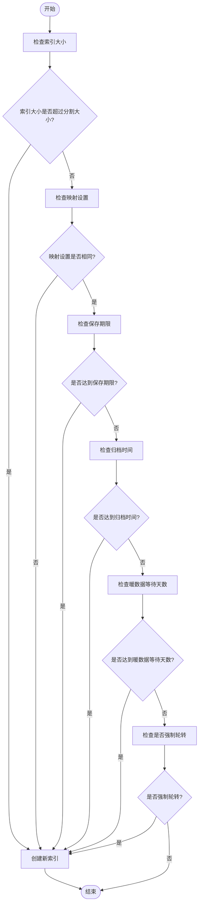
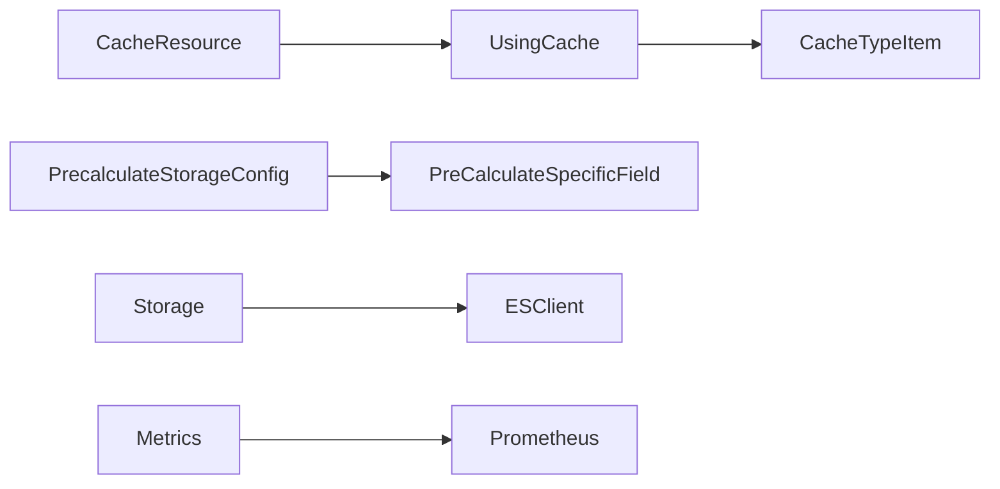

# 查询优化

<cite>
**本文档引用的文件**   
- [cache.py](file://bkmonitor/bkmonitor/utils/cache.py)
- [cache.py](file://bkmonitor/core/drf_resource/contrib/cache.py)
- [apm.py](file://bkmonitor/constants/apm.py)
- [storage.py](file://bkmonitor/metadata/models/storage.py)
- [metrics.py](file://bkmonitor/core/prometheus/metrics.py)
</cite>

## 目录
1. [引言](#引言)
2. [项目结构](#项目结构)
3. [核心组件](#核心组件)
4. [架构概述](#架构概述)
5. [详细组件分析](#详细组件分析)
6. [依赖分析](#依赖分析)
7. [性能考量](#性能考量)
8. [故障排除指南](#故障排除指南)
9. [结论](#结论)

## 引言
本文档旨在深入探讨bk-monitor系统中查询性能的优化策略与技术实现。文档将详细说明查询缓存机制的工作原理，包括缓存键的生成、缓存有效期管理以及缓存穿透防护。同时，分析预计算和物化视图的实现方式，如何通过预先聚合数据提升查询性能。此外，文档化索引使用策略，解释系统如何利用底层存储的索引能力加速查询，并提供查询性能监控指标，包括查询延迟、资源消耗等，给出性能调优的实用建议。

## 项目结构
bk-monitor系统采用模块化设计，主要分为多个子系统，如ai_agent、bkmonitor、api、apm等。每个子系统负责不同的功能模块，如ai_agent负责AI代理相关功能，bkmonitor为核心监控模块，api提供API接口服务，apm负责应用性能管理。这种设计使得系统具有良好的可维护性和扩展性。

## 核心组件
### 查询缓存机制
查询缓存机制是提升查询性能的关键技术之一。系统通过`CacheResource`类实现缓存功能，该类继承自`Resource`，支持缓存的resource在开发环境下默认不生效。缓存类型通过`cache_type`和`backend_cache_type`属性设置，分别用于客户端和后端缓存。缓存是否与用户关联由`cache_user_related`属性决定，压缩功能由`cache_compress`属性控制。

#### 缓存键生成
缓存键的生成逻辑由`func_key_generator`参数定义，默认情况下，函数标识key的生成逻辑为`f"{func.__module__}.{func.__name__}"`。此外，缓存键还会包含用户信息和语言信息，确保不同用户和语言环境下的缓存隔离。

#### 缓存有效期管理
缓存有效期通过`timeout`参数设置，单位为秒。系统提供了多种缓存类型，每种类型有不同的超时时间，如`BIZ`类型超时时间为`settings.CACHE_BIZ_TIMEOUT`，`HOST`类型超时时间为`settings.CACHE_HOST_TIMEOUT`等。这些超时时间可以根据实际需求进行配置。

#### 缓存穿透防护
为了防止缓存穿透，系统采用了两级缓存机制：一级内存缓存（local）和二级缓存（cache）。一级缓存仅在单次请求中生效，二级缓存则在60秒内生效。当一级缓存未命中时，系统会尝试从二级缓存中获取值。如果二级缓存也未命中，则返回默认值。此外，系统还支持压缩功能，减少缓存数据的存储空间。

### 预计算和物化视图
预计算和物化视图通过预先聚合数据来提升查询性能。系统在`constants\apm.py`文件中定义了预计算存储配置，包括表结构和字段信息。预计算表包含多个维度字段，如`bk_tenant_id`、`biz_id`、`app_id`等，以及度量字段，如`min_start_time`、`max_end_time`、`trace_duration`等。这些字段用于存储预计算的结果，从而减少实时查询的计算量。

#### 实现方式
预计算任务通常在后台周期性执行，将原始数据按照预定义的维度进行聚合，并将结果存储到预计算表中。查询时，系统直接从预计算表中读取数据，避免了复杂的实时计算过程。这种方式特别适用于需要频繁查询的历史数据或统计信息。

### 索引使用策略
系统利用底层存储的索引能力加速查询。在`metadata\models\storage.py`文件中，定义了索引管理和优化的相关逻辑。系统通过`_should_create_index`方法判断是否需要创建新索引，依据包括索引大小、映射设置、保存期限、归档时间、暖数据等待天数等因素。当满足任一条件时，系统会创建新的索引，以确保查询性能。

#### 索引分裂
当索引大小超过预设的分割大小时，系统会创建新的索引。这有助于避免单个索引过大导致的查询性能下降。此外，当索引的映射设置发生变化时，系统也会创建新的索引，以确保数据的一致性。

#### 索引轮转
系统支持基于时间的索引轮转，当索引达到保存期限或归档时间时，会创建新的索引。这有助于管理数据生命周期，确保旧数据不会影响查询性能。同时，系统还支持强制轮转，允许管理员手动触发索引创建。

### 查询性能监控指标
系统提供了丰富的查询性能监控指标，帮助运维人员及时发现和解决性能问题。在`core\prometheus\metrics.py`文件中，定义了多个监控指标，包括查询次数、查询耗时、周期任务执行时间等。

#### 查询次数
`SPACE_QUERY_COUNT`指标记录了空间查询的次数，标签包括`using_cache`和`role`，用于区分是否使用缓存和查询角色。

#### 查询耗时
`DATASOURCE_QUERY_TIME`指标记录了各数据源查询请求的耗时，标签包括`data_source_label`、`data_type_label`、`role`、`result_table`和`api`，用于详细分析查询性能。

#### 周期任务执行时间
`CRON_TASK_EXECUTE_TIME`指标记录了周期任务的执行时间，标签包括`task_name`和`queue`，用于监控任务的执行效率。

## 架构概述

**图源**
- [cache.py](file://bkmonitor/bkmonitor/utils/cache.py)
- [storage.py](file://bkmonitor/metadata/models/storage.py)

## 详细组件分析
### 查询缓存机制分析

**图源**
- [cache.py](file://bkmonitor/bkmonitor/utils/cache.py)
- [cache.py](file://bkmonitor/core/drf_resource/contrib/cache.py)

### 预计算和物化视图分析

**图源**
- [apm.py](file://bkmonitor/constants/apm.py)

### 索引使用策略分析

**图源**
- [storage.py](file://bkmonitor/metadata/models/storage.py)

## 依赖分析

**图源**
- [cache.py](file://bkmonitor/bkmonitor/utils/cache.py)
- [apm.py](file://bkmonitor/constants/apm.py)
- [storage.py](file://bkmonitor/metadata/models/storage.py)
- [metrics.py](file://bkmonitor/core/prometheus/metrics.py)

## 性能考量
系统通过多种技术手段提升查询性能，包括查询缓存、预计算和物化视图、索引优化等。查询缓存减少了重复查询的开销，预计算和物化视图通过预先聚合数据减少了实时计算的复杂度，索引优化确保了查询的高效性。此外，系统还提供了详细的性能监控指标，帮助运维人员及时发现和解决性能瓶颈。

## 故障排除指南
### 缓存问题
- **缓存未命中**：检查缓存键生成逻辑是否正确，确保缓存键的唯一性和一致性。
- **缓存穿透**：启用两级缓存机制，确保一级缓存和二级缓存的协同工作。
- **缓存失效**：检查缓存有效期设置，确保缓存数据的及时更新。

### 预计算问题
- **预计算任务失败**：检查预计算任务的日志，确保任务能够正常执行。
- **预计算数据不准确**：验证预计算逻辑的正确性，确保数据聚合的准确性。

### 索引问题
- **索引创建失败**：检查ES客户端连接状态，确保索引创建操作能够成功执行。
- **索引性能下降**：分析索引大小和映射设置，必要时进行索引分裂或重建。

## 结论
本文档详细介绍了bk-monitor系统中查询性能的优化策略和技术实现。通过查询缓存、预计算和物化视图、索引优化等技术手段，系统能够显著提升查询性能。同时，丰富的性能监控指标为运维人员提供了有力的支持，帮助他们及时发现和解决性能问题。未来，系统将继续优化这些技术，进一步提升查询性能和用户体验。