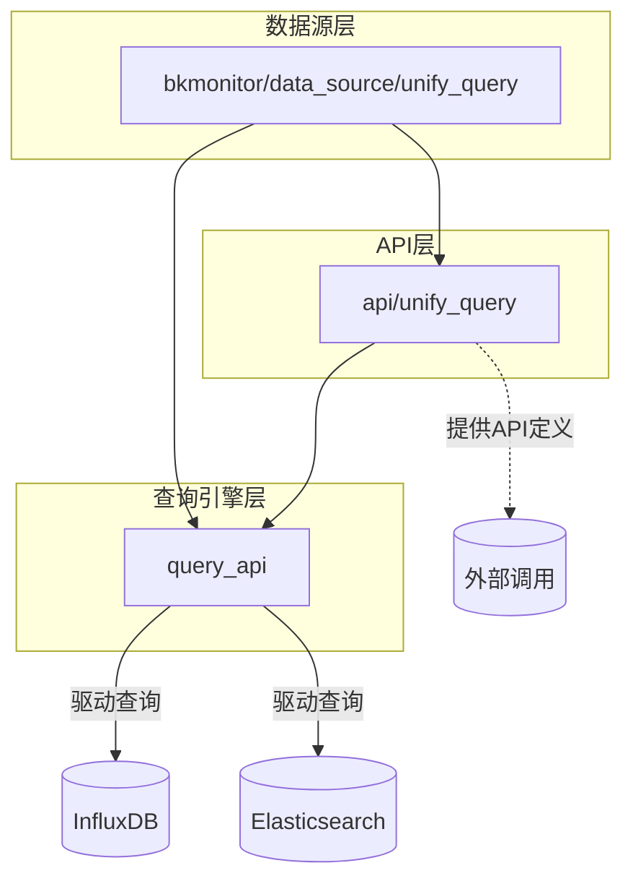
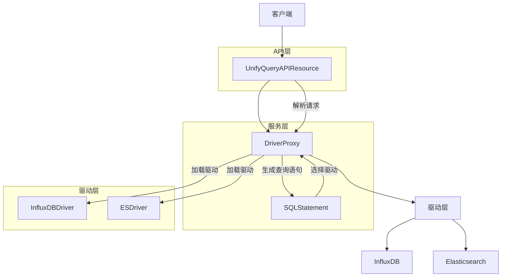
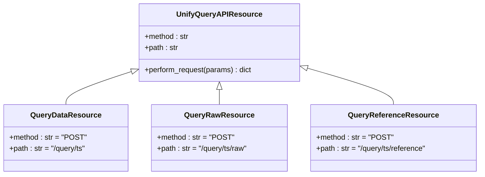
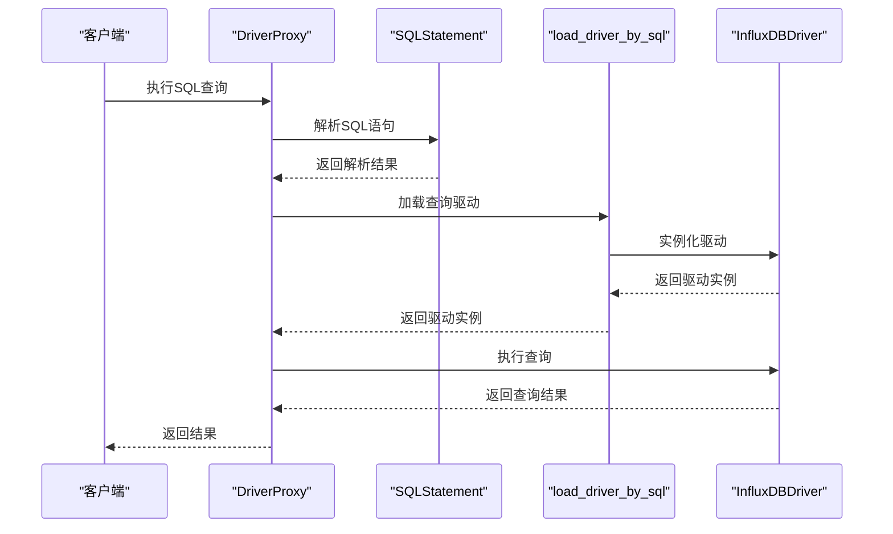
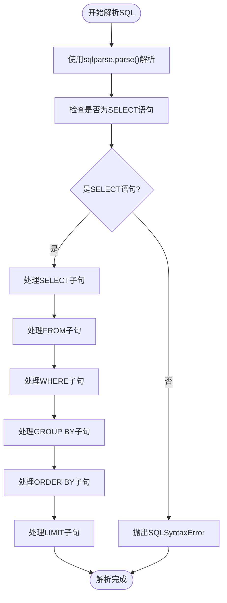
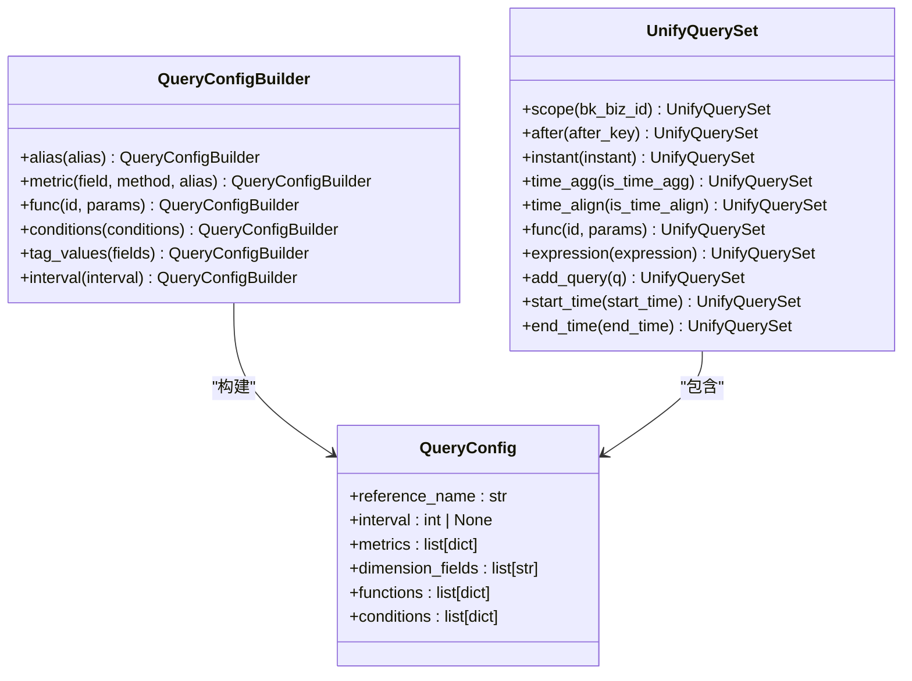
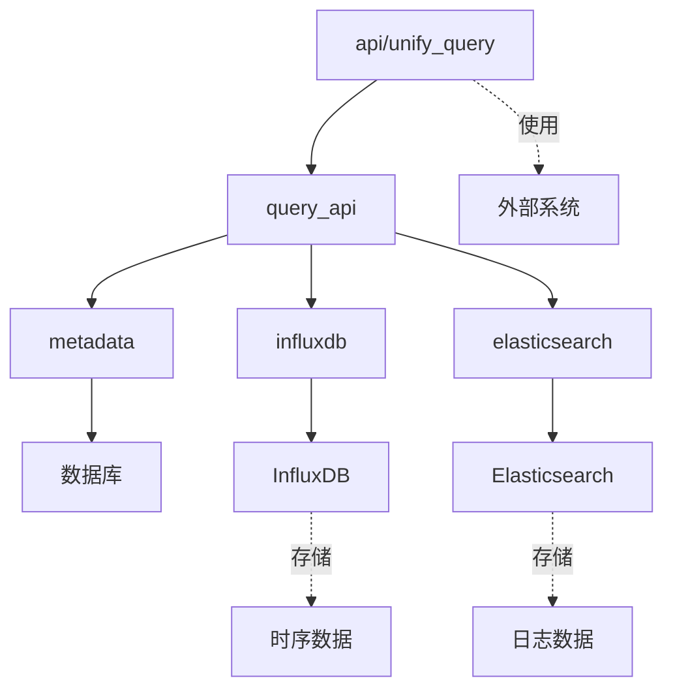

# 查询接口

<cite>
**本文档引用的文件**
- [default.py](file://bkmonitor/api/unify_query/default.py)
- [README.md](file://bkmonitor/query_api/README.md)
- [resources.py](file://bkmonitor/query_api/resources.py)
- [client.py](file://bkmonitor/query_api/drivers/influxdb/client.py)
- [statement.py](file://bkmonitor/query_api/sql_parse/statement.py)
- [proxy.py](file://bkmonitor/query_api/drivers/proxy.py)
- [builder.py](file://bkmonitor/bkmonitor/data_source/unify_query/builder.py)
</cite>

## 目录
1. [简介](#简介)
2. [项目结构](#项目结构)
3. [核心组件](#核心组件)
4. [架构概览](#架构概览)
5. [详细组件分析](#详细组件分析)
6. [依赖分析](#依赖分析)
7. [性能考虑](#性能考虑)
8. [故障排除指南](#故障排除指南)
9. [结论](#结论)

## 简介
本文档详细描述了蓝鲸监控平台（BlueKing - Monitor）中统一查询接口（Unify Query API）的设计与实现。该接口作为监控数据链路中的核心查询模块，支持通过SQL或ES DSL查询接入蓝鲸监控的时序数据和日志数据。文档将深入解析接口的RESTful设计规范、查询请求处理流程、查询语句结构、认证权限机制以及API版本管理策略，为开发者和用户提供全面的技术参考。

## 项目结构
蓝鲸监控系统的统一查询功能分布在多个模块中，主要涉及`api/unify_query`、`query_api`和`bkmonitor/data_source/unify_query`三个核心目录。`api/unify_query`模块定义了对外暴露的API资源和路由配置；`query_api`模块实现了底层的查询驱动和SQL解析功能；`bkmonitor/data_source/unify_query`模块则提供了类ORM的查询构建器，简化了后台复杂查询的开发。

**图示来源**
- [default.py](file://bkmonitor/api/unify_query/default.py)
- [resources.py](file://bkmonitor/query_api/resources.py)
- [builder.py](file://bkmonitor/bkmonitor/data_source/unify_query/builder.py)

**本节来源**
- [default.py](file://bkmonitor/api/unify_query/default.py)
- [README.md](file://bkmonitor/query_api/README.md)
- [builder.py](file://bkmonitor/bkmonitor/data_source/unify_query/builder.py)

## 核心组件
统一查询接口的核心组件包括API资源定义、查询驱动管理、SQL解析器和查询构建器。API资源定义了标准化的RESTful接口，如`QueryDataResource`用于查询时序数据，`GetTSDataResource`用于执行SQL查询。查询驱动管理通过`load_driver_by_sql`函数根据结果表的存储类型动态加载相应的查询驱动。SQL解析器使用`sqlparse`库将SQL语句分解为SELECT、FROM、WHERE等语法元素。查询构建器提供了类ORM的链式调用语法，极大地简化了复杂查询的构建过程。

**本节来源**
- [default.py](file://bkmonitor/api/unify_query/default.py)
- [proxy.py](file://bkmonitor/query_api/drivers/proxy.py)
- [statement.py](file://bkmonitor/query_api/sql_parse/statement.py)
- [builder.py](file://bkmonitor/bkmonitor/data_source/unify_query/builder.py)

## 架构概览
统一查询接口采用分层架构设计，从上至下分为API层、服务层和驱动层。API层接收前端或后台服务的查询请求，进行参数验证和预处理。服务层负责解析查询语句，根据结果表信息选择合适的查询驱动。驱动层则与具体的数据库（如InfluxDB、Elasticsearch）进行交互，执行实际的查询操作并返回结果。整个架构通过`UnifyQueryAPIResource`基类和`DriverProxy`代理模式实现了良好的扩展性和灵活性。

**图示来源**
- [default.py](file://bkmonitor/api/unify_query/default.py)
- [proxy.py](file://bkmonitor/query_api/drivers/proxy.py)
- [statement.py](file://bkmonitor/query_api/sql_parse/statement.py)
- [client.py](file://bkmonitor/query_api/drivers/influxdb/client.py)

**本节来源**
- [default.py](file://bkmonitor/api/unify_query/default.py)
- [proxy.py](file://bkmonitor/query_api/drivers/proxy.py)
- [statement.py](file://bkmonitor/query_api/sql_parse/statement.py)

## 详细组件分析

### API资源分析
统一查询API通过`UnifyQueryAPIResource`基类定义了标准化的请求处理流程。子类如`QueryDataResource`和`QueryRawResource`通过设置不同的`method`和`path`属性来定义具体的API端点。每个资源类都包含一个`RequestSerializer`，用于定义请求参数的验证规则。`perform_request`方法实现了请求的转发逻辑，包括URL构建、请求头设置和错误处理。

**图示来源**
- [default.py](file://bkmonitor/api/unify_query/default.py)

**本节来源**
- [default.py](file://bkmonitor/api/unify_query/default.py)

### 查询驱动分析
查询驱动管理通过`DriverProxy`类实现。当接收到SQL查询时，`DriverProxy`首先使用`SQLStatement`解析器分析SQL语句，提取结果表信息。然后根据结果表的`default_storage`字段动态导入相应的查询驱动模块（如`query_api.drivers.influxdb`）。这种设计使得系统可以轻松支持多种数据存储后端，而无需修改核心查询逻辑。

**图示来源**
- [proxy.py](file://bkmonitor/query_api/drivers/proxy.py)
- [statement.py](file://bkmonitor/query_api/sql_parse/statement.py)
- [client.py](file://bkmonitor/query_api/drivers/influxdb/client.py)

**本节来源**
- [proxy.py](file://bkmonitor/query_api/drivers/proxy.py)
- [statement.py](file://bkmonitor/query_api/sql_parse/statement.py)

### SQL解析分析
SQL解析器`SQLStatement`类使用`sqlparse`库将原始SQL语句分解为语法树。它通过遍历语法树中的标记（token），识别SELECT、FROM、WHERE、GROUP BY等SQL子句，并将其存储在相应的属性中。解析器还实现了语法验证功能，如检查SQL是否以SELECT开头，确保FROM子句中只有一个结果表等，保证了查询语句的合法性。

**图示来源**
- [statement.py](file://bkmonitor/query_api/sql_parse/statement.py)

**本节来源**
- [statement.py](file://bkmonitor/query_api/sql_parse/statement.py)

### 查询构建器分析
查询构建器`QueryConfigBuilder`提供了类ORM的链式调用语法，允许开发者以面向对象的方式构建复杂查询。通过`metric()`、`filter()`、`group_by()`等方法，开发者可以逐步构建查询配置。`UnifyQuerySet`类则提供了`scope()`、`start_time()`、`end_time()`等方法，用于设置查询的全局参数。这种设计极大地提高了代码的可读性和可维护性。

**图示来源**
- [builder.py](file://bkmonitor/bkmonitor/data_source/unify_query/builder.py)

**本节来源**
- [builder.py](file://bkmonitor/bkmonitor/data_source/unify_query/builder.py)

## 依赖分析
统一查询接口的依赖关系清晰，各组件之间耦合度低。`api/unify_query`模块依赖`query_api`模块提供的查询功能，而`query_api`模块又依赖`metadata`模块获取结果表的元数据信息。`query_api`模块通过插件化的方式加载不同的数据库驱动，如`influxdb`驱动依赖`influxdb`库，`es`驱动依赖`elasticsearch`库。这种分层和插件化的架构设计使得系统具有良好的可扩展性和可维护性。

**图示来源**
- [default.py](file://bkmonitor/api/unify_query/default.py)
- [proxy.py](file://bkmonitor/query_api/drivers/proxy.py)
- [resources.py](file://bkmonitor/query_api/resources.py)

**本节来源**
- [default.py](file://bkmonitor/api/unify_query/default.py)
- [proxy.py](file://bkmonitor/query_api/drivers/proxy.py)
- [resources.py](file://bkmonitor/query_api/resources.py)

## 性能考虑
统一查询接口在性能方面做了多项优化。首先，通过连接池管理数据库连接，避免了频繁创建和销毁连接的开销。其次，对于InfluxDB查询，使用了`client_pool`来复用客户端实例。在SQL解析方面，`SQLStatement`类缓存了解析结果，避免了重复解析。此外，系统还支持`instant`模式查询，可以在不进行时间聚合的情况下快速获取瞬时数据，满足实时性要求高的场景。

## 故障排除指南
当遇到查询接口问题时，可以按照以下步骤进行排查：首先检查API请求的参数是否符合规范，特别是时间范围和结果表ID是否正确。其次查看`query_api`模块的日志，确认SQL解析和驱动加载是否成功。如果涉及数据库连接问题，检查`metadata`模块中结果表的存储配置是否正确。对于性能问题，可以通过分析慢查询日志来定位瓶颈。最后，确保客户端有足够的权限访问目标业务和数据。

**本节来源**
- [default.py](file://bkmonitor/api/unify_query/default.py)
- [proxy.py](file://bkmonitor/query_api/drivers/proxy.py)
- [resources.py](file://bkmonitor/query_api/resources.py)

## 结论
蓝鲸监控平台的统一查询接口通过分层架构和模块化设计，实现了对多种数据源的统一查询能力。其RESTful API设计规范、灵活的驱动扩展机制和便捷的查询构建器，为开发者提供了强大而易用的查询工具。通过深入理解其设计原理和实现细节，开发者可以更高效地利用该接口构建监控和告警应用，提升系统的可观测性。