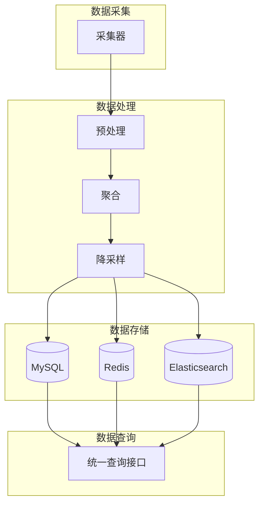
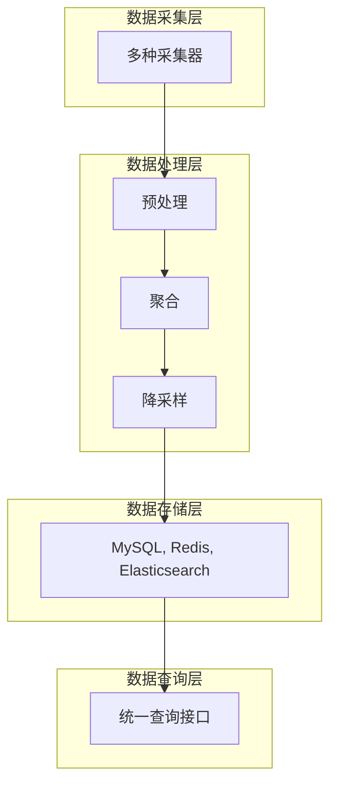
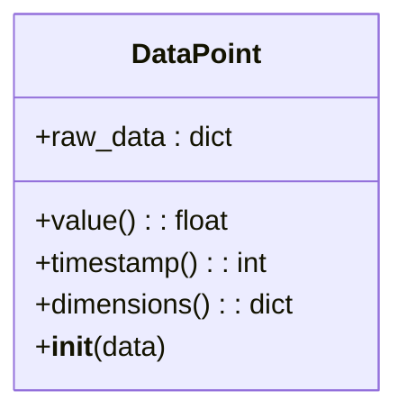
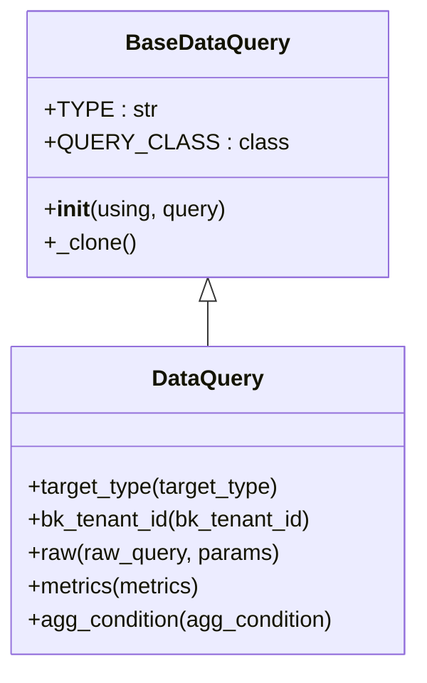
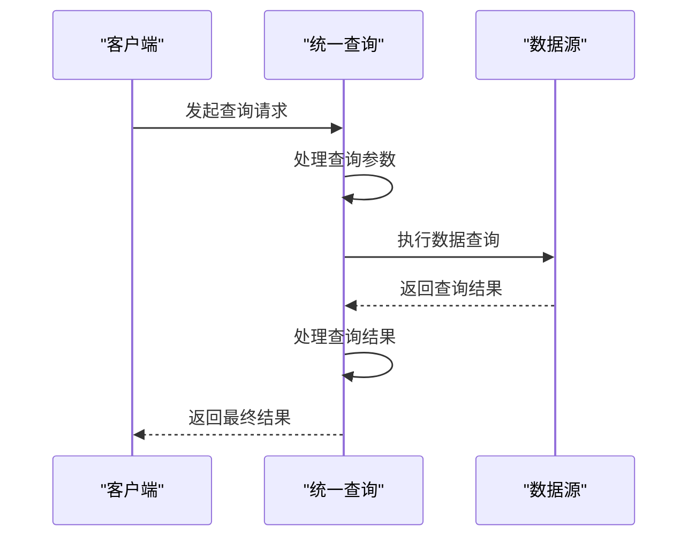
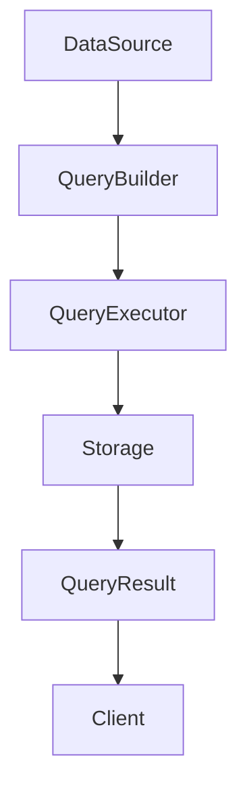

# 数据流设计

<cite>
**本文档引用的文件**   
- [data_structure.py](file://bkmonitor\bkmonitor\data_source\models\data_structure.py)
- [query.py](file://bkmonitor\bkmonitor\data_source\models\query.py)
- [sql/query.py](file://bkmonitor\bkmonitor\data_source\models\sql\query.py)
- [unify_query/query.py](file://bkmonitor\bkmonitor\data_source\unify_query\query.py)
- [data_source/__init__.py](file://bkmonitor\bkmonitor\data_source\data_source\__init__.py)
- [constants/data_source.py](file://bkmonitor\constants\data_source.py)
- [api/metadata/default.py](file://bkmonitor\api\metadata\default.py)
</cite>

## 目录
1. [引言](#引言)
2. [项目结构](#项目结构)
3. [核心组件](#核心组件)
4. [架构概述](#架构概述)
5. [详细组件分析](#详细组件分析)
6. [依赖分析](#依赖分析)
7. [性能考虑](#性能考虑)
8. [故障排除指南](#故障排除指南)
9. [结论](#结论)

## 引言
本文档全面描述了bk-monitor系统的数据流设计，涵盖了监控数据从采集到展示的完整生命周期。系统通过多种采集器收集指标数据，经过预处理、聚合和降采样等操作后，将数据存储到MySQL、Redis、Elasticsearch等存储系统中。用户通过统一查询接口获取数据，系统支持实时数据流和批处理数据流的不同处理路径，并确保数据一致性。

## 项目结构
bk-monitor系统采用模块化设计，主要模块包括数据源、数据处理、存储和查询等。系统通过清晰的目录结构组织代码，便于维护和扩展。

**图示来源**
- [data_source/__init__.py](file://bkmonitor\bkmonitor\data_source\data_source\__init__.py)
- [unify_query/query.py](file://bkmonitor\bkmonitor\data_source\unify_query\query.py)

## 核心组件
系统的核心组件包括数据源模块、数据处理模块、存储模块和查询模块。这些组件协同工作，确保监控数据的高效处理和可靠存储。

**组件来源**
- [data_source/__init__.py](file://bkmonitor\bkmonitor\data_source\data_source\__init__.py)
- [unify_query/query.py](file://bkmonitor\bkmonitor\data_source\unify_query\query.py)

## 架构概述
bk-monitor系统采用分层架构，包括数据采集层、数据处理层、数据存储层和数据查询层。各层之间通过清晰的接口进行通信，确保系统的可扩展性和可维护性。

**图示来源**
- [data_source/__init__.py](file://bkmonitor\bkmonitor\data_source\data_source\__init__.py)
- [unify_query/query.py](file://bkmonitor\bkmonitor\data_source\unify_query\query.py)

## 详细组件分析
### 数据源模块分析
数据源模块负责从不同数据源获取监控数据，支持多种数据类型和查询方式。

#### 数据结构设计

**图示来源**
- [data_structure.py](file://bkmonitor\bkmonitor\data_source\models\data_structure.py)

#### 查询模型设计

**图示来源**
- [query.py](file://bkmonitor\bkmonitor\data_source\models\query.py)

### 统一查询接口分析
统一查询接口提供了一致的数据访问方式，支持复杂的查询操作和数据处理。

#### 查询执行流程

**图示来源**
- [unify_query/query.py](file://bkmonitor\bkmonitor\data_source\unify_query\query.py)

## 依赖分析
系统各组件之间存在明确的依赖关系，确保数据流的正确性和高效性。

**图示来源**
- [data_source/__init__.py](file://bkmonitor\bkmonitor\data_source\data_source\__init__.py)
- [unify_query/query.py](file://bkmonitor\bkmonitor\data_source\unify_query\query.py)

## 性能考虑
系统在设计时充分考虑了性能因素，通过优化查询、缓存机制和并行处理等方式提高系统性能。

## 故障排除指南
当系统出现性能问题或数据不一致时，可以通过检查日志、监控指标和查询执行计划等方式进行故障排除。

**组件来源**
- [unify_query/query.py](file://bkmonitor\bkmonitor\data_source\unify_query\query.py)
- [data_source/__init__.py](file://bkmonitor\bkmonitor\data_source\data_source\__init__.py)

## 结论
bk-monitor系统通过精心设计的数据流架构，实现了监控数据的高效采集、处理、存储和查询。系统具有良好的可扩展性和可维护性，能够满足大规模监控场景的需求。