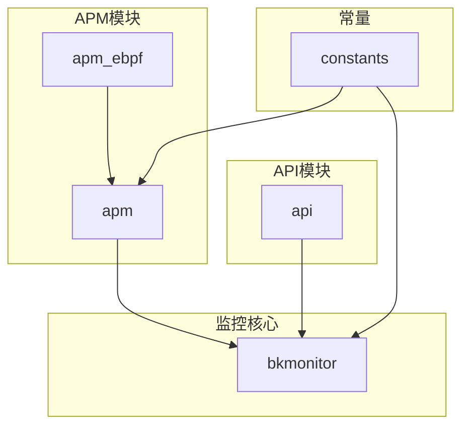
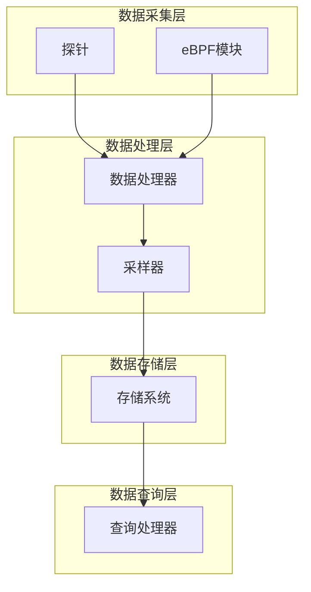
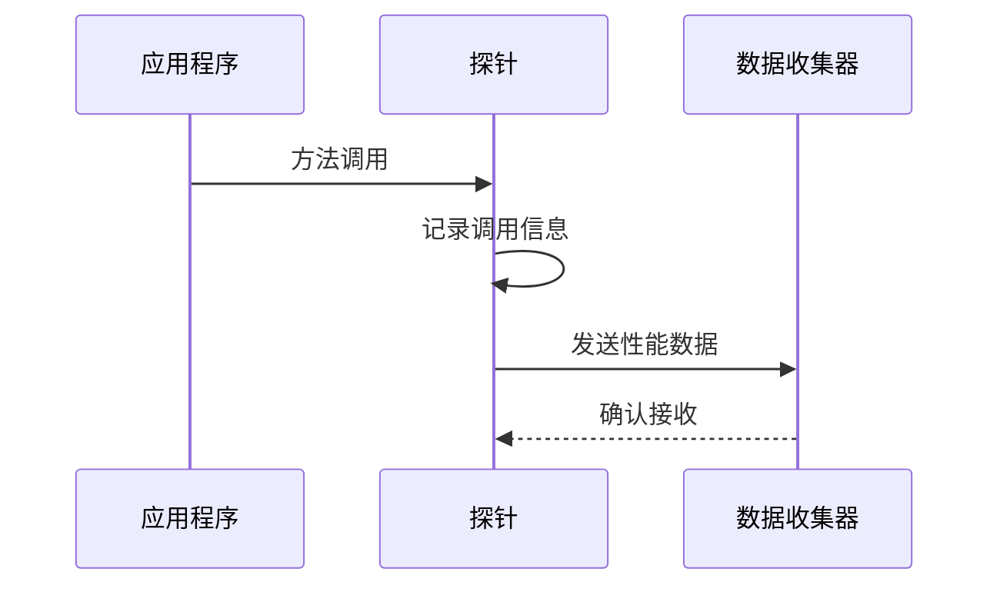
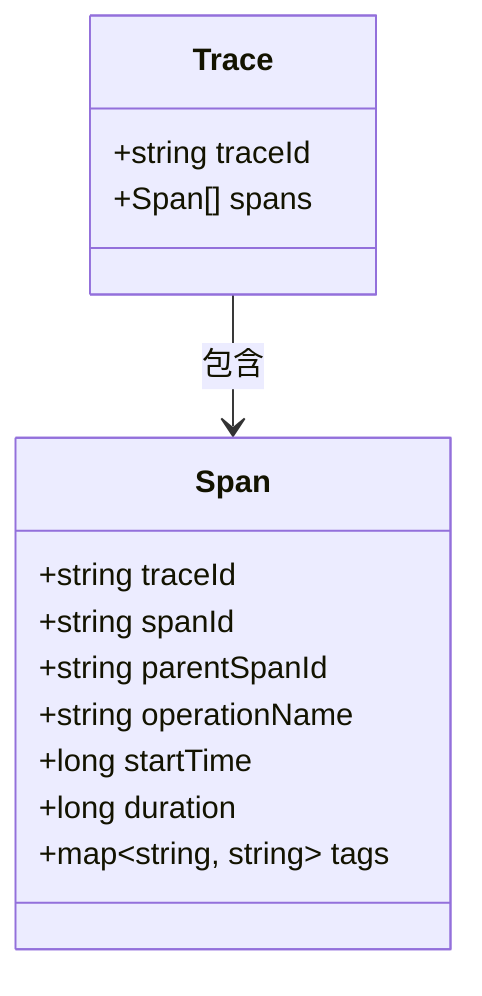
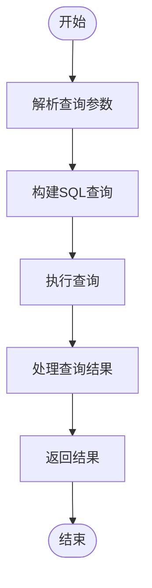
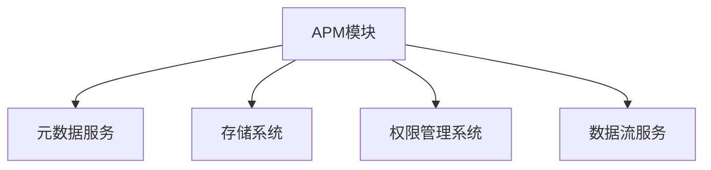

# APM数据采集

<cite>
**本文档引用的文件**   
- [builder.py](file://bkmonitor/apm/core/handlers/query/builder.py)
- [base.py](file://bkmonitor/apm/core/handlers/ebpf/base.py)
- [ebpf_query.py](file://bkmonitor/apm/core/handlers/query/ebpf_query.py)
- [base.py](file://bkmonitor/apm/core/deepflow/base.py)
- [constants.py](file://bkmonitor/apm/core/deepflow/constants.py)
- [application.py](file://bkmonitor/apm/models/application.py)
- [datasource.py](file://bkmonitor/apm/models/datasource.py)
- [origin_trace_query.py](file://bkmonitor/apm/core/handlers/query/origin_trace_query.py)
- [tail_sampling.py](file://bkmonitor/apm/core/handlers/bk_data/tail_sampling.py)
- [flow.py](file://bkmonitor/apm/core/handlers/bk_data/flow.py)
- [application_hepler.py](file://bkmonitor/apm/core/handlers/application_hepler.py)
</cite>

## 目录
1. [简介](#简介)
2. [项目结构](#项目结构)
3. [核心组件](#核心组件)
4. [架构概述](#架构概述)
5. [详细组件分析](#详细组件分析)
6. [依赖分析](#依赖分析)
7. [性能考虑](#性能考虑)
8. [故障排除指南](#故障排除指南)
9. [结论](#结论)

## 简介
本文档详细描述了蓝鲸监控平台中应用性能监控（APM）数据采集的技术实现。文档涵盖了通过探针采集应用性能数据的机制，包括方法调用链、SQL执行、外部服务调用和异常信息等性能指标的采集。同时，文档还阐述了分布式追踪的实现原理，如TraceID和SpanID的生成与传递，并提供了APM探针性能影响评估和优化建议。

## 项目结构
项目结构遵循模块化设计，主要分为以下几个部分：
- `apm`：APM核心模块，包含数据采集、处理和查询逻辑。
- `apm_ebpf`：eBPF相关处理模块，用于网络层面的数据采集。
- `api`：API接口定义，提供与外部系统的交互。
- `bkmonitor`：监控核心功能，包含告警、数据源管理等。
- `constants`：常量定义，统一管理项目中的常量。

**图示来源**
- [project_structure](file://project_structure)

## 核心组件
APM数据采集的核心组件包括探针、数据源配置、查询处理器和eBPF处理模块。这些组件协同工作，实现对应用性能数据的全面监控。

**组件来源**
- [application.py](file://bkmonitor/apm/models/application.py)
- [datasource.py](file://bkmonitor/apm/models/datasource.py)
- [ebpf_query.py](file://bkmonitor/apm/core/handlers/query/ebpf_query.py)

## 架构概述
APM数据采集架构采用分层设计，从数据采集到数据处理再到数据查询，每一层都有明确的职责。

**图示来源**
- [flow.py](file://bkmonitor/apm/core/handlers/bk_data/flow.py)
- [tail_sampling.py](file://bkmonitor/apm/core/handlers/bk_data/tail_sampling.py)

## 详细组件分析

### 探针与数据采集
探针是APM数据采集的起点，负责在应用运行时收集性能数据。探针通过字节码增强技术，动态插入监控代码，捕获方法调用、SQL执行等信息。

**图示来源**
- [application.py](file://bkmonitor/apm/models/application.py)
- [datasource.py](file://bkmonitor/apm/models/datasource.py)

### 分布式追踪实现
分布式追踪通过TraceID和SpanID实现跨服务的调用链路追踪。每个请求生成唯一的TraceID，每个调用生成唯一的SpanID，通过父子关系构建完整的调用链。

**图示来源**
- [base.py](file://bkmonitor/apm/core/deepflow/base.py)
- [constants.py](file://bkmonitor/apm/core/deepflow/constants.py)

### 查询处理机制
查询处理器负责将用户查询转换为底层存储系统的查询语句，并返回结果。查询处理器支持多种查询类型，包括列表查询、详细信息查询等。

**图示来源**
- [builder.py](file://bkmonitor/apm/core/handlers/query/builder.py)
- [origin_trace_query.py](file://bkmonitor/apm/core/handlers/query/origin_trace_query.py)

## 依赖分析
APM数据采集系统依赖于多个外部组件，包括元数据服务、数据存储系统和权限管理系统。这些依赖关系通过清晰的接口定义，确保系统的可维护性和可扩展性。

**图示来源**
- [flow.py](file://bkmonitor/apm/core/handlers/bk_data/flow.py)
- [application_hepler.py](file://bkmonitor/apm/core/handlers/application_hepler.py)

## 性能考虑
APM探针对应用性能有一定影响，主要体现在CPU和内存开销上。为了最小化性能影响，系统采用了多种优化策略，包括采样、异步上报和数据压缩。

- **采样策略**：通过尾部采样减少数据量，只保留关键调用链。
- **异步上报**：将数据上报操作放入异步队列，避免阻塞主业务流程。
- **数据压缩**：在传输前对数据进行压缩，减少网络带宽消耗。

## 故障排除指南
### 探针加载失败
- **检查**：确认探针版本与应用环境兼容。
- **解决**：更新探针版本或调整应用配置。

### 数据不完整
- **检查**：确认采样率设置是否合理。
- **解决**：调整采样率或检查网络连接。

### 性能损耗过大
- **检查**：监控探针的CPU和内存使用情况。
- **解决**：优化探针配置或增加采样率。

**组件来源**
- [tail_sampling.py](file://bkmonitor/apm/core/handlers/bk_data/tail_sampling.py)
- [flow.py](file://bkmonitor/apm/core/handlers/bk_data/flow.py)

## 结论
APM数据采集系统通过探针、eBPF和分布式追踪技术，实现了对应用性能的全面监控。系统设计考虑了性能影响和可扩展性，提供了丰富的配置选项和优化策略。通过本文档的指导，用户可以更好地理解和使用APM系统，提升应用性能监控的效率和准确性。