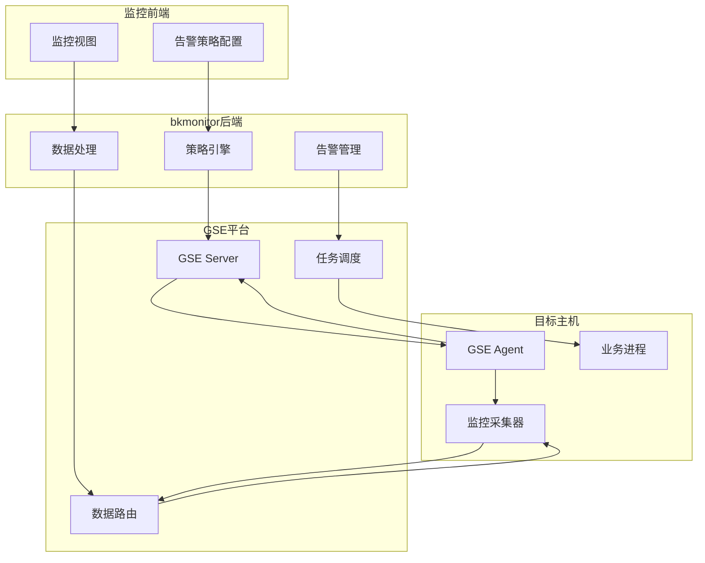

# GSE数据采集

<cite>
**本文档引用文件**   
- [GSE(通用服务引擎).md](file://wiki\GSE(通用服务引擎).md)
- [default.py](file://bkmonitor\api\gse\default.py)
- [agent.py](file://bkmonitor\alarm_backends\service\access\event\records\agent.py)
</cite>

## 目录
1. [引言](#引言)
2. [GSE核心功能与定位](#gse核心功能与定位)
3. [技术架构与组件分析](#技术架构与组件分析)
4. [数据采集机制详解](#数据采集机制详解)
5. [采集配置管理](#采集配置管理)
6. [性能调优建议](#性能调优建议)
7. [常见问题排查指南](#常见问题排查指南)
8. [总结](#总结)

## 引言

本技术文档旨在全面阐述腾讯蓝鲸（BlueKing）监控平台（bk-monitor）中GSE（通用服务引擎）的数据采集机制。GSE作为蓝鲸体系的底层管控平台，是实现大规模自动化运维的“神经中枢”和“命令管道”。它为上层应用（如作业平台、日志平台、监控平台）提供高并发、分布式的任务执行、文件传输和节点管理能力，是整个蓝鲸自动化运维体系的基石。

本文档将深入解析GSE如何通过其Agent与Server的协同工作，实现对主机性能指标、进程状态、系统日志等数据的可靠采集。同时，文档将详细说明GSE的部署架构、通信协议、心跳机制、数据上报流程以及采集配置的下发与管理方式。此外，还将提供性能调优建议和常见问题的诊断与解决方案，为运维人员和开发者提供一份详尽的技术参考。

## GSE核心功能与定位

### **核心定位：蓝鲸的“神经系统”**

GSE在蓝鲸生态中并非一个独立的前端产品，而是作为底层的“通用服务引擎”或“管控平台”存在。其核心定位是为整个蓝鲸PaaS平台提供基础的分布式管控能力。可以将其比喻为系统的“神经系统”，连接着控制中心（蓝鲸SaaS）和遍布在各个业务服务器上的“神经末梢”（GSE Agent），实现指令的精确下达和状态的实时反馈。

### **主要功能**

GSE的核心功能可归纳为以下三个方面：

*   **命令与脚本执行**：这是GSE最基础的功能。它构建了一条稳定的“命令管道”，使得管理员或上层平台（如作业平台）能够远程、批量地在成千上万台服务器上执行Shell、Python等脚本，是实现自动化运维的基石。
*   **文件分发与传输**：GSE具备强大的文件分发能力，能够高效地将文件、安装包、配置文件等从源服务器传输到大量目标服务器。这一功能由其内部的`BK FileServer`等组件支持，对于批量部署和配置更新至关重要。
*   **Agent节点管理**：GSE的功能实现依赖于部署在每台受管服务器上的代理程序——`GSE Agent`。GSE平台及`bk-nodeman`（节点管理器）模块提供了对这些Agent的完整生命周期管理，包括状态监控、版本升级、配置变更和进程管理。

在bkmonitor项目中，GSE主要扮演**数据采集的基础通道**和**告警处理的执行引擎**两大角色，是监控系统能够正常运行的基础支撑。

## 技术架构与组件分析

### **已知的核心组件**

尽管GSE的完整内部架构图未公开，但通过分析现有文档和代码，可以识别出其关键组成部分：

*   **GSE Agent**：客户端代理。这是一个轻量级的代理程序，必须预先安装在所有受管服务器上。它负责接收来自GSE Server的指令，执行任务（如采集数据、执行脚本），并将结果上报。
*   **GSE Server (后台)** ：服务端集群。这是GSE的控制中枢，以集群形式部署以保证高可用和高并发处理能力。其核心子组件包括：
    *   **TaskServer (`BK TaskServer`)**：任务处理服务器，负责接收、解析和调度来自上层平台的任务请求。
    *   **FileServer (`BK FileServer`)**：文件服务，专门处理文件分发任务。
    *   **其他后台服务**：可能包括与Agent维持长连接、管理Agent状态、处理数据中转等功能的微服务。
*   **bk-nodeman (节点管理器)** ：一个专门用于管理GSE Agent的蓝鲸官方SaaS应用。用户可以通过其界面方便地对Agent进行安装、卸载、升级和配置。
*   **依赖组件**：GSE的稳定运行还依赖于ZooKeeper（服务发现与协调）、Redis（数据缓存）等基础中间件。

### **组件交互与通信协议**

关于GSE内部组件间详细的通信协议设计，目前缺乏公开的官方文档。但基于其功能特性，可以做出如下合理推断：

1.  **Agent与Server的通信**：GSE Agent与GSE Server之间很可能采用基于TCP的、加密的、持久化的长连接。这种设计保证了指令下发的低延迟和实时性，并能及时感知Agent的掉线。
2.  **协议设计**：通信协议是私有的、自定义的二进制协议，以实现高效的数据序列化和传输。报文内容会包含任务ID、指令类型、加密荷载、校验信息等字段。
3.  **高可用设计**：Agent在连接GSE Server时，可能会通过服务发现机制（如轮询DNS或从Zookeeper获取地址列表）连接到可用的Server节点，从而实现服务端的负载均衡和故障转移。

**Section sources**
- [GSE(通用服务引擎).md](file://wiki\GSE(通用服务引擎).md)

## 数据采集机制详解

### **数据采集流程**

GSE的数据采集遵循一个清晰的流程：

1.  **数据采集**：GSE Agent在各主机上采集监控数据（如CPU、内存、磁盘使用率、进程状态等）。
2.  **数据传输**：通过GSE的数据路由系统，将采集到的数据传输到bkmonitor平台。
3.  **数据处理**：bkmonitor对收到的数据进行清洗、聚合和分析。
4.  **告警生成**：基于预设的监控策略，对处理后的数据进行判断，生成告警事件。
5.  **动作执行**：当告警触发时，通过GSE执行相应的处理动作（如执行修复脚本）。

简而言之，**GSE是bkmonitor系统的"神经系统"**，实现了监控数据的双向流通和自动化运维操作的精确执行。



**Diagram sources**
- [GSE(通用服务引擎).md](file://wiki\GSE(通用服务引擎).md)

### **心跳机制与状态监控**

GSE通过心跳机制来监控Agent的存活状态。

*   **心跳上报**：GSE Agent会定期向GSE Server发送心跳数据。
*   **状态查询**：bkmonitor通过调用GSE提供的`GetAgentStatus` API来实时查询主机的Agent状态。
*   **告警触发**：当GSE Server在一定时间内未收到Agent的心跳时，会生成“AGENT心跳丢失-GSE”的告警事件。在代码中，该事件的`METRIC_ID`为`bk_monitor.agent-gse`，`event_type`为`gse_basic_alarm_type`。

```python
# 示例：GSE Agent心跳丢失事件的数据结构
{
    "utctime2": "2025-08-26 10:00:00",
    "value": [
        {
            "event_raw_id": 29,
            "event_type": "gse_basic_alarm_type",
            "event_time": "2025-08-26 10:00:00",
            "extra": {
                "count": 1,
                "host": [{"cloudid": 0, "bizid": 0, "agent_id": "0100005254008ed86116666614661851"}],
                "type": 2
            },
            "event_title": "",
            "event_desc": "",
            "event_source_system": ""
        }
    ],
    "server": "127.0.0.1",
    "utctime": "2025-08-26 10:00:00",
    "time": "2025-08-26 10:00:00",
    "timezone": 8
}
```

**Section sources**
- [default.py](file://bkmonitor\api\gse\default.py#L410-L426)
- [agent.py](file://bkmonitor\alarm_backends\service\access\event\records\agent.py#L61-L93)

### **进程状态监控**

GSE同样可以监控主机上关键进程的运行状态。

*   **状态查询**：bkmonitor通过调用`GetProcStatus` API来获取指定主机上特定进程的运行状态。
*   **异常处理**：如果进程异常退出，GSE会捕获该事件并上报，从而触发相应的告警和自动化处理流程。

**Section sources**
- [default.py](file://bkmonitor\api\gse\default.py#L429-L455)

## 采集配置管理

### **配置下发机制**

GSE的采集配置通过API进行管理，主要涉及数据流（StreamTo）和路由（Route）的配置。

*   **新增数据接收端 (AddStreamTo)**：此API用于配置数据的最终接收端，如Kafka、Redis、Pulsar或文件。配置中需指定接收端的IP、端口、认证信息等。
*   **注册路由配置 (AddRoute)**：此API用于定义数据从Agent到接收端的传输路径。它将数据流（StreamTo）与特定的过滤条件（如主机、业务）关联起来，实现数据的定向传输。

### **配置项说明**

*   **采集策略**：通过路由（Route）中的`filter_name_and`和`filter_name_or`等字段定义，用于指定哪些主机或业务的数据需要被采集。
*   **采集频率**：通常由部署在主机上的具体采集器（Collector）或监控脚本决定，GSE主要负责通道的稳定传输。心跳频率是固定的，由Agent内部机制控制。
*   **命令模板**：对于需要执行脚本的采集任务，脚本内容本身即为“命令模板”。这些脚本通过GSE的命令执行功能下发到目标主机执行。

**Section sources**
- [default.py](file://bkmonitor\api\gse\default.py#L51-L108)
- [default.py](file://bkmonitor\api\gse\default.py#L288-L353)

## 性能调优建议

尽管关于GSE的官方性能基准测试报告和具体性能指标在公开渠道中完全缺失，但可以基于其架构和通用原则提出以下优化策略：

*   **批量上报**：对于非实时性要求极高的数据，可以配置采集器进行数据聚合，然后通过GSE批量上报，减少网络连接和处理开销。
*   **压缩传输**：在传输大量日志或监控数据时，启用数据压缩（如gzip）可以显著降低网络带宽消耗。
*   **合理配置心跳间隔**：根据实际监控需求调整Agent的心跳上报频率，在保证监控实时性的同时，避免对Server造成过大压力。
*   **资源隔离**：确保GSE Server集群有足够的计算和网络资源，并与业务系统进行适当的资源隔离，避免相互影响。

**Section sources**
- [GSE(通用服务引擎).md](file://wiki\GSE(通用服务引擎).md)

## 常见问题排查指南

### **Agent离线**

*   **现象**：监控平台显示大量主机Agent状态为离线。
*   **诊断步骤**：
    1.  检查目标主机的网络连通性，确保能访问GSE Server。
    2.  登录目标主机，检查`GSE Agent`进程是否在运行。
    3.  查看Agent的日志文件，排查是否有连接失败、认证错误等记录。
    4.  检查GSE Server集群的负载和状态，确认服务是否正常。

### **数据延迟**

*   **现象**：监控数据上报有明显延迟。
*   **诊断步骤**：
    1.  检查GSE Server集群的资源使用率（CPU、内存、网络），是否存在瓶颈。
    2.  检查数据接收端（如Kafka、Redis）是否积压，处理能力是否足够。
    3.  确认网络带宽是否充足，是否存在丢包或高延迟。
    4.  检查Agent端的采集器是否因资源不足而采集缓慢。

### **连接超时**

*   **现象**：执行命令或文件分发时出现连接超时错误。
*   **诊断步骤**：
    1.  检查防火墙策略，确保GSE Server与目标主机之间的通信端口是开放的。
    2.  确认目标主机的负载是否过高，导致无法及时响应。
    3.  检查GSE Server的连接池配置，是否已达到上限。
    4.  尝试从GSE Server直接ping或telnet目标主机，验证网络层的连通性。

**Section sources**
- [GSE(通用服务引擎).md](file://wiki\GSE(通用服务引擎).md)

## 总结

GSE（通用服务引擎）是腾讯蓝鲸监控平台不可或缺的底层基础设施。它通过其强大的分布式管控能力，为数据采集、告警处理和配置管理提供了稳定、高效的基础通道。虽然其内部通信协议和性能细节未完全公开，但通过对其核心功能、架构组件和API接口的分析，我们可以清晰地理解其在监控体系中的核心作用。GSE作为连接监控中心与海量业务节点的“神经系统”，是实现大规模、自动化、智能化运维的关键所在。随着AIOps和云原生技术的发展，GSE也必将向着更高性能、更强安全性和更智能调度的方向持续演进。