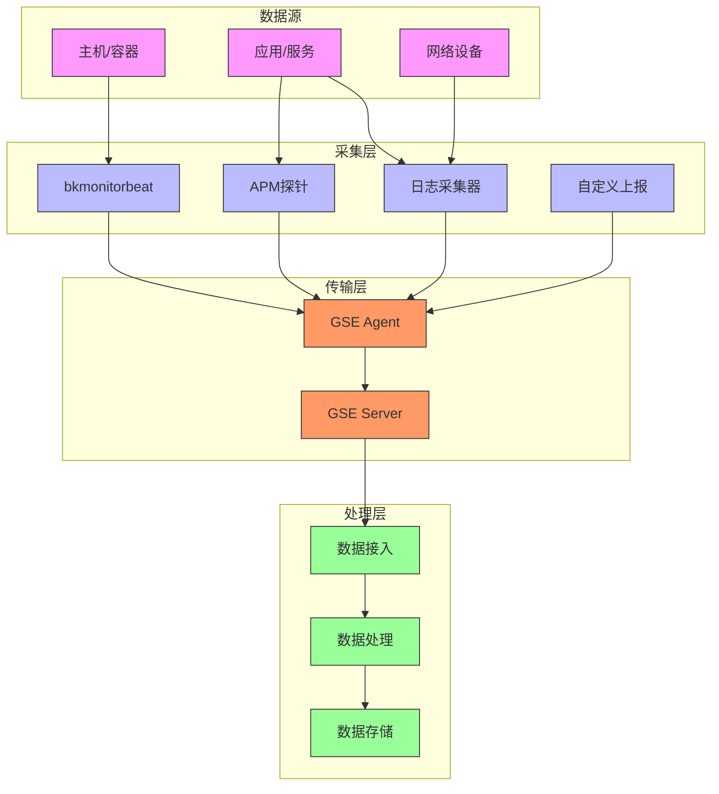
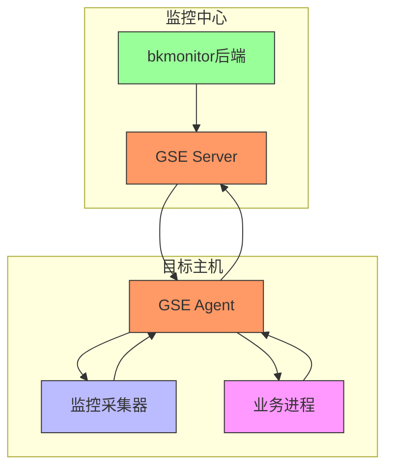

# 数据采集

<cite>
**本文档引用的文件**   
- [time_series.py](file://bkmonitor\packages\monitor_web\grafana\resources\time_series.py)
- [status.py](file://bkmonitor\packages\monitor_web\collecting\resources\status.py)
- [backend.py](file://bkmonitor\packages\monitor_web\collecting\resources\backend.py)
- [observation_scene.py](file://bkmonitor\packages\monitor_web\scene_view\resources\observation_scene.py)
- [data\processor.py](file://bkmonitor\alarm_backends\service\access\data\processor.py)
- [query_collect_config_detail.md](file://bkmonitor\docs\api\apidocs\zh_hans\query_collect_config_detail.md)
- [search_action.md](file://bkmonitor\support-files\apigw\docs\zh\search_action.md)
- [export_uptime_check_task.md](file://bkmonitor\docs\api\apidocs\zh_hans\export_uptime_check_task.md)
- [custom_ts_group.py](file://bkmonitor\alarm_backends\core\cache\models\custom_ts_group.py)
- [constants.py](file://bkmonitor\metadata\models\constants.py)
- [toolkit.py](file://bkmonitor\packages\monitor_web\collecting\resources\toolkit.py)
- [views.py](file://bkmonitor\packages\monitor_web\collecting\views.py)
- [transfer_story.py](file://bkmonitor\alarm_backends\management\story\transfer_story.py)
- [biz\resources.py](file://bkmonitor\packages\monitor_web\commons\biz\resources.py)
- [GSE(通用服务引擎).md](file://wiki\GSE(通用服务引擎).md)
- [bkmonitor关联BCS集群.md](file://wiki\bkmonitor关联BCS集群.md)
- [report_event.py](file://bkmonitor\apm\utils\report_event.py)
- [tasks.py](file://bkmonitor\packages\apm_web\tasks.py)
- [test_release_app_config.py](file://bkmonitor\apm\tests\test_release_app_config.py)
- [fields.py](file://bkmonitor\packages\apm_web\meta\plugin\context_manager\fields.py)
</cite>

## 目录
1. [引言](#引言)
2. [数据采集机制概述](#数据采集机制概述)
3. [核心数据采集方式](#核心数据采集方式)
4. [采集配置管理](#采集配置管理)
5. [通信协议与数据格式](#通信协议与数据格式)
6. [性能优化与故障排查](#性能优化与故障排查)
7. [总结](#总结)

## 引言

本技术文档旨在全面阐述bk-monitor系统的数据采集机制。文档详细描述了通过GSE、日志采集、APM探针、自定义上报等多种途径收集监控数据的技术细节。同时，深入分析了数据采集配置的管理方式，包括采集策略、采集频率、数据过滤规则等核心要素。此外，文档还探讨了采集器与监控系统之间的通信协议和数据格式，并提供了采集性能优化建议以及针对采集延迟、数据丢失等常见问题的故障排查指南。本文档的目标是为运维工程师和技术人员提供一份详尽、权威的参考，以确保监控系统的稳定、高效运行。

## 数据采集机制概述

bk-monitor系统构建了一个多层次、多协议的综合性数据采集体系。该体系以GSE（通用服务引擎）作为底层基础设施，为各类监控数据的采集和传输提供了稳定、高效的通道。系统支持多种数据源类型，包括时序数据、日志数据、事件数据和自定义上报数据，能够满足从基础资源监控到应用性能管理（APM）的广泛需求。

整个数据采集流程始于部署在目标主机上的采集器（如bkmonitorbeat），这些采集器通过GSE Agent与监控平台建立连接。采集器根据预设的策略和配置，从主机或应用中收集原始数据，经过初步处理后，通过GSE构建的“命令管道”将数据安全、可靠地传输至监控平台的后端服务。后端服务对数据进行进一步的清洗、聚合和存储，最终供告警、分析和可视化等上层功能使用。



**图示来源**
- [GSE(通用服务引擎).md](file://wiki\GSE(通用服务引擎).md)

## 核心数据采集方式

### GSE通用服务引擎

GSE（General Service Engine，通用服务引擎）是bk-monitor系统数据采集的基石，扮演着“神经系统”的角色。它并非一个独立的前端产品，而是蓝鲸体系中的底层管控平台，为上层应用提供分布式任务执行、文件分发和节点管理能力。

**核心功能与作用：**
- **数据采集通道**：GSE为bkmonitor提供稳定、高效的数据传输通道，将部署在各主机上的监控数据（如系统指标、进程状态、日志）实时传输到监控平台。
- **Agent管理**：通过在被监控主机上部署GSE Agent，实现对采集器的统一管理和控制。GSE支持对Agent进行安装、卸载、升级和配置变更等全生命周期管理。
- **命令与脚本执行**：当监控策略触发告警时，GSE负责执行预定义的处理动作，如执行修复脚本、重启服务等，实现自动化响应。
- **配置分发**：将监控策略、采集器配置等批量分发到目标主机，确保配置的一致性和及时性。

GSE通过其`TaskServer`和`FileServer`等后台组件，与分布在各业务主机上的`GSE Agent`协同工作，构建了一个跨网络、跨云的分布式管控网络。



**图示来源**
- [GSE(通用服务引擎).md](file://wiki\GSE(通用服务引擎).md)

### 日志采集

日志采集是监控系统的重要组成部分，用于收集和分析应用程序和系统的日志信息。在bk-monitor中，日志采集通常通过`bkmonitorbeat`等采集器实现，这些采集器利用GSE作为传输通道。

**实现原理：**
1.  **配置管理**：用户在监控平台创建日志采集配置，指定日志路径、日志类型、过滤规则等。
2.  **配置下发**：平台通过GSE将采集配置分发到目标主机。
3.  **日志读取**：`bkmonitorbeat`根据配置读取指定路径的日志文件。
4.  **数据处理**：对读取的日志进行解析、过滤和格式化。
5.  **数据上报**：将处理后的日志数据通过GSE Agent上报至监控平台。

### APM探针

APM（Application Performance Management，应用性能管理）探针用于监控应用的内部性能指标，如方法调用耗时、数据库查询性能、分布式链路追踪等。

**实现原理：**
- **探针注入**：APM探针以SDK或Agent的形式集成到目标应用中，通过字节码增强（Bytecode Instrumentation）等技术，无侵入或低侵入地收集应用运行时的性能数据。
- **数据上报**：探针将收集到的性能数据（如Trace、Span）通过HTTP或gRPC等协议上报到APM后端服务。
- **配置管理**：探针的行为（如采样率、监控规则）可以通过平台进行动态配置和管理。例如，在`test_release_app_config.py`中，可以看到探针配置（`probe_config`）包含规则（`rules`）、过滤器（`filters`）等，用于控制数据采集的范围和方式。

### 自定义上报

自定义上报为用户提供了极大的灵活性，允许业务系统直接向监控平台发送特定的监控数据。

**实现原理：**
- **API调用**：业务系统通过调用监控平台提供的`custom_report_tool`等工具，将自定义的监控数据发送到指定的`data_id`。
- **数据格式**：上报的数据通常包含事件名称、时间戳、维度信息（`dimension`）和具体内容（`content`）。例如，在`report_event.py`中，`_get_content`方法构建了包含`event_name`、`target`、`timestamp`、`dimension`和`event.content`的事件数据结构。
- **应用场景**：适用于业务指标监控、自定义事件上报、第三方系统集成等场景。

## 采集配置管理

采集配置是数据采集的核心，它定义了“采集什么”、“从哪里采集”、“如何采集”以及“何时采集”等关键问题。bk-monitor系统提供了一套完善的采集配置管理机制。

### 采集策略

采集策略定义了数据采集的逻辑和规则。它通常与具体的监控目标（如主机、服务实例）和数据源类型（如时序、日志）相关联。策略的管理通过`CollectConfigMeta`等模型进行，支持创建、编辑、启用、停用和删除等操作。

### 采集频率

采集频率（或称采集周期）决定了数据采集的间隔时间，是影响监控实时性和系统负载的关键参数。在代码中，采集周期通常以`period`字段表示，单位为秒或分钟。

**动态间隔计算示例：**
在`time_series.py`中，当未指定查询间隔（`interval`）时，系统会根据时间范围（`time_range`）动态计算一个合适的间隔：
```python
if not interval:
    time_range = end_time - start_time
    if time_range < 5 * 60:        # 小于5分钟
        interval = 60              # 间隔60秒
    elif time_range < 60 * 60:     # 小于1小时
        interval = 5 * 60          # 间隔5分钟
    elif time_range < 24 * 60 * 60: # 小于1天
        interval = 60 * 60         # 间隔1小时
    else:
        interval = 24 * 60 * 60    # 间隔24小时
```
此逻辑确保了在不同时间粒度下，查询结果既不过于稀疏也不过于密集。

### 数据过滤规则

数据过滤规则用于在采集或查询阶段筛选出所需的数据，减少数据量并提高查询效率。

**过滤规则实现：**
- **基于Cookies的过滤**：在`time_series.py`中，系统会从请求的Cookies中提取符合规则的字段作为过滤条件（`cookies_filter`），并将其加入到查询参数`filter_dict`中。
- **基于维度的过滤**：在`status.py`中，查询日志数据时，会根据`bk_target_ip`或`bk_target_service_instance_id`等维度进行分组（`group_by`），并使用`filter_dict`来过滤特定的采集配置ID（`bk_collect_config_id`）。
- **高级过滤**：系统支持更复杂的过滤条件，如在`processor.py`中，`_advance_where`字段用于存储和恢复高级过滤条件。

**图示来源**
- [time_series.py](file://bkmonitor\packages\monitor_web\grafana\resources\time_series.py#L735-L765)
- [status.py](file://bkmonitor\packages\monitor_web\collecting\resources\status.py#L114-L144)
- [data\processor.py](file://bkmonitor\alarm_backends\service\access\data\processor.py#L358-L384)

## 通信协议与数据格式

### 通信协议

GSE作为底层传输框架，其内部通信协议是私有的、自定义的二进制协议。虽然具体的协议细节未公开，但可以合理推断：

- **连接方式**：GSE Agent与GSE Server之间很可能采用基于TCP的、加密的持久化长连接，以保证指令下发的低延迟和实时性。
- **协议特性**：该协议设计为高效、可靠，支持任务调度、文件分发和数据上报等多种消息类型。

### 数据格式

监控数据在上报和存储时遵循特定的格式规范。

**核心数据字段：**
- **`data_id`**：数据源的唯一标识符，用于区分不同类型和来源的数据流。
- **`protocol`**：数据协议，定义了数据的序列化格式。在`custom_ts_group.py`中，通过调用`api.metadata.custom_time_series_detail`接口获取`time_series_group`的详细信息，并从中提取`protocol`字段。如果自定义时序表不存在，则默认使用`json`协议。
- **`timestamp`**：时间戳，表示数据上报的时间，是时序数据的关键字段。
- **`dimension`**：维度，用于描述数据的属性，如`ip`、`bk_cloud_id`、`bk_biz_id`等，是数据聚合和查询的基础。
- **`metric`**：指标，表示具体的监控数值，如CPU使用率、内存占用等。

**图示来源**
- [custom_ts_group.py](file://bkmonitor\alarm_backends\core\cache\models\custom_ts_group.py#L27-L60)
- [constants.py](file://bkmonitor\metadata\models\constants.py#L3905-L3943)

## 性能优化与故障排查

### 性能优化建议

1.  **合理设置采集频率**：避免设置过高的采集频率，以免对目标系统和网络造成过大压力。应根据监控需求选择合适的`period`。
2.  **精细化数据过滤**：在采集和查询阶段应用精确的过滤规则，减少不必要的数据传输和处理。
3.  **优化查询语句**：在查询大量数据时，利用`interval`和`time_range`等参数进行聚合，避免一次性查询过长时间范围的原始数据。
4.  **监控GSE性能**：定期检查GSE Server的CPU、内存和网络使用情况，确保其有足够的资源处理任务。

### 故障排查指南

#### 采集延迟

- **检查Agent状态**：通过`GetAgentStatus`等API检查GSE Agent是否在线且健康。
- **检查网络连通性**：确认目标主机与GSE Server之间的网络连接正常，无防火墙或安全组策略阻断。
- **检查任务队列**：查看GSE的`TaskServer`是否存在任务积压，这可能是导致延迟的原因。

#### 数据丢失

- **检查丢包指标**：在`transfer_story.py`中，`parse_metrics`方法会解析包含`_dropped_`关键字的指标（如`transfer_pipeline_backend_dropped_total`），这些指标记录了数据在传输过程中被丢弃的数量。如果这些值不为零，则表明存在数据丢失。
- **检查采集器日志**：查看`bkmonitorbeat`等采集器的日志，寻找错误或警告信息。
- **检查存储系统**：确认InfluxDB、Kafka等后端存储系统运行正常，磁盘空间充足。

**图示来源**
- [transfer_story.py](file://bkmonitor\alarm_backends\management\story\transfer_story.py#L149-L187)

## 总结

bk-monitor系统通过一个以GSE为核心的、多层次的数据采集架构，实现了对各类监控数据的全面覆盖。系统支持GSE、日志采集、APM探针和自定义上报等多种采集方式，满足了从基础设施到应用层面的监控需求。采集配置的管理通过策略、频率和过滤规则等机制实现精细化控制。虽然GSE的底层通信协议是私有的，但其稳定高效的传输能力为整个监控体系提供了坚实的基础。通过遵循性能优化建议和故障排查指南，可以有效保障数据采集的稳定性和可靠性，为后续的监控分析和告警决策提供高质量的数据支持。