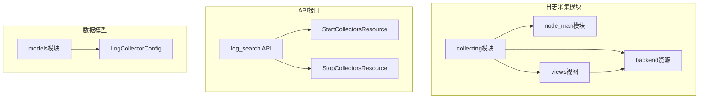
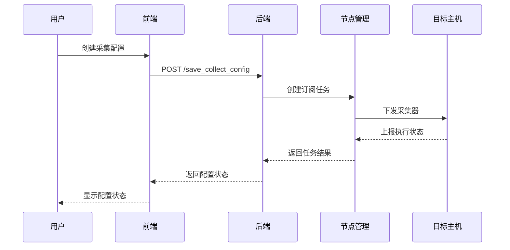
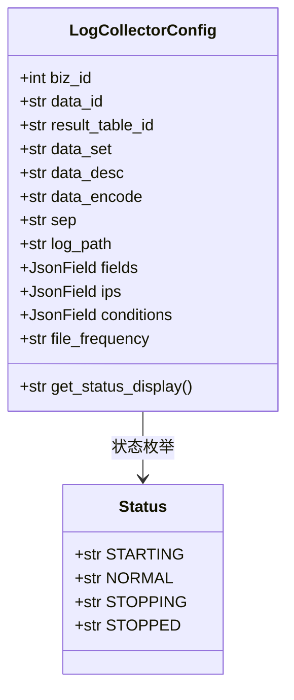
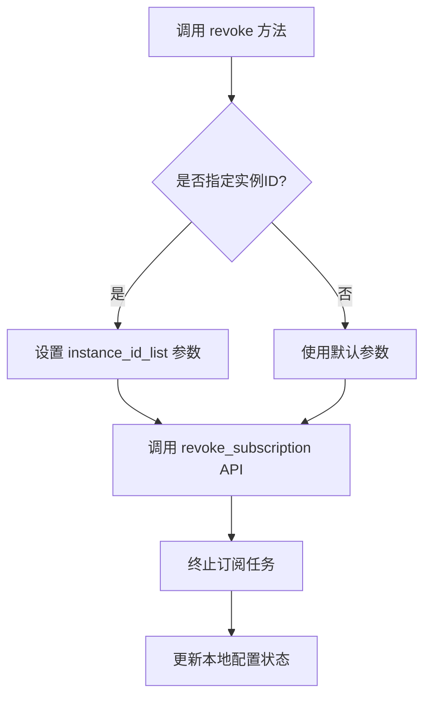
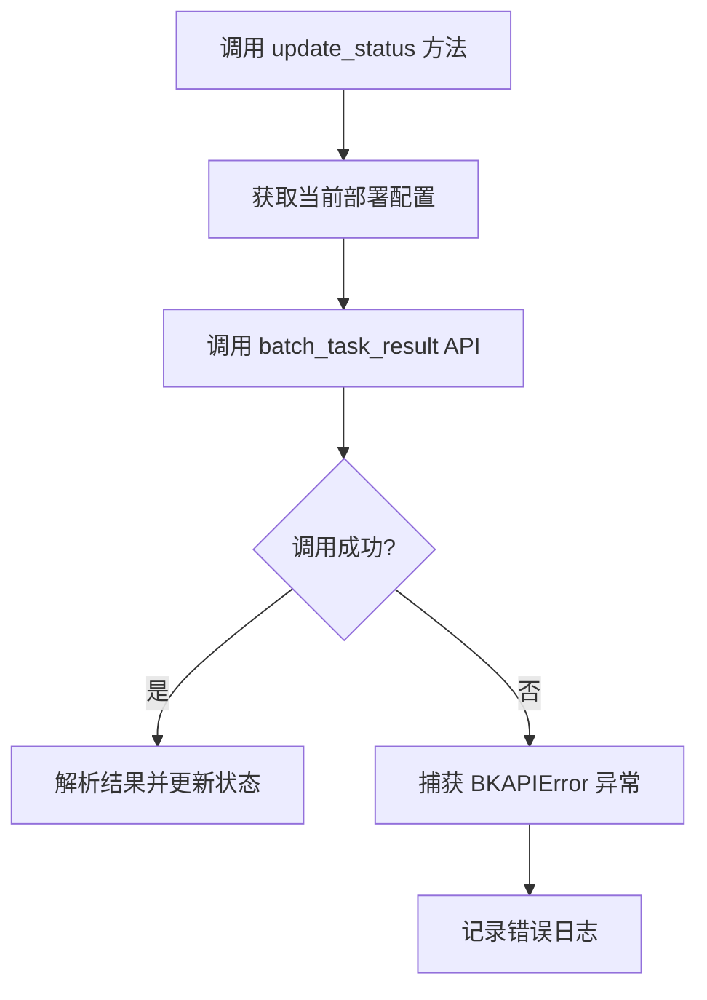
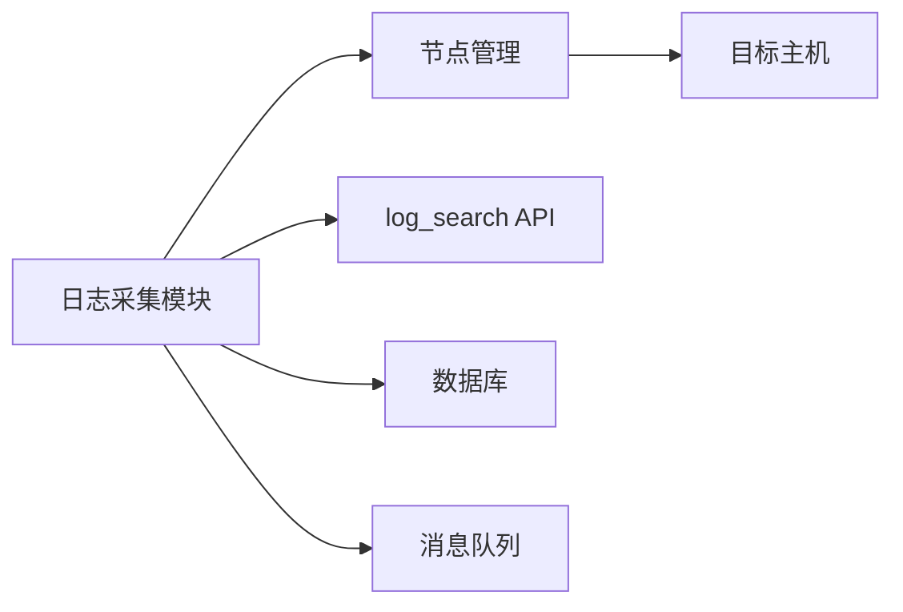

# 日志数据采集

<cite>
**本文档引用的文件**  
- [old.py](file://bkmonitor/packages/monitor/models/old.py#L794-L834)
- [node_man.py](file://bkmonitor/packages/monitor_web/collecting/deploy/node_man.py#L690-L724)
- [node_man.py](file://bkmonitor/packages/monitor_web/collecting/deploy/node_man.py#L1069-L1097)
- [backend.py](file://bkmonitor/packages/monitor_web/collecting/resources/backend.py#L937-L973)
- [default.py](file://bkmonitor/api/log_search/default.py#L445-L493)
- [application.py](file://bkmonitor/packages/apm_web/models/application.py#L568-L597)
- [views.py](file://bkmonitor/packages/monitor_web/collecting/views.py#L45-L62)
</cite>

## 目录
1. [引言](#引言)
2. [项目结构](#项目结构)
3. [核心组件](#核心组件)
4. [架构概述](#架构概述)
5. [详细组件分析](#详细组件分析)
6. [依赖分析](#依赖分析)
7. [性能考虑](#性能考虑)
8. [故障排除指南](#故障排除指南)
9. [结论](#结论)

## 引言
本文档全面阐述了在 `bk-monitor` 系统中实现日志数据采集的技术方案。该系统支持对系统日志、应用日志、安全日志等多种日志数据进行采集，通过配置管理、处理流程、性能优化和问题排查机制，确保日志采集的高效性与可靠性。文档将深入分析日志采集功能的实现细节，为开发和运维人员提供详尽的技术参考。

## 项目结构
`bk-monitor` 项目采用模块化设计，主要功能分散在多个子目录中。日志采集功能主要集中在 `packages/monitor_web/collecting` 和 `api/log_search` 模块中，依赖于 `node_man`（节点管理）进行采集任务的部署与控制。核心配置模型位于 `packages/monitor/models/old.py`，定义了日志路径、编码、分隔符等关键参数。

**图示来源**
- [node_man.py](file://bkmonitor/packages/monitor_web/collecting/deploy/node_man.py)
- [backend.py](file://bkmonitor/packages/monitor_web/collecting/resources/backend.py)
- [views.py](file://bkmonitor/packages/monitor_web/collecting/views.py)
- [default.py](file://bkmonitor/api/log_search/default.py)

## 核心组件
日志采集功能的核心组件包括：
- **LogCollectorConfig**：定义日志采集的配置模型，包含日志路径、编码、字段配置等。
- **NodeManInstaller**：基于节点管理（node_man）实现采集任务的部署、启动、停止和重试。
- **Collecting Resources**：提供后端资源接口，用于保存、撤销、获取日志采集配置和执行日志。
- **LogSearch API**：提供开启/关闭采集器的API接口。

这些组件协同工作，实现了从配置到执行的完整日志采集流程。

**组件来源**
- [old.py](file://bkmonitor/packages/monitor/models/old.py#L794-L834)
- [node_man.py](file://bkmonitor/packages/monitor_web/collecting/deploy/node_man.py)
- [backend.py](file://bkmonitor/packages/monitor_web/collecting/resources/backend.py)

## 架构概述
日志采集系统采用前后端分离架构，前端通过API调用后端服务，后端通过节点管理平台下发采集任务到目标主机。整体流程如下：
1. 用户在前端创建或编辑日志采集配置。
2. 配置通过 `save_collect_config` 接口保存。
3. 系统调用 `node_man` API 创建订阅任务并下发到目标主机。
4. 采集器在目标主机上运行，读取指定路径的日志文件。
5. 日志数据经过解析、过滤、转换后上报至中心服务器。
6. 状态通过 `update_status` 定期同步，执行日志可通过 `GetCollectLogDetailResource` 获取。

**图示来源**
- [views.py](file://bkmonitor/packages/monitor_web/collecting/views.py#L45-L62)
- [node_man.py](file://bkmonitor/packages/monitor_web/collecting/deploy/node_man.py)

## 详细组件分析

### 日志采集配置分析
日志采集配置的核心是 `LogCollectorConfig` 模型，它定义了所有必要的采集参数。

**图示来源**
- [old.py](file://bkmonitor/packages/monitor/models/old.py#L794-L834)

#### 配置参数说明
- **业务ID (biz_id)**: 标识日志所属的业务。
- **日志路径 (log_path)**: 指定需要采集的日志文件路径，支持通配符。
- **字符编码 (data_encode)**: 指定日志文件的编码格式，如UTF-8、GBK。
- **数据分隔符 (sep)**: 用于分隔日志行中的字段。
- **字段配置 (fields)**: JSON格式，定义日志字段的名称、类型和提取规则。
- **采集条件 (conditions)**: JSON格式，定义日志过滤条件，如按关键字、时间范围过滤。
- **日志生成频率 (file_frequency)**: 指示日志文件的生成模式（如实时、定时）。

### 采集任务管理分析
采集任务的生命周期由 `NodeManInstaller` 类管理，通过调用节点管理API实现。

#### 任务终止流程

**图示来源**
- [node_man.py](file://bkmonitor/packages/monitor_web/collecting/deploy/node_man.py#L690-L724)

#### 状态更新流程

**图示来源**
- [node_man.py](file://bkmonitor/packages/monitor_web/collecting/deploy/node_man.py#L1069-L1097)

## 依赖分析
日志采集功能依赖于多个核心服务和模块：
- **节点管理 (node_man)**: 负责采集器的部署、启动、停止和状态查询。
- **API网关 (API Gateway)**: 提供 `log_search` 等API接口。
- **数据库**: 存储 `LogCollectorConfig` 等配置信息。
- **消息队列**: 用于异步处理采集任务的执行结果。

**图示来源**
- [node_man.py](file://bkmonitor/packages/monitor_web/collecting/deploy/node_man.py)
- [default.py](file://bkmonitor/api/log_search/default.py)

## 性能考虑
系统通过以下机制优化日志采集性能：
- **异步任务处理**：采集任务的部署和状态更新通过异步方式处理，避免阻塞主线程。
- **批量操作**：支持批量终止和重试采集配置，提高运维效率。
- **断点续传**：虽然代码中未直接体现，但依赖的节点管理平台通常具备任务断点续传能力。
- **多线程采集**：采集器在目标主机上可能采用多线程方式读取和上报日志，以提高吞吐量。

## 故障排除指南
### 日志丢失问题
- **检查采集路径**：确认 `log_path` 配置正确，且目标主机上存在该路径的日志文件。
- **检查文件权限**：确保采集器进程有权限读取日志文件。
- **检查过滤条件**：确认 `conditions` 配置没有过度过滤导致日志被丢弃。

### 解析错误问题
- **检查分隔符**：确认 `sep` 配置与日志实际格式匹配。
- **检查字段配置**：验证 `fields` 中的字段名称和位置是否正确。
- **查看执行日志**：通过 `GetCollectLogDetailResource` 获取实例的详细执行日志，定位解析失败的具体步骤。

### 性能瓶颈问题
- **监控资源使用**：检查目标主机的CPU、内存和磁盘I/O使用情况。
- **调整采集频率**：根据日志生成速度调整 `file_frequency` 配置。
- **优化过滤规则**：简化复杂的过滤条件，减少处理开销。

**排查来源**
- [node_man.py](file://bkmonitor/packages/monitor_web/collecting/deploy/node_man.py#L1069-L1097)
- [backend.py](file://bkmonitor/packages/monitor_web/collecting/resources/backend.py#L937-L973)

## 结论
`bk-monitor` 的日志数据采集功能通过模块化设计和与节点管理平台的深度集成，实现了灵活、可靠的日志采集能力。系统提供了完整的配置管理、任务控制和状态监控机制，能够满足多种日志采集场景的需求。通过合理的配置和运维，可以有效保障日志数据的完整性和采集效率。