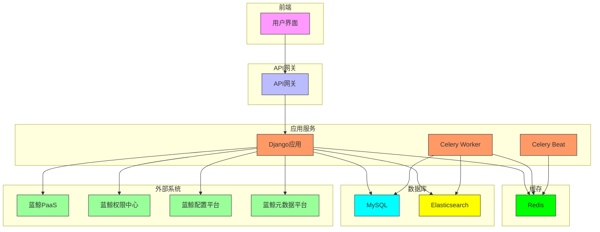
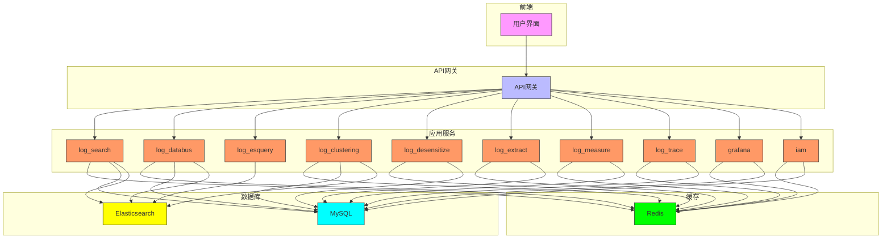
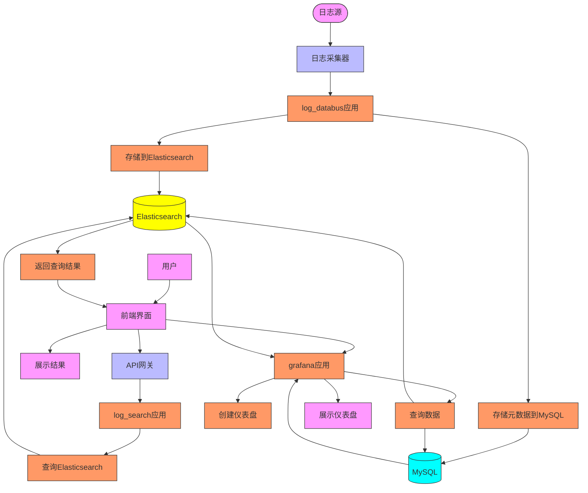
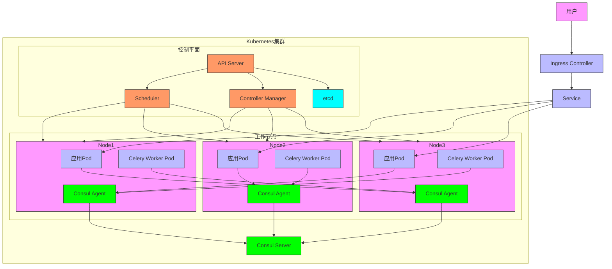
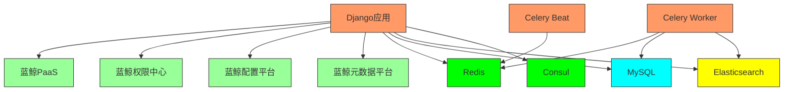

# 架构设计

<cite>
**本文档引用的文件**
- [README.md](file://README.md)
- [settings.py](file://bklog/settings.py)
- [urls.py](file://bklog/urls.py)
- [default.py](file://bklog/config/default.py)
- [prod.py](file://bklog/config/prod.py)
- [dev.py](file://bklog/config/dev.py)
- [app.yml](file://bklog/app.yml)
- [Dockerfile](file://bklog/Dockerfile)
- [wsgi.py](file://bklog/wsgi.py)
- [gunicorn_config.py](file://bklog/gunicorn_config.py)
- [manage.py](file://bklog/manage.py)
</cite>

## 目录
1. [简介](#简介)
2. [项目结构](#项目结构)
3. [核心组件](#核心组件)
4. [架构概览](#架构概览)
5. [详细组件分析](#详细组件分析)
6. [依赖分析](#依赖分析)
7. [性能考虑](#性能考虑)
8. [故障排除指南](#故障排除指南)
9. [结论](#结论)

## 简介

蓝鲸智云监控平台（BLUEKING-MONITOR）是一款由蓝鲸智云官方推出的监控平台产品，具备丰富的数据采集能力、大规模的数据处理能力和简单易用的特性，同时提供更多的平台扩展能力。该平台依托于蓝鲸PaaS，与传统的CS结构不同，在整个蓝鲸生态中可以形成监控的闭环能力。

平台致力于满足不同的监控场景需求和能力，提高监控的及时性、准确性和智能化，为在线业务保驾护航。系统采用微服务架构设计，通过容器化部署，实现了高可用性和可扩展性。

**本文档引用的文件**
- [README.md](file://README.md)

## 项目结构

该项目采用Django框架构建，遵循典型的Django项目结构。主要目录包括：

- `bklog/`: 核心应用目录，包含所有Django应用
- `bklog/apps/`: 包含多个Django应用，如`ai_assistant`、`api`、`bk_log_admin`、`grafana`、`iam`、`log_audit`、`log_bcs`、`log_clustering`、`log_commons`、`log_databus`、`log_desensitize`、`log_esquery`、`log_extract`、`log_measure`、`log_search`、`log_trace`、`log_unifyquery`等
- `bklog/config/`: 配置文件目录，包含`default.py`、`dev.py`、`prod.py`等环境配置文件
- `bklog/docs/`: 文档目录，包含架构设计、代码框架等文档
- `bklog/static/`: 静态资源目录
- `bklog/templates/`: 模板目录
- `bklog/support-files/`: 支持文件目录，包含API网关定义、SQL脚本等

系统通过`settings.py`文件加载不同环境的配置，使用`urls.py`文件定义URL路由，通过`wsgi.py`文件提供WSGI接口，使用`gunicorn_config.py`文件配置Gunicorn服务器。

**图表来源**
- [settings.py](file://bklog/settings.py)
- [urls.py](file://bklog/urls.py)
- [default.py](file://bklog/config/default.py)

**本节来源**
- [settings.py](file://bklog/settings.py)
- [urls.py](file://bklog/urls.py)
- [default.py](file://bklog/config/default.py)

## 核心组件

系统的核心组件包括：

- **Django应用**: 作为主要的应用服务，处理HTTP请求和业务逻辑
- **Celery**: 用于异步任务处理，包括数据采集、日志处理等
- **Redis**: 作为缓存和Celery的消息队列
- **MySQL**: 作为关系型数据库，存储系统配置和元数据
- **Elasticsearch**: 作为全文检索引擎，存储和查询日志数据
- **Gunicorn**: 作为WSGI服务器，处理HTTP请求
- **API网关**: 作为系统的入口，处理认证、路由和限流

这些组件通过微服务架构协同工作，实现了系统的高可用性和可扩展性。

**本节来源**
- [settings.py](file://bklog/settings.py)
- [urls.py](file://bklog/urls.py)
- [default.py](file://bklog/config/default.py)

## 架构概览

系统采用微服务架构设计，各Django应用具有明确的职责边界和通信方式。主要应用包括：

- `log_databus`: 负责日志采集和数据总线管理
- `log_search`: 负责日志搜索和查询
- `log_esquery`: 负责Elasticsearch查询
- `log_clustering`: 负责日志聚类分析
- `log_desensitize`: 负责日志脱敏
- `log_extract`: 负责日志提取
- `log_measure`: 负责指标度量
- `log_trace`: 负责调用链追踪
- `grafana`: 负责数据可视化
- `iam`: 负责权限管理

各应用通过Django的URL路由和视图函数进行通信，使用RESTful API进行数据交换。系统通过Celery实现异步任务处理，提高了系统的响应速度和吞吐量。

**图表来源**
- [urls.py](file://bklog/urls.py)
- [default.py](file://bklog/config/default.py)

**本节来源**
- [urls.py](file://bklog/urls.py)
- [default.py](file://bklog/config/default.py)

## 详细组件分析

### 数据流分析

系统从日志源到最终可视化展示的完整数据流如下：

1. 日志源通过日志采集器（如bkunifylogbeat）将日志发送到数据总线
2. `log_databus`应用接收日志数据，进行初步处理和存储
3. 日志数据被存储到Elasticsearch中，同时元数据存储到MySQL中
4. 用户通过前端界面发起日志查询请求
5. 请求通过API网关路由到`log_search`应用
6. `log_search`应用从Elasticsearch中查询日志数据
7. 查询结果返回给前端界面进行展示
8. 用户可以通过`grafana`应用创建仪表盘，进行数据可视化

**图表来源**
- [urls.py](file://bklog/urls.py)
- [default.py](file://bklog/config/default.py)

**本节来源**
- [urls.py](file://bklog/urls.py)
- [default.py](file://bklog/config/default.py)

### 部署架构

系统采用容器化部署，使用Kubernetes进行服务发现和负载均衡。部署架构如下：

1. 应用服务被打包成Docker镜像，通过Kubernetes部署
2. Kubernetes负责服务的自动扩缩容和故障恢复
3. 服务发现通过Consul实现，服务启动时自动注册到Consul
4. 负载均衡通过Kubernetes的Service和Ingress实现
5. 配置管理通过环境变量和配置文件实现

**图表来源**
- [Dockerfile](file://bklog/Dockerfile)
- [gunicorn_config.py](file://bklog/gunicorn_config.py)
- [default.py](file://bklog/config/default.py)

**本节来源**
- [Dockerfile](file://bklog/Dockerfile)
- [gunicorn_config.py](file://bklog/gunicorn_config.py)
- [default.py](file://bklog/config/default.py)

## 依赖分析

系统依赖于多个外部组件和服务，包括：

- **蓝鲸PaaS**: 提供基础平台服务，如用户认证、应用管理等
- **蓝鲸权限中心**: 提供统一的权限管理服务
- **蓝鲸配置平台**: 提供配置管理服务
- **蓝鲸元数据平台**: 提供元数据管理服务
- **Redis**: 提供缓存和消息队列服务
- **MySQL**: 提供关系型数据库服务
- **Elasticsearch**: 提供全文检索服务
- **Consul**: 提供服务发现和配置管理服务

这些依赖通过配置文件和环境变量进行管理，确保了系统的灵活性和可维护性。

**图表来源**
- [default.py](file://bklog/config/default.py)
- [prod.py](file://bklog/config/prod.py)
- [dev.py](file://bklog/config/dev.py)

**本节来源**
- [default.py](file://bklog/config/default.py)
- [prod.py](file://bklog/config/prod.py)
- [dev.py](file://bklog/config/dev.py)

## 性能考虑

系统在设计时充分考虑了性能因素，采取了多项优化措施：

1. 使用Redis作为缓存，减少数据库访问
2. 使用Celery进行异步任务处理，提高系统响应速度
3. 使用Elasticsearch作为全文检索引擎，提高日志查询效率
4. 使用Gunicorn作为WSGI服务器，支持多进程处理
5. 使用Kubernetes进行自动扩缩容，应对高并发场景
6. 使用连接池管理数据库连接，减少连接开销

这些措施确保了系统在高并发场景下的稳定性和响应速度。

## 故障排除指南

系统提供了完善的故障排除机制，包括：

1. 健康检查接口：通过`/healthz`和`/readiness`接口检查系统健康状态
2. 日志记录：系统各组件记录详细的日志，便于问题排查
3. 监控告警：通过蓝鲸监控平台对系统进行监控，及时发现和处理问题
4. 服务发现：通过Consul实现服务发现，自动处理服务故障
5. 自动恢复：通过Kubernetes实现自动恢复，确保服务高可用

这些机制确保了系统的稳定运行和快速故障恢复。

**本节来源**
- [home_application/urls.py](file://bklog/home_application/urls.py)
- [home_application/handlers/metrics.py](file://bklog/home_application/handlers/metrics.py)

## 结论

蓝鲸智云监控平台采用微服务架构设计，通过容器化部署，实现了高可用性和可扩展性。系统各组件职责明确，通过RESTful API进行通信，使用Celery实现异步任务处理。系统依赖于多个外部组件和服务，通过配置文件和环境变量进行管理。系统在设计时充分考虑了性能因素，采取了多项优化措施。系统提供了完善的故障排除机制，确保了系统的稳定运行和快速故障恢复。