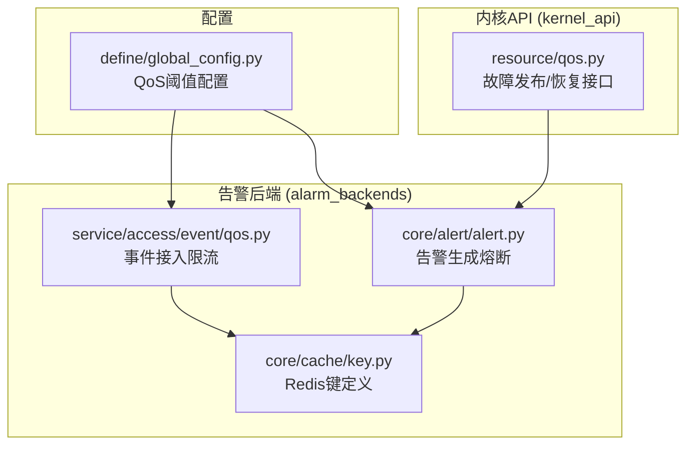
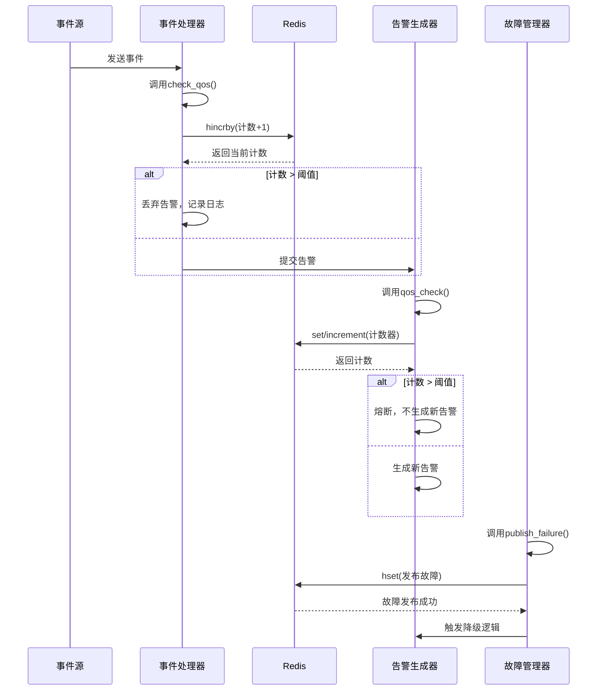
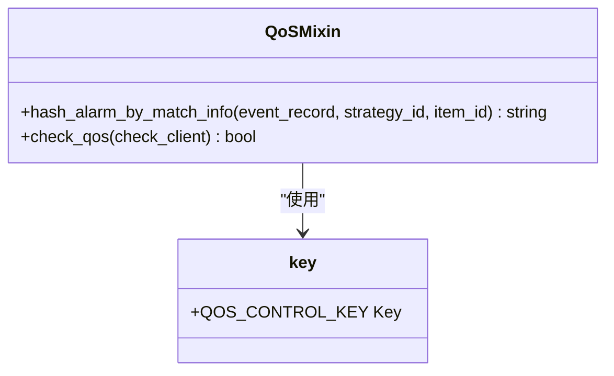
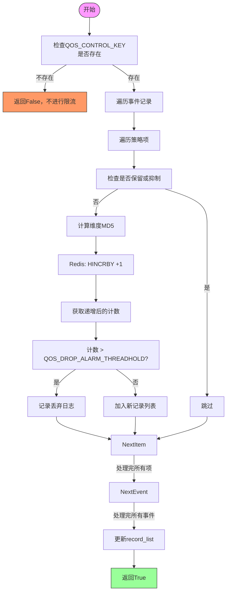
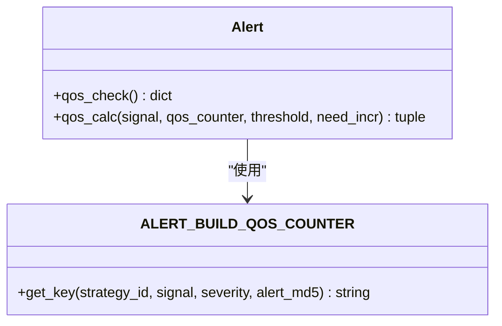
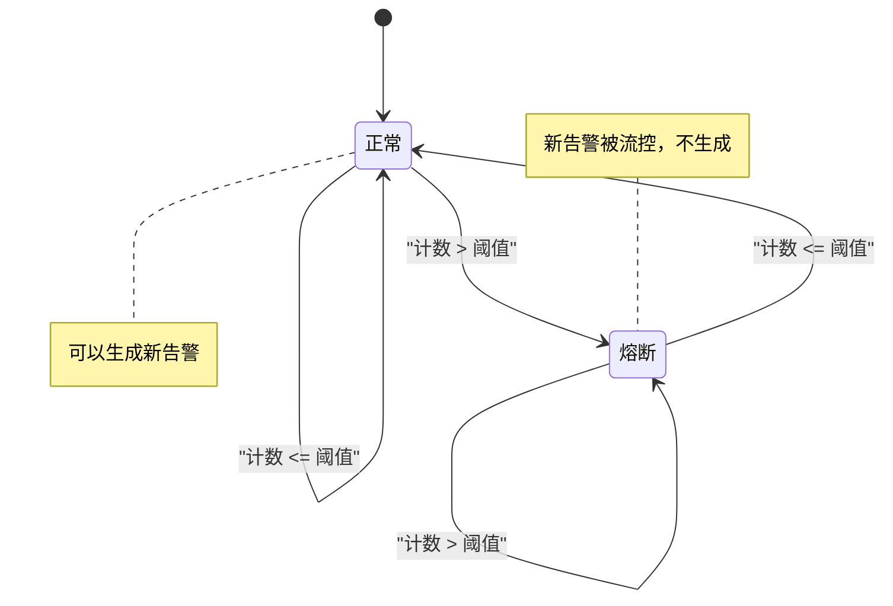
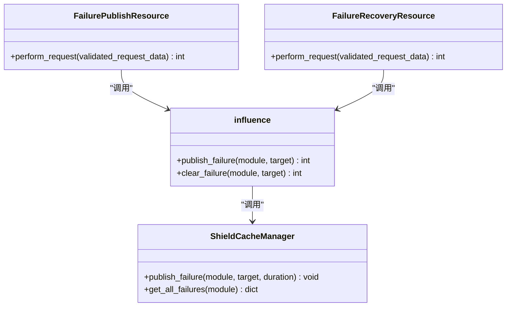
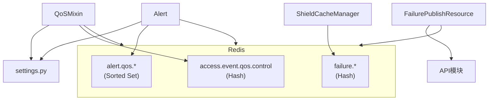

# 告警QoS

<cite>
**本文档引用文件**   
- [qos.py](file://bkmonitor/alarm_backends/service/access/event/qos.py#L1-L70)
- [global_config.py](file://bkmonitor/bkmonitor/define/global_config.py#L26-L44)
- [key.py](file://bkmonitor/alarm_backends/core/cache/key.py#L404-L413)
- [key.py](file://bkmonitor/alarm_backends/core/cache/key.py#L777-L785)
- [alert.py](file://bkmonitor/alarm_backends/core/alert/alert.py#L900-L1099)
- [influence.py](file://bkmonitor/alarm_backends/service/alert/qos/influence.py#L46-L60)
- [processor.py](file://bkmonitor/alarm_backends/service/access/event/processor.py#L25-L224)
- [qos.py](file://bkmonitor/kernel_api/resource/qos.py#L19-L39)
</cite>

## 目录
1. [引言](#引言)
2. [项目结构](#项目结构)
3. [核心组件](#核心组件)
4. [架构概述](#架构概述)
5. [详细组件分析](#详细组件分析)
6. [依赖分析](#依赖分析)
7. [性能考量](#性能考量)
8. [故障排除指南](#故障排除指南)
9. [结论](#结论)

## 引言
本文档深入解析蓝鲸监控平台中告警QoS（服务质量）机制的实现原理。该机制旨在通过限流、降级、熔断等容错策略，保障系统在高负载或异常情况下的稳定性和可靠性。文档将详细阐述基于Redis的限流算法设计、服务降级的触发条件、熔断器的状态转换机制，并重点描述QoS配置的动态更新与参数调优方法。

## 项目结构
告警QoS功能主要分布在`alarm_backends`和`kernel_api`两个核心模块中。`alarm_backends`负责告警数据的接入、处理和生成，其`service/access/event/qos.py`文件实现了事件接入层面的限流。`core/alert/alert.py`文件则定义了告警生成层面的熔断逻辑。`kernel_api`模块通过`resource/qos.py`提供了故障发布与恢复的API接口，用于实现服务降级。全局配置在`bkmonitor/define/global_config.py`中定义。

**图源**
- [qos.py](file://bkmonitor/alarm_backends/service/access/event/qos.py#L1-L70)
- [alert.py](file://bkmonitor/alarm_backends/core/alert/alert.py#L900-L1099)
- [global_config.py](file://bkmonitor/bkmonitor/define/global_config.py#L26-L44)

## 核心组件
告警QoS的核心组件包括：
1.  **QoSMixin**: 一个混入类，提供事件接入层面的限流功能，通过Redis哈希结构统计告警数量。
2.  **Alert类**: 告警实体类，其`qos_check`和`qos_calc`方法实现了告警生成层面的熔断逻辑。
3.  **全局配置**: 定义了各类QoS策略的阈值和窗口时间。
4.  **Redis缓存键**: 定义了用于QoS计数的Redis键模板。

**节源**
- [qos.py](file://bkmonitor/alarm_backends/service/access/event/qos.py#L1-L70)
- [alert.py](file://bkmonitor/alarm_backends/core/alert/alert.py#L900-L1099)
- [global_config.py](file://bkmonitor/bkmonitor/define/global_config.py#L26-L44)

## 架构概述
告警QoS机制贯穿于告警处理的整个生命周期。当事件数据接入时，`QoSMixin`首先进行第一道限流，防止海量事件冲击下游。随后，告警生成服务在创建告警时，会调用`Alert.qos_check`进行熔断检查，避免同一策略产生过多告警。当系统发生严重故障时，可通过`FailurePublishResource` API主动发布故障，触发服务降级，屏蔽非关键告警。整个流程依赖Redis作为高速缓存，实现计数和状态的实时同步。

**图源**
- [qos.py](file://bkmonitor/alarm_backends/service/access/event/qos.py#L31-L60)
- [alert.py](file://bkmonitor/alarm_backends/core/alert/alert.py#L994-L1027)
- [influence.py](file://bkmonitor/alarm_backends/service/alert/qos/influence.py#L46-L53)

## 详细组件分析

### QoSMixin 限流组件分析
`QoSMixin`类通过Redis的哈希（Hash）数据结构实现事件接入层面的限流。它为每个独特的告警维度（由业务ID、策略ID、指标ID、目标IP和级别等信息的MD5值标识）在Redis中创建一个字段，并使用`HINCRBY`命令进行原子性递增。

**图源**
- [qos.py](file://bkmonitor/alarm_backends/service/access/event/qos.py#L22-L68)

#### 限流算法流程

**图源**
- [qos.py](file://bkmonitor/alarm_backends/service/access/event/qos.py#L31-L60)

### 告警生成熔断分析
告警生成层面的熔断由`Alert`类的`qos_check`方法实现。它使用Redis的有序集合（Sorted Set）作为计数器，通过`SET`命令的`NX`（Not eXists）选项来实现原子性计数和过期时间设置。

**图源**
- [alert.py](file://bkmonitor/alarm_backends/core/alert/alert.py#L900-L1099)
- [key.py](file://bkmonitor/alarm_backends/core/cache/key.py#L777-L785)

#### 熔断状态转换机制

**图源**
- [alert.py](file://bkmonitor/alarm_backends/core/alert/alert.py#L939-L962)

### 服务降级与故障管理分析
服务降级通过`kernel_api`提供的`FailurePublishResource`和`FailureRecoveryResource`接口实现。发布故障会调用`publish_failure`函数，该函数会查询特定模块（如"vm"）的故障影响范围和持续时间，并将此信息写入Redis。告警生成器在处理告警时，会检查这些故障信息，对受影响范围内的告警进行屏蔽。

**图源**
- [qos.py](file://bkmonitor/kernel_api/resource/qos.py#L19-L39)
- [influence.py](file://bkmonitor/alarm_backends/service/alert/qos/influence.py#L46-L60)

## 依赖分析
告警QoS机制依赖于多个核心组件和外部服务。

**图源**
- [key.py](file://bkmonitor/alarm_backends/core/cache/key.py#L404-L413)
- [key.py](file://bkmonitor/alarm_backends/core/cache/key.py#L777-L785)
- [global_config.py](file://bkmonitor/bkmonitor/define/global_config.py#L26-L44)

**节源**
- [qos.py](file://bkmonitor/alarm_backends/service/access/event/qos.py#L1-L70)
- [alert.py](file://bkmonitor/alarm_backends/core/alert/alert.py#L900-L1099)
- [influence.py](file://bkmonitor/alarm_backends/service/alert/qos/influence.py#L46-L60)

## 性能考量
1.  **Redis性能**: QoS机制高度依赖Redis的性能。应确保Redis集群有足够的资源和合理的分片策略。
2.  **键空间管理**: `QOS_CONTROL_KEY`使用哈希结构，能有效减少键的数量，避免键空间爆炸。
3.  **TTL设置**: `ALERT_BUILD_QOS_COUNTER`的TTL为2分钟，能快速回收过期计数器，避免内存泄漏。
4.  **原子操作**: 使用`HINCRBY`和`SET NX EX`等原子命令，保证了计数的准确性，避免了竞态条件。

## 故障排除指南
1.  **告警未被限流**: 检查`QOS_CONTROL_KEY`对应的Redis键是否存在，以及`QOS_DROP_ALARM_THREADHOLD`阈值是否设置得过高。
2.  **告警持续熔断**: 检查`ALERT_BUILD_QOS_COUNTER`对应的Redis键的计数和TTL，确认是否因计数未及时过期导致。
3.  **服务降级未生效**: 检查`FAILURE_KEY`中是否有正确的故障信息，确认`publish_failure`接口是否被正确调用。
4.  **Redis连接超时**: 检查Redis服务状态和网络连接，确保`alarm_backends`服务能正常访问Redis。

**节源**
- [qos.py](file://bkmonitor/alarm_backends/service/access/event/qos.py#L31-L60)
- [alert.py](file://bkmonitor/alarm_backends/core/alert/alert.py#L994-L1027)
- [influence.py](file://bkmonitor/alarm_backends/service/alert/qos/influence.py#L46-L60)

## 结论
蓝鲸监控平台的告警QoS机制通过多层级的限流、熔断和降级策略，构建了一个健壮的容错体系。它利用Redis的高性能特性，实现了对告警风暴的有效控制。通过合理的配置和调优，可以在保障系统稳定性的同时，确保关键告警的及时性。理解其内部实现原理对于系统的稳定运维和性能优化至关重要。