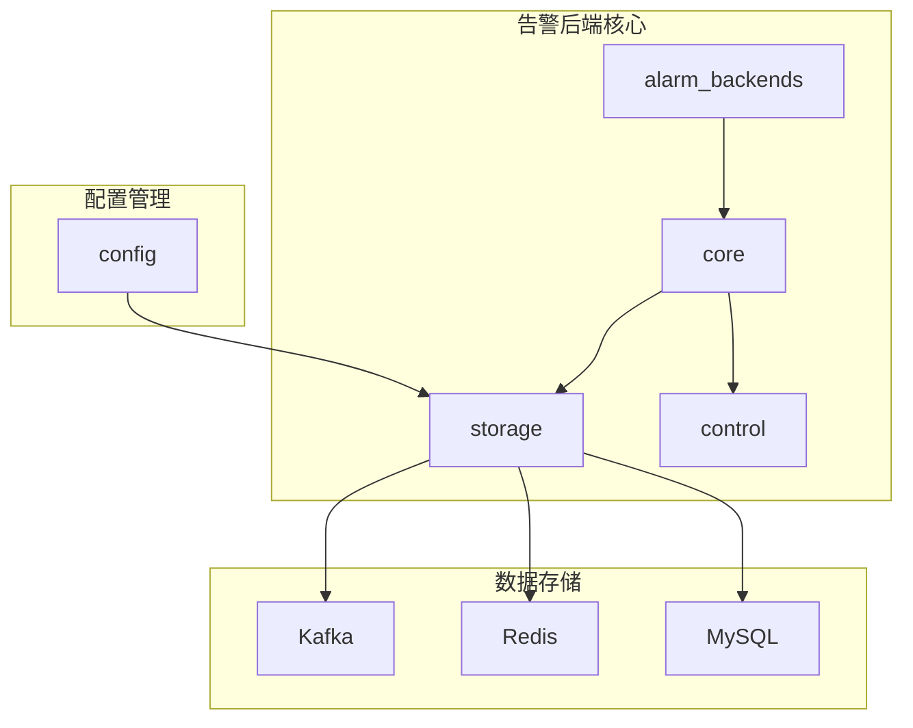
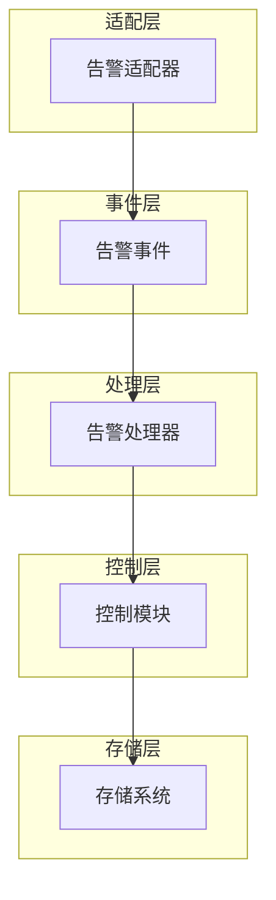
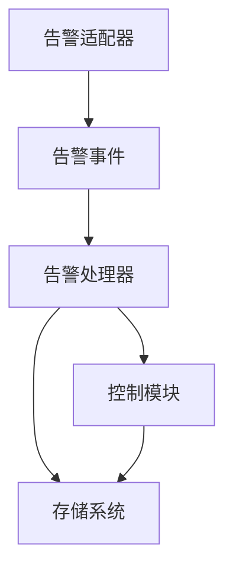

# 告警引擎架构

<cite>
**本文档中引用的文件**
- [adapter.py](file://bkmonitor/alarm_backends/core/alert/adapter.py)
- [event.py](file://bkmonitor/alarm_backends/core/alert/event.py)
- [alert.py](file://bkmonitor/alarm_backends/core/alert/alert.py)
- [checkpoint.py](file://bkmonitor/alarm_backends/core/control/checkpoint.py)
- [strategy.py](file://bkmonitor/alarm_backends/core/control/strategy.py)
- [kafka.py](file://bkmonitor/alarm_backends/core/storage/kafka.py)
- [redis.py](file://bkmonitor/alarm_backends/core/storage/redis.py)
- [mysql.py](file://bkmonitor/config/tools/mysql.py)
</cite>

## 目录
1. [引言](#引言)
2. [项目结构](#项目结构)
3. [核心组件](#核心组件)
4. [架构概览](#架构概览)
5. [详细组件分析](#详细组件分析)
6. [依赖分析](#依赖分析)
7. [性能考量](#性能考量)
8. [故障排除指南](#故障排除指南)
9. [结论](#结论)

## 引言
本文档旨在深入分析告警引擎的详细架构，涵盖其分层设计和处理流程。文档将详细描述告警适配器、告警事件、告警处理器的职责划分和交互关系，解析告警检测、告警收敛、告警通知的完整生命周期。重点说明控制模块中的检查点机制和策略执行器的设计原理，阐述存储层对Kafka、Redis、MySQL的使用策略和数据流转机制。提供告警处理的状态机图，展示从原始告警到最终通知的各个状态转换。解释告警QoS机制的设计，包括限流、降级、熔断等容错策略的实现方式。

## 项目结构
告警引擎的项目结构遵循分层设计原则，主要分为以下几个核心模块：
- `alarm_backends`: 告警后端核心逻辑，包含告警处理、控制、存储等核心功能。
- `api`: 提供对外的API接口。
- `config`: 配置管理，包含数据库、缓存等配置。
- `core`: 核心工具和基础组件。
- `models`: 数据模型定义。
- `utils`: 通用工具函数。



**图示来源**
- [alarm_backends](file://bkmonitor/alarm_backends)
- [config](file://bkmonitor/config)

**本节来源**
- [alarm_backends](file://bkmonitor/alarm_backends)
- [config](file://bkmonitor/config)

## 核心组件
告警引擎的核心组件包括告警适配器、告警事件、告警处理器、控制模块和存储层。这些组件协同工作，实现从原始事件到最终告警通知的完整流程。

**本节来源**
- [adapter.py](file://bkmonitor/alarm_backends/core/alert/adapter.py)
- [event.py](file://bkmonitor/alarm_backends/core/alert/event.py)
- [alert.py](file://bkmonitor/alarm_backends/core/alert/alert.py)

## 架构概览
告警引擎采用分层架构设计，主要包括以下几个层次：
- **适配层**: 负责将不同来源的原始事件转换为标准的告警事件。
- **事件层**: 定义告警事件的数据结构和核心方法。
- **处理层**: 实现告警的检测、收敛、通知等核心逻辑。
- **控制层**: 管理策略执行、检查点等控制逻辑。
- **存储层**: 提供对Kafka、Redis、MySQL等存储系统的访问。



**图示来源**
- [adapter.py](file://bkmonitor/alarm_backends/core/alert/adapter.py)
- [event.py](file://bkmonitor/alarm_backends/core/alert/event.py)
- [alert.py](file://bkmonitor/alarm_backends/core/alert/alert.py)
- [checkpoint.py](file://bkmonitor/alarm_backends/core/control/checkpoint.py)
- [kafka.py](file://bkmonitor/alarm_backends/core/storage/kafka.py)

## 详细组件分析
### 告警适配器分析
告警适配器负责将不同来源的原始事件转换为标准的告警事件。其主要职责包括：
- 解析原始事件数据。
- 提取告警相关的维度信息。
- 构建标准的告警事件对象。

```mermaid
classDiagram
class MonitorEventAdapter {
+push_to_kafka(events : list[dict])
+adapt(status : str, description : str, time : int) dict
+extract_target(strategy : dict, dimensions : dict, dimension_fields : list[str]) tuple[str, str, dict]
}
MonitorEventAdapter : +record : dict
MonitorEventAdapter : +strategy : dict
MonitorEventAdapter : +SPECIAL_ALERT_TAG_KEY_WHITELIST : list[str]
```

**图示来源**
- [adapter.py](file://bkmonitor/alarm_backends/core/alert/adapter.py#L1-L226)

**本节来源**
- [adapter.py](file://bkmonitor/alarm_backends/core/alert/adapter.py#L1-L226)

### 告警事件分析
告警事件定义了告警的核心数据结构和处理方法。其主要职责包括：
- 定义告警事件的字段。
- 提供事件数据的清洗和验证方法。
- 实现事件的去重和状态管理。

```mermaid
classDiagram
class Event {
+__init__(data : dict, do_clean : bool)
+clean()
+remove_none_fields() dict
+_clean_metric() list
+_clean_data_type() str
+_clean_bk_biz_id() int
+_clean_tags() list
+_clean_target() str
+_clean_category() str
+_clean_target_type() str
+_clean_dedupe_keys() list
+_clean_time() int
+_clean_severity() int
+_clean_status() str
+cal_dedupe_md5()
}
Event : +data : dict
Event : +_dedupe_values : list
Event : +_dropped : bool
Event : +FIELDS : tuple
Event : +DEFAULT_EXPIRED_SECONDS : int
Event : +DEFAULT_SEVERITY : int
```

**图示来源**
- [event.py](file://bkmonitor/alarm_backends/core/alert/event.py#L1-L429)

**本节来源**
- [event.py](file://bkmonitor/alarm_backends/core/alert/event.py#L1-L429)

### 告警处理器分析
告警处理器是告警引擎的核心，负责告警的检测、收敛和通知。其主要职责包括：
- 根据策略配置检测告警。
- 实现告警的收敛逻辑。
- 管理告警的状态转换。

```mermaid
classDiagram
class Alert {
+__init__(data : dict)
+init_severity()
+update(event : Event)
+refresh_update_time()
+add_log(**kwargs)
+set_next_status(status : str, delay : int)
+move_to_next_status()
+get_latest_interval_record() dict
+is_ack_signal() bool
+notice_signal() str
+qos_check() dict
+qos_calc(signal : str, qos_counter : str, threshold : dict, need_incr : bool) tuple[bool, int]
}
Alert : +data : dict
Alert : +data_id : int
Alert : +data_topic : str
Alert : +_refresh_db : bool
Alert : +_is_new : bool
Alert : +_status_changed : bool
Alert : +logs : list[dict]
Alert : +last_event : Event
Alert : +CLOSE_WINDOW_SIZE : int
Alert : +RECOVER_WINDOW_SIZE : int
Alert : +ALERT_EXPRESSION_VALUE_MAPPING : dict
```

**图示来源**
- [alert.py](file://bkmonitor/alarm_backends/core/alert/alert.py#L1-L1169)

**本节来源**
- [alert.py](file://bkmonitor/alarm_backends/core/alert/alert.py#L1-L1169)

### 控制模块分析
控制模块负责管理策略执行和检查点等控制逻辑。其主要职责包括：
- 实现策略的检查点机制。
- 管理策略的执行周期。

```mermaid
classDiagram
class Checkpoint {
+__init__(strategy_group_key : str, client : object)
+set(checkpoint : int)
+get(min_last_checkpoint : int, interval : int) int
+is_pass(timestamp : int) bool
}
Checkpoint : +strategy_group_key : str
Checkpoint : +client : object
Checkpoint : +_key : str
```

**图示来源**
- [checkpoint.py](file://bkmonitor/alarm_backends/core/control/checkpoint.py#L1-L60)

**本节来源**
- [checkpoint.py](file://bkmonitor/alarm_backends/core/control/checkpoint.py#L1-L60)

### 存储层分析
存储层提供对Kafka、Redis、MySQL等存储系统的访问。其主要职责包括：
- 实现对Kafka的消息队列操作。
- 提供对Redis的缓存访问。
- 管理MySQL的数据库连接。

```mermaid
classDiagram
class KafkaQueue {
+__init__(topic : str, group_prefix : str, redis_offset : bool, kfk_conf : dict, timeout : int)
+get_alert_kafka_queue() KafkaQueue
+get_common_kafka_queue() KafkaQueue
+close()
+client : property
+set_topic(topic : str, group_prefix : str)
+get_producer() object
+get_consumer() object
+get_offset_manager() KafkaOffsetManager
+_create_consumer(topic : str, group_name : str) object
+_put(value : list, topic : str) object
+put(value : list, topic : str)
+reset_offset(force_offset : int)
+take_raw(count : int, timeout : int) list
+take(count : int, timeout : float) list
}
class KafkaOffsetManager {
+__init__(consumer : object)
+key : property
+reset_key : property
+_get_offset() int
+get_offset() int
+get_reset_offset() int
+set_offset(offset : int, force : bool)
+update_consumer_offset(count : int, messages : list)
+reset_consumer_offset(count : int)
}
KafkaQueue : +reconnect_seconds : int
KafkaQueue : +msg_push_batch_size : int
KafkaQueue : +topic : str
KafkaQueue : +group_name : str
KafkaQueue : +_client : object
KafkaQueue : +_client_init_time : datetime
KafkaQueue : +producer : object
KafkaQueue : +consumer_pool : dict
KafkaQueue : +offset_manager_pool : dict
KafkaOffsetManager : +TIMEOUT : int
KafkaOffsetManager : +KEY_PREFIX : str
KafkaOffsetManager : +consumer : object
KafkaOffsetManager : +cache : Cache
KafkaOffsetManager : +instance_offset : int
KafkaOffsetManager : +reset_offset : int
```

**图示来源**
- [kafka.py](file://bkmonitor/alarm_backends/core/storage/kafka.py#L1-L258)

**本节来源**
- [kafka.py](file://bkmonitor/alarm_backends/core/storage/kafka.py#L1-L258)

## 依赖分析
告警引擎的各个组件之间存在紧密的依赖关系。适配层依赖于事件层，事件层依赖于处理层，处理层依赖于控制层和存储层。存储层提供了对Kafka、Redis、MySQL等存储系统的访问，是整个系统的基础。



**图示来源**
- [adapter.py](file://bkmonitor/alarm_backends/core/alert/adapter.py)
- [event.py](file://bkmonitor/alarm_backends/core/alert/event.py)
- [alert.py](file://bkmonitor/alarm_backends/core/alert/alert.py)
- [checkpoint.py](file://bkmonitor/alarm_backends/core/control/checkpoint.py)
- [kafka.py](file://bkmonitor/alarm_backends/core/storage/kafka.py)

**本节来源**
- [adapter.py](file://bkmonitor/alarm_backends/core/alert/adapter.py)
- [event.py](file://bkmonitor/alarm_backends/core/alert/event.py)
- [alert.py](file://bkmonitor/alarm_backends/core/alert/alert.py)
- [checkpoint.py](file://bkmonitor/alarm_backends/core/control/checkpoint.py)
- [kafka.py](file://bkmonitor/alarm_backends/core/storage/kafka.py)

## 性能考量
告警引擎在设计时充分考虑了性能问题。通过使用Redis缓存策略配置和检查点，减少了对数据库的频繁访问。使用Kafka作为消息队列，实现了异步处理，提高了系统的吞吐量。同时，通过QoS机制实现了限流、降级、熔断等容错策略，保证了系统的稳定性。

**本节来源**
- [redis.py](file://bkmonitor/alarm_backends/core/storage/redis.py)
- [kafka.py](file://bkmonitor/alarm_backends/core/storage/kafka.py)
- [alert.py](file://bkmonitor/alarm_backends/core/alert/alert.py)

## 故障排除指南
在使用告警引擎时，可能会遇到以下常见问题：
- **告警未触发**: 检查策略配置是否正确，检查原始事件是否符合告警条件。
- **告警重复**: 检查去重键配置是否正确，检查事件的维度信息是否一致。
- **性能问题**: 检查Redis和Kafka的配置，检查是否有大量的告警事件积压。

**本节来源**
- [alert.py](file://bkmonitor/alarm_backends/core/alert/alert.py)
- [redis.py](file://bkmonitor/alarm_backends/core/storage/redis.py)
- [kafka.py](file://bkmonitor/alarm_backends/core/storage/kafka.py)

## 结论
告警引擎采用分层架构设计，各组件职责明确，协同工作。通过使用Kafka、Redis、MySQL等存储系统，实现了高性能、高可用的告警处理能力。QoS机制的引入，进一步增强了系统的稳定性和容错能力。整体设计合理，能够满足大规模监控场景下的告警处理需求。