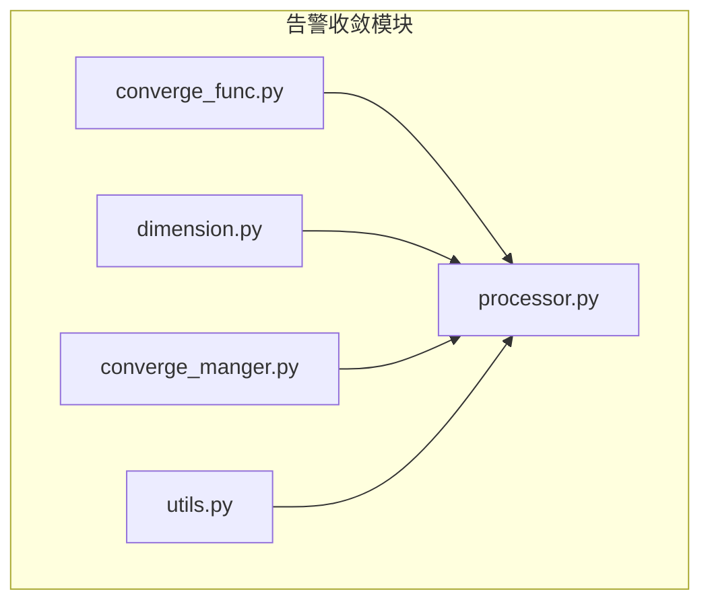
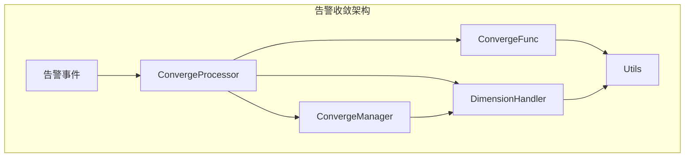
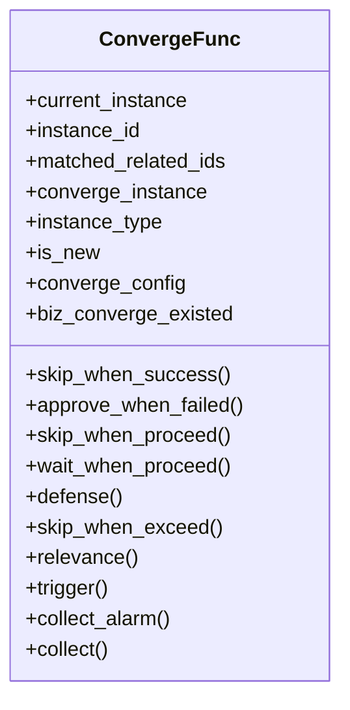
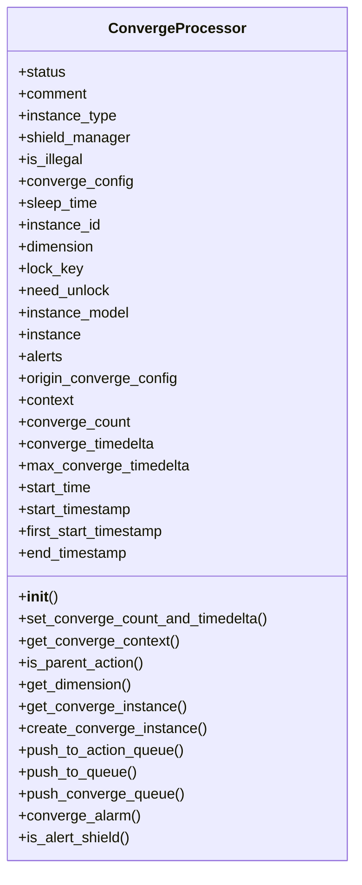
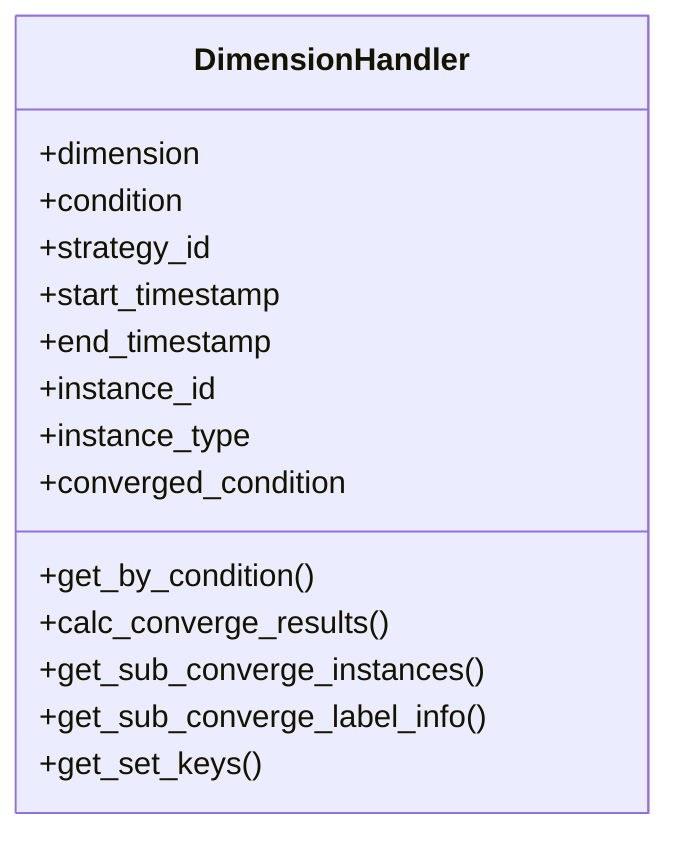
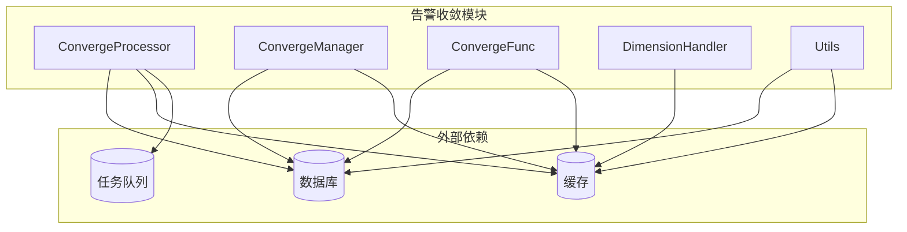

# 告警收敛

<cite>
**本文档引用的文件**
- [converge_func.py](file://bkmonitor\alarm_backends\service\converge\converge_func.py)
- [processor.py](file://bkmonitor\alarm_backends\service\converge\processor.py)
- [dimension.py](file://bkmonitor\alarm_backends\service\converge\dimension.py)
- [converge_manger.py](file://bkmonitor\alarm_backends\service\converge\converge_manger.py)
- [utils.py](file://bkmonitor\alarm_backends\service\converge\utils.py)
- [converge.py](file://bkmonitor\alarm_backends\core\context\converge.py)
- [base.py](file://bkmonitor\packages\monitor_api\models\base.py)
</cite>

## 目录
1. [引言](#引言)
2. [项目结构](#项目结构)
3. [核心组件](#核心组件)
4. [架构概述](#架构概述)
5. [详细组件分析](#详细组件分析)
6. [依赖分析](#依赖分析)
7. [性能考虑](#性能考虑)
8. [故障排除指南](#故障排除指南)
9. [结论](#结论)

## 引言
告警收敛机制是监控平台中用于减少告警风暴、提高告警处理效率的关键功能。通过多维度的收敛策略，系统能够智能地合并和处理大量重复或相关的告警事件，从而避免信息过载，确保运维人员能够专注于真正重要的问题。本文档将深入解析告警收敛机制的实现原理，涵盖基于时间、空间和业务维度的收敛算法，以及收敛处理器的状态管理机制。

## 项目结构
告警收敛功能主要位于`bkmonitor/alarm_backends/service/converge`目录下，该目录包含了实现告警收敛逻辑的核心文件。主要文件包括`converge_func.py`、`processor.py`、`dimension.py`、`converge_manger.py`和`utils.py`。这些文件共同协作，实现了从配置解析到状态管理的完整收敛流程。

**图示来源**
- [converge_func.py](file://bkmonitor\alarm_backends\service\converge\converge_func.py)
- [processor.py](file://bkmonitor\alarm_backends\service\converge\processor.py)
- [dimension.py](file://bkmonitor\alarm_backends\service\converge\dimension.py)
- [converge_manger.py](file://bkmonitor\alarm_backends\service\converge\converge_manger.py)
- [utils.py](file://bkmonitor\alarm_backends\service\converge\utils.py)

## 核心组件
告警收敛的核心组件主要包括收敛函数（ConvergeFunc）、收敛处理器（ConvergeProcessor）、维度处理器（DimensionHandler）和收敛管理器（ConvergeManager）。这些组件通过协同工作，实现了复杂的收敛逻辑。

**组件来源**
- [converge_func.py](file://bkmonitor\alarm_backends\service\converge\converge_func.py)
- [processor.py](file://bkmonitor\alarm_backends\service\converge\processor.py)
- [dimension.py](file://bkmonitor\alarm_backends\service\converge\dimension.py)
- [converge_manger.py](file://bkmonitor\alarm_backends\service\converge\converge_manger.py)

## 架构概述
告警收敛的架构设计遵循模块化原则，各组件职责明确，通过清晰的接口进行交互。收敛处理器作为核心调度者，负责协调其他组件的工作，确保收敛逻辑的正确执行。

**图示来源**
- [processor.py](file://bkmonitor\alarm_backends\service\converge\processor.py)
- [converge_manger.py](file://bkmonitor\alarm_backends\service\converge\converge_manger.py)
- [converge_func.py](file://bkmonitor\alarm_backends\service\converge\converge_func.py)
- [dimension.py](file://bkmonitor\alarm_backends\service\converge\dimension.py)
- [utils.py](file://bkmonitor\alarm_backends\service\converge\utils.py)

## 详细组件分析
### 收敛函数分析
收敛函数（ConvergeFunc）是实现具体收敛策略的核心。它提供了多种收敛方法，如`skip_when_success`、`approve_when_failed`等，每种方法对应不同的业务场景。

#### 收敛函数类图

**图示来源**
- [converge_func.py](file://bkmonitor\alarm_backends\service\converge\converge_func.py)

### 收敛处理器分析
收敛处理器（ConvergeProcessor）负责整个收敛流程的控制。它初始化收敛配置，调用相应的收敛函数，并管理收敛实例的状态。

#### 收敛处理器类图

**图示来源**
- [processor.py](file://bkmonitor\alarm_backends\service\converge\processor.py)

### 维度处理器分析
维度处理器（DimensionHandler）负责处理基于不同维度的收敛条件。它通过Redis存储和查询相关告警，实现高效的维度匹配。

#### 维度处理器类图

**图示来源**
- [dimension.py](file://bkmonitor\alarm_backends\service\converge\dimension.py)

## 依赖分析
告警收敛模块依赖于多个外部组件，包括数据库模型、缓存系统和任务队列。这些依赖关系确保了收敛逻辑的高效执行和状态的持久化。

**图示来源**
- [processor.py](file://bkmonitor\alarm_backends\service\converge\processor.py)
- [converge_manger.py](file://bkmonitor\alarm_backends\service\converge\converge_manger.py)
- [converge_func.py](file://bkmonitor\alarm_backends\service\converge\converge_func.py)
- [dimension.py](file://bkmonitor\alarm_backends\service\converge\dimension.py)
- [utils.py](file://bkmonitor\alarm_backends\service\converge\utils.py)

## 性能考虑
在大规模告警场景下，告警收敛模块的性能至关重要。通过使用Redis进行高效的维度查询和状态管理，系统能够在高并发环境下保持良好的响应速度。此外，合理的配置参数（如`timedelta`和`count`）可以有效平衡收敛效果和系统负载。

## 故障排除指南
当告警收敛功能出现问题时，首先应检查收敛配置是否正确，特别是`condition`和`converge_func`字段。其次，查看日志文件中的错误信息，定位具体的问题所在。最后，确保所有依赖组件（如数据库和缓存）正常运行。

**组件来源**
- [converge_func.py](file://bkmonitor\alarm_backends\service\converge\converge_func.py)
- [processor.py](file://bkmonitor\alarm_backends\service\converge\processor.py)
- [dimension.py](file://bkmonitor\alarm_backends\service\converge\dimension.py)
- [converge_manger.py](file://bkmonitor\alarm_backends\service\converge\converge_manger.py)
- [utils.py](file://bkmonitor\alarm_backends\service\converge\utils.py)

## 结论
告警收敛机制通过多维度的策略和高效的处理流程，显著提升了监控系统的告警管理能力。通过对核心组件的深入分析，我们可以更好地理解和优化这一关键功能，确保其在各种复杂场景下的稳定运行。