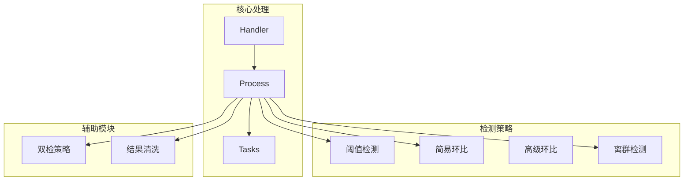
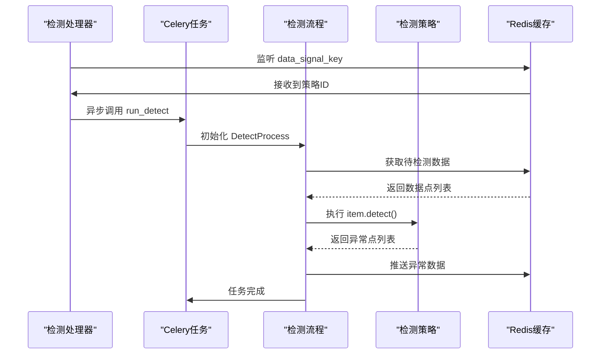
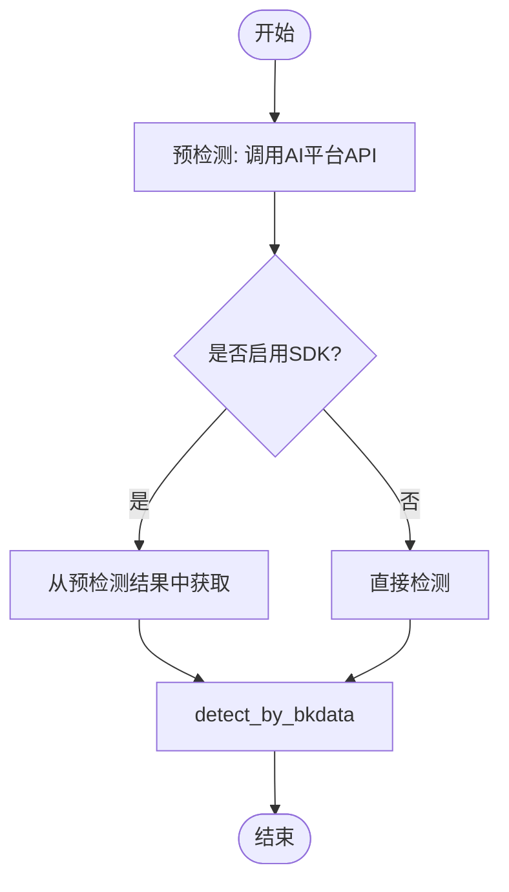
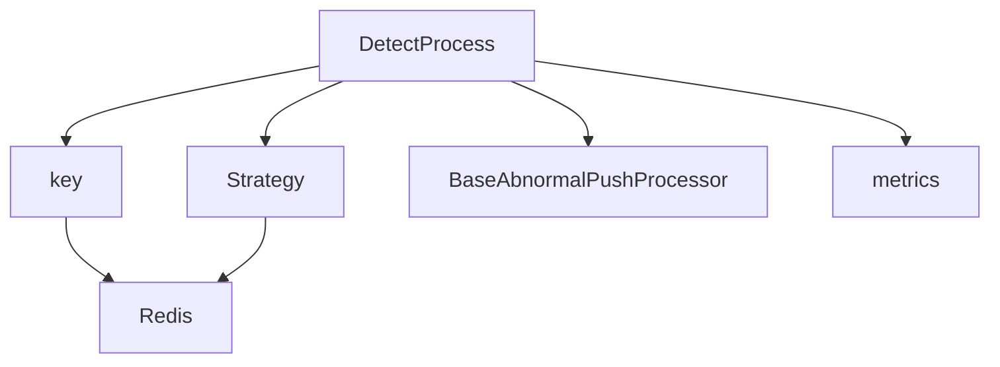

# 告警检测

<cite>
**本文档引用的文件**   
- [simple_ring_ratio.py](file://bkmonitor/alarm_backends/service/detect/strategy/simple_ring_ratio.py)
- [clean.py](file://bkmonitor/alarm_backends/core/detect_result/clean.py)
- [sum.py](file://bkmonitor/alarm_backends/service/detect/double_check_strategies/sum.py)
- [process.py](file://bkmonitor/alarm_backends/service/detect/process.py)
- [tasks.py](file://bkmonitor/alarm_backends/service/detect/tasks.py)
- [handler.py](file://bkmonitor/alarm_backends/service/detect/handler.py)
- [core.py](file://bkmonitor/alarm_backends/service/detect/core.py)
- [__init__.py](file://bkmonitor/alarm_backends/service/detect/strategy/__init__.py)
- [abnormal_cluster.py](file://bkmonitor/alarm_backends/service/detect/strategy/abnormal_cluster.py)
- [threshold.py](file://bkmonitor/alarm_backends/service/detect/strategy/threshold.py)
</cite>

## 目录
1. [引言](#引言)
2. [项目结构](#项目结构)
3. [核心组件](#核心组件)
4. [架构概览](#架构概览)
5. [详细组件分析](#详细组件分析)
6. [依赖分析](#依赖分析)
7. [性能考量](#性能考量)
8. [故障排除指南](#故障排除指南)
9. [结论](#结论)

## 引言
本文档旨在深入解析蓝鲸监控平台的告警检测模块，涵盖检测算法实现、双检策略、结果清洗、配置方式、调度机制及性能优化等核心内容。文档基于对代码库的全面分析，为开发者和运维人员提供详尽的技术参考。

## 项目结构
告警检测模块主要位于 `bkmonitor/alarm_backends/service/detect` 目录下，其核心结构如下：
- `strategy/`: 包含各类检测算法的实现，如阈值、环比、离群检测等。
- `double_check_strategies/`: 实现二次确认策略。
- `process.py`: 检测任务的主处理流程。
- `tasks.py`: 基于Celery的任务调度。
- `handler.py`: 处理检测信号的入口。
- `core.py`: 定义检测数据点等核心数据结构。



**图示来源**
- [handler.py](file://bkmonitor/alarm_backends/service/detect/handler.py)
- [process.py](file://bkmonitor/alarm_backends/service/detect/process.py)
- [tasks.py](file://bkmonitor/alarm_backends/service/detect/tasks.py)

**本节来源**
- [handler.py](file://bkmonitor/alarm_backends/service/detect/handler.py)
- [process.py](file://bkmonitor/alarm_backends/service/detect/process.py)
- [tasks.py](file://bkmonitor/alarm_backends/service/detect/tasks.py)

## 核心组件
告警检测模块的核心由检测处理器、策略算法和任务调度三大部分构成。检测处理器负责拉取数据、执行检测和推送结果；策略算法定义了具体的异常判断逻辑；任务调度则确保检测任务的高效执行。

**本节来源**
- [process.py](file://bkmonitor/alarm_backends/service/detect/process.py)
- [strategy/__init__.py](file://bkmonitor/alarm_backends/service/detect/strategy/__init__.py)
- [tasks.py](file://bkmonitor/alarm_backends/service/detect/tasks.py)

## 架构概览
告警检测模块采用事件驱动和定时任务相结合的架构。外部数据通过信号队列触发检测流程，Celery任务负责执行具体的检测逻辑，整个过程由锁机制保证并发安全。



**图示来源**
- [handler.py](file://bkmonitor/alarm_backends/service/detect/handler.py#L0-L88)
- [tasks.py](file://bkmonitor/alarm_backends/service/detect/tasks.py#L0-L52)
- [process.py](file://bkmonitor/alarm_backends/service/detect/process.py#L0-L181)

## 详细组件分析
### 检测算法实现机制
#### 阈值检测策略
阈值检测是最基础的告警策略，通过配置静态阈值来判断指标是否异常。其核心实现位于 `threshold.py`。

```python
class AndThreshold(BasicAlgorithmsCollection):
    config_serializer = ThresholdSerializer.AndSerializer
    expr_op = "and"
    desc_tpl = "{} {method_desc} {threshold}{{{{unit|unit_suffix:algorithm_unit}}}}"

    def gen_expr(self):
        expr_list = []
        tpl_list = []
        for t_config in self.validated_config:
            method = t_config["method"]
            threshold = t_config["threshold"]
            comp = allowed_threshold_method[method]
            expr_list.append(
                "unit_convert_min(value, unit) {comp} unit_convert_min({threshold}, unit, algorithm_unit)".format(
                    comp=comp, threshold=threshold
                )
            )
            tpl_list.append(self.desc_tpl.format(method_desc=mark_safe(comp.replace("==", "=")), threshold=threshold))
        for args in zip(expr_list, tpl_list):
            yield ExprDetectAlgorithms(*args)
```
该策略通过 `gen_expr` 方法生成多个比较表达式，并使用 `and` 或 `or` 操作符连接。每个表达式都包含单位转换，确保比较的准确性。

**本节来源**
- [threshold.py](file://bkmonitor/alarm_backends/service/detect/strategy/threshold.py#L0-L71)

#### 环比检测策略
环比检测通过比较当前值与历史值的变化率来判断异常。`simple_ring_ratio.py` 实现了简易环比算法。

```python
class SimpleRingRatio(RangeRatioAlgorithmsCollection):
    config_serializer = SimpleRingRatioSerializer
    floor_desc_tpl = _("较前一时刻({{history_data_point.value|auto_unit:unit}})下降超过{{floor}}%")
    ceil_desc_tpl = _("较前一时刻({{history_data_point.value|auto_unit:unit}})上升超过{{ceil}}%")

    def get_history_offsets(self, item):
        return [item.query_configs[0]["agg_interval"]]
```
该策略通过 `get_history_offsets` 方法确定需要拉取的历史数据偏移量（即前一个聚合周期），然后计算变化率。`floor_desc_tpl` 和 `ceil_desc_tpl` 定义了下降和上升的告警描述模板。

**本节来源**
- [simple_ring_ratio.py](file://bkmonitor/alarm_backends/service/detect/strategy/simple_ring_ratio.py#L0-L33)

#### 离群检测策略
离群检测是一种智能算法，利用AI平台的计算结果来识别异常。其实现位于 `abnormal_cluster.py`。



**图示来源**
- [abnormal_cluster.py](file://bkmonitor/alarm_backends/service/detect/strategy/abnormal_cluster.py#L0-L192)

**本节来源**
- [abnormal_cluster.py](file://bkmonitor/alarm_backends/service/detect/strategy/abnormal_cluster.py#L0-L192)

### 双检策略
双检策略用于对SUM聚合的异常进行二次确认，防止因数据缺失导致的误报。其实现位于 `sum.py`。

```python
@dataclass
class DoubleCheckSumStrategy(DoubleCheckStrategy):
    name = "SUM"
    match_agg_method = "SUM"
    match_algorithms_type_sequence = ["AdvancedRingRatio", "SimpleRingRatio", "Threshold"]

    def double_check(self, outputs: List[dict]):
        # 1. 计算需要检测的时间范围
        offset_list = self.get_offsets_by_algorithm(algorithm_type)
        # 2. 查询COUNT聚合的数据
        counter_data = self.countable_item.query_record(...)
        # 3. 逐个异常点进行数据质量确认
        for anomaly_point in anomaly_points:
            # 检查数据点是否缺失
            check_points_missing(now_point_record_id, counter_point_map)
```
该策略首先根据异常判定策略计算历史偏移量，然后查询COUNT聚合的数据来验证数据点的完整性，从而确认异常是否真实。

**本节来源**
- [sum.py](file://bkmonitor/alarm_backends/service/detect/double_check_strategies/sum.py#L0-L199)

### 检测结果清洗模块
检测结果清洗模块负责清理过期的检测结果和缓存，位于 `clean.py`。

```python
class CleanResult:
    @staticmethod
    def clean_expired_detect_result(strategy_range=None):
        """
        清理检测结果及最近拉取结果的缓存
        """
        for strategy in strategies:
            point_remain = detect_result_point_required(strategy)
            # 按保留点数清理检测结果缓存
            pipeline.zremrangebyrank(check_result_cache_key, 0, -point_remain)
            # 清理空的last checkpoint
            pipeline.hdel(last_checkpoints_cache_key, last_checkpoints_cache_field)
```
该模块根据策略配置的保留周期，使用Redis的 `zremrangebyrank` 命令清理过期的ZSet数据，并同步清理相关的哈希字段。

**本节来源**
- [clean.py](file://bkmonitor/alarm_backends/core/detect_result/clean.py#L0-L128)

### 检测任务调度机制
检测任务通过Celery进行调度，由 `tasks.py` 定义。

```python
@app.task(ignore_result=True, queue="celery_service")
def run_detect(strategy_id):
    try:
        processor = DetectProcess(strategy_id)
        processor.process()
    except LockError:
        # 未获取到锁，延迟重试
        client.delay("lpush", data_signal_key, strategy_id, delay=20)
    except Exception as e:
        logger.exception("处理异常")
    else:
        if processor.is_busy:
            # 数据过多，立即重试
            run_detect.apply_async(args=(strategy_id,))
```
调度机制通过 `run_detect` 任务执行检测流程，并处理锁冲突和数据积压的情况，确保系统的稳定运行。

**本节来源**
- [tasks.py](file://bkmonitor/alarm_backends/service/detect/tasks.py#L0-L52)

## 依赖分析
告警检测模块依赖于多个核心组件：
- `core.cache.key`: 提供Redis缓存键的定义和访问。
- `core.control.strategy`: 策略管理，提供策略配置的缓存。
- `core.processor.base`: 基础处理器，定义了异常数据推送的接口。
- `core.prometheus.metrics`: 提供性能指标的上报。



**图示来源**
- [process.py](file://bkmonitor/alarm_backends/service/detect/process.py)
- [key.py](file://bkmonitor/alarm_backends/core/cache/key.py)

**本节来源**
- [process.py](file://bkmonitor/alarm_backends/service/detect/process.py)
- [key.py](file://bkmonitor/alarm_backends/core/cache/key.py)

## 性能考量
- **数据拉取**: 使用Redis的 `lrange` 和 `ltrim` 原子操作，避免数据丢失。
- **批量处理**: 使用Redis Pipeline减少网络开销。
- **并发控制**: 通过 `service_lock` 防止同一策略的并发执行。
- **异常处理**: 对异常进行降级处理，保证主流程的稳定性。
- **指标监控**: 通过Prometheus上报延迟、数据量等关键指标。

## 故障排除指南
- **数据积压**: 检查 `SQL_MAX_LIMIT` 配置，确认是否达到上限。
- **延迟过高**: 查看 `DETECT_PROCESS_LATENCY` 指标，分析瓶颈。
- **锁冲突**: 检查 `SERVICE_LOCK_DETECT` 的持有情况。
- **异常漏报**: 确认 `double_check` 逻辑是否正确执行。
- **缓存未清理**: 检查 `clean_expired_detect_result` 任务是否正常运行。

**本节来源**
- [process.py](file://bkmonitor/alarm_backends/service/detect/process.py)
- [clean.py](file://bkmonitor/alarm_backends/core/detect_result/clean.py)

## 结论
蓝鲸监控的告警检测模块设计精巧，通过分层架构实现了高内聚、低耦合。其核心优势在于：
1. **灵活性**: 通过策略模式支持多种检测算法。
2. **可靠性**: 双检策略和结果清洗机制保障了告警的准确性。
3. **可扩展性**: 基于Celery的调度架构易于水平扩展。
4. **可观测性**: 完善的指标监控体系便于问题定位。

建议在实际使用中，根据业务场景合理配置检测策略和调度参数，以达到最佳的监控效果。