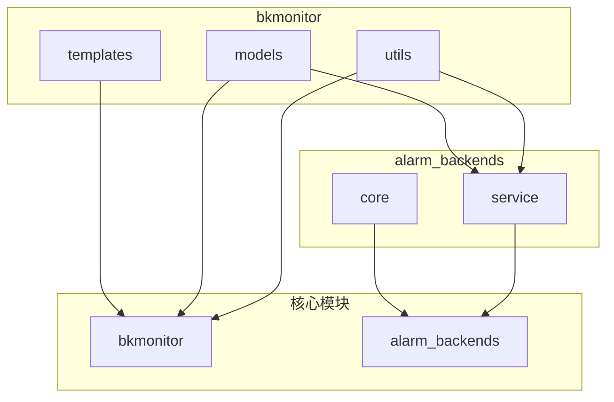
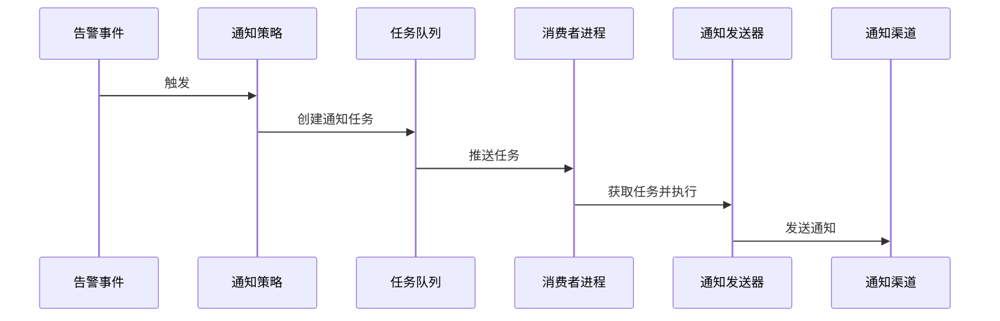
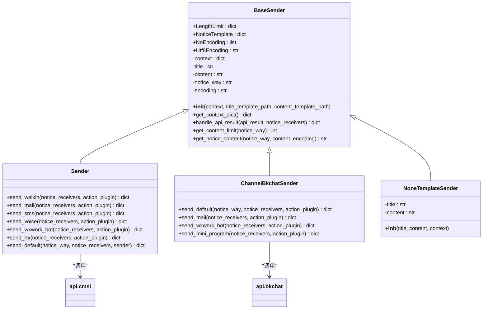
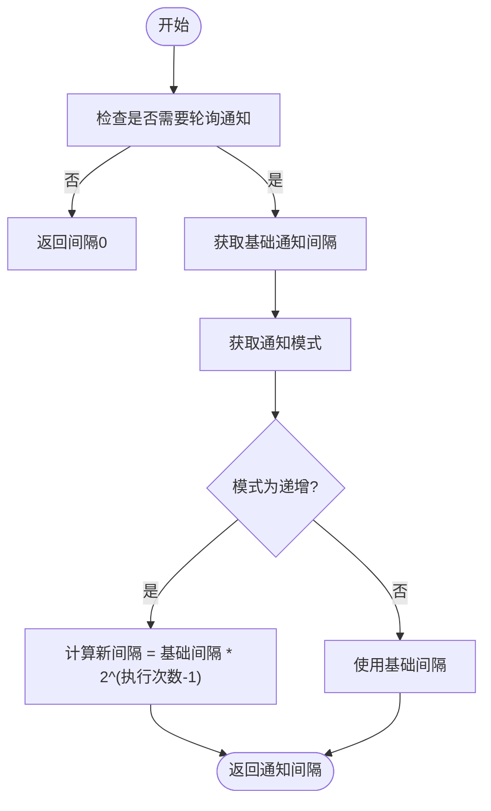
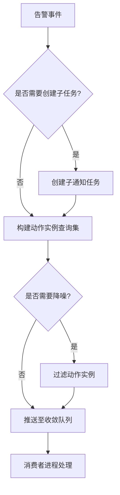
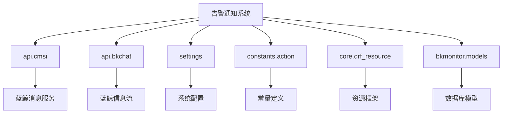

# 告警通知

<cite>
**本文档引用的文件**   
- [send.py](file://bkmonitor/bkmonitor/utils/send.py#L0-L715)
- [action.py](file://bkmonitor/alarm_backends/service/fta_action/utils.py#L750-L857)
- [action.py](file://bkmonitor/bkmonitor/models/fta/action.py#L361-L418)
- [action.py](file://bkmonitor/alarm_backends/service/fta_action/utils.py#L773-L802)
- [frontend_resources.py](file://bkmonitor/packages/fta_web/action/resources/frontend_resources.py#L343-L371)
- [utils.py](file://bkmonitor/alarm_backends/service/fta_action/utils.py#L90-L119)
- [checker.py](file://bkmonitor/alarm_backends/service/alert/manager/checker/action.py#L202-L221)
- [double_check.py](file://bkmonitor/alarm_backends/service/fta_action/double_check.py#L31-L62)
</cite>

## 目录
1. [引言](#引言)
2. [项目结构](#项目结构)
3. [核心组件](#核心组件)
4. [架构概述](#架构概述)
5. [详细组件分析](#详细组件分析)
6. [依赖分析](#依赖分析)
7. [性能考虑](#性能考虑)
8. [故障排除指南](#故障排除指南)
9. [结论](#结论)

## 引言
本文档旨在全面解析蓝鲸监控平台中的告警通知系统。该系统负责在发生异常、恢复、无数据等事件时，通过多种渠道向相关人员发送通知。文档将深入探讨通知渠道管理、消息模板、发送策略的实现机制，以及通知任务的异步处理、重试和失败处理等关键技术点。

## 项目结构
告警通知系统的核心功能分散在多个模块中，主要集中在`bkmonitor`和`alarm_backends`两个包下。`bkmonitor`包包含通用的工具和模型，而`alarm_backends`包则包含了告警处理的核心业务逻辑。

**图示来源**
- [send.py](file://bkmonitor/bkmonitor/utils/send.py#L0-L715)

**本节来源**
- [send.py](file://bkmonitor/bkmonitor/utils/send.py#L0-L715)

## 核心组件
告警通知系统的核心组件包括通知发送器（Sender）、通知配置管理、通知任务队列和通知策略引擎。这些组件协同工作，确保告警信息能够准确、及时地送达指定接收人。

**本节来源**
- [send.py](file://bkmonitor/bkmonitor/utils/send.py#L0-L715)
- [action.py](file://bkmonitor/alarm_backends/service/fta_action/utils.py#L750-L857)

## 架构概述
告警通知系统的架构遵循典型的生产者-消费者模式。当告警事件被触发时，系统会根据预设的策略生成通知任务，并将其推送到任务队列中。后台的消费者进程会从队列中取出任务，调用相应的通知发送器完成实际的发送操作。

**图示来源**
- [utils.py](file://bkmonitor/alarm_backends/service/fta_action/utils.py#L90-L119)
- [send.py](file://bkmonitor/bkmonitor/utils/send.py#L0-L715)

## 详细组件分析

### 通知渠道管理与扩展接口
系统通过一个统一的`Sender`基类来管理所有通知渠道。每个具体的渠道（如邮件、短信、微信）都通过继承`Sender`类并实现特定的`send_xxx`方法来完成集成。这种设计模式使得系统具有良好的扩展性，可以轻松地添加新的通知方式。

#### 通知发送器类图

**图示来源**
- [send.py](file://bkmonitor/bkmonitor/utils/send.py#L0-L715)

**本节来源**
- [send.py](file://bkmonitor/bkmonitor/utils/send.py#L0-L715)

### 通知策略配置逻辑
通知策略的配置逻辑主要体现在通知方式的组合、接收人的确定以及通知时机的控制上。系统支持分级通知、轮询通知等多种模式。

#### 分级与轮询通知
通过`interval_notify_mode`配置项，系统支持标准（standard）和递增（increasing）两种通知间隔模式。在递增模式下，通知间隔会随着执行次数呈指数级增长，实现了类似“升级通知”的效果。

**图示来源**
- [checker.py](file://bkmonitor/alarm_backends/service/alert/manager/checker/action.py#L202-L221)

**本节来源**
- [checker.py](file://bkmonitor/alarm_backends/service/alert/manager/checker/action.py#L202-L221)

### 通知任务异步处理机制
通知任务的异步处理是系统的核心，它确保了告警处理的高效性和可靠性。

#### 任务队列处理流程

**图示来源**
- [utils.py](file://bkmonitor/alarm_backends/service/fta_action/utils.py#L90-L119)

**本节来源**
- [utils.py](file://bkmonitor/alarm_backends/service/fta_action/utils.py#L90-L119)

### 通知模板编写指南
通知模板使用Jinja2模板引擎，允许在模板中嵌入动态变量。模板文件通常存放在`templates`目录下，按通知类型和渠道进行组织。

#### 模板路径示例
- 邮件内容模板: `templates/notice/abnormal/action/mail_content.jinja`
- 企业微信内容模板: `templates/notice/abnormal/action/markdown_content.jinja`

**最佳实践**
- 使用`{{ }}`语法插入变量。
- 为不同语言提供对应的模板文件（如`_en.jinja`）。
- 避免在模板中编写复杂的逻辑。

**本节来源**
- [frontend_resources.py](file://bkmonitor/packages/fta_web/action/resources/frontend_resources.py#L343-L371)

## 依赖分析
告警通知系统依赖于多个外部组件和内部模块。

**图示来源**
- [send.py](file://bkmonitor/bkmonitor/utils/send.py#L0-L715)

**本节来源**
- [send.py](file://bkmonitor/bkmonitor/utils/send.py#L0-L715)

## 性能考虑
- **异步处理**: 通过任务队列解耦告警生成和通知发送，避免阻塞主流程。
- **模板缓存**: 系统在初始化时加载模板，减少运行时的I/O开销。
- **批量发送**: 对于同一渠道的多个接收人，尽可能使用批量发送接口。

## 故障排除指南
- **通知未发送**: 检查告警事件是否被正确触发，以及通知策略配置是否正确。
- **发送失败**: 查看日志中的错误信息，确认接收人账号、渠道配置和网络连接是否正常。
- **模板渲染错误**: 检查模板语法和上下文变量是否存在。

**本节来源**
- [send.py](file://bkmonitor/bkmonitor/utils/send.py#L0-L715)
- [action.py](file://bkmonitor/alarm_backends/service/fta_action/utils.py#L750-L857)

## 结论
蓝鲸监控的告警通知系统是一个功能丰富、架构清晰的模块。它通过灵活的策略配置、可扩展的渠道集成和可靠的异步处理机制，为用户提供了一个强大的告警管理解决方案。未来可以进一步优化模板引擎的性能，并增加更多智能化的通知策略。