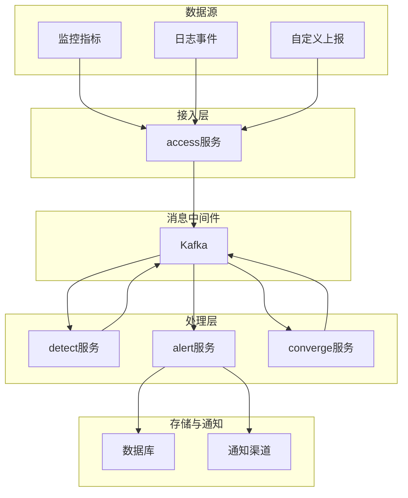
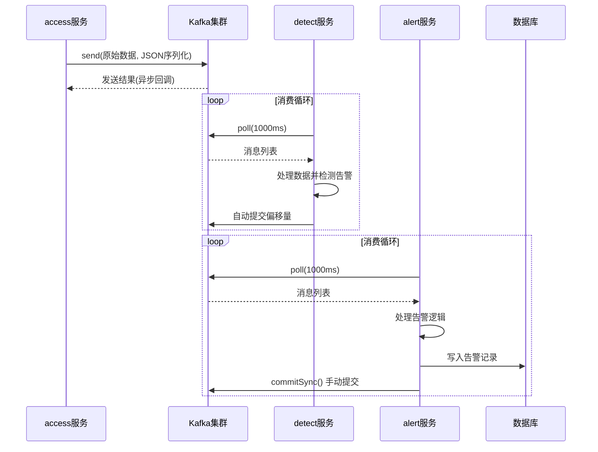
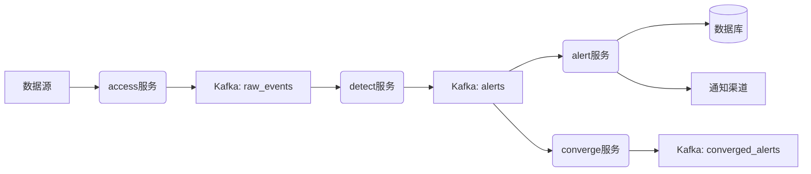
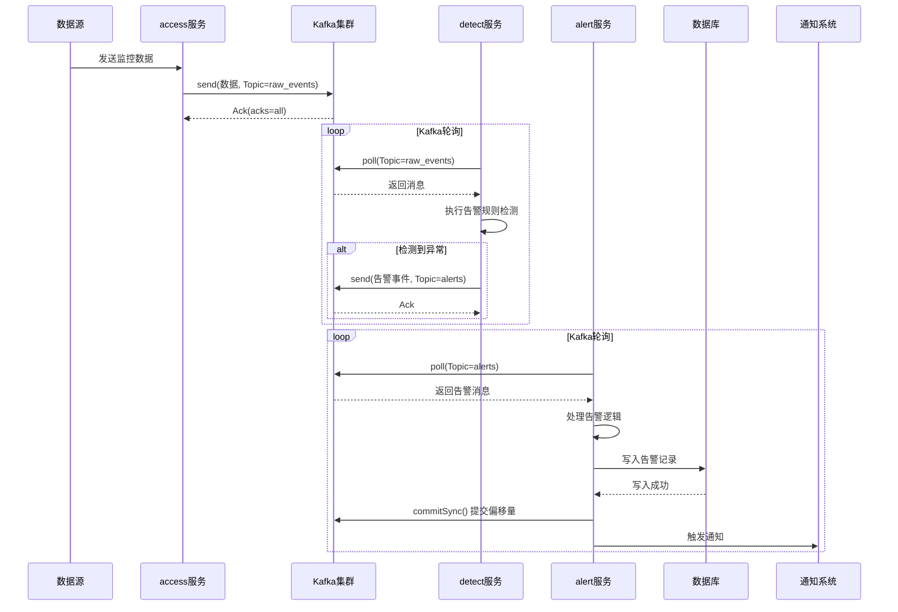

# Kafka消息队列架构

<cite>
**本文档引用的文件**  
- [kafka.md](file://wiki/kafka.md)
- [告警数据的来源.md](file://wiki/告警数据的来源.md)
- [策略引擎.md](file://wiki/策略引擎.md)
- [QWEN.md](file://QWEN.md)
- [README.md](file://README.md)
- [alarm_backends/core/processor.py](file://bkmonitor/alarm_backends/core/processor.py)
- [alarm_backends/service/access/README.md](file://bkmonitor/alarm_backends/service/access/README.md)
- [alarm_backends/service/alert/README.md](file://bkmonitor/alarm_backends/service/alert/README.md)
- [config/tools/kafka.py](file://config/tools/kafka.py)
- [bkmonitor/utils/kafka_tools.py](file://bkmonitor/utils/kafka_tools.py)
</cite>

## 目录
1. [引言](#引言)
2. [项目结构分析](#项目结构分析)
3. [Kafka在告警系统中的核心作用](#kafka在告警系统中的核心作用)
4. [Kafka生产者与消费者实现机制](#kafka生产者与消费者实现机制)
5. [Topic分区策略与消息序列化](#topic分区策略与消息序列化)
6. [消息可靠性保证机制](#消息可靠性保证机制)
7. [Kafka与其他系统的集成](#kafka与其他系统的集成)
8. [消息流转时序图](#消息流转时序图)
9. [运维关键点](#运维关键点)
10. [结论](#结论)

## 引言

Kafka作为分布式消息队列，在本监控系统中承担着告警数据流转的核心枢纽角色。它实现了数据生产与消费的解耦，支持高吞吐量、低延迟的消息传递，并保障了告警数据在复杂处理链路中的可靠传输。本文档深入分析Kafka在告警数据处理流程中的架构设计、实现机制与集成方式，为系统维护与优化提供技术依据。

## 项目结构分析

项目采用模块化分层架构，`bkmonitor`目录为核心监控模块，其中`alarm_backends`子模块负责告警的全生命周期处理。Kafka作为中间件，贯穿于数据接入、检测、收敛、告警生成等多个服务环节。

**图示来源**
- [项目结构](file://.project_structure)

**本节来源**
- [README.md](file://README.md)
- [告警数据的来源.md](file://wiki/告警数据的来源.md)

## Kafka在告警系统中的核心作用

Kafka在告警数据流转中扮演着“中枢神经”的角色，其核心作用体现在：

1.  **解耦生产与消费**：数据接入服务（access）将原始数据写入Kafka，而告警检测（detect）、告警生成（alert）、告警收敛（converge）等服务作为独立消费者，按需订阅数据，彼此互不影响。
2.  **缓冲与削峰**：面对监控数据的瞬时高峰，Kafka作为缓冲区，平滑了数据流，防止下游处理服务因瞬时压力过大而崩溃。
3.  **支持多订阅者**：同一份原始数据可以被多个不同的处理服务消费，例如，一份数据既可用于实时告警检测，也可用于离线分析或数据备份。
4.  **保障数据持久性**：消息在Kafka中持久化存储，即使消费者服务临时宕机，重启后仍可从上次消费位置继续处理，避免数据丢失。

**本节来源**
- [kafka.md](file://wiki/kafka.md)
- [告警数据的来源.md](file://wiki/告警数据的来源.md)

## Kafka生产者与消费者实现机制

### 生产者实现

生产者主要由`alarm_backends/service/access`模块实现，负责将接收到的监控数据和事件转换为Kafka消息并发送。

*   **消息构建**：生产者将原始数据封装成包含`event_id`、`event_type`、`raw_data`、`timestamp`等字段的JSON对象。
*   **异步发送**：使用异步发送模式，提高吞吐量。发送请求立即返回，通过回调函数处理发送成功或失败的结果。
*   **关键配置**：在`config/tools/kafka.py`中定义了生产者配置，如`bootstrap.servers`、`acks`、`retries`、`batch.size`等。

### 消费者实现

消费者分布在多个服务中，如`detect`、`alert`、`converge`等，它们通过订阅特定的Topic来获取数据。

*   **消费者组**：每个服务使用独立的`group.id`，确保同组内的多个实例能分摊消费任务，实现负载均衡。
*   **自动提交与手动提交**：
    *   `detect`服务通常采用自动提交（`enable.auto.commit=true`），因为检测是幂等操作。
    *   `alert`服务为保证“恰好一次”语义，采用手动提交（`enable.auto.commit=false`），在告警成功写入数据库后才调用`commitSync()`。
*   **反序列化**：消费者使用`org.apache.kafka.common.serialization.StringDeserializer`或自定义反序列化器将字节流还原为JSON对象。

**图示来源**
- [alarm_backends/service/access/README.md](file://bkmonitor/alarm_backends/service/access/README.md)
- [alarm_backends/service/detect/README.md](file://bkmonitor/alarm_backends/service/detect/README.md)
- [alarm_backends/service/alert/README.md](file://bkmonitor/alarm_backends/service/alert/README.md)

**本节来源**
- [config/tools/kafka.py](file://config/tools/kafka.py)
- [bkmonitor/utils/kafka_tools.py](file://bkmonitor/utils/kafka_tools.py)

## Topic分区策略与消息序列化

### Topic分区策略

系统根据数据类型和处理需求设计了多个Topic，并采用合理的分区策略：

*   **Topic设计**：
    *   `raw_events`: 存储所有原始事件数据。
    *   `alerts`: 存储检测出的告警事件。
    *   `converged_alerts`: 存储经过收敛处理的告警。
*   **分区依据**：
    *   对于`raw_events`，分区键（Key）通常为`bk_biz_id`（业务ID）或`event_source`（数据源），确保同一业务或数据源的数据进入同一分区，保证处理顺序。
    *   对于`alerts`，分区键为`alert_id`，确保同一个告警的所有相关事件（如状态更新）能被同一个消费者实例处理。

### 消息序列化

*   **序列化方式**：消息体（Value）采用`JSON`格式进行序列化，具有良好的可读性和跨语言兼容性。
*   **序列化器**：生产者使用`org.apache.kafka.common.serialization.StringSerializer`将JSON字符串转换为字节数组。
*   **Schema管理**：虽然当前使用JSON，但未来可引入Schema Registry（如Avro）来严格定义消息格式，提高数据一致性和兼容性。

**本节来源**
- [kafka.md](file://wiki/kafka.md)
- [告警数据的来源.md](file://wiki/告警数据的来源.md)

## 消息可靠性保证机制

为确保告警数据不丢失，系统在Kafka层面实施了多重可靠性保障措施。

### ACK确认机制

*   **生产者ACK设置**：在`config/tools/kafka.py`中，`acks`参数被设置为`all`（或`-1`）。这意味着生产者要求Leader和所有ISR（In-Sync Replicas）副本都成功写入消息后，才向生产者返回确认。这是最高等级的可靠性保证，能有效防止Leader宕机导致的数据丢失。
*   **ISR机制**：Kafka通过ISR机制动态维护一个与Leader保持同步的副本列表。只有ISR中的副本才有资格在Leader宕机时被选举为新的Leader。

### 重试机制

*   **生产者重试**：当网络抖动或Leader切换导致发送失败时，生产者会根据配置的`retries`参数（如`Integer.MAX_VALUE`）进行无限次重试，直到成功或遇到不可恢复的错误。
*   **幂等性生产者**：启用`enable.idempotence=true`，确保即使在网络重试导致消息重复发送的情况下，Kafka也能保证消息的“恰好一次”投递，避免告警数据重复。

### 消费者可靠性

*   **手动提交偏移量**：如前所述，`alert`服务采用手动提交，确保只有在业务逻辑（如数据库写入）成功完成后才提交偏移量。即使消费者在处理后、提交前崩溃，重启后会重新处理该消息，防止告警丢失。
*   **死信队列（DLQ）**：对于反复消费失败的“毒药消息”，系统可将其转发到专门的死信队列Topic，避免阻塞正常消息的消费，同时便于人工排查。

**本节来源**
- [config/tools/kafka.py](file://config/tools/kafka.py)
- [alarm_backends/service/alert/README.md](file://bkmonitor/alarm_backends/service/alert/README.md)

## Kafka与其他系统的集成

Kafka作为核心中间件，与系统内多个关键组件紧密集成。

### 与告警处理器的集成

*   **与detect服务集成**：`detect`服务订阅`raw_events` Topic，实时消费原始数据，执行告警规则匹配。一旦检测到异常，将生成的告警事件发布到`alerts` Topic。
*   **与alert服务集成**：`alert`服务订阅`alerts` Topic，负责告警的生命周期管理，包括告警的创建、状态更新、通知发送等，并将结果持久化到数据库。
*   **与converge服务集成**：`converge`服务订阅`alerts` Topic，对大量告警进行智能收敛（如风暴抑制、根因分析），并将收敛后的结果发布到`converged_alerts` Topic。

### 与数据存储的集成

*   **持久化**：`alert`服务在处理完告警后，会将告警的最终状态和详细信息写入后端数据库（如MySQL或Elasticsearch），实现数据的长期存储和查询。
*   **状态同步**：数据库中的告警状态变更，有时也会通过Kafka广播，通知其他关心该状态的服务进行相应处理。

**图示来源**
- [alarm_backends/service/access/README.md](file://bkmonitor/alarm_backends/service/access/README.md)
- [alarm_backends/service/detect/README.md](file://bkmonitor/alarm_backends/service/detect/README.md)
- [alarm_backends/service/alert/README.md](file://bkmonitor/alarm_backends/service/alert/README.md)
- [alarm_backends/service/converge/README.md](file://bkmonitor/alarm_backends/service/converge/README.md)

**本节来源**
- [策略引擎.md](file://wiki/策略引擎.md)

## 消息流转时序图

以下时序图展示了从数据产生到告警消费的完整路径。

**图示来源**
- [告警数据的来源.md](file://wiki/告警数据的来源.md)
- [alarm_backends/core/processor.py](file://bkmonitor/alarm_backends/core/processor.py)

## 运维关键点

### 消息积压处理

*   **监控指标**：持续监控各Topic的`Lag`（消费者落后于生产者的条数）和`Consumer Group`的消费速率。
*   **告警阈值**：当Lag超过预设阈值（如10万条）时，触发告警。
*   **处理措施**：
    1.  **扩容消费者**：增加`detect`或`alert`服务的实例数量，提升消费能力。
    2.  **优化处理逻辑**：分析消费者代码，优化数据库写入、外部API调用等耗时操作。
    3.  **临时降级**：在极端情况下，可考虑丢弃低优先级的告警或降低数据采样率。

### 性能监控

*   **Kafka集群监控**：监控Broker的CPU、内存、磁盘I/O、网络吞吐量以及ZooKeeper的健康状态。
*   **生产者监控**：监控生产者的发送延迟、失败率、重试次数。
*   **消费者监控**：监控消费者的消费延迟（Lag）、poll间隔、处理时长。
*   **工具**：利用Prometheus和Grafana对上述指标进行可视化展示。

### 容量规划

*   **数据量估算**：根据业务规模预估每日产生的消息总量和峰值QPS。
*   **存储规划**：根据消息保留策略（`log.retention.hours`）计算所需的磁盘空间，并预留30%-50%的余量。
*   **分区数规划**：分区数决定了消费者的最大并行度。初始分区数应略大于预期的消费者实例总数，并可通过`kafka-reassign-partitions.sh`工具在线扩容。
*   **带宽规划**：确保网络带宽能满足生产者和消费者的数据传输需求。

**本节来源**
- [kafka.md](file://wiki/kafka.md)
- [QWEN.md](file://QWEN.md)

## 结论

Kafka在本监控系统中构建了一个高效、可靠、可扩展的消息传输骨架。通过合理的Topic设计、分区策略和序列化方式，实现了数据的有序和高效流转。结合ACK确认、重试机制和手动提交偏移量，为告警数据的“不丢失”提供了强有力的保障。其与`access`、`detect`、`alert`等服务的深度集成，支撑了复杂的告警处理流程。完善的运维监控体系，确保了Kafka集群的稳定运行。未来可考虑引入Schema Registry和更智能的流处理框架（如Flink），以进一步提升系统的健壮性和处理能力。