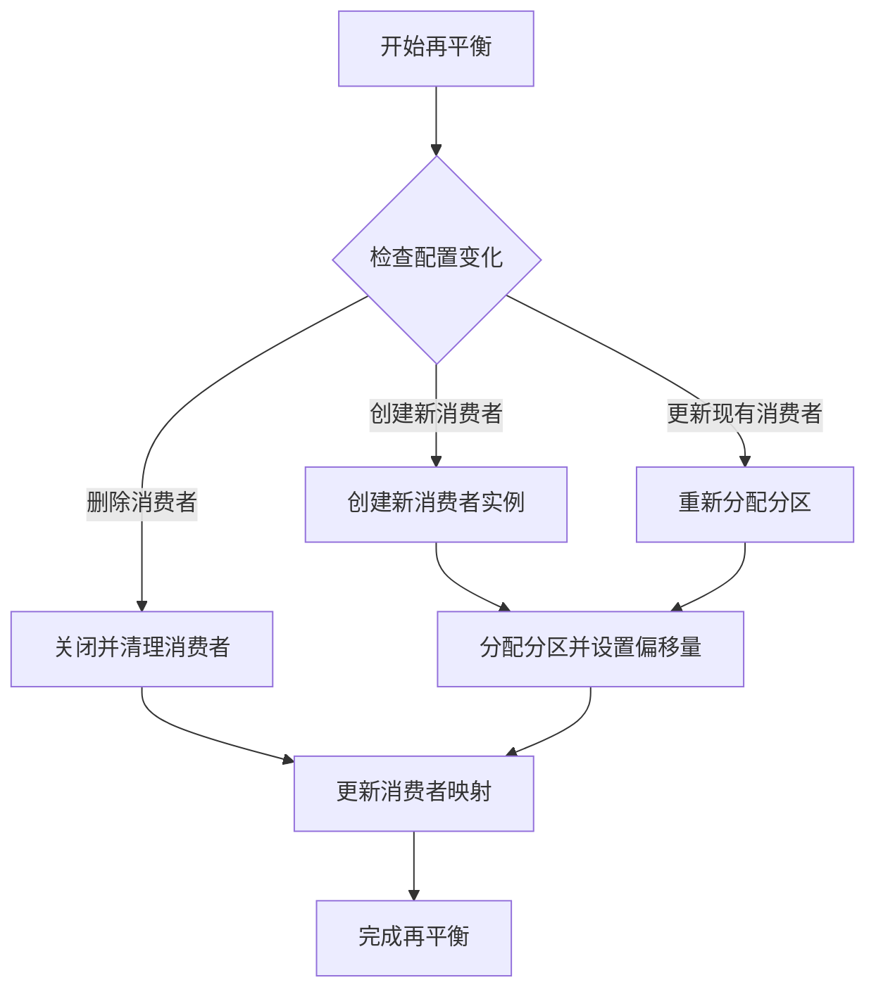
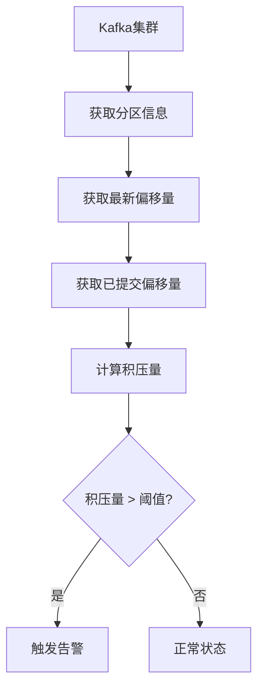

# Kafka消费者实现

<cite>
**本文档引用的文件**   
- [kafka.py](file://bkmonitor/alarm_backends/core/storage/kafka.py)
- [kafka_v2.py](file://bkmonitor/alarm_backends/core/storage/kafka_v2.py)
- [handler.py](file://bkmonitor/alarm_backends/service/alert/handler.py)
- [test_alert_poller.py](file://bkmonitor/alarm_backends/tests/service/alert/test_alert_poller.py)
- [resources.py](file://bkmonitor/metadata/resources/resources.py)
- [kafka.md](file://wiki/kafka.md)
- [function_story.py](file://bkmonitor/alarm_backends/management/story/function_story.py)
- [processor.py](file://bkmonitor/alarm_backends/service/access/data/processor.py)
</cite>

## 目录
1. [引言](#引言)
2. [消费者组与订阅模式](#消费者组与订阅模式)
3. [消息拉取机制](#消息拉取机制)
4. [自动提交与手动提交](#自动提交与手动提交)
5. [再平衡处理策略](#再平衡处理策略)
6. [反序列化与消息处理](#反序列化与消息处理)
7. [异常处理机制](#异常处理机制)
8. [性能监控与积压管理](#性能监控与积压管理)
9. [结论](#结论)

## 引言
Kafka在蓝鲸监控平台中扮演着核心消息中间件的角色，作为数据接入和处理之间的缓冲层，确保系统高可用性和削峰填谷能力。本文档详细阐述Kafka消费者的实现机制，包括消费者组管理、订阅与手动分配模式的区别、消息拉取机制、自动提交与手动提交的权衡、再平衡过程的处理策略、反序列化、消息处理逻辑和异常处理机制，以及消费者性能监控和积压管理的最佳实践。

## 消费者组与订阅模式
Kafka消费者通过消费者组（Consumer Group）实现并行处理和负载均衡。消费者组是一组共同消费一个或多个主题的消费者实例，Kafka确保每个分区只能被组内的一个消费者消费。

### 订阅模式（subscribe）
订阅模式是Kafka消费者最常用的模式，消费者通过`subscribe()`方法订阅一个或多个主题，Kafka会自动管理分区分配。在蓝鲸监控平台中，`kafka_v2.py`文件中的`_create_consumer`方法展示了订阅模式的实现：

```python
def _create_consumer(self, topic, group_name):
    consumer = kafka.KafkaConsumer(
        topic,
        bootstrap_servers=self.bootstrap_servers,
        group_id=group_name,
        client_id=f"{group_name}-{self.pod_id}",
        enable_auto_commit=settings.KAFKA_AUTO_COMMIT,
        max_poll_interval_ms=3,
        session_timeout_ms=30000,
        max_partition_fetch_bytes=1024 * 1024 * 5,
        partition_assignment_strategy=[kafka.coordinator.assignors.roundrobin.RoundRobinPartitionAssignor],
        auto_offset_reset="latest",
    )
    consumer.subscribe([topic])
```

**Section sources**
- [kafka_v2.py](file://bkmonitor/alarm_backends/core/storage/kafka_v2.py#L62-L94)

### 手动分配模式（assign）
手动分配模式允许消费者直接指定要消费的分区，绕过消费者组的协调机制。在`handler.py`文件中，`run_consumer_manager`方法展示了手动分配的实现：

```python
for bootstrap_server in create_bootstrap_servers:
    new_consumers[bootstrap_server] = KafkaConsumer(
        bootstrap_servers=bootstrap_server,
        group_id=f"{settings.APP_CODE}.alert.builder",
        max_partition_fetch_bytes=1024 * 1024 * 5,
    )
    new_consumers[bootstrap_server].poll()
    new_consumers[bootstrap_server].assign(partitions=list(bootstrap_servers_topics[bootstrap_server]))
```

手动分配模式适用于需要精确控制分区消费的场景，如蓝鲸监控中的告警事件处理。

**Section sources**
- [handler.py](file://bkmonitor/alarm_backends/service/alert/handler.py#L315-L339)

## 消息拉取机制
Kafka消费者通过`poll()`方法从服务器拉取消息。`poll()`方法是一个阻塞调用，它会等待指定的超时时间，直到有足够的数据可用或达到最大记录数。

在`event_poller.py`文件中，`poll_once`方法展示了消息拉取的实现：

```python
def poll_once(self):
    consumer = self.get_consumer()
    records = consumer.poll(500, max_records=MAX_RETRIEVE_NUMBER)
    messages = list(itertools.chain.from_iterable(records.values()))
    return messages
```

`poll()`方法的参数包括：
- `timeout_ms`：等待数据的最长时间（毫秒）
- `max_records`：单次调用返回的最大记录数

**Section sources**
- [event_poller.py](file://bkmonitor/alarm_backends/service/access/event/event_poller.py#L69-L98)

## 自动提交与手动提交
Kafka消费者提供两种提交消费位移（offset）的方式：自动提交和手动提交。

### 自动提交（enable.auto.commit）
自动提交通过设置`enable_auto_commit=True`启用，Kafka会在后台定期自动提交消费位移。在`kafka_v2.py`文件中，消费者配置了自动提交：

```python
consumer = kafka.KafkaConsumer(
    ...
    enable_auto_commit=settings.KAFKA_AUTO_COMMIT,
    ...
)
```

自动提交的优点是简单易用，但可能导致消息重复消费或丢失，特别是在处理时间较长或消费者崩溃的情况下。

### 手动提交（commit）
手动提交通过调用`commit()`方法显式提交消费位移，提供更精确的控制。在`kafka_v2.py`文件中，`take_raw`方法展示了手动提交的实现：

```python
def take_raw(self, count=1, timeout=0.1):
    consumer = self._ensure_connected(self.get_consumer())
    records = consumer.poll(timeout_ms=timeout * 1000, max_records=count).values()
    messages = list(itertools.chain.from_iterable(records))
    consumer.commit()  # 手动提交保证可靠性
    return messages
```

手动提交的优点是可以确保消息处理成功后再提交位移，避免消息丢失，但需要开发者自行管理提交逻辑。

**Section sources**
- [kafka_v2.py](file://bkmonitor/alarm_backends/core/storage/kafka_v2.py#L122-L155)

## 再平衡处理策略
再平衡是Kafka消费者组在成员变化时重新分配分区的过程。蓝鲸监控平台通过`run_consumer_manager`方法实现自定义的再平衡策略：



**Diagram sources**
- [handler.py](file://bkmonitor/alarm_backends/service/alert/handler.py#L290-L361)

在`handler.py`文件中，`run_consumer_manager`方法通过比较当前配置和现有消费者，决定创建、更新或删除消费者：

```python
update_bootstrap_servers = []
create_bootstrap_servers = []
delete_bootstrap_servers = []

for bootstrap_server, tps in bootstrap_servers_topics.items():
    if bootstrap_server not in self.consumers:
        create_bootstrap_servers.append(bootstrap_server)
        continue

    consumer = self.consumers[bootstrap_server]
    if consumer.assignment() != tps:
        update_bootstrap_servers.append(bootstrap_server)

for bootstrap_server in self.consumers:
    if bootstrap_server not in bootstrap_servers_topics:
        delete_bootstrap_servers.append(bootstrap_server)
```

**Section sources**
- [handler.py](file://bkmonitor/alarm_backends/service/alert/handler.py#L290-L317)

## 反序列化与消息处理
Kafka消息以字节数组形式存储，消费者需要将其反序列化为可用的数据结构。在`resources.py`文件中，`_consume_with_confluent_kafka`方法展示了反序列化和消息处理的实现：

```python
for msg in messages:
    if msg.error():
        if msg.error().code() == KafkaError._PARTITION_EOF:
            break
        else:
            errors.append(msg.error())
    else:
        try:
            result.append(json.loads(msg.value().decode()))
        except Exception:
            pass
```

消息处理流程包括：
1. 检查消息错误
2. 解码字节数据
3. JSON反序列化
4. 异常处理

**Section sources**
- [resources.py](file://bkmonitor/metadata/resources/resources.py#L2619-L2651)

## 异常处理机制
Kafka消费者需要处理各种异常情况，包括连接失败、数据格式错误和消费者组协调问题。在`kafka_v2.py`文件中，`_create_consumer`方法展示了连接异常的处理：

```python
for i in range(3):
    try:
        consumer = kafka.KafkaConsumer(...)
        consumer.subscribe([topic])
    except Exception as e:
        logger.exception("topic(%s) create consumer failed %d times: %s", topic, i + 1, e)
        continue
    if consumer.offsets:
        return consumer
    else:
        logger.warning("topic(%s) load metadata failed %d times", topic, i + 1)
        continue
```

在`resources.py`文件中，`fetch_latest_messages`方法展示了消息消费异常的处理：

```python
if not result and errors:
    raise KafkaException(errors)
```

**Section sources**
- [kafka_v2.py](file://bkmonitor/alarm_backends/core/storage/kafka_v2.py#L62-L94)
- [resources.py](file://bkmonitor/metadata/resources/resources.py#L2703-L2728)

## 性能监控与积压管理
Kafka消费者性能监控和积压管理是确保系统稳定运行的关键。在`function_story.py`文件中，`MonitorKafkaCongestionCheck`类实现了积压检测：

```python
end_offsets = c.end_offsets(topic_partitions)
committed_offsets = {}
for topic_partition in topic_partitions:
    committed_offsets[topic_partition] = c.committed(topic_partition) or 0

for topic_partition in committed_offsets:
    if end_offsets[topic_partition] - committed_offsets[topic_partition] > threshold:
        congestion_topics.append(topic_partition.topic)
        self.story.warning(f"{bootstrap_servers} {topic_partition.topic} congestion occurs, {end_offsets[topic_partition] - committed_offsets[topic_partition]}")
```

积压管理的最佳实践包括：
- 定期监控消费延迟
- 设置合理的阈值告警
- 优化消费者处理性能
- 动态调整消费者数量



**Diagram sources**
- [function_story.py](file://bkmonitor/alarm_backends/management/story/function_story.py#L100-L113)

**Section sources**
- [function_story.py](file://bkmonitor/alarm_backends/management/story/function_story.py#L88-L121)

## 结论
Kafka消费者在蓝鲸监控平台中扮演着关键角色，通过消费者组、订阅模式、消息拉取、位移提交、再平衡、反序列化、消息处理和异常处理等机制，实现了高效可靠的消息消费。性能监控和积压管理确保了系统的稳定运行。理解这些实现机制有助于优化消费者性能，提高系统可靠性。