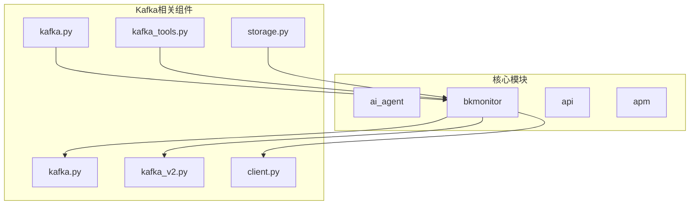
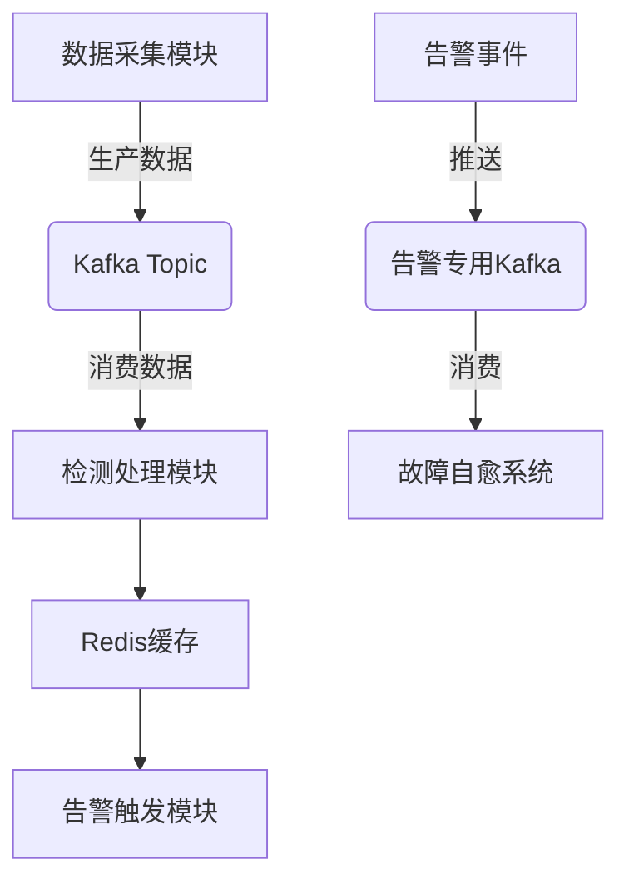
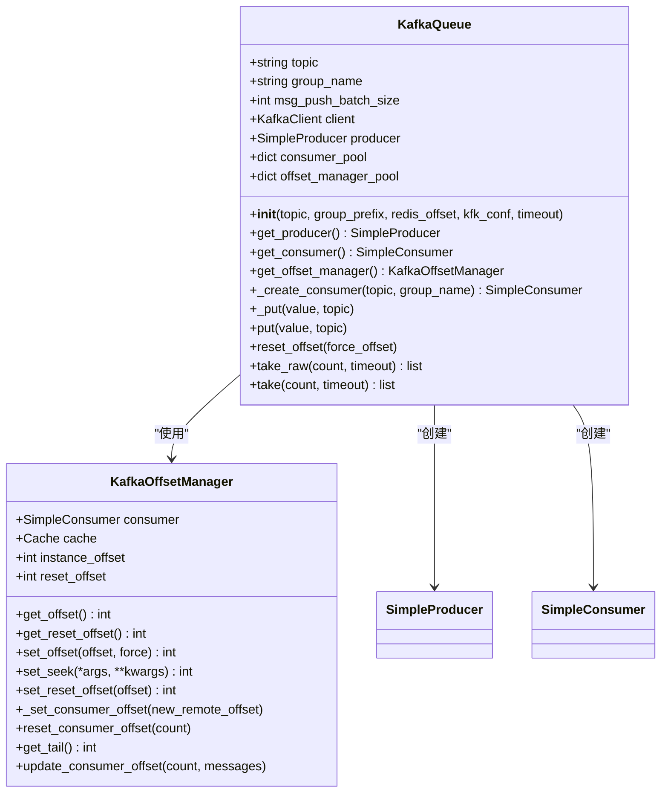
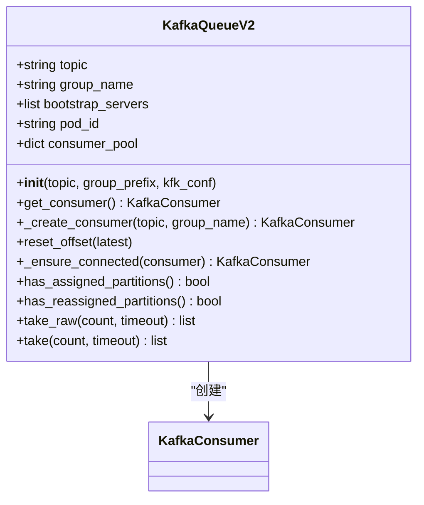
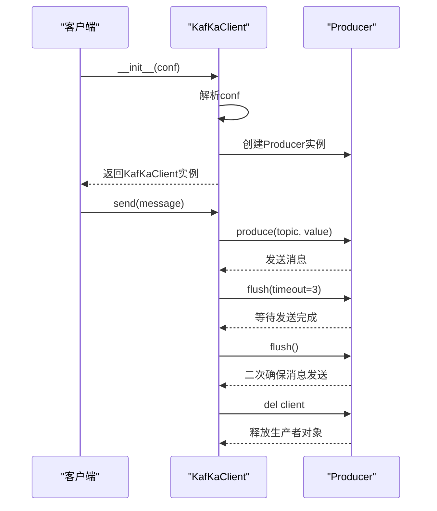
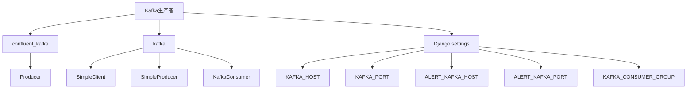

# Kafka生产者实现

<cite>
**本文档中引用的文件**   
- [kafka.py](file://bkmonitor/alarm_backends/core/storage/kafka.py)
- [kafka_v2.py](file://bkmonitor/alarm_backends/core/storage/kafka_v2.py)
- [client.py](file://bkmonitor/alarm_backends/service/fta_action/message_queue/client.py)
- [kafka.py](file://bkmonitor/config/tools/kafka.py)
- [kafka_tools.py](file://bkmonitor/bkmonitor/utils/kafka_tools.py)
- [storage.py](file://bkmonitor/metadata/models/storage.py)
- [function_story.py](file://bkmonitor/alarm_backends/management/story/function_story.py)
- [settings.py](file://bkmonitor/settings.py)
- [kafka.md](file://wiki/kafka.md)
</cite>

## 目录
1. [引言](#引言)
2. [项目结构分析](#项目结构分析)
3. [核心组件](#核心组件)
4. [架构概述](#架构概述)
5. [详细组件分析](#详细组件分析)
6. [依赖分析](#依赖分析)
7. [性能考虑](#性能考虑)
8. [故障排除指南](#故障排除指南)
9. [结论](#结论)

## 引言
Kafka在蓝鲸监控平台中作为核心消息中间件，承担着数据采集、缓冲、告警事件处理和数据流转的关键角色。本文档深入分析Kafka生产者的实现细节，包括生产者客户端的创建、消息发送流程、异步发送机制和回调处理，以及消息键（key）和值（value）的序列化过程、分区策略（Partitioner）的选择与实现、消息压缩（compression.type）配置、批量发送（batch.size）和延迟（linger.ms）优化机制，并提供生产者性能调优建议和错误处理策略。

## 项目结构分析
蓝鲸监控平台的项目结构清晰，主要模块包括ai_agent、bkmonitor、api、apm等。与Kafka生产者相关的代码主要分布在`bkmonitor/alarm_backends/core/storage/`目录下的`kafka.py`和`kafka_v2.py`文件中，以及`bkmonitor/alarm_backends/service/fta_action/message_queue/`目录下的`client.py`文件。此外，配置文件位于`bkmonitor/config/tools/`和`bkmonitor/metadata/models/`目录下。

**图源**
- [kafka.py](file://bkmonitor/alarm_backends/core/storage/kafka.py)
- [kafka_v2.py](file://bkmonitor/alarm_backends/core/storage/kafka_v2.py)
- [client.py](file://bkmonitor/alarm_backends/service/fta_action/message_queue/client.py)
- [kafka.py](file://bkmonitor/config/tools/kafka.py)
- [kafka_tools.py](file://bkmonitor/bkmonitor/utils/kafka_tools.py)
- [storage.py](file://bkmonitor/metadata/models/storage.py)

## 核心组件
Kafka生产者的核心组件包括`KafkaQueue`、`KafkaQueueV2`和`KafKaClient`。`KafkaQueue`和`KafkaQueueV2`是传统的和新版本的Kafka客户端封装，而`KafKaClient`是用于故障自愈系统的Kafka客户端。

**组件源**
- [kafka.py](file://bkmonitor/alarm_backends/core/storage/kafka.py#L30-L257)
- [kafka_v2.py](file://bkmonitor/alarm_backends/core/storage/kafka_v2.py#L30-L156)
- [client.py](file://bkmonitor/alarm_backends/service/fta_action/message_queue/client.py#L30-L131)

## 架构概述
Kafka在蓝鲸监控平台中的架构包括数据采集模块、Kafka Topic、检测处理模块、Redis缓存、告警触发模块、告警事件、告警专用Kafka和故障自愈系统。数据采集模块生产数据到Kafka Topic，检测处理模块消费数据并存储到Redis缓存，告警触发模块从Redis缓存中读取数据并触发告警，告警事件被推送到告警专用Kafka，故障自愈系统消费告警事件。

**图源**
- [kafka.md](file://wiki/kafka.md#L30-L55)

## 详细组件分析

### KafkaQueue分析
`KafkaQueue`类是传统的Kafka客户端封装，负责生产者和消费者的创建与管理。它通过`get_producer()`方法创建生产者，通过`get_consumer()`方法创建消费者，并通过`put()`方法发送消息。

#### 类图

**图源**
- [kafka.py](file://bkmonitor/alarm_backends/core/storage/kafka.py#L30-L257)

**组件源**
- [kafka.py](file://bkmonitor/alarm_backends/core/storage/kafka.py#L30-L257)

### KafkaQueueV2分析
`KafkaQueueV2`类是新版本的Kafka客户端实现，提供了更高级的消费者管理功能，如分区分配检查和重分配检测。

#### 类图

**图源**
- [kafka_v2.py](file://bkmonitor/alarm_backends/core/storage/kafka_v2.py#L30-L156)

**组件源**
- [kafka_v2.py](file://bkmonitor/alarm_backends/core/storage/kafka_v2.py#L30-L156)

### KafKaClient分析
`KafKaClient`类是用于故障自愈系统的Kafka客户端，支持字符串DSN和结构化字典两种配置方式。

#### 序列图

**图源**
- [client.py](file://bkmonitor/alarm_backends/service/fta_action/message_queue/client.py#L30-L131)

**组件源**
- [client.py](file://bkmonitor/alarm_backends/service/fta_action/message_queue/client.py#L30-L131)

## 依赖分析
Kafka生产者依赖于`confluent_kafka`库和`kafka`库，以及Django的`settings`模块。`KafkaQueue`和`KafkaQueueV2`类依赖于`kafka`库的`SimpleClient`、`SimpleProducer`和`KafkaConsumer`类，而`KafKaClient`类依赖于`confluent_kafka`库的`Producer`类。

**图源**
- [kafka.py](file://bkmonitor/alarm_backends/core/storage/kafka.py)
- [kafka_v2.py](file://bkmonitor/alarm_backends/core/storage/kafka_v2.py)
- [client.py](file://bkmonitor/alarm_backends/service/fta_action/message_queue/client.py)
- [settings.py](file://bkmonitor/settings.py)

**组件源**
- [kafka.py](file://bkmonitor/alarm_backends/core/storage/kafka.py)
- [kafka_v2.py](file://bkmonitor/alarm_backends/core/storage/kafka_v2.py)
- [client.py](file://bkmonitor/alarm_backends/service/fta_action/message_queue/client.py)
- [settings.py](file://bkmonitor/settings.py)

## 性能考虑
Kafka生产者的性能优化主要包括批量发送、延迟发送和消息压缩。`KafkaQueue`类的`msg_push_batch_size`属性设置为1000，以批量发送消息提高效率。`KafkaQueueV2`类的`max_partition_fetch_bytes`属性设置为5MB，以提高单次拉取效率。此外，Kafka支持数据压缩以减少网络传输。

**组件源**
- [kafka.py](file://bkmonitor/alarm_backends/core/storage/kafka.py#L30-L257)
- [kafka_v2.py](file://bkmonitor/alarm_backends/core/storage/kafka_v2.py#L30-L156)

## 故障排除指南
Kafka生产者的错误处理策略包括自动重连机制和堵塞检测。`KafkaQueue`类的`reconnect_seconds`属性设置为60秒，以实现自动重连。`function_story.py`文件中的`RealTimeTopicStatus`类通过监控消费者延迟来检测Kafka队列堵塞。

**组件源**
- [kafka.py](file://bkmonitor/alarm_backends/core/storage/kafka.py#L30-L257)
- [function_story.py](file://bkmonitor/alarm_backends/management/story/function_story.py#L90-L114)

## 结论
Kafka在蓝鲸监控平台中是数据流转的核心枢纽，确保监控数据的可靠传输、高效处理和实时告警。通过深入分析Kafka生产者的实现细节，我们可以更好地理解其工作原理，并进行性能调优和错误处理。