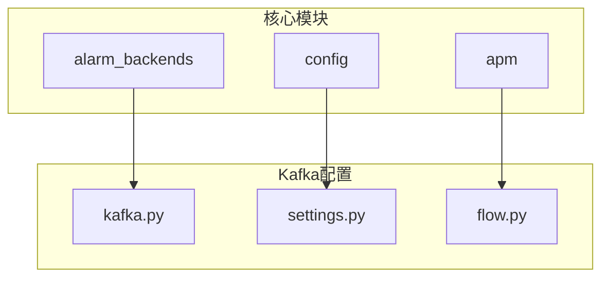
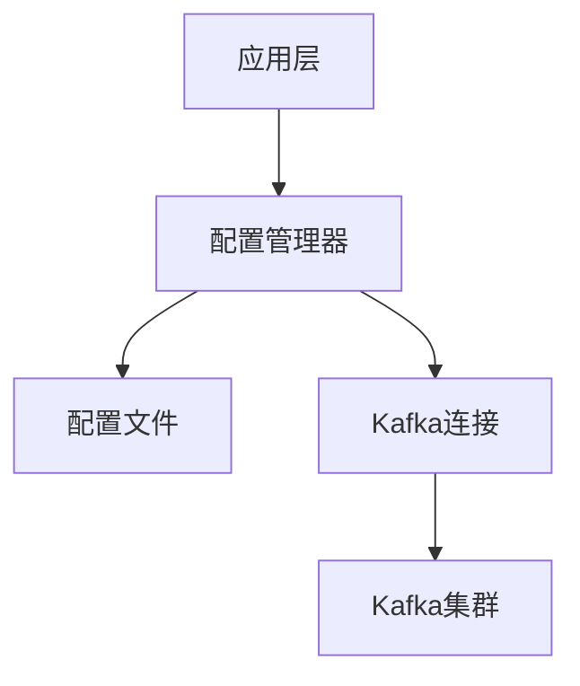
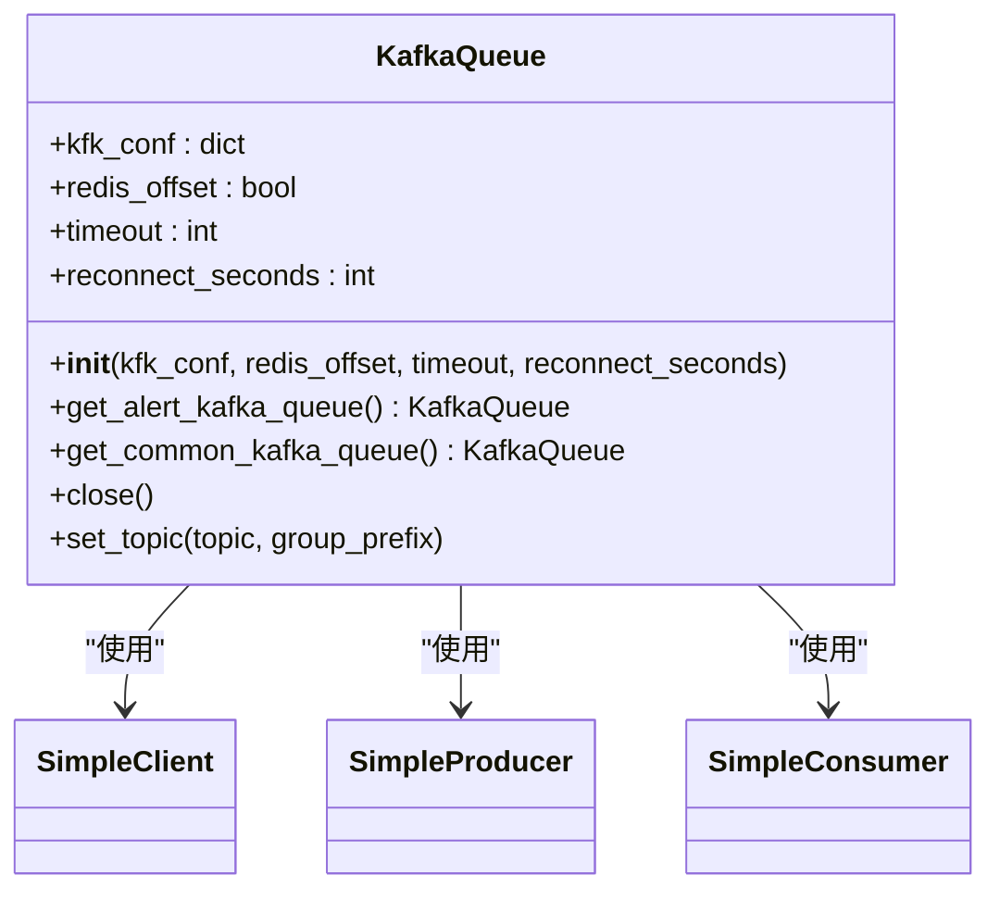
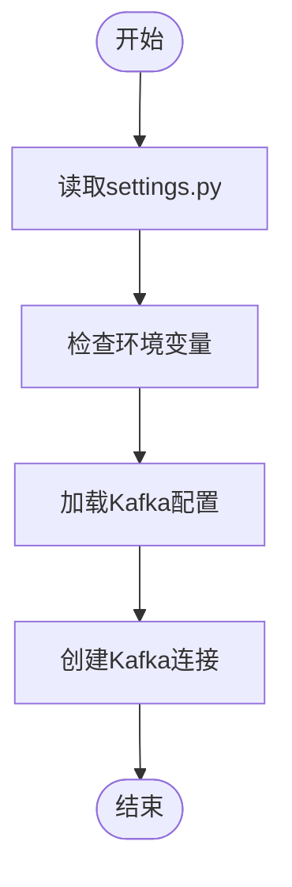
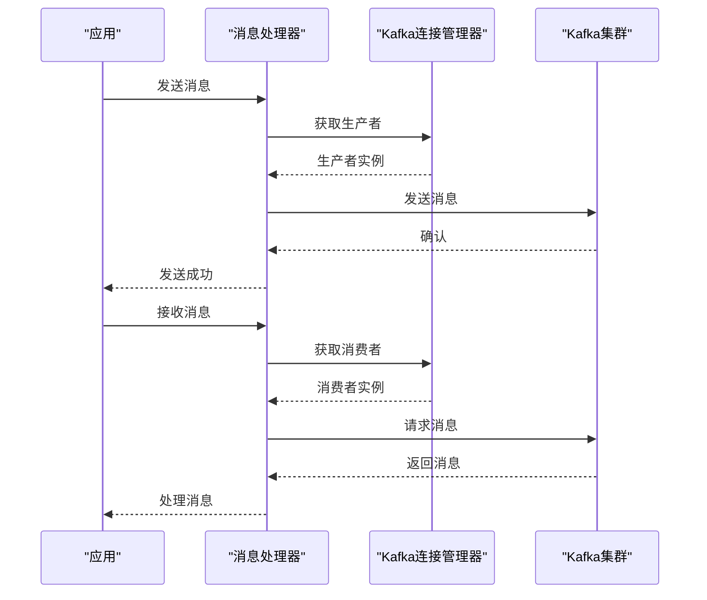
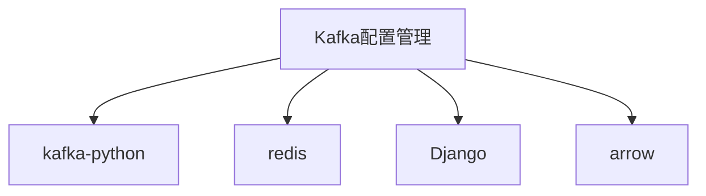

# Kafka配置管理

<cite>
**本文档引用的文件**   
- [kafka.py](file://bkmonitor\alarm_backends\core\storage\kafka.py)
- [settings.py](file://bkmonitor\settings.py)
- [flow.py](file://bkmonitor\apm\core\handlers\bk_data\flow.py)
- [kafka.md](file://wiki\kafka.md)
</cite>

## 目录
1. [简介](#简介)
2. [项目结构](#项目结构)
3. [核心组件](#核心组件)
4. [架构概述](#架构概述)
5. [详细组件分析](#详细组件分析)
6. [依赖分析](#依赖分析)
7. [性能考虑](#性能考虑)
8. [故障排查指南](#故障排查指南)
9. [结论](#结论)

## 简介
本文档详细介绍了蓝鲸监控平台中Kafka配置管理的实现机制。文档涵盖Kafka集群连接参数、生产者与消费者配置、序列化方式、配置加载机制以及运行时管理策略。通过分析代码实现和配置结构，为开发和运维人员提供全面的指导。

## 项目结构
蓝鲸监控平台的项目结构采用模块化设计，Kafka相关配置分散在多个模块中。主要涉及`alarm_backends`、`apm`和`config`等模块。`alarm_backends`模块负责告警数据的存储与处理，`apm`模块处理应用性能监控数据，而`config`模块则包含全局配置信息。

**图示来源**
- [kafka.py](file://bkmonitor\alarm_backends\core\storage\kafka.py)
- [settings.py](file://bkmonitor\settings.py)
- [flow.py](file://bkmonitor\apm\core\handlers\bk_data\flow.py)

**本节来源**
- [kafka.py](file://bkmonitor\alarm_backends\core\storage\kafka.py)
- [settings.py](file://bkmonitor\settings.py)

## 核心组件
Kafka配置管理的核心组件包括配置加载器、连接管理器和消息处理器。配置加载器从`settings.py`文件中读取Kafka连接参数，连接管理器负责建立和维护Kafka连接，消息处理器则处理消息的生产和消费。

**本节来源**
- [kafka.py](file://bkmonitor\alarm_backends\core\storage\kafka.py)
- [settings.py](file://bkmonitor\settings.py)

## 架构概述
Kafka配置管理的架构采用分层设计，上层应用通过配置管理器获取Kafka连接，配置管理器从配置文件中读取参数并创建连接。这种设计实现了配置与业务逻辑的解耦，提高了系统的可维护性。

**图示来源**
- [kafka.py](file://bkmonitor\alarm_backends\core\storage\kafka.py)
- [settings.py](file://bkmonitor\settings.py)

## 详细组件分析

### Kafka连接管理器分析
Kafka连接管理器负责创建和管理Kafka连接。它通过读取配置文件中的参数来初始化连接，并提供生产者和消费者实例。

**图示来源**
- [kafka.py](file://bkmonitor\alarm_backends\core\storage\kafka.py)

**本节来源**
- [kafka.py](file://bkmonitor\alarm_backends\core\storage\kafka.py)

### 配置加载器分析
配置加载器从`settings.py`文件中读取Kafka配置参数，包括主机地址、端口、认证信息等。这些参数用于初始化Kafka连接。

**图示来源**
- [settings.py](file://bkmonitor\settings.py)

**本节来源**
- [settings.py](file://bkmonitor\settings.py)

### 消息处理器分析
消息处理器负责处理Kafka消息的生产和消费。它使用Kafka连接管理器提供的连接实例来发送和接收消息。

**图示来源**
- [kafka.py](file://bkmonitor\alarm_backends\core\storage\kafka.py)

**本节来源**
- [kafka.py](file://bkmonitor\alarm_backends\core\storage\kafka.py)

## 依赖分析
Kafka配置管理依赖于多个外部组件，包括Kafka客户端库、Redis（用于偏移量存储）和Django配置系统。这些依赖通过Python的包管理机制进行管理。

**图示来源**
- [kafka.py](file://bkmonitor\alarm_backends\core\storage\kafka.py)
- [settings.py](file://bkmonitor\settings.py)

**本节来源**
- [kafka.py](file://bkmonitor\alarm_backends\core\storage\kafka.py)
- [settings.py](file://bkmonitor\settings.py)

## 性能考虑
Kafka配置管理在性能方面进行了多项优化，包括连接池管理、批量消息发送和异步处理。这些优化措施有效提高了消息处理的吞吐量和响应速度。

## 故障排查指南
当Kafka配置管理出现问题时，可以按照以下步骤进行排查：
1. 检查`settings.py`文件中的配置参数是否正确
2. 验证Kafka集群是否正常运行
3. 检查网络连接是否通畅
4. 查看日志文件中的错误信息

**本节来源**
- [kafka.py](file://bkmonitor\alarm_backends\core\storage\kafka.py)
- [settings.py](file://bkmonitor\settings.py)
- [wiki\kafka.md](file://wiki\kafka.md)

## 结论
Kafka配置管理是蓝鲸监控平台的重要组成部分，它通过分层设计和模块化实现，提供了灵活可靠的Kafka集成能力。通过合理配置和优化，可以有效支持大规模监控数据的处理需求。