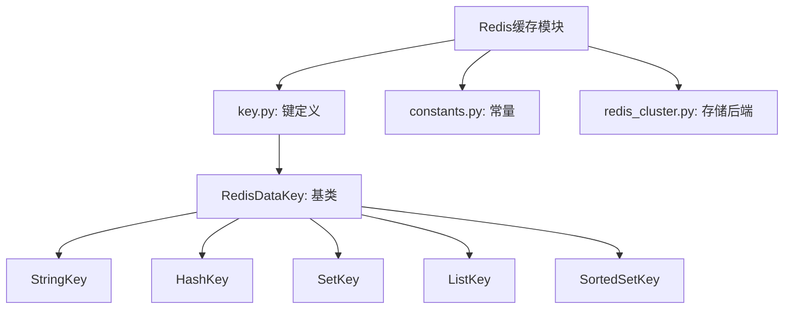
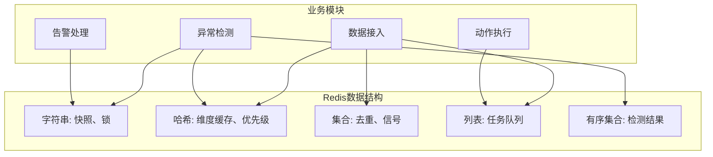
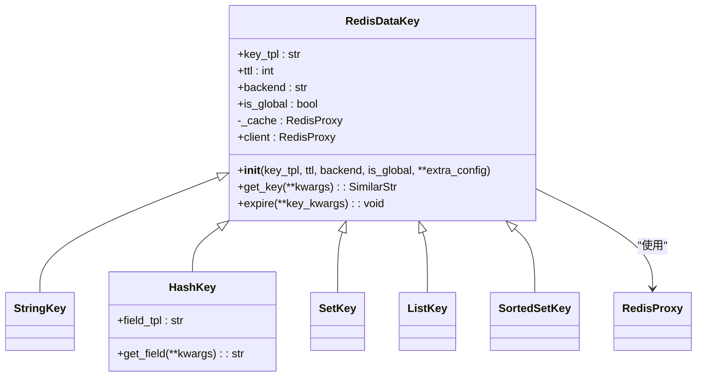

# Redis数据结构设计

<cite>
**本文档引用的文件**   
- [key.py](file://bkmonitor/alarm_backends/core/cache/key.py#L0-L1075)
- [constants.py](file://bkmonitor/alarm_backends/constants.py)
- [redis_cluster.py](file://bkmonitor/alarm_backends/core/storage/redis_cluster.py)
</cite>

## 目录
1. [引言](#引言)
2. [项目结构](#项目结构)
3. [核心组件](#核心组件)
4. [架构概述](#架构概述)
5. [详细组件分析](#详细组件分析)
6. [依赖分析](#依赖分析)
7. [性能考虑](#性能考虑)
8. [故障排除指南](#故障排除指南)
9. [结论](#结论)

## 引言
本文档深入分析蓝鲸监控平台中Redis数据结构的设计与实现。系统通过精心设计的Redis键值结构，支撑了告警、检测、策略配置等核心功能的高效运行。文档将详细说明String、Hash、Set等数据结构在不同业务场景下的选择依据，解析核心数据的存储格式和序列化方式，并阐述数据结构优化对查询性能的影响。

## 项目结构
蓝鲸监控平台的项目结构清晰，采用模块化设计。与Redis数据结构直接相关的核心文件位于`bkmonitor/alarm_backends/core/cache/`目录下，其中`key.py`文件定义了所有Redis键的模板、过期策略和存储后端。



**图示来源**
- [key.py](file://bkmonitor/alarm_backends/core/cache/key.py#L0-L1075)

**本节来源**
- [key.py](file://bkmonitor/alarm_backends/core/cache/key.py#L0-L1075)

## 核心组件
系统的核心组件围绕`RedisDataKey`基类构建，该类封装了Redis键的生成、过期策略和存储后端配置。通过`register_key_with_config`函数，系统可以动态地根据配置字典实例化不同数据类型的键对象。

**本节来源**
- [key.py](file://bkmonitor/alarm_backends/core/cache/key.py#L100-L200)

## 架构概述
系统采用分层架构，将Redis用作高性能的缓存和队列中间件。不同的数据类型被用于不同的业务场景：String用于存储快照和锁，Hash用于存储维度信息和优先级，Set用于去重和信号传递，List用于任务队列，Sorted Set用于按时间排序的检测结果。



**图示来源**
- [key.py](file://bkmonitor/alarm_backends/core/cache/key.py#L200-L500)

## 详细组件分析

### Redis键管理类分析
`RedisDataKey`类是整个Redis键管理的核心，它通过模板化的方式统一管理所有键的生命周期。

#### 类图


**图示来源**
- [key.py](file://bkmonitor/alarm_backends/core/cache/key.py#L100-L150)

**本节来源**
- [key.py](file://bkmonitor/alarm_backends/core/cache/key.py#L100-L200)

### 数据结构选择与业务场景分析

#### String数据结构
String类型主要用于存储单值数据，如快照、锁和序列号。

- **策略快照**：`STRATEGY_SNAPSHOT_KEY`使用String存储策略的完整配置，确保检测时使用一致的策略版本。
- **进程锁**：`SERVICE_LOCK_DETECT`等锁键使用String配合Redis的`SETNX`命令实现分布式锁，防止并发冲突。
- **自增序列**：`ALERT_UUID_SEQUENCE`使用String存储告警的UUID序列，保证全局唯一性。

```python
# 代码示例：获取策略快照
snapshot_key = STRATEGY_SNAPSHOT_KEY.get_key(strategy_id=123, update_time=1640995200)
snapshot_data = STRATEGY_SNAPSHOT_KEY.client.get(snapshot_key)
```

**本节来源**
- [key.py](file://bkmonitor/alarm_backends/core/cache/key.py#L300-L350)

#### Hash数据结构
Hash类型用于存储对象的多个字段，非常适合存储维度信息和配置。

- **维度信息缓存**：`MD5_TO_DIMENSION_CACHE_KEY`使用Hash存储`dimensions_md5`到维度字典的映射，避免重复计算。
- **数据拉取优先级**：`ACCESS_PRIORITY_KEY`使用Hash存储不同维度数据的优先级，支持动态调整。
- **QOS控制**：`QOS_CONTROL_KEY`使用Hash存储各维度的QOS控制开关状态。

```python
# 代码示例：存储维度信息
dimensions_md5 = "abc123"
dimensions_data = {"ip": "127.0.0.1", "port": "8080"}
field = MD5_TO_DIMENSION_CACHE_KEY.get_field(service_type="web", strategy_id=123, item_id=456, dimensions_md5=dimensions_md5)
MD5_TO_DIMENSION_CACHE_KEY.client.hset(MD5_TO_DIMENSION_CACHE_KEY.get_key(service_type="web", strategy_id=123, item_id=456), field, json.dumps(dimensions_data))
```

**本节来源**
- [key.py](file://bkmonitor/alarm_backends/core/cache/key.py#L350-L400)

#### Set数据结构
Set类型用于存储唯一元素的集合，常用于去重和成员检查。

- **数据去重**：`ACCESS_DUPLICATE_KEY`使用Set存储已处理数据的时间戳，防止重复处理。
- **信号队列**：`EVENT_SIGNAL_KEY`使用Set存储待检测的事件信号，利用其唯一性避免重复触发。

```python
# 代码示例：数据去重检查
duplicate_key = ACCESS_DUPLICATE_KEY.get_key(strategy_group_key="group1", dt_event_time=1640995200)
if not ACCESS_DUPLICATE_KEY.client.sismember(duplicate_key, "data_item_1"):
    ACCESS_DUPLICATE_KEY.client.sadd(duplicate_key, "data_item_1")
    # 处理数据
```

**本节来源**
- [key.py](file://bkmonitor/alarm_backends/core/cache/key.py#L250-L300)

#### List数据结构
List类型用作先进先出的队列，是服务间通信的主要方式。

- **待处理事件队列**：`EVENT_LIST_KEY`存储从数据源接收到的原始事件。
- **待检测数据队列**：`DATA_LIST_KEY`存储需要进行异常检测的数据。
- **待执行动作队列**：`FTA_ACTION_LIST_KEY`存储需要执行的通知、脚本等动作。

```python
# 代码示例：向待检测数据队列添加数据
data_key = DATA_LIST_KEY.get_key(strategy_id=123, item_id=456)
DATA_LIST_KEY.client.lpush(data_key, json.dumps(raw_data))
```

**本节来源**
- [key.py](file://bkmonitor/alarm_backends/core/cache/key.py#L200-L250)

#### Sorted Set数据结构
Sorted Set类型用于存储按分数排序的元素，非常适合时间序列数据。

- **检测结果缓存**：`CHECK_RESULT_CACHE_KEY`使用时间戳作为分数，存储正常和异常的检测结果，支持按时间范围查询。
- **限流桶**：`STRATEGY_NOTICE_BUCKET`使用时间戳作为分数，实现基于令牌桶算法的告警频率限制。

```python
# 代码示例：存储检测结果
result_key = CHECK_RESULT_CACHE_KEY.get_key(prefix=KEY_PREFIX, strategy_id=123, item_id=456, dimensions_md5="abc123", level=1)
timestamp = int(time.time())
value = f"{timestamp}|{metric_value}"
CHECK_RESULT_CACHE_KEY.client.zadd(result_key, {value: timestamp})
# 查询最近1小时的检测结果
recent_results = CHECK_RESULT_CACHE_KEY.client.zrangebyscore(result_key, timestamp - 3600, timestamp)
```

**本节来源**
- [key.py](file://bkmonitor/alarm_backends/core/cache/key.py#L400-L450)

## 依赖分析
系统对Redis的依赖主要体现在`redis_cluster.py`提供的`RedisProxy`客户端和`constants.py`中定义的常量。`RedisDataKey`类通过`backend`参数选择不同的Redis连接池，实现了对多个Redis实例的支持。

```mermaid
graph TD
RedisDataKey --> RedisProxy : "依赖"
RedisDataKey --> constants : "依赖"
RedisProxy --> redis : "Python Redis库"
```

**图示来源**
- [key.py](file://bkmonitor/alarm_backends/core/cache/key.py#L0-L1075)
- [redis_cluster.py](file://bkmonitor/alarm_backends/core/storage/redis_cluster.py)

**本节来源**
- [key.py](file://bkmonitor/alarm_backends/core/cache/key.py#L0-L1075)
- [redis_cluster.py](file://bkmonitor/alarm_backends/core/storage/redis_cluster.py)

## 性能考虑
系统的Redis数据结构设计充分考虑了性能因素：

1. **数据结构优化**：根据访问模式选择最合适的数据结构，如使用Hash存储对象字段以减少网络传输，使用Sorted Set支持高效的时间范围查询。
2. **过期策略**：为每个键设置了合理的过期时间（TTL），避免内存无限增长。例如，检测结果缓存的TTL由配置决定，而临时锁的TTL较短。
3. **内存占用优化**：通过`dimensions_md5`等哈希值代替完整的维度信息作为键或字段名，显著减少了内存占用。
4. **批量操作**：在可能的情况下，使用pipeline进行批量读写，减少网络往返次数。

## 故障排除指南
当遇到Redis相关问题时，可参考以下步骤进行排查：

1. **检查键是否存在**：使用`redis-cli`检查关键的锁或队列键是否存在。
2. **检查内存使用**：监控Redis内存使用情况，防止因内存不足导致性能下降。
3. **检查过期时间**：确认关键数据的TTL设置是否合理，避免数据过早过期或长期占用内存。
4. **检查连接池**：确认`backend`配置的连接池是否正常工作。

**本节来源**
- [key.py](file://bkmonitor/alarm_backends/core/cache/key.py#L0-L1075)

## 结论
蓝鲸监控平台的Redis数据结构设计体现了高度的工程化和模块化思想。通过`RedisDataKey`基类和`register_key_with_config`工厂函数，系统实现了对Redis键的统一管理和配置化。不同类型的数据结构被精准地应用于各自的业务场景，String用于快照和锁，Hash用于对象存储，Set用于去重，List用于队列，Sorted Set用于时间序列，充分发挥了Redis的性能优势。合理的过期策略和内存优化方案确保了系统的稳定性和高效性。