# Redis缓存架构

<cite>
**本文档引用的文件**   
- [cache.py](file://bkmonitor/bkmonitor/utils/cache.py)
- [key.py](file://bkmonitor/alarm_backends/core/cache/key.py)
- [delay_queue.py](file://bkmonitor/alarm_backends/core/cache/delay_queue.py)
- [redis.py](file://bkmonitor/alarm_backends/core/storage/redis.py)
- [redis_cluster.py](file://bkmonitor/alarm_backends/core/storage/redis_cluster.py)
</cite>

## 目录
1. [引言](#引言)
2. [项目结构](#项目结构)
3. [核心组件](#核心组件)
4. [架构概述](#架构概述)
5. [详细组件分析](#详细组件分析)
6. [依赖分析](#依赖分析)
7. [性能考虑](#性能考虑)
8. [故障排除指南](#故障排除指南)
9. [结论](#结论)

## 引言
本文档旨在深入分析蓝鲸监控平台中Redis缓存层的详细架构。文档将全面阐述Redis在系统性能优化中的关键作用，包括数据结构的选择、缓存键的设计、缓存策略的实现、分布式部署模式以及运维实践。通过本分析，旨在为开发者和运维人员提供一个清晰、全面的Redis缓存使用蓝图。

## 项目结构
蓝鲸监控平台的项目结构体现了模块化和分层的设计思想。与Redis缓存相关的代码主要分布在以下几个核心模块中：
*   **`bkmonitor/bkmonitor/utils/cache.py`**: 定义了核心的缓存装饰器`using_cache`和缓存类型`CacheType`，是应用层缓存逻辑的入口。
*   **`bkmonitor/alarm_backends/core/cache/key.py`**: 集中管理所有Redis键的定义、命名规范和过期策略，是缓存键设计的核心。
*   **`bkmonitor/alarm_backends/core/cache/delay_queue.py`**: 实现了基于Redis的延迟队列，用于处理定时任务。
*   **`bkmonitor/alarm_backends/core/storage/redis.py` 和 `redis_cluster.py`**: 提供了与Redis交互的底层存储接口和连接管理。

```mermaid
graph TD
subgraph "缓存应用层"
A[cache.py] --> |定义装饰器| B[业务逻辑模块]
end
subgraph "缓存键管理层"
C[key.py] --> |定义键规则| D[存储层]
end
subgraph "缓存存储层"
D[redis.py] --> |连接| E[Redis实例]
F[redis_cluster.py] --> |连接| E[Redis实例]
end
subgraph "缓存功能模块"
G[delay_queue.py] --> |使用| D
end
A --> C
C --> D
```



**图示来源**
- [cache.py](file://bkmonitor/bkmonitor/utils/cache.py)
- [key.py](file://bkmonitor/alarm_backends/core/cache/key.py)
- [redis.py](file://bkmonitor/alarm_backends/core/storage/redis.py)
- [redis_cluster.py](file://bkmonitor/alarm_backends/core/storage/redis_cluster.py)
- [delay_queue.py](file://bkmonitor/alarm_backends/core/cache/delay_queue.py)

**本节来源**
- [cache.py](file://bkmonitor/bkmonitor/utils/cache.py)
- [key.py](file://bkmonitor/alarm_backends/core/cache/key.py)
- [redis.py](file://bkmonitor/alarm_backends/core/storage/redis.py)
- [redis_cluster.py](file://bkmonitor/alarm_backends/core/storage/redis_cluster.py)
- [delay_queue.py](file://bkmonitor/alarm_backends/core/cache/delay_queue.py)

## 核心组件
本系统中的Redis缓存核心由三个关键组件构成：**缓存装饰器**、**缓存键管理器**和**存储客户端**。
*   **缓存装饰器 (`using_cache`)**: 位于`utils/cache.py`，它是一个高阶函数，通过Python的装饰器模式，为任意函数提供透明的缓存能力。它支持`cached`（默认）、`refresh`（强制刷新）和`cacheless`（忽略缓存）三种调用模式。
*   **缓存键管理器 (`RedisDataKey`)**: 位于`core/cache/key.py`，它是一个面向对象的键管理类。它将键的模板、过期时间、存储后端等元信息封装成一个对象，确保了键的生成是类型安全且一致的。
*   **存储客户端 (`Cache`)**: 位于`core/storage/redis.py`，它封装了`redis-py`库，提供了单例模式的Redis连接实例，并处理了连接的创建、关闭和刷新。

**本节来源**
- [cache.py](file://bkmonitor/bkmonitor/utils/cache.py#L33-L72)
- [key.py](file://bkmonitor/alarm_backends/core/cache/key.py#L49-L139)
- [redis.py](file://bkmonitor/alarm_backends/core/storage/redis.py#L109-L134)

## 架构概述
系统的Redis缓存架构采用分层设计，清晰地分离了关注点。应用层通过装饰器声明缓存需求，键管理层根据预定义的规则生成符合规范的键，存储层则负责与Redis进行实际的读写交互。


**图示来源**
- [cache.py](file://bkmonitor/bkmonitor/utils/cache.py#L101-L129)
- [key.py](file://bkmonitor/alarm_backends/core/cache/key.py#L49-L139)
- [redis.py](file://bkmonitor/alarm_backends/core/storage/redis.py)

## 详细组件分析

### 缓存键设计与命名空间管理
缓存键的设计是本系统的一大亮点，它通过`RedisDataKey`类实现了高度结构化和可维护的键管理。

**键前缀与命名空间**:
系统使用`get_cache_key_prefix()`函数生成全局前缀，其格式为`{app_code}.{platform}{env}`。例如，`bk_monitor.ee[dev]`。这确保了不同应用、平台和环境的键不会冲突。此外，还支持集群级别的前缀，通过`KEY_PREFIX`实现更细粒度的隔离。

**键结构**:
所有键都遵循`前缀.模块.功能.参数`的模式。例如：
*   `bk_monitor.ee[dev].access.event.123`：表示应用为`bk_monitor`，环境为`dev`，模块为`access`，功能为`event`，参数为`data_id=123`的队列。
*   `web_cache:data:bkmonitor.utils.cache.test:md5,md5[username]zh-hans`：这是由`using_cache`装饰器生成的键，包含了`web_cache`前缀、`data`缓存类型、函数路径、参数哈希和用户名。

**数据结构选择**:
`key.py`文件通过`register_key_with_config`函数和一系列子类（`StringKey`, `HashKey`, `SetKey`等）明确指定了不同场景下应使用的Redis数据结构：
*   **String**: 用于存储简单的键值对，如快照、锁、计数器。
*   **Hash**: 用于存储对象，将对象的多个字段映射为Hash的field，如`dimensions.cache.key`用于缓存维度信息。
*   **List**: 用于实现消息队列，如`access.event.{data_id}`用于存放待处理的事件。
*   **Set**: 用于存储无序且唯一的元素，如`access.data.duplicate`用于数据去重。
*   **Sorted Set**: 用于存储需要按分数排序的数据，如`detect.anomaly.list`用于存储按时间排序的异常检测结果。

```mermaid
classDiagram
class RedisDataKey {
+key_tpl : str
+ttl : int
+backend : str
+is_global : bool
+get_key(**kwargs) SimilarStr
+expire(**key_kwargs) void
}
class StringKey {
}
class HashKey {
+field_tpl : str
+get_field(**kwargs) str
}
class SetKey {
}
class ListKey {
}
class SortedSetKey {
}
RedisDataKey <|-- StringKey
RedisDataKey <|-- HashKey
RedisDataKey <|-- SetKey
RedisDataKey <|-- ListKey
RedisDataKey <|-- SortedSetKey
class EVENT_LIST_KEY {
<<Constant>>
label : "[access]待处理event队列"
key_type : "list"
key_tpl : "access.event.{data_id}"
ttl : 1800
backend : "queue"
}
class STRATEGY_SNAPSHOT_KEY {
<<Constant>>
label : "[detect]异常检测使用的策略快照"
key_type : "string"
key_tpl : "cache.strategy.snapshot.{strategy_id}.{update_time}"
ttl : 3600
backend : "service"
}
StringKey <|-- STRATEGY_SNAPSHOT_KEY
ListKey <|-- EVENT_LIST_KEY
```

**图示来源**
- [key.py](file://bkmonitor/alarm_backends/core/cache/key.py#L49-L139)
- [key.py](file://bkmonitor/alarm_backends/core/cache/key.py#L170-L190)

**本节来源**
- [key.py](file://bkmonitor/alarm_backends/core/cache/key.py)

### 缓存策略与防护机制
系统实现了多层次的缓存策略和防护机制。

**多级缓存**:
`using_cache`装饰器实现了两级缓存：
1.  **一级缓存 (local)**: 基于Python的`local`对象，在单个请求（线程）生命周期内有效。这避免了在一次请求中重复访问Redis。
2.  **二级缓存 (cache)**: 基于Redis，具有可配置的超时时间。

**缓存类型 (`CacheType`)**:
系统预定义了多种缓存类型，如`BIZ`, `HOST`, `DATA`, `OVERVIEW`等。每种类型都有明确的超时时间和作用域（是否与用户相关），这使得开发者可以轻松地为不同业务场景选择合适的缓存策略。

**防护策略**:
*   **缓存穿透**: 系统通过`is_cache_func`参数控制空值缓存。默认情况下，空值不会被缓存，这可以防止恶意请求击穿缓存。对于确定不会存在的数据，可以通过自定义`is_cache_func`来缓存一个特殊的空对象。
*   **缓存雪崩**: 通过为不同类型的缓存设置不同的、非整点的超时时间（如`CONST_HALF_MINUTE`, `CONST_MINUTES`）来避免大量缓存同时失效。
*   **缓存击穿**: 系统未显式实现互斥锁（Mutex Lock），但通过`_refresh`模式（强制刷新）和业务逻辑的重试机制，可以在一定程度上缓解热点数据失效时的并发压力。


**图示来源**
- [cache.py](file://bkmonitor/bkmonitor/utils/cache.py#L101-L129)
- [cache.py](file://bkmonitor/bkmonitor/utils/cache.py#L162-L195)

**本节来源**
- [cache.py](file://bkmonitor/bkmonitor/utils/cache.py)

### 分布式部署与数据分片
系统通过配置`CACHE_BACKEND_CONF_MAP`来支持Redis的多种部署模式。

**部署模式**:
*   **普通模式**: 直接连接到一个独立的Redis实例。
*   **哨兵模式 (Sentinel)**: 通过`SentinelRedisNode`类支持，用于实现高可用。配置中指定了`master_name`，客户端会自动发现主节点。
*   **集群模式**: 通过`RedisNode`类支持，但代码中未直接体现集群的分片逻辑，分片由Redis Cluster自身处理。

**数据分片与后端管理**:
系统通过`backend`参数对Redis进行逻辑分片。不同的`backend`（如`"queue"`, `"service"`, `"log"`）可以指向不同的Redis实例或数据库（db）。例如，在`key.py`中，`EVENT_LIST_KEY`的`backend`为`"queue"`，而`STRATEGY_SNAPSHOT_KEY`的`backend`为`"service"`。这实现了功能上的隔离，将消息队列和业务数据存储在不同的Redis实例上，优化了性能和管理。

**本节来源**
- [redis.py](file://bkmonitor/alarm_backends/core/storage/redis.py#L72-L110)
- [redis_cluster.py](file://bkmonitor/alarm_backends/core/storage/redis_cluster.py#L24-L62)
- [key.py](file://bkmonitor/alarm_backends/core/cache/key.py#L170-L190)

### 缓存更新与一致性
系统主要采用**过期时间 (TTL)** 作为缓存更新的主要机制。当缓存过期后，下一次请求会触发数据的重新加载。

**强制刷新**:
`using_cache`装饰器提供的`refresh`模式允许在特定场景下（如管理员手动刷新）强制绕过缓存，执行原始函数并更新缓存。

**后台任务更新**:
对于一些需要长时间保持一致性的数据（如CMDB数据），系统通过后台周期性任务来主动刷新`CC_CACHE_ALWAYS`等类型的缓存，而不是依赖TTL过期。

**本节来源**
- [cache.py](file://bkmonitor/bkmonitor/utils/cache.py#L193-L229)

### 延迟队列实现
系统利用Redis的`Sorted Set`数据结构实现了延迟队列。

**实现原理**:
*   **`TASK_DELAY_QUEUE`**: 一个Sorted Set，其`score`为任务的执行时间戳（Unix时间）。
*   **`TASK_STORAGE_QUEUE`**: 一个Hash，用于存储任务的详细信息（序列化的任务数据）。
*   **工作流程**: 一个定时任务（`main`函数）会周期性地（每分钟）扫描`TASK_DELAY_QUEUE`，找出所有`score`小于等于当前时间的任务。然后，它将这些任务从Sorted Set中移除，并从Hash中取出任务数据，最后将任务重新推送到实际的处理队列中。


**图示来源**
- [delay_queue.py](file://bkmonitor/alarm_backends/core/cache/delay_queue.py#L68-L81)

**本节来源**
- [delay_queue.py](file://bkmonitor/alarm_backends/core/cache/delay_queue.py)

## 依赖分析
系统对Redis的依赖主要通过`django-redis`和`redis-py`库实现。`Cache`类作为统一的入口，封装了底层的连接细节，使得上层应用无需关心具体的Redis部署方式（单机、哨兵、集群）。


**图示来源**
- [cache.py](file://bkmonitor/bkmonitor/utils/cache.py)
- [key.py](file://bkmonitor/alarm_backends/core/cache/key.py)
- [redis.py](file://bkmonitor/alarm_backends/core/storage/redis.py)

**本节来源**
- [cache.py](file://bkmonitor/bkmonitor/utils/cache.py)
- [key.py](file://bkmonitor/alarm_backends/core/cache/key.py)
- [redis.py](file://bkmonitor/alarm_backends/core/storage/redis.py)

## 性能考虑
*   **压缩**: 对于较大的缓存值，系统默认启用`zlib`压缩，以减少网络传输和内存占用。
*   **连接池**: `Cache`类使用单例模式，避免了频繁创建和销毁连接的开销。
*   **多级缓存**: 一级缓存（local）显著减少了对Redis的访问次数，提升了响应速度。
*   **Pipeline**: 在延迟队列的`refresh_single_db`方法中，使用了`pipeline`来批量执行Redis命令，减少了网络往返次数。

## 故障排除指南
*   **缓存不生效**: 检查`settings.DEFAULT_USE_CACHE`和`settings.ENVIRONMENT`，在开发环境下默认不使用缓存。
*   **缓存数据错误**: 检查`func_key_generator`和`is_cache_func`的实现，确保缓存键的唯一性和缓存条件的正确性。
*   **Redis连接失败**: 检查环境变量（如`DJANGO_REDIS_HOST`）或`CACHE_BACKEND_CONF_MAP`中的配置是否正确。`Cache`类的`refresh_instance`方法会尝试重连。
*   **延迟队列积压**: 检查`delay_queue.py`的定时任务是否正常运行，以及处理队列的消费者是否足够。

**本节来源**
- [cache.py](file://bkmonitor/bkmonitor/utils/cache.py#L162-L195)
- [redis.py](file://bkmonitor/alarm_backends/core/storage/redis.py#L134-L168)
- [delay_queue.py](file://bkmonitor/alarm_backends/core/cache/delay_queue.py#L68-L81)

## 结论
蓝鲸监控平台的Redis缓存架构设计精良，通过`using_cache`装饰器、`RedisDataKey`键管理器和灵活的后端配置，构建了一个高效、可靠且易于维护的缓存体系。它不仅有效提升了系统性能，还通过清晰的命名规范、多级缓存和多种部署模式，为大规模分布式系统的稳定运行提供了坚实保障。该架构是将Redis功能与业务需求紧密结合的优秀实践。