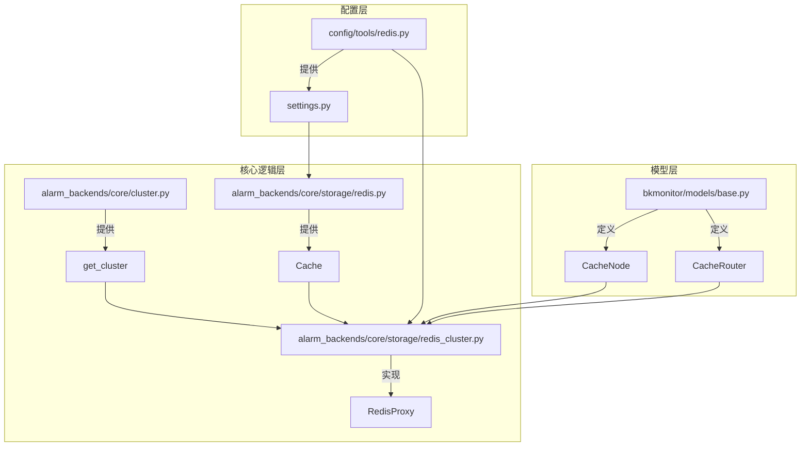
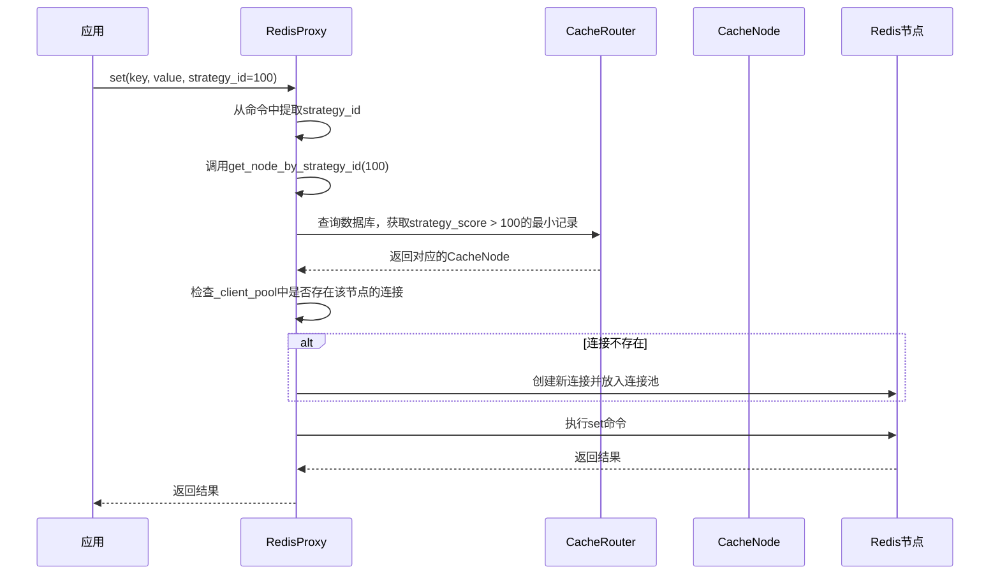
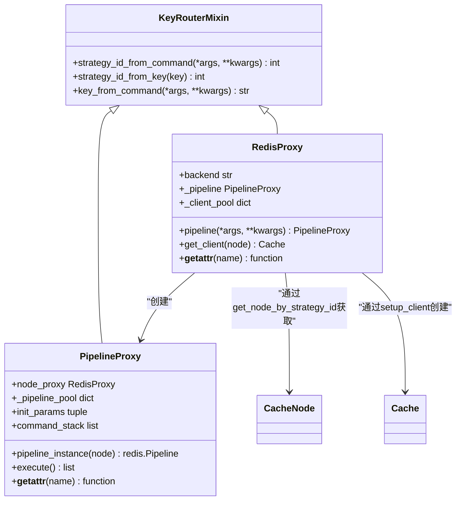
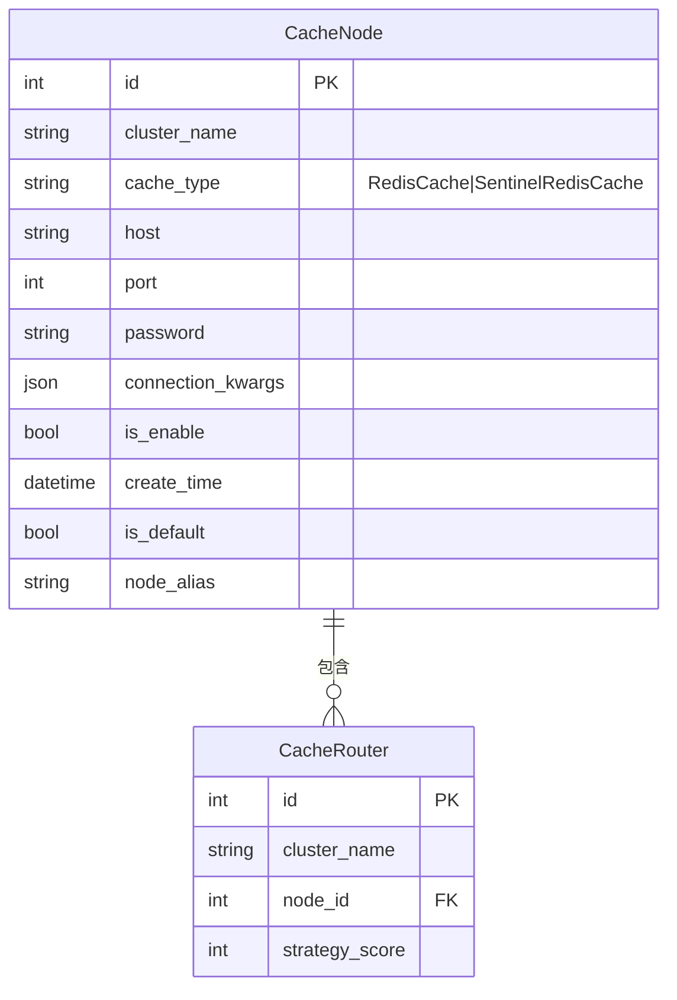
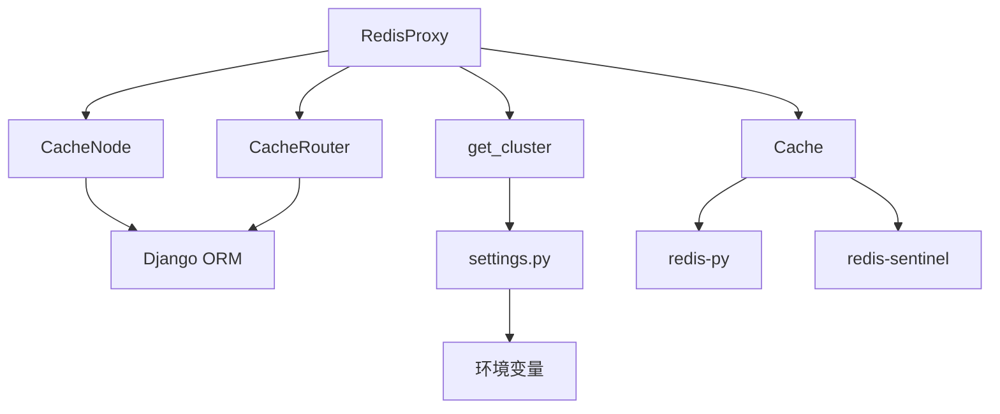

# Redis集群架构

<cite>
**本文档引用的文件**   
- [redis_cluster.py](file://bkmonitor/alarm_backends/core/storage/redis_cluster.py)
- [base.py](file://bkmonitor/bkmonitor/models/base.py)
- [cluster.py](file://bkmonitor/alarm_backends/core/cluster.py)
- [redis.py](file://bkmonitor/alarm_backends/core/storage/redis.py)
- [redis.py](file://bkmonitor/config/tools/redis.py)
- [settings.py](file://bkmonitor/settings.py)
</cite>

## 目录
1. [引言](#引言)
2. [项目结构](#项目结构)
3. [核心组件](#核心组件)
4. [架构概述](#架构概述)
5. [详细组件分析](#详细组件分析)
6. [依赖分析](#依赖分析)
7. [性能考虑](#性能考虑)
8. [故障排查指南](#故障排查指南)
9. [结论](#结论)

## 引言

蓝鲸监控平台的告警后端系统（alarm_backends）依赖Redis作为核心缓存组件，用于存储策略配置、异常检测结果和告警事件信息。随着业务规模的扩大，系统需要支持Redis集群以实现水平扩展。本系统并未采用TwemProxy或原生Redis Cluster模式，而是基于业务特性实现了客户端分片路由方案，通过策略ID（strategy_id）进行数据分片，确保了系统的可扩展性和灵活性。

## 项目结构

蓝鲸监控的代码库结构清晰，遵循模块化设计。与Redis集群相关的核心代码主要位于`bkmonitor/alarm_backends/core/storage/`目录下，特别是`redis_cluster.py`文件，它实现了客户端分片和路由的核心逻辑。集群节点和路由信息的管理则通过Django模型`CacheNode`和`CacheRouter`在`bkmonitor/models/base.py`中定义。配置信息分散在多个文件中，包括`config/tools/redis.py`中的环境变量读取和`settings.py`中的具体配置值。

**图源**
- [redis_cluster.py](file://bkmonitor/alarm_backends/core/storage/redis_cluster.py)
- [base.py](file://bkmonitor/bkmonitor/models/base.py)
- [cluster.py](file://bkmonitor/alarm_backends/core/cluster.py)
- [redis.py](file://bkmonitor/alarm_backends/core/storage/redis.py)
- [redis.py](file://bkmonitor/config/tools/redis.py)
- [settings.py](file://bkmonitor/settings.py)

**节源**
- [redis_cluster.py](file://bkmonitor/alarm_backends/core/storage/redis_cluster.py)
- [base.py](file://bkmonitor/bkmonitor/models/base.py)

## 核心组件

本系统的核心是`RedisProxy`类，它作为客户端与Redis集群之间的代理，实现了基于策略ID的分片路由、连接池管理和故障重试机制。`CacheNode`和`CacheRouter`模型负责在数据库中持久化集群节点信息和路由规则。`get_node_by_strategy_id`函数是路由逻辑的核心，它根据策略ID查询路由表，确定数据应存储在哪个Redis节点上。

**节源**
- [redis_cluster.py](file://bkmonitor/alarm_backends/core/storage/redis_cluster.py#L143-L225)
- [base.py](file://bkmonitor/bkmonitor/models/base.py#L917-L1028)

## 架构概述

系统采用客户端分片（Client-side Sharding）的架构。应用层不直接连接Redis，而是通过`RedisProxy`实例进行所有操作。当执行一个Redis命令时，`RedisProxy`会从命令参数中提取出`strategy_id`，然后调用`get_node_by_strategy_id(strategy_id)`来查询该ID应路由到的`CacheNode`。随后，`RedisProxy`会从内部的`_client_pool`连接池中获取或创建一个指向该节点的客户端连接，并执行命令。这种设计将分片逻辑完全放在客户端，避免了中间代理的性能开销。

**图源**
- [redis_cluster.py](file://bkmonitor/alarm_backends/core/storage/redis_cluster.py#L107-L141)
- [base.py](file://bkmonitor/bkmonitor/models/base.py#L941-L1028)

## 详细组件分析

### RedisProxy分析

`RedisProxy`是整个集群架构的核心，它继承自`KeyRouterMixin`，并利用Python的`__getattr__`魔术方法实现了对所有Redis命令的动态代理。

#### 类图

**图源**
- [redis_cluster.py](file://bkmonitor/alarm_backends/core/storage/redis_cluster.py#L107-L141)

**节源**
- [redis_cluster.py](file://bkmonitor/alarm_backends/core/storage/redis_cluster.py#L107-L141)

#### 动态代理机制
`RedisProxy`的`__getattr__`方法是其魔法所在。当应用调用`redis_proxy.set(...)`时，Python会查找`set`属性，由于`RedisProxy`类中没有定义`set`方法，因此会触发`__getattr__`。该方法返回一个闭包`handle`，`handle`函数内部会：
1.  调用`strategy_id_from_command`从命令参数中提取`strategy_id`。
2.  调用`get_node_by_strategy_id(strategy_id)`获取目标`CacheNode`。
3.  调用`get_client(node)`从连接池中获取或创建一个`Cache`客户端实例。
4.  获取该客户端实例上的`set`命令，并执行它。
5.  在执行过程中，如果遇到`ConnectionError`，会尝试刷新连接并重试最多3次。

这使得`RedisProxy`实例可以像一个普通的Redis客户端一样被使用，但其背后隐藏了复杂的路由和容错逻辑。

### CacheNode与CacheRouter模型分析

`CacheNode`和`CacheRouter`是Django模型，用于在数据库中管理集群的元数据。

#### 数据模型图

**图源**
- [base.py](file://bkmonitor/bkmonitor/models/base.py#L838-L938)

**节源**
- [base.py](file://bkmonitor/bkmonitor/models/base.py#L838-L938)

`CacheNode`代表一个物理的Redis节点，可以是单例模式（`RedisCache`）或哨兵模式（`SentinelRedisCache`）。`CacheRouter`表则定义了分片规则，`strategy_score`字段是一个分界点。例如，如果路由表中有记录`strategy_score=100`指向`nodeA`，`strategy_score=200`指向`nodeB`，那么`strategy_id`在`[0, 100)`范围内的数据会路由到`nodeA`，在`[100, 200)`范围内的数据会路由到`nodeB`。

`add_router`方法用于添加或修改路由规则。它会清理指定分数区间内的旧规则，并创建新的规则，最后调用`optimize_router`合并相邻且指向同一节点的区间，以保持路由表的简洁。

## 依赖分析

系统内部依赖关系清晰。`RedisProxy`依赖于`CacheNode`和`CacheRouter`模型来获取路由信息，依赖于`get_cluster()`函数来确定当前集群名称。`CacheNode`和`CacheRouter`又依赖于Django的ORM和数据库。外部依赖包括`redis-py`库用于连接Redis，`redis-sentinel`用于哨兵模式，以及`kombu`用于URL解析。配置依赖于`settings.py`和环境变量。

**图源**
- [redis_cluster.py](file://bkmonitor/alarm_backends/core/storage/redis_cluster.py)
- [base.py](file://bkmonitor/bkmonitor/models/base.py)
- [cluster.py](file://bkmonitor/alarm_backends/core/cluster.py)
- [redis.py](file://bkmonitor/alarm_backends/core/storage/redis.py)

**节源**
- [redis_cluster.py](file://bkmonitor/alarm_backends/core/storage/redis_cluster.py)
- [base.py](file://bkmonitor/bkmonitor/models/base.py)

## 性能考虑

该架构的性能优势在于去除了中间代理，客户端直接连接后端Redis，减少了网络跳数。连接池（`_client_pool`）复用了与各个Redis节点的连接，避免了频繁建立和断开连接的开销。`__getattr__`的动态代理虽然引入了少量函数调用开销，但相对于网络I/O来说可以忽略不计。

潜在的性能瓶颈在于`get_node_by_strategy_id`函数。该函数在首次调用时会查询数据库并缓存路由表（`STRATEGY_ROUTER_CACHE`），后续调用会优先使用内存缓存，这大大减少了数据库查询压力。然而，如果路由表非常大，全量加载到内存可能会占用较多内存。此外，`strategy_id`的分布如果非常不均匀，可能导致某些Redis节点负载过高。

## 故障排查指南

*   **连接失败**：检查`CacheNode`表中的`host`和`port`是否正确，确认Redis服务是否正常运行。检查`connection_kwargs`中的`master_name`和`sentinel_password`（如果是哨兵模式）是否正确。
*   **数据路由错误**：检查`CacheRouter`表中的`strategy_score`设置是否正确。确保`strategy_id`的提取逻辑（`key_from_command`）能正确从键名或参数中获取ID。
*   **性能下降**：使用`CacheRouter.list_router()` API检查路由表是否过于复杂或存在大量冗余记录。检查各个Redis节点的负载是否均衡。监控连接池的大小和使用情况。
*   **默认节点未创建**：检查`CacheNode.default_node()`方法的逻辑，确保`settings.CACHE_BACKEND_TYPE`, `REDIS_HOST`, `REDIS_PORT`, `REDIS_PASSWD`等配置正确。该方法在首次调用时会创建默认节点。

**节源**
- [redis_cluster.py](file://bkmonitor/alarm_backends/core/storage/redis_cluster.py#L143-L225)
- [base.py](file://bkmonitor/bkmonitor/models/base.py#L838-L938)

## 结论

蓝鲸监控平台的Redis集群架构采用了一种务实的客户端分片方案。它通过`RedisProxy`、`CacheNode`和`CacheRouter`三个核心组件，实现了灵活、可扩展且易于管理的缓存集群。该方案避免了引入额外中间件的复杂性，将分片逻辑内聚在应用代码中，同时通过连接池和内存缓存优化了性能。其基于策略ID的路由规则简单明了，非常适合监控系统中按策略划分数据的业务场景。整体设计体现了对业务需求的深刻理解和对技术选型的权衡。