# 缓存策略机制

<cite>
**本文档引用文件**  
- [base.py](file://bkmonitor/alarm_backends/core/cache/base.py)
- [action_config.py](file://bkmonitor/alarm_backends/core/cache/action_config.py)
- [assign.py](file://bkmonitor/alarm_backends/core/cache/assign.py)
- [bcs_cluster.py](file://bkmonitor/alarm_backends/core/cache/bcs_cluster.py)
- [calendar.py](file://bkmonitor/alarm_backends/core/cache/calendar.py)
- [cmdb/base.py](file://bkmonitor/alarm_backends/core/cache/cmdb/base.py)
- [cmdb/business.py](file://bkmonitor/alarm_backends/core/cache/cmdb/business.py)
- [cmdb/dynamic_group.py](file://bkmonitor/alarm_backends/core/cache/cmdb/dynamic_group.py)
- [cmdb/host.py](file://bkmonitor/alarm_backends/core/cache/cmdb/host.py)
- [cmdb/module.py](file://bkmonitor/alarm_backends/core/cache/cmdb/module.py)
- [cmdb/service_instance.py](file://bkmonitor/alarm_backends/core/cache/cmdb/service_instance.py)
- [cmdb/service_template.py](file://bkmonitor/alarm_backends/core/cache/cmdb/service_template.py)
- [cmdb/set.py](file://bkmonitor/alarm_backends/core/cache/cmdb/set.py)
- [cmdb/set_template.py](file://bkmonitor/alarm_backends/core/cache/cmdb/set_template.py)
- [api_cache/__init__.py](file://bkmonitor/alarm_backends/core/api_cache/__init__.py)
- [api_cache/library.py](file://bkmonitor/alarm_backends/core/api_cache/library.py)
- [api_cache/log_search.py](file://bkmonitor/alarm_backends/core/api_cache/log_search.py)
- [api_cache/metadata.py](file://bkmonitor/alarm_backends/core/api_cache/metadata.py)
- [cache.py](file://bkmonitor/bkmonitor/utils/cache.py)
</cite>

## 目录
1. [引言](#引言)
2. [项目结构分析](#项目结构分析)
3. [核心缓存组件](#核心缓存组件)
4. [缓存架构概览](#缓存架构概览)
5. [详细组件分析](#详细组件分析)
6. [缓存更新与失效策略](#缓存更新与失效策略)
7. [缓存预热机制](#缓存预热机制)
8. [缓存一致性保证](#缓存一致性保证)
9. [缓存防护措施](#缓存防护措施)
10. [缓存监控与性能](#缓存监控与性能)
11. [内存管理与容量规划](#内存管理与容量规划)
12. [性能基准测试与优化建议](#性能基准测试与优化建议)

## 引言
本技术文档全面阐述了监控系统中的缓存策略机制。系统采用分层缓存架构，通过Redis实现分布式缓存，针对不同业务场景设计了专用的缓存管理类。文档详细说明了缓存的更新、失效、预热策略，以及与数据库的一致性保证机制。同时，文档还涵盖了缓存穿透、雪崩、击穿的防护措施，提供了缓存命中率监控方案和内存管理策略。

## 项目结构分析
系统缓存机制主要分布在`alarm_backends/core/cache`和`alarm_backends/core/api_cache`两个目录中。前者负责业务数据缓存，后者负责API调用结果缓存。缓存实现遵循分层设计原则，通过基类`BaseCache`提供通用缓存功能，各业务模块继承基类实现特定缓存逻辑。

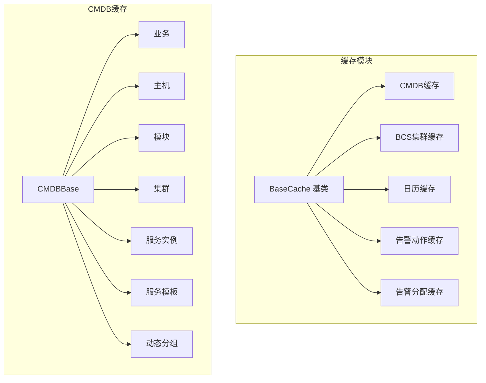

**图示来源**
- [base.py](file://bkmonitor/alarm_backends/core/cache/base.py)
- [cmdb/base.py](file://bkmonitor/alarm_backends/core/cache/cmdb/base.py)

**本节来源**
- [base.py](file://bkmonitor/alarm_backends/core/cache/base.py)
- [cmdb/base.py](file://bkmonitor/alarm_backends/core/cache/cmdb/base.py)

## 核心缓存组件
系统实现了多个专用缓存组件，每个组件针对特定业务场景进行优化。核心组件包括CMDB缓存、BCS集群缓存、告警动作配置缓存等。这些组件均继承自`BaseCache`基类，遵循统一的缓存管理规范。

**本节来源**
- [base.py](file://bkmonitor/alarm_backends/core/cache/base.py)
- [action_config.py](file://bkmonitor/alarm_backends/core/cache/action_config.py)
- [bcs_cluster.py](file://bkmonitor/alarm_backends/core/cache/bcs_cluster.py)

## 缓存架构概览
系统采用多级缓存架构，结合本地缓存和分布式缓存。API缓存层位于最上层，用于缓存外部API调用结果；业务缓存层位于中间，存储核心业务数据；数据库位于底层，作为最终数据源。缓存键设计遵循统一命名规范，确保缓存键的唯一性和可读性。

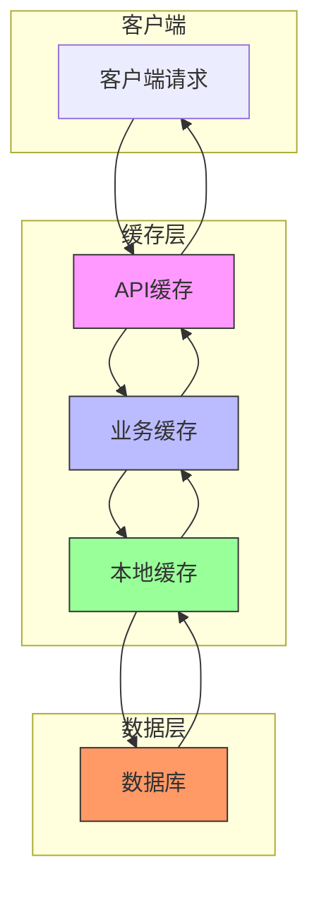

**图示来源**
- [api_cache/__init__.py](file://bkmonitor/alarm_backends/core/api_cache/__init__.py)
- [base.py](file://bkmonitor/alarm_backends/core/cache/base.py)

## 详细组件分析

### 缓存基类分析
`BaseCache`类提供了缓存操作的通用方法，包括获取、设置、删除缓存等。该类通过抽象方法定义了缓存数据的加载逻辑，由子类具体实现。

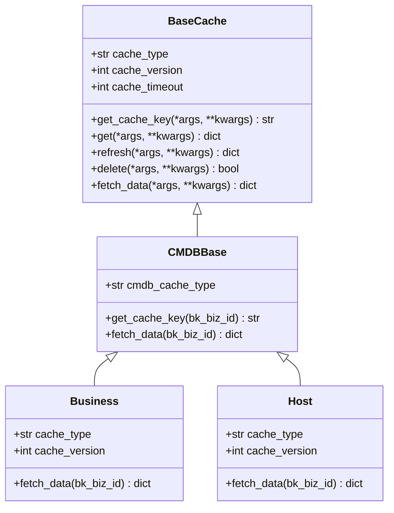

**图示来源**
- [base.py](file://bkmonitor/alarm_backends/core/cache/base.py)
- [cmdb/base.py](file://bkmonitor/alarm_backends/core/cache/cmdb/base.py)
- [cmdb/business.py](file://bkmonitor/alarm_backends/core/cache/cmdb/business.py)
- [cmdb/host.py](file://bkmonitor/alarm_backends/core/cache/cmdb/host.py)

**本节来源**
- [base.py](file://bkmonitor/alarm_backends/core/cache/base.py)
- [cmdb/base.py](file://bkmonitor/alarm_backends/core/cache/cmdb/base.py)

### API缓存分析
API缓存模块专门用于缓存外部API调用结果，减少对第三方服务的重复请求。不同API类型有各自的缓存实现，如日志搜索API缓存、元数据API缓存等。

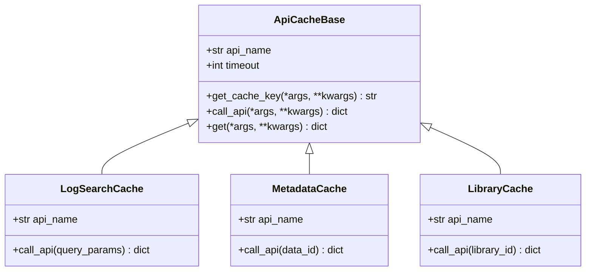

**图示来源**
- [api_cache/__init__.py](file://bkmonitor/alarm_backends/core/api_cache/__init__.py)
- [api_cache/log_search.py](file://bkmonitor/alarm_backends/core/api_cache/log_search.py)
- [api_cache/metadata.py](file://bkmonitor/alarm_backends/core/api_cache/metadata.py)
- [api_cache/library.py](file://bkmonitor/alarm_backends/core/api_cache/library.py)

**本节来源**
- [api_cache/__init__.py](file://bkmonitor/alarm_backends/core/api_cache/__init__.py)
- [api_cache/log_search.py](file://bkmonitor/alarm_backends/core/api_cache/log_search.py)

## 缓存更新与失效策略
系统采用主动更新与被动失效相结合的策略。缓存数据在首次访问时加载，并设置合理的过期时间。当底层数据发生变化时，通过事件驱动机制主动清除相关缓存。

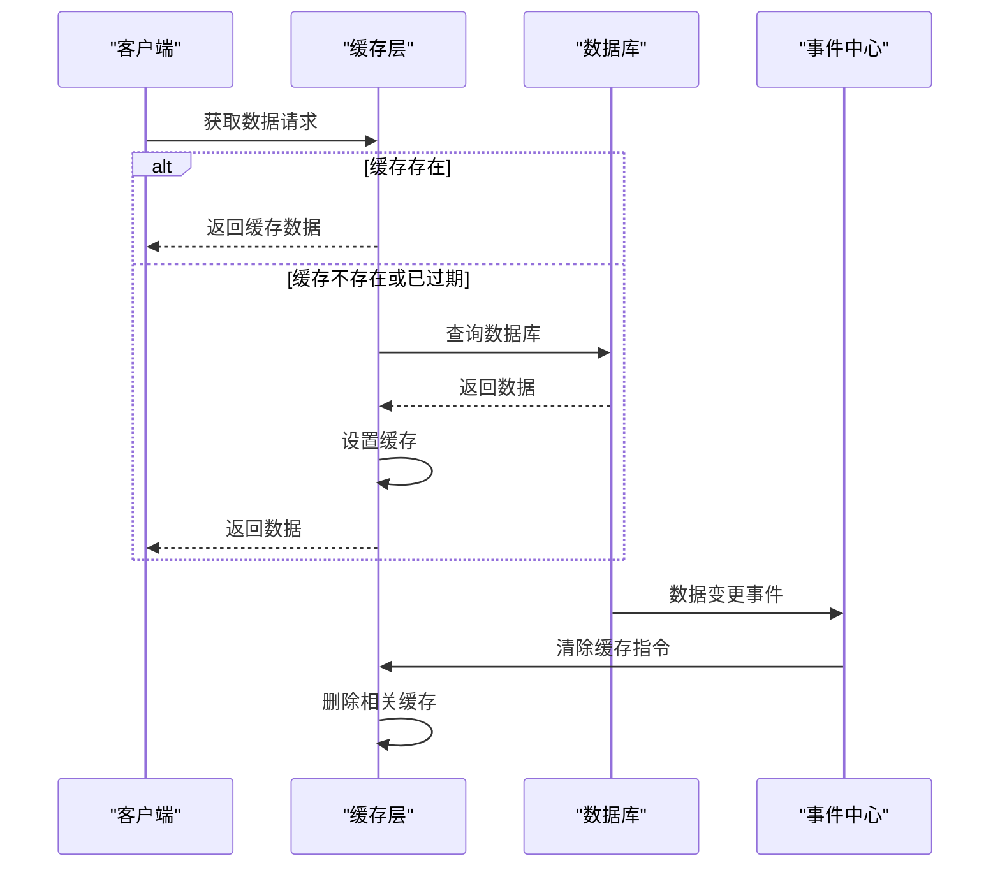

**图示来源**
- [base.py](file://bkmonitor/alarm_backends/core/cache/base.py)
- [cache.py](file://bkmonitor/bkmonitor/utils/cache.py)

**本节来源**
- [base.py](file://bkmonitor/alarm_backends/core/cache/base.py)
- [cache.py](file://bkmonitor/bkmonitor/utils/cache.py)

## 缓存预热机制
系统在服务启动时执行缓存预热，提前加载高频访问的数据到缓存中。预热过程通过后台任务异步执行，避免影响服务启动速度。

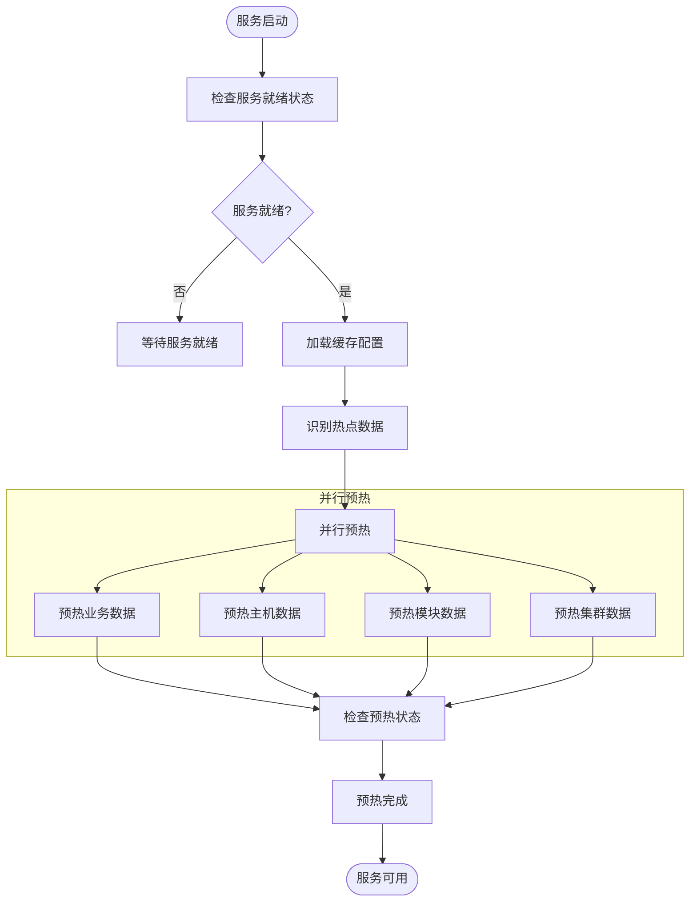

**图示来源**
- [base.py](file://bkmonitor/alarm_backends/core/cache/base.py)
- [cmdb/business.py](file://bkmonitor/alarm_backends/core/cache/cmdb/business.py)
- [cmdb/host.py](file://bkmonitor/alarm_backends/core/cache/cmdb/host.py)

## 缓存一致性保证
系统通过多种机制保证缓存与数据库的一致性。主要策略包括：写后失效（Write-Through）、读时校验（Read-Validate）和定时同步。

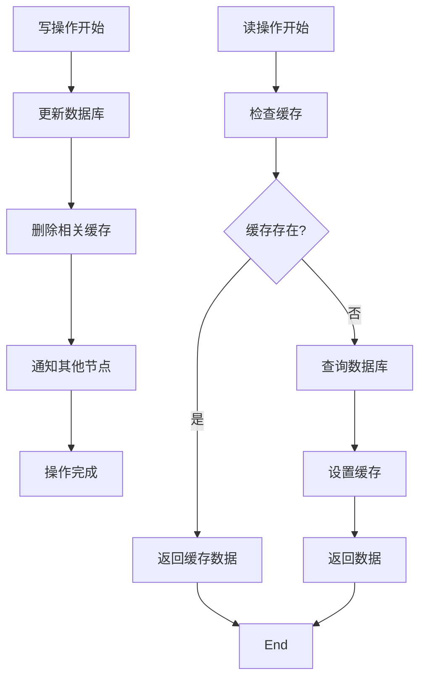

**图示来源**
- [base.py](file://bkmonitor/alarm_backends/core/cache/base.py)
- [cache.py](file://bkmonitor/bkmonitor/utils/cache.py)

## 缓存防护措施
系统实现了完整的缓存防护机制，有效应对缓存穿透、雪崩和击穿问题。

### 缓存穿透防护
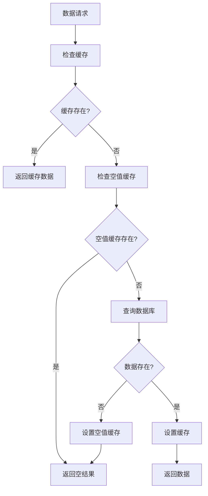

### 缓存雪崩防护
系统采用差异化过期时间策略，避免大量缓存同时失效。缓存过期时间在基础值上增加随机偏移。

### 缓存击穿防护
对热点数据采用互斥锁机制，当缓存失效时，只允许一个线程重新加载数据，其他线程等待。

**图示来源**
- [base.py](file://bkmonitor/alarm_backends/core/cache/base.py)
- [cache.py](file://bkmonitor/bkmonitor/utils/cache.py)

**本节来源**
- [base.py](file://bkmonitor/alarm_backends/core/cache/base.py)
- [cache.py](file://bkmonitor/bkmonitor/utils/cache.py)

## 缓存监控与性能
系统提供了完善的缓存监控机制，包括命中率统计、访问延迟监控和缓存大小监控。

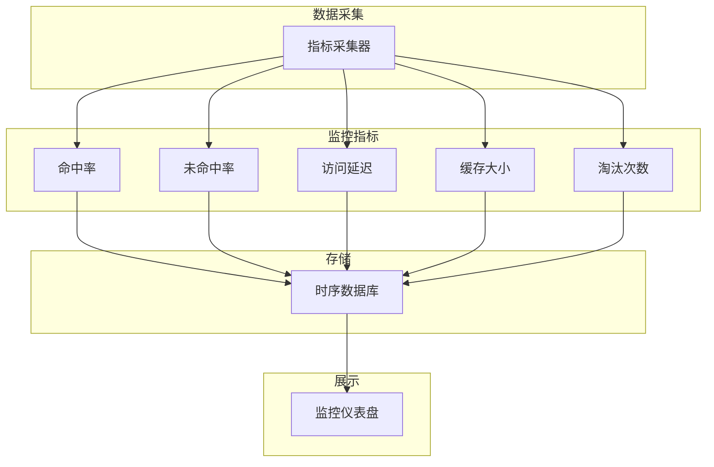

**图示来源**
- [utils/cache.py](file://bkmonitor/bkmonitor/utils/cache.py)
- [core/prometheus/metrics.py](file://bkmonitor/core/prometheus/metrics.py)

## 内存管理与容量规划
系统采用分层内存管理策略，根据数据的重要性和访问频率分配不同的缓存策略。容量规划基于历史访问模式和业务增长预测。

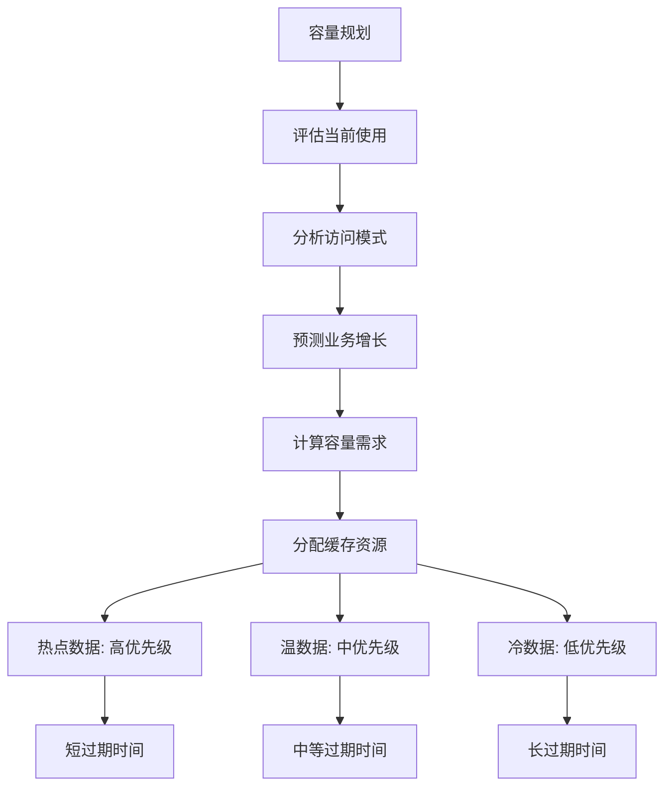

**图示来源**
- [config/redis.py](file://bkmonitor/config/tools/redis.py)
- [utils/cache.py](file://bkmonitor/bkmonitor/utils/cache.py)

## 性能基准测试与优化建议
系统定期进行缓存性能基准测试，评估不同场景下的缓存表现。优化建议包括：合理设置过期时间、优化缓存键设计、实施缓存分片等。

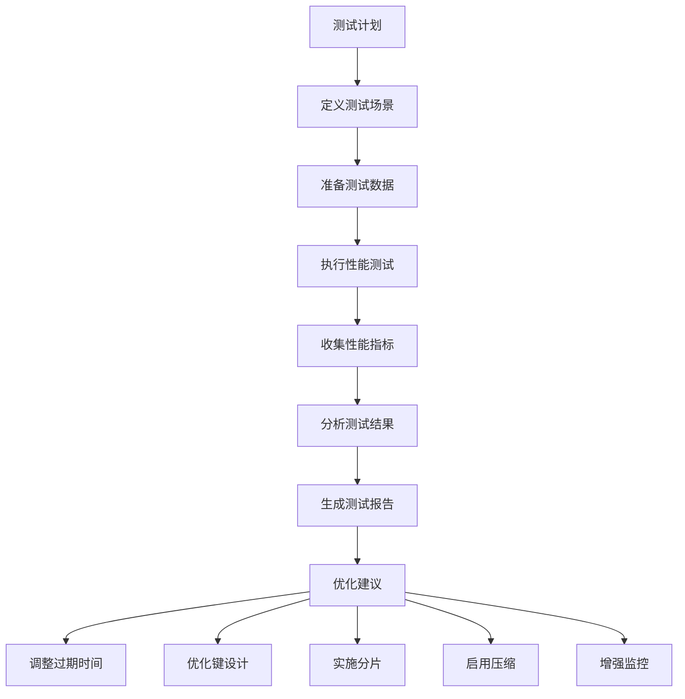

**图示来源**
- [tests/test_cache.py](file://bkmonitor/alarm_backends/tests/core/test_cache.py)
- [utils/cache.py](file://bkmonitor/bkmonitor/utils/cache.py)