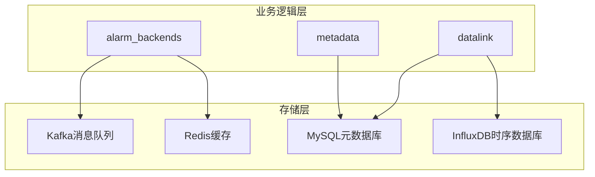
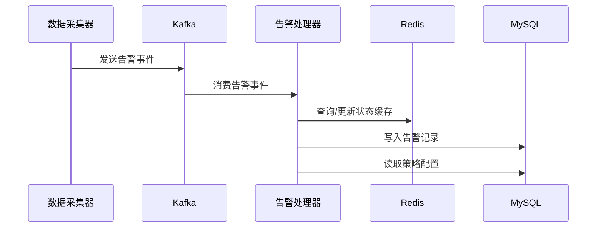
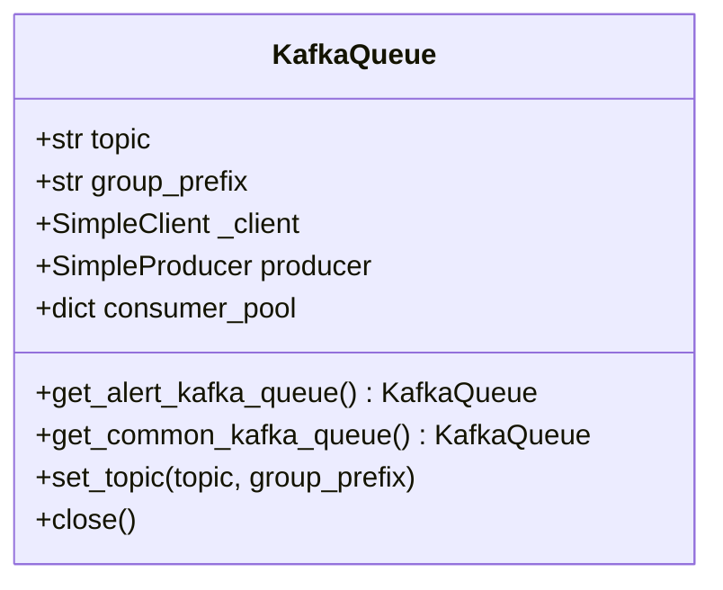
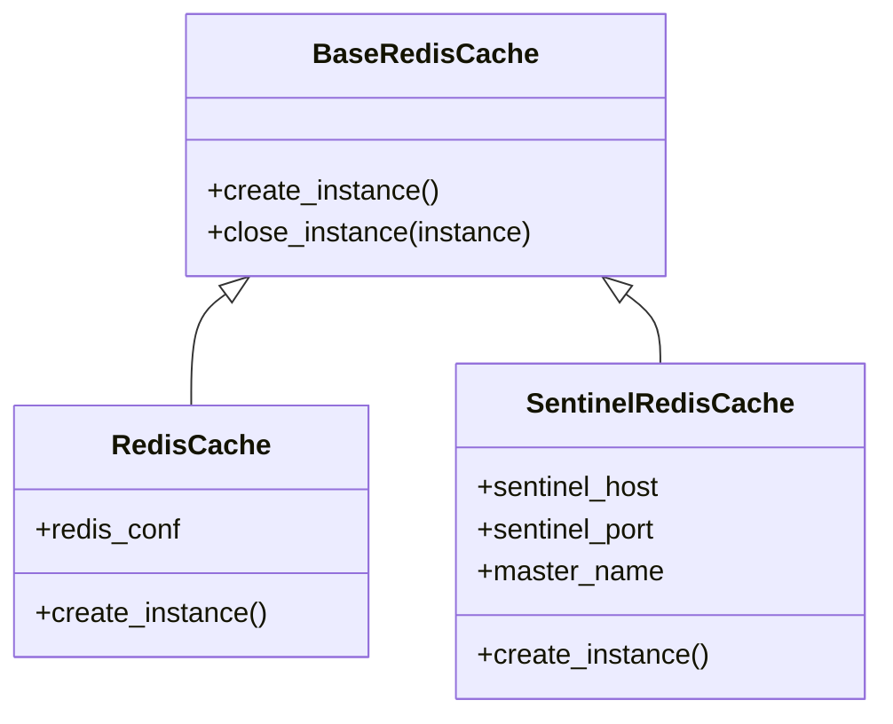
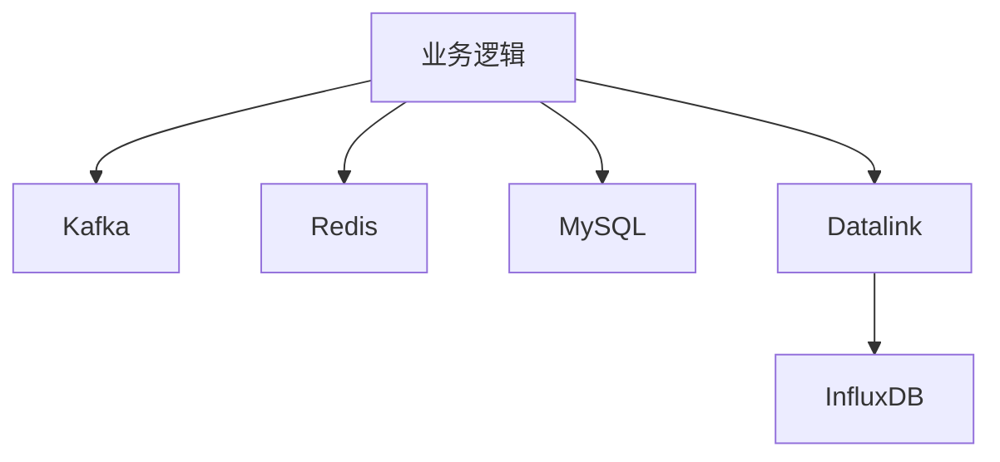

# 存储架构

<cite>
**本文档引用的文件**   
- [storage.py](file://bkmonitor/packages/monitor_web/datalink/storage.py)
- [kafka.py](file://bkmonitor/alarm_backends/core/storage/kafka.py)
- [redis.py](file://bkmonitor/alarm_backends/core/storage/redis.py)
- [redis_client.py](file://bkmonitor/packages/utils/redis_client.py)
- [storage.py](file://bkmonitor/metadata/models/storage.py)
- [init_data.json](file://bkmonitor/metadata/data/init_data.json)
</cite>

## 目录
1. [引言](#引言)
2. [项目结构](#项目结构)
3. [核心组件](#核心组件)
4. [架构概述](#架构概述)
5. [详细组件分析](#详细组件分析)
6. [依赖分析](#依赖分析)
7. [性能考虑](#性能考虑)
8. [故障排除指南](#故障排除指南)
9. [结论](#结论)

## 引言
本文档旨在深入分析“bk-monitor”项目的存储架构，重点探讨其多级存储设计、数据流转机制以及关键技术实现。系统采用Kafka作为告警数据的消息队列，利用Redis实现高性能缓存，并通过MySQL管理元数据。时序数据则主要存储于InfluxDB中。文档将详细解析各存储组件的使用场景、数据结构设计及优化策略。

## 项目结构
项目采用模块化设计，核心存储逻辑分散在多个子目录中。`alarm_backends`模块负责告警数据的处理与存储，`metadata`模块管理数据源和结果表的元信息，`packages/monitor_web/datalink`包含通用的存储接口实现。

**Diagram sources**
- [storage.py](file://bkmonitor/packages/monitor_web/datalink/storage.py)
- [kafka.py](file://bkmonitor/alarm_backends/core/storage/kafka.py)
- [redis.py](file://bkmonitor/alarm_backends/core/storage/redis.py)

**Section sources**
- [project_structure](file://workspace)

## 核心组件
系统的核心存储组件包括Kafka、Redis、MySQL和InfluxDB。Kafka用于解耦告警数据的生产与消费；Redis用于缓存热点数据和实现延迟队列；MySQL用于持久化存储配置和元数据；InfluxDB则专门用于高效存储和查询海量时序监控数据。

**Section sources**
- [kafka.py](file://bkmonitor/alarm_backends/core/storage/kafka.py)
- [redis.py](file://bkmonitor/alarm_backends/core/storage/redis.py)
- [storage.py](file://bkmonitor/metadata/models/storage.py)

## 架构概述
系统的数据流始于监控数据的采集，经过处理后，告警事件被发送至Kafka。告警处理后端从Kafka消费数据，利用Redis进行状态缓存和去重，最终将告警记录和策略配置等元数据持久化到MySQL。原始监控指标则通过独立的数据链路写入InfluxDB。

**Diagram sources**
- [kafka.py](file://bkmonitor/alarm_backends/core/storage/kafka.py)
- [redis.py](file://bkmonitor/alarm_backends/core/storage/redis.py)

## 详细组件分析

### Kafka消息队列分析
Kafka在系统中扮演着关键的解耦和削峰角色。告警数据首先被生产者发送到名为`alert`的Topic，消费者组`alert_processor`负责消费这些数据。这种设计保证了告警处理的高吞吐量和可靠性。

**Diagram sources**
- [kafka.py](file://bkmonitor/alarm_backends/core/storage/kafka.py#L30-L67)

**Section sources**
- [kafka.py](file://bkmonitor/alarm_backends/core/storage/kafka.py)

### Redis缓存分析
Redis被用于多种场景，包括缓存、延迟队列和分布式锁。系统通过`RedisCache`和`SentinelRedisCache`类封装了Redis客户端，支持主从和哨兵模式。延迟队列通过`zset`数据结构实现，利用分数（score）来标识任务的执行时间。

**Diagram sources**
- [redis.py](file://bkmonitor/alarm_backends/core/storage/redis.py#L201-L269)

**Section sources**
- [redis.py](file://bkmonitor/alarm_backends/core/storage/redis.py)
- [redis_client.py](file://bkmonitor/packages/utils/redis_client.py)

### MySQL关系型数据库分析
MySQL主要用于存储系统的元数据和配置信息。例如，`ClusterInfo`表存储了Redis和InfluxDB等存储集群的配置，`ResultTable`表则定义了结果表的Schema。通过`init_data.json`文件初始化了如MySQL、Redis等数据库的监控指标表结构。

**Section sources**
- [storage.py](file://bkmonitor/metadata/models/storage.py)
- [init_data.json](file://bkmonitor/metadata/data/init_data.json)

## 依赖分析
系统各存储组件之间存在明确的依赖关系。业务逻辑层依赖于Kafka进行异步通信，依赖于Redis进行快速状态查询，依赖于MySQL进行持久化配置管理。数据存储层（如InfluxDB）则通过独立的`datalink`模块进行访问。

**Diagram sources**
- [project_structure](file://workspace)

## 性能考虑
为保证系统性能，采用了多项优化策略：使用Kafka实现异步解耦，避免处理阻塞；利用Redis缓存频繁访问的数据，减少数据库压力；对MySQL的元数据表建立合适的索引；对时序数据采用专门的InfluxDB进行存储，以获得高效的写入和查询性能。

## 故障排除指南
常见问题包括Kafka连接超时、Redis内存溢出和MySQL连接池耗尽。应监控各组件的健康状态，如Kafka的消费者延迟、Redis的内存使用率和连接数、MySQL的慢查询日志等。

**Section sources**
- [metrics.py](file://bkmonitor/core/prometheus/metrics.py)

## 结论
该系统的存储架构设计合理，充分利用了不同存储技术的优势。通过Kafka、Redis、MySQL和InfluxDB的组合，实现了高可用、高性能和可扩展的监控数据存储与处理能力。未来可考虑引入数据分片和归档策略以应对数据量的持续增长。