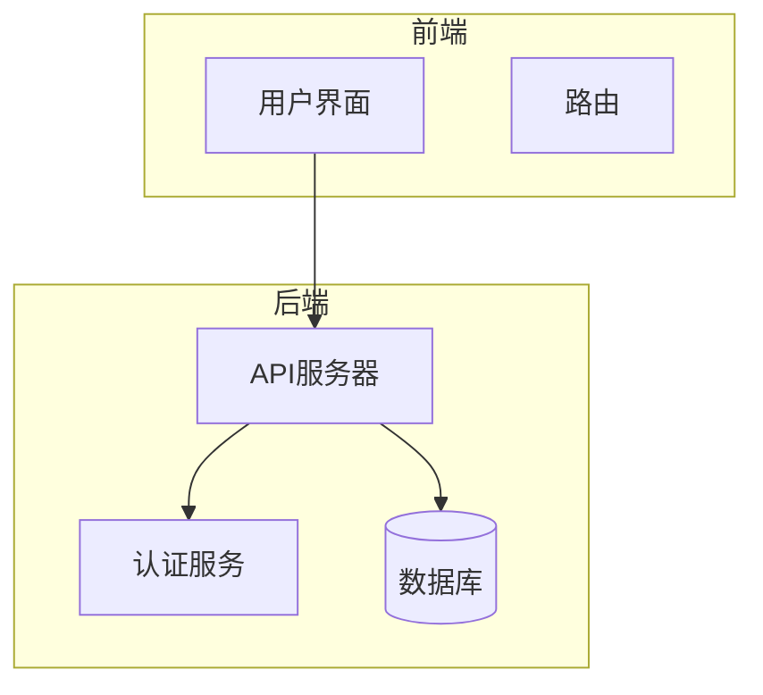
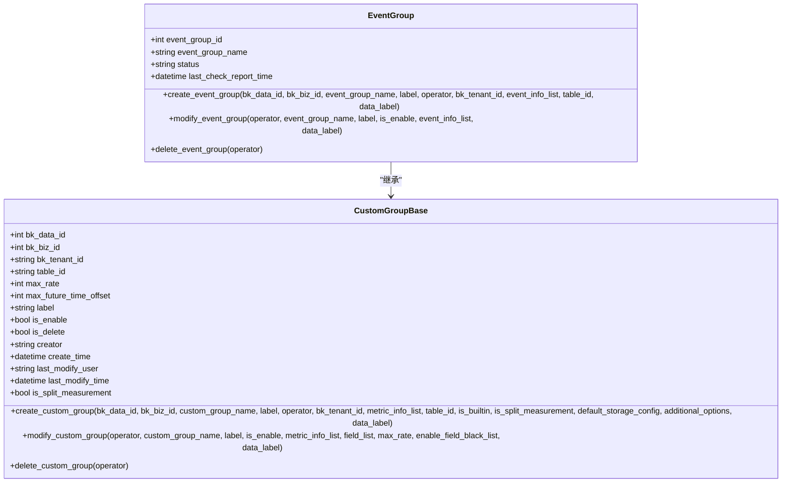
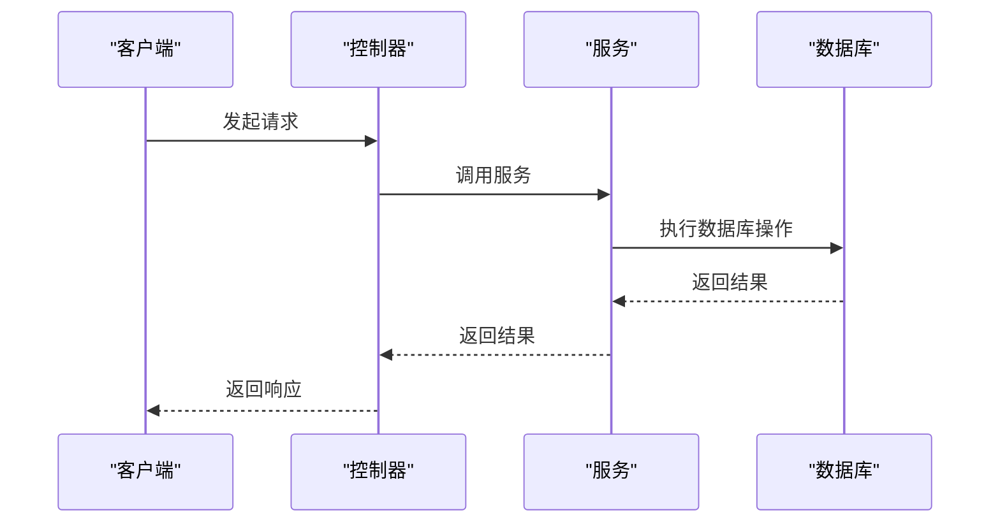

# 事务管理

<cite>
**本文档引用的文件**   
- [db_routers.py](file://bkmonitor/bkmonitor/db_routers.py#L1-L143)
- [event.py](file://bkmonitor/metadata/models/custom_report/event.py#L1-L505)
- [base.py](file://bkmonitor/metadata/models/custom_report/base.py#L1-L523)
</cite>

## 目录
1. [简介](#简介)
2. [项目结构](#项目结构)
3. [核心组件](#核心组件)
4. [架构概述](#架构概述)
5. [详细组件分析](#详细组件分析)
6. [依赖分析](#依赖分析)
7. [性能考虑](#性能考虑)
8. [故障排除指南](#故障排除指南)
9. [结论](#结论)

## 简介
本文档深入解析了蓝鲸监控平台中的事务管理机制，重点阐述了数据库事务的ACID特性实现、事务隔离级别的选择、分布式事务处理机制（如两阶段提交）、锁机制的应用场景及死锁预防策略。同时，文档还提供了事务边界控制的最佳实践，以及异常情况下的回滚和恢复机制。

## 项目结构
蓝鲸监控平台的项目结构遵循模块化设计原则，主要分为AI代理、监控后端、API接口、APM（应用性能监控）、元数据管理等多个模块。每个模块都有清晰的职责划分，通过Django框架实现MVC架构，确保了系统的可维护性和可扩展性。

## 核心组件
核心组件包括事务管理、分布式事务处理、锁机制、事务边界控制等。这些组件共同确保了系统在高并发环境下的数据一致性和完整性。

**Section sources**
- [db_routers.py](file://bkmonitor/bkmonitor/db_routers.py#L1-L143)
- [event.py](file://bkmonitor/metadata/models/custom_report/event.py#L1-L505)
- [base.py](file://bkmonitor/metadata/models/custom_report/base.py#L1-L523)

## 架构概述
系统采用微服务架构，各服务通过API进行通信。数据库层面使用MySQL作为主要存储，通过Django ORM进行数据操作。事务管理通过`@atomic`装饰器实现，确保了数据操作的原子性。

**Diagram sources**
- [db_routers.py](file://bkmonitor/bkmonitor/db_routers.py#L1-L143)

## 详细组件分析

### 事务管理分析
事务管理是确保数据一致性的关键。在蓝鲸监控平台中，事务管理主要通过Django的`@atomic`装饰器实现。

#### 事务边界控制
事务边界控制通过`@atomic`装饰器实现，确保了数据操作的原子性。例如，在创建事件组时，整个过程被包裹在一个事务中，确保了数据的一致性。

**Diagram sources**
- [event.py](file://bkmonitor/metadata/models/custom_report/event.py#L1-L505)
- [base.py](file://bkmonitor/metadata/models/custom_report/base.py#L1-L523)

#### 分布式事务处理
分布式事务处理通过数据库路由配置实现。`BackendRouter`类负责将读写操作路由到正确的数据库实例，确保了数据的一致性。

**Diagram sources**
- [db_routers.py](file://bkmonitor/bkmonitor/db_routers.py#L1-L143)

### 锁机制分析
锁机制用于防止并发操作导致的数据不一致。系统中使用了行锁、表锁和间隙锁等多种锁机制。

#### 行锁
行锁用于锁定特定的行，防止其他事务修改同一行数据。在高并发环境下，行锁可以有效减少锁冲突。

#### 表锁
表锁用于锁定整个表，防止其他事务对表进行修改。表锁通常用于批量操作，确保数据的一致性。

#### 间隙锁
间隙锁用于锁定索引之间的间隙，防止其他事务插入新的数据。间隙锁可以有效防止幻读现象。

**Section sources**
- [db_routers.py](file://bkmonitor/bkmonitor/db_routers.py#L1-L143)

## 依赖分析
系统中的各个组件通过明确的接口进行通信，减少了组件间的耦合度。通过Django的ORM和数据库路由配置，实现了数据访问的解耦。

**Diagram sources**
- [db_routers.py](file://bkmonitor/bkmonitor/db_routers.py#L1-L143)

## 性能考虑
在高并发环境下，事务管理和锁机制对系统性能有重要影响。通过合理选择事务隔离级别和锁机制，可以有效提升系统性能。

## 故障排除指南
当遇到事务相关的问题时，可以通过查看日志文件和数据库状态来定位问题。常见的问题包括死锁、事务超时等。

**Section sources**
- [event.py](file://bkmonitor/metadata/models/custom_report/event.py#L1-L505)
- [base.py](file://bkmonitor/metadata/models/custom_report/base.py#L1-L523)

## 结论
蓝鲸监控平台通过Django的`@atomic`装饰器和数据库路由配置，实现了高效的事务管理和分布式事务处理。通过合理的锁机制，确保了数据的一致性和完整性。在高并发环境下，系统表现出良好的性能和稳定性。