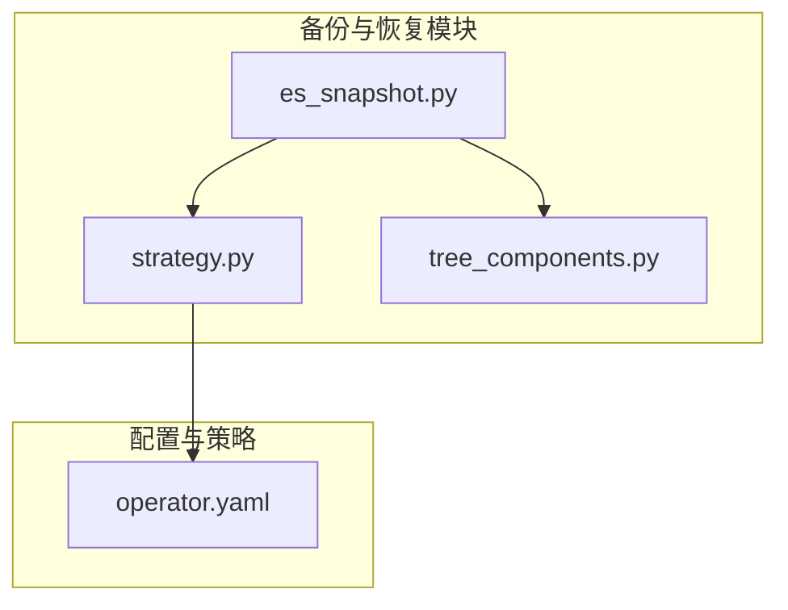
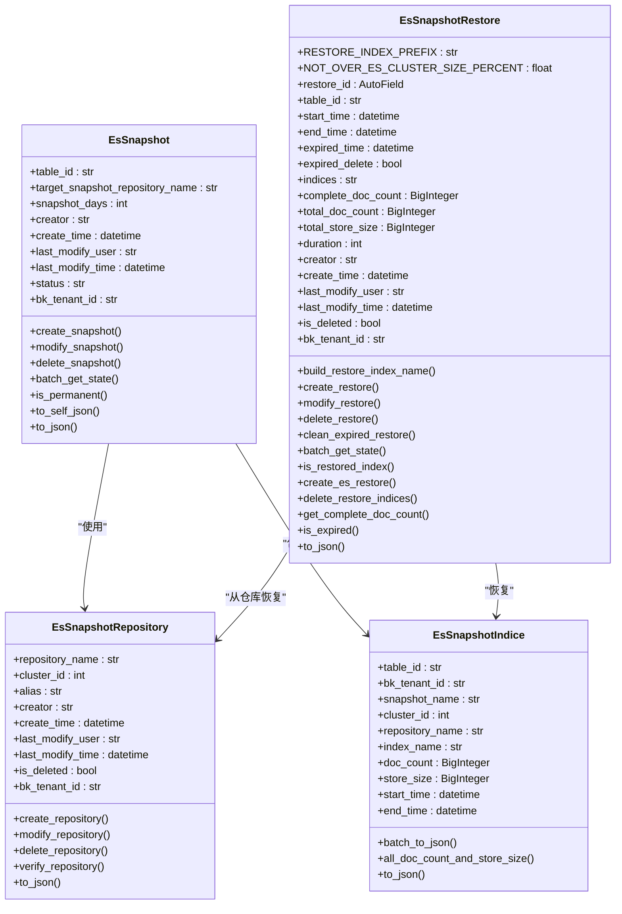
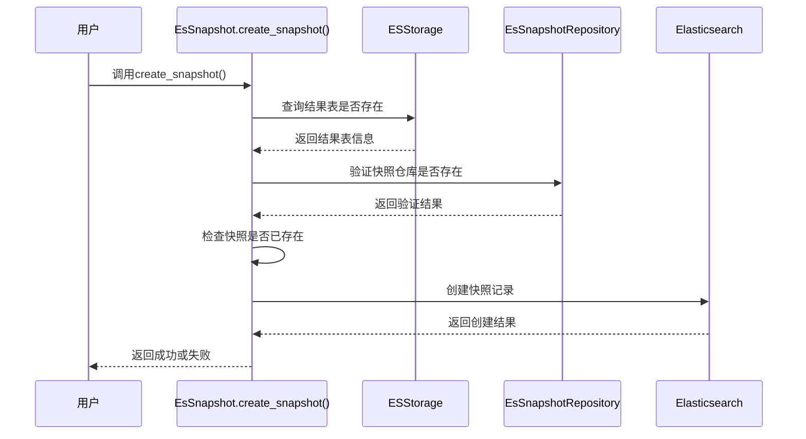
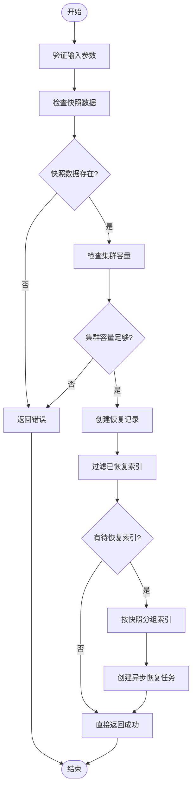
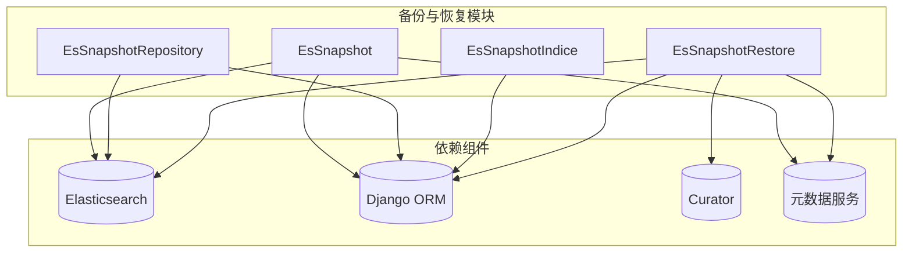

# 备份与恢复

<cite>
**本文档引用的文件**   
- [es_snapshot.py](file://bkmonitor\metadata\models\es_snapshot.py)
- [operator.yaml](file://bkmonitor\bkmonitor\as_code\tests\configs\notice\operator.yaml)
- [strategy.py](file://bkmonitor\bkmonitor\models\strategy.py)
- [tree_components.py](file://bkmonitor\packages\fta_web\fta_migrate\pipeline\tree_components.py)
</cite>

## 目录
1. [简介](#简介)
2. [项目结构](#项目结构)
3. [核心组件](#核心组件)
4. [架构概述](#架构概述)
5. [详细组件分析](#详细组件分析)
6. [依赖分析](#依赖分析)
7. [性能考虑](#性能考虑)
8. [故障排除指南](#故障排除指南)
9. [结论](#结论)

## 简介
本文档详细阐述了蓝鲸监控平台（BlueKing - Monitor）中的备份与恢复机制，重点围绕Elasticsearch数据的快照与恢复功能。文档涵盖了全量备份、增量备份和差异备份的策略选择，备份周期、存储位置和加密方式，以及如何验证备份完整性。同时描述了灾难恢复流程，包括数据还原步骤和时间窗口评估，并讨论了备份对系统性能的影响。

## 项目结构
项目结构显示了备份与恢复功能主要集中在`bkmonitor\metadata\models\es_snapshot.py`文件中，该文件定义了与Elasticsearch快照和恢复相关的数据模型和业务逻辑。其他相关配置分散在`strategy.py`和`tree_components.py`等文件中，用于定义备份策略和故障自愈流程。

**图示来源**
- [es_snapshot.py](file://bkmonitor\metadata\models\es_snapshot.py)
- [strategy.py](file://bkmonitor\bkmonitor\models\strategy.py)
- [tree_components.py](file://bkmonitor\packages\fta_web\fta_migrate\pipeline\tree_components.py)

**本节来源**
- [es_snapshot.py](file://bkmonitor\metadata\models\es_snapshot.py)
- [strategy.py](file://bkmonitor\bkmonitor\models\strategy.py)

## 核心组件
核心组件包括`EsSnapshot`、`EsSnapshotRepository`、`EsSnapshotIndice`和`EsSnapshotRestore`四个模型，它们共同实现了Elasticsearch数据的备份与恢复功能。

**本节来源**
- [es_snapshot.py](file://bkmonitor\metadata\models\es_snapshot.py)

## 架构概述
系统架构基于Django ORM和Elasticsearch Curator工具，通过定义数据模型来管理快照和恢复任务。`EsSnapshot`模型负责管理结果表的快照配置，`EsSnapshotRepository`模型管理快照仓库，`EsSnapshotIndice`模型记录物理索引的快照信息，`EsSnapshotRestore`模型则负责管理恢复任务。

**图示来源**
- [es_snapshot.py](file://bkmonitor\metadata\models\es_snapshot.py)

## 详细组件分析
### EsSnapshot模型分析
`EsSnapshot`模型是备份功能的核心，负责管理结果表的快照配置。它定义了快照的存储天数、目标快照仓库等属性，并提供了创建、修改和删除快照的方法。

#### 创建快照流程

**图示来源**
- [es_snapshot.py](file://bkmonitor\metadata\models\es_snapshot.py#L100-L150)

**本节来源**
- [es_snapshot.py](file://bkmonitor\metadata\models\es_snapshot.py)

### EsSnapshotRestore模型分析
`EsSnapshotRestore`模型是恢复功能的核心，负责管理恢复任务。它定义了恢复的时间范围、过期时间、索引列表等属性，并提供了创建、修改和删除恢复任务的方法。

#### 创建恢复任务流程

**图示来源**
- [es_snapshot.py](file://bkmonitor\metadata\models\es_snapshot.py#L400-L450)

**本节来源**
- [es_snapshot.py](file://bkmonitor\metadata\models\es_snapshot.py)

## 依赖分析
备份与恢复功能依赖于多个外部组件和内部模块。主要依赖包括Elasticsearch客户端、Django ORM、Curator工具以及元数据服务的其他模块。

**图示来源**
- [es_snapshot.py](file://bkmonitor\metadata\models\es_snapshot.py)

**本节来源**
- [es_snapshot.py](file://bkmonitor\metadata\models\es_snapshot.py)

## 性能考虑
备份与恢复操作对系统性能有显著影响。创建快照和恢复数据都是资源密集型操作，可能会影响Elasticsearch集群的性能。为减少对生产环境的影响，建议在低峰期执行备份操作，并使用异步任务处理恢复任务。

## 故障排除指南
### 常见问题
1. **快照创建失败**: 检查快照仓库配置是否正确，Elasticsearch集群是否有足够的磁盘空间。
2. **恢复任务失败**: 检查目标集群是否有足够的容量，恢复的索引是否与现有索引冲突。
3. **备份策略不生效**: 检查`strategy.py`中的备份配置是否正确，时间匹配逻辑是否符合预期。

**本节来源**
- [es_snapshot.py](file://bkmonitor\metadata\models\es_snapshot.py)
- [strategy.py](file://bkmonitor\bkmonitor\models\strategy.py)

## 结论
蓝鲸监控平台的备份与恢复功能通过`es_snapshot.py`文件中的四个核心模型实现，提供了完整的Elasticsearch数据保护解决方案。系统支持全量备份和基于时间范围的恢复，具有良好的可扩展性和可靠性。通过合理的策略配置和性能优化，可以有效保障监控数据的安全性和可用性。