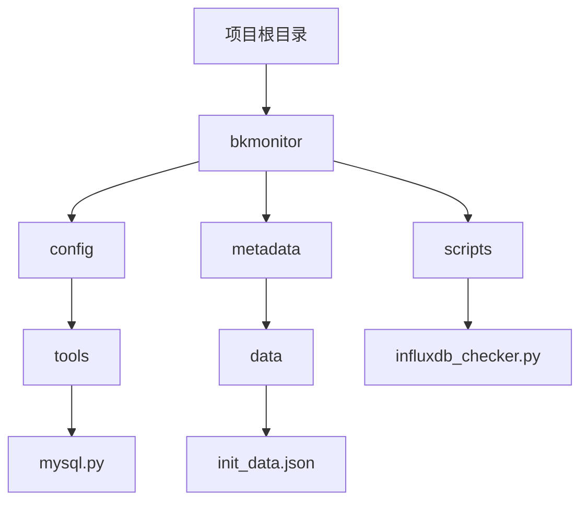
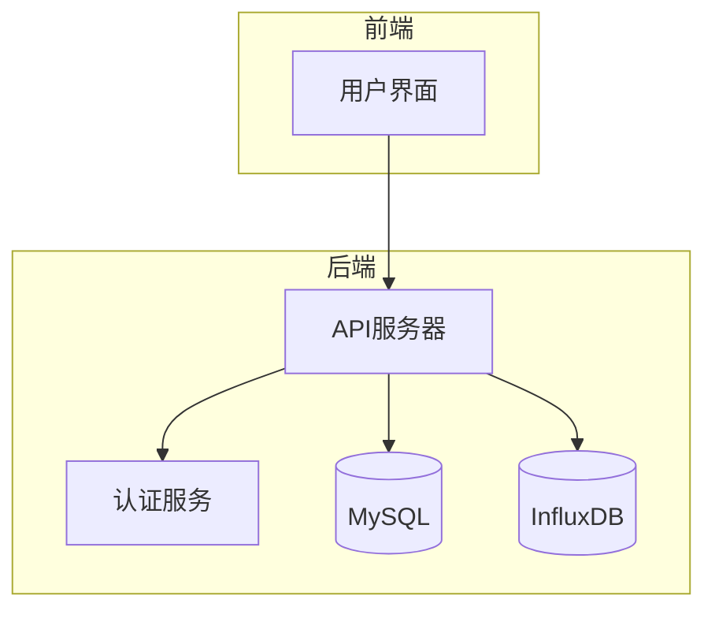
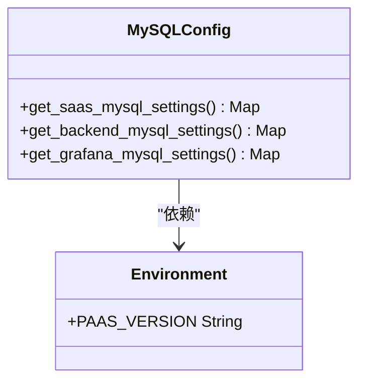
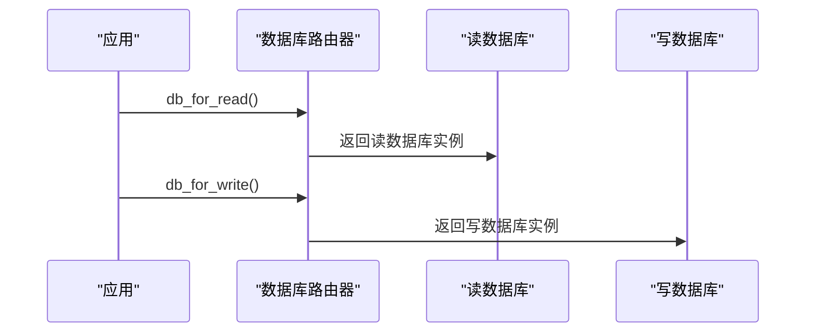
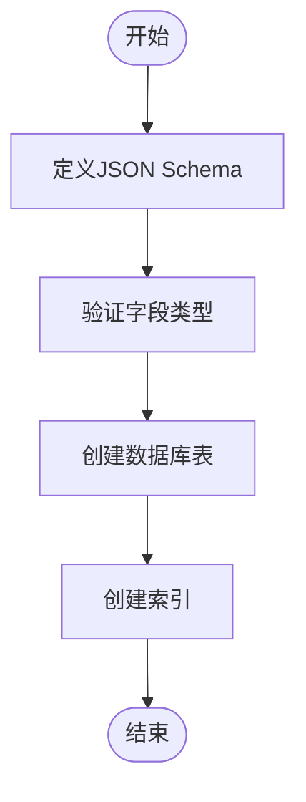
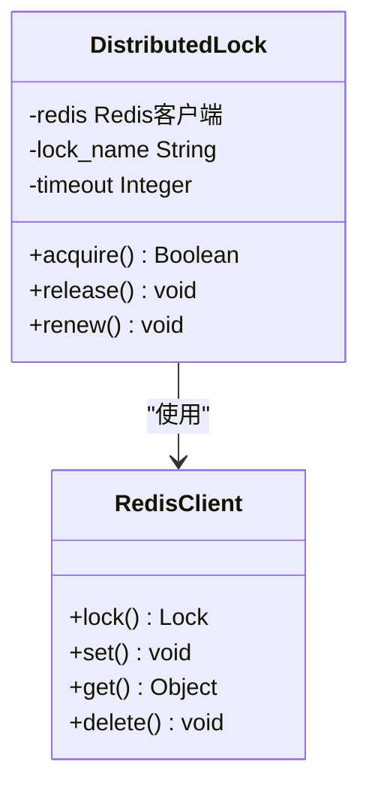
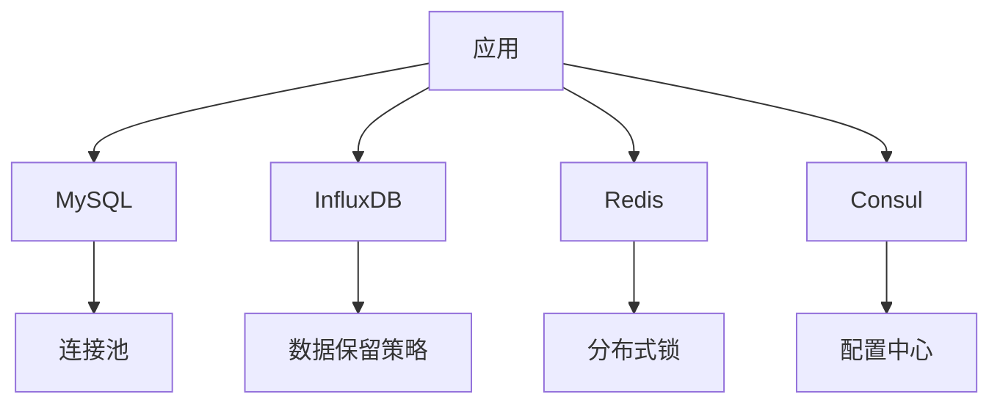

# 数据库存储架构

<cite>
**本文档引用的文件**   
- [mysql.py](file://bkmonitor/config/tools/mysql.py)
- [db_routers.py](file://bkmonitor/bkmonitor/db_routers.py)
- [init_data.json](file://bkmonitor/metadata/data/init_data.json)
- [redis_lock.py](file://bkmonitor/metadata/tools/redis_lock.py)
- [influxdb_checker.py](file://bkmonitor/scripts/influxdb_checker.py)
- [0001_monitor_20200113-0000_mysql.sql](file://bkmonitor/support-files/sql/0001_monitor_20200113-0000_mysql.sql)
</cite>

## 目录
1. [简介](#简介)
2. [项目结构](#项目结构)
3. [核心组件](#核心组件)
4. [架构概述](#架构概述)
5. [详细组件分析](#详细组件分析)
6. [依赖分析](#依赖分析)
7. [性能考虑](#性能考虑)
8. [故障排除指南](#故障排除指南)
9. [结论](#结论)

## 简介
本文档旨在深入分析蓝鲸监控平台的数据库存储架构，详细阐述其在持久化数据管理中的核心地位。文档将覆盖MySQL表结构设计、索引优化、事务管理、锁机制、查询优化等关键技术，并重点说明时序数据的分区策略、读写分离架构以及数据库监控与备份恢复方案。

## 项目结构
项目采用模块化设计，核心监控功能位于`bkmonitor`目录下。与数据库存储相关的关键模块包括：
- `config/tools/mysql.py`: 数据库连接配置
- `bkmonitor/db_routers.py`: 数据库路由策略
- `metadata/data/init_data.json`: 数据表结构定义
- `scripts/influxdb_checker.py`: 数据库监控脚本

**图示来源**
- [mysql.py](file://bkmonitor/config/tools/mysql.py)
- [init_data.json](file://bkmonitor/metadata/data/init_data.json)
- [influxdb_checker.py](file://bkmonitor/scripts/influxdb_checker.py)

**节来源**
- [mysql.py](file://bkmonitor/config/tools/mysql.py)
- [init_data.json](file://bkmonitor/metadata/data/init_data.json)
- [influxdb_checker.py](file://bkmonitor/scripts/influxdb_checker.py)

## 核心组件
核心组件包括数据库配置管理、路由策略、表结构定义和监控工具。这些组件共同构成了一个高可用、高性能的数据库存储系统。

**节来源**
- [mysql.py](file://bkmonitor/config/tools/mysql.py)
- [db_routers.py](file://bkmonitor/bkmonitor/db_routers.py)
- [init_data.json](file://bkmonitor/metadata/data/init_data.json)

## 架构概述
系统采用多数据库实例架构，通过读写分离和分布式锁机制确保数据一致性和高并发性能。MySQL用于存储结构化数据，InfluxDB用于存储时序数据。

**图示来源**
- [db_routers.py](file://bkmonitor/bkmonitor/db_routers.py)
- [mysql.py](file://bkmonitor/config/tools/mysql.py)

## 详细组件分析

### 数据库配置分析
数据库配置通过环境变量和配置文件双重管理，支持多环境部署。

#### 配置管理类图

**图示来源**
- [mysql.py](file://bkmonitor/config/tools/mysql.py#L1-L78)

**节来源**
- [mysql.py](file://bkmonitor/config/tools/mysql.py#L1-L78)

### 读写分离分析
通过自定义数据库路由器实现读写分离，提高数据库性能。

#### 读写分离序列图

**图示来源**
- [db_routers.py](file://bkmonitor/bkmonitor/db_routers.py#L1-L143)

**节来源**
- [db_routers.py](file://bkmonitor/bkmonitor/db_routers.py#L1-L143)

### 表结构设计分析
表结构设计遵循规范化原则，通过JSON配置文件定义数据模型。

#### 表结构设计流程图

**图示来源**
- [init_data.json](file://bkmonitor/metadata/data/init_data.json#L800-L1200)

**节来源**
- [init_data.json](file://bkmonitor/metadata/data/init_data.json#L800-L1200)

### 分布式锁分析
使用Redis实现分布式锁，确保并发操作的数据一致性。

#### 分布式锁类图

**图示来源**
- [redis_lock.py](file://bkmonitor/metadata/tools/redis_lock.py#L1-L76)

**节来源**
- [redis_lock.py](file://bkmonitor/metadata/tools/redis_lock.py#L1-L76)

## 依赖分析
系统依赖多个外部组件，包括MySQL、InfluxDB、Redis和Consul，通过配置文件和环境变量进行管理。

**图示来源**
- [mysql.py](file://bkmonitor/config/tools/mysql.py)
- [redis_lock.py](file://bkmonitor/metadata/tools/redis_lock.py)

**节来源**
- [mysql.py](file://bkmonitor/config/tools/mysql.py)
- [redis_lock.py](file://bkmonitor/metadata/tools/redis_lock.py)

## 性能考虑
系统通过连接池、读写分离、索引优化和缓存机制提高性能。MySQL连接池配置了5个初始连接和无上限的溢出连接，确保高并发下的性能稳定。

## 故障排除指南
常见问题包括数据库连接失败、锁获取超时和查询性能下降。解决方案包括检查环境变量配置、监控Redis状态和优化SQL查询。

**节来源**
- [mysql.py](file://bkmonitor/config/tools/mysql.py)
- [redis_lock.py](file://bkmonitor/metadata/tools/redis_lock.py)
- [influxdb_checker.py](file://bkmonitor/scripts/influxdb_checker.py)

## 结论
蓝鲸监控平台的数据库存储架构设计合理，通过多数据库实例、读写分离和分布式锁机制，实现了高可用性和高性能。建议定期监控数据库性能，优化查询语句，并根据业务需求调整容量规划。