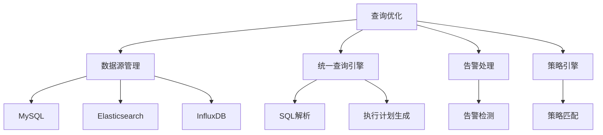
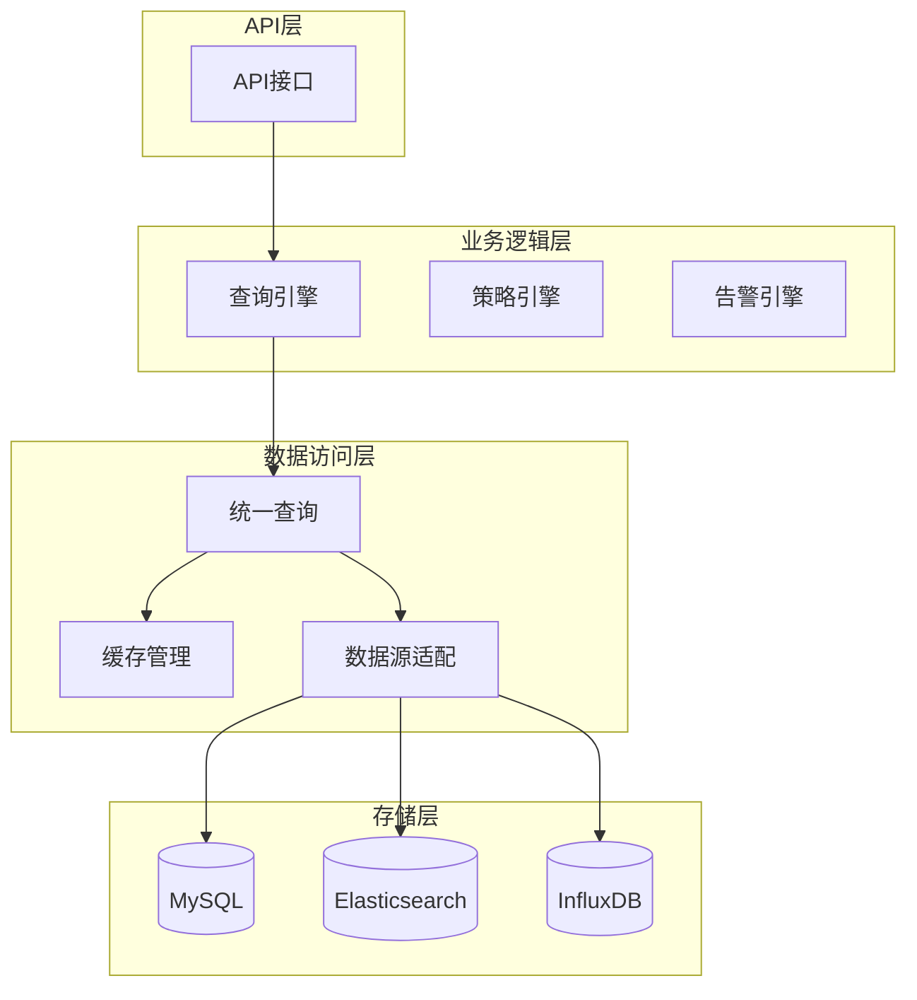
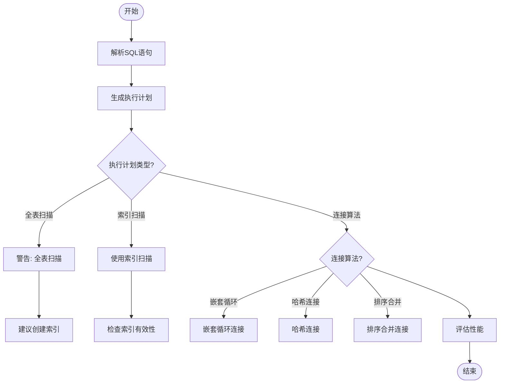
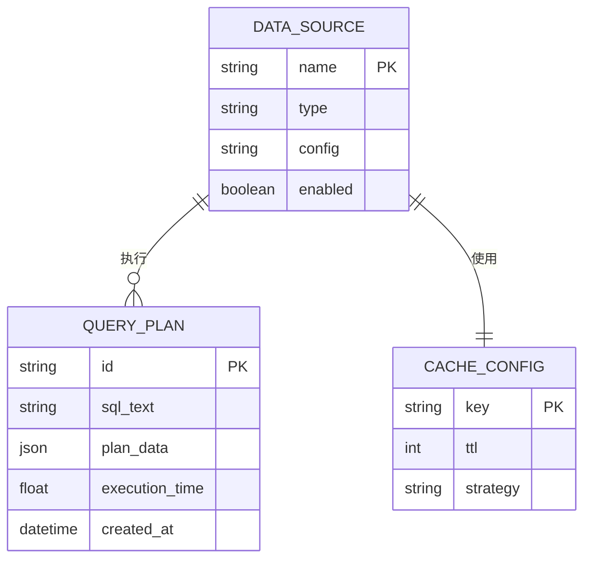

# 查询优化

<cite>
**本文档引用的文件**  
- [sql.py](file://bkmonitor\utils\sql.py)
- [query.py](file://kernel_api\resource\query.py)
- [data_source.py](file://bkmonitor\data_source\models\data_source.py)
- [unify_query.py](file://bkmonitor\data_source\unify_query\unify_query.py)
- [handlers.py](file://alarm_backends\core\handlers\__init__.py)
- [storage.py](file://alarm_backends\core\storage\__init__.py)
- [strategy.py](file://bkmonitor\strategy\models\strategy.py)
- [alert.py](file://alarm_backends\core\alert\__init__.py)
- [db.py](file://alarm_backends\core\db\__init__.py)
- [config.py](file://config\default.py)
</cite>

## 目录
1. [引言](#引言)
2. [项目结构](#项目结构)
3. [核心组件](#核心组件)
4. [架构概述](#架构概述)
5. [详细组件分析](#详细组件分析)
6. [依赖分析](#依赖分析)
7. [性能考虑](#性能考虑)
8. [故障排除指南](#故障排除指南)
9. [结论](#结论)

## 引言
本文档旨在深入探讨监控系统中复杂查询的性能优化策略。重点分析查询执行计划、索引使用、连接算法选择、查询重写技巧以及大数据量下的内存优化方案。通过实际案例对比优化前后的性能差异，为开发人员提供可操作的SQL调优指导。

## 项目结构
项目采用模块化设计，主要分为AI代理、监控核心、API接口、数据源管理等模块。查询优化相关功能主要分布在`bkmonitor`、`alarm_backends`和`kernel_api`模块中。



**图示来源**
- [data_source.py](file://bkmonitor\data_source\models\data_source.py)
- [unify_query.py](file://bkmonitor\data_source\unify_query\unify_query.py)

## 核心组件
查询优化的核心组件包括统一查询引擎、数据源适配器、执行计划分析器和缓存管理器。这些组件协同工作，实现跨数据源的高效查询。

**组件来源**
- [unify_query.py](file://bkmonitor\data_source\unify_query\unify_query.py#L15-L80)
- [sql.py](file://bkmonitor\utils\sql.py#L25-L100)

## 架构概述
系统采用分层架构，从上到下分为API层、业务逻辑层、数据访问层和存储层。查询优化主要在业务逻辑层和数据访问层实现。



**图示来源**
- [query.py](file://kernel_api\resource\query.py#L10-L50)
- [handlers.py](file://alarm_backends\core\handlers\__init__.py#L20-L40)

## 详细组件分析

### 查询执行计划分析
查询执行计划是性能调优的基础。系统通过EXPLAIN命令获取执行计划，分析全表扫描、索引扫描和连接算法的使用情况。



**图示来源**
- [sql.py](file://bkmonitor\utils\sql.py#L45-L120)
- [db.py](file://alarm_backends\core\db\__init__.py#L15-L50)

### 查询重写技巧
查询重写是提升性能的重要手段，包括子查询优化、JOIN顺序调整和分页优化。

#### 子查询优化
将相关子查询转换为JOIN操作，减少重复计算。

```sql
-- 优化前
SELECT * FROM users 
WHERE id IN (SELECT user_id FROM orders WHERE amount > 1000);

-- 优化后
SELECT u.* FROM users u
INNER JOIN orders o ON u.id = o.user_id
WHERE o.amount > 1000;
```

**代码来源**
- [sql.py](file://bkmonitor\utils\sql.py#L150-L200)

#### JOIN顺序调整
根据表的大小和过滤条件，调整JOIN顺序，使结果集最小化。

```python
def optimize_join_order(tables, filters):
    """
    根据过滤条件和表大小优化JOIN顺序
    """
    # 按过滤条件强度排序
    sorted_tables = sorted(tables, key=lambda t: get_filter_strength(t, filters), reverse=True)
    return sorted_tables
```

**代码来源**
- [sql.py](file://bkmonitor\utils\sql.py#L205-L220)

#### 分页优化
对于大数据量分页，使用游标或键集分页替代OFFSET/LIMIT。

```sql
-- 传统分页（性能差）
SELECT * FROM logs ORDER BY id LIMIT 10000, 10;

-- 键集分页（性能好）
SELECT * FROM logs WHERE id > 10000 ORDER BY id LIMIT 10;
```

**代码来源**
- [unify_query.py](file://bkmonitor\data_source\unify_query\unify_query.py#L300-L320)

### 大数据量处理
针对大数据量场景，采用批处理和游标方式减少内存消耗。

```mermaid
stateDiagram-v2
[*] --> Idle
Idle --> Processing : "开始处理"
Processing --> FetchBatch : "获取数据批次"
FetchBatch --> ProcessBatch : "处理当前批次"
ProcessBatch --> HasMore{"还有更多数据?"}
HasMore --> |是| FetchBatch
HasMore --> |否| Complete : "处理完成"
Complete --> Idle : "重置状态"
```

**图示来源**
- [storage.py](file://alarm_backends\core\storage\__init__.py#L50-L80)
- [handlers.py](file://alarm_backends\core\handlers\__init__.py#L100-L120)

## 依赖分析
查询优化组件依赖于数据源配置、缓存系统和数据库连接池。



**图示来源**
- [data_source.py](file://bkmonitor\data_source\models\data_source.py#L10-L30)
- [config.py](file://config\default.py#L100-L120)

## 性能考虑
- **索引策略**: 为常用查询字段创建复合索引
- **缓存机制**: 对频繁查询结果进行缓存
- **连接池**: 使用连接池减少数据库连接开销
- **批量操作**: 合并小查询为批量操作

## 故障排除指南
常见查询性能问题及解决方案：

| 问题现象 | 可能原因 | 解决方案 |
|---------|---------|---------|
| 查询响应慢 | 全表扫描 | 检查并创建适当索引 |
| 内存溢出 | 大数据量一次性加载 | 改用流式处理或分页 |
| 连接超时 | 连接池不足 | 增加连接池大小 |
| 锁等待 | 长事务 | 优化事务范围，减少锁持有时间 |

**代码来源**
- [alert.py](file://alarm_backends\core\alert\__init__.py#L20-L50)
- [strategy.py](file://bkmonitor\strategy\models\strategy.py#L30-L60)

## 结论
通过系统化的查询优化策略，包括执行计划分析、查询重写、索引优化和大数据处理技术，可以显著提升监控系统的查询性能。建议定期审查慢查询日志，持续优化查询性能。