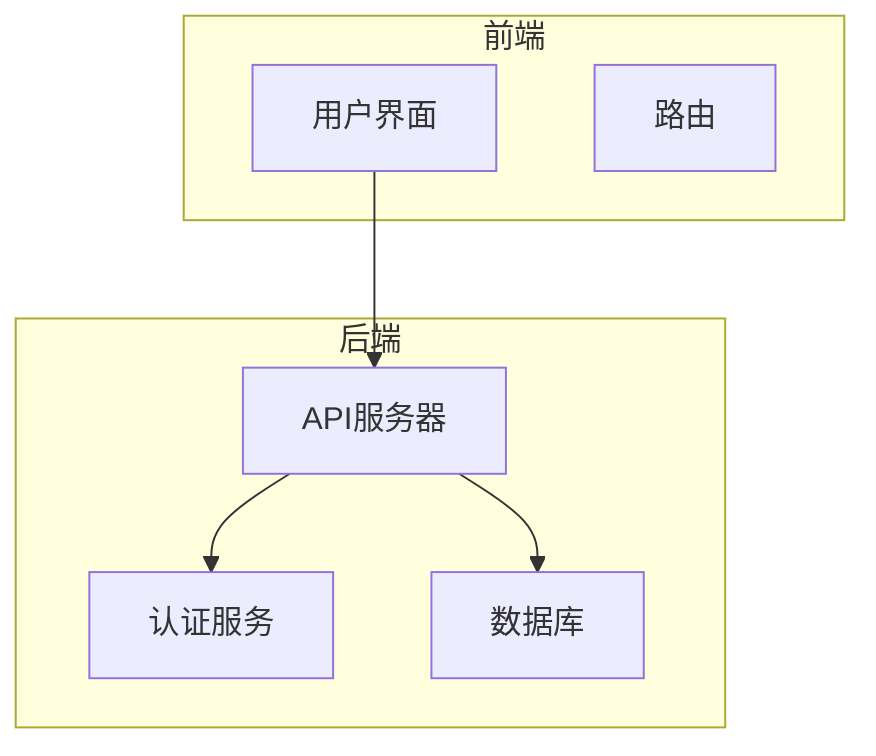

# 索引优化

<cite>
**本文档引用的文件**
- [bkmonitor\metadata\models\storage.py](file://bkmonitor\metadata\models\storage.py)
</cite>

## 目录
1. [引言](#引言)
2. [项目结构](#项目结构)
3. [核心组件](#核心组件)
4. [架构概述](#架构概述)
5. [详细组件分析](#详细组件分析)
6. [依赖分析](#依赖分析)
7. [性能考量](#性能考量)
8. [故障排除指南](#故障排除指南)
9. [结论](#结论)

## 引言
本文档旨在深入探讨索引优化策略，涵盖复合索引、覆盖索引和唯一索引的应用场景。通过分析查询执行计划（EXPLAIN），说明如何根据查询模式设计最优索引，并讨论索引维护成本与查询性能之间的平衡。此外，文档还提供了慢查询日志分析方法，针对时序数据的特殊性阐述时间字段索引的最佳实践，并给出索引失效的常见案例及解决方案。

## 项目结构
本项目的结构遵循模块化设计原则，主要分为多个功能模块，如`ai_agent`、`bkmonitor`、`api`等。每个模块负责特定的功能，例如`ai_agent`处理AI相关任务，`bkmonitor`负责监控后端逻辑，而`api`则提供各种服务接口。这种结构有助于提高代码的可维护性和扩展性。

```mermaid
graph TD
subgraph "根目录"
ai_agent["ai_agent"]
bkmonitor["bkmonitor"]
api["api"]
apm["apm"]
bkm_ipchooser["bkm_ipchooser"]
docs["docs"]
scripts["scripts"]
end
ai_agent --> core["core"]
ai_agent --> llm["llm"]
ai_agent --> services["services"]
bkmonitor --> .devcontainer[".devcontainer"]
bkmonitor --> .github[".github"]
bkmonitor --> ai_whale["ai_whale"]
bkmonitor --> alarm_backends["alarm_backends"]
bkmonitor --> api["api"]
bkmonitor --> apm["apm"]
bkmonitor --> apm_ebpf["apm_ebpf"]
bkmonitor --> bin["bin"]
bkmonitor --> bk_dataview["bk_dataview"]
bkmonitor --> bkm_ipchooser["bkm_ipchooser"]
bkmonitor --> bkm_space["bkm_space"]
bkmonitor --> bkmonitor["bkmonitor"]
bkmonitor --> blueking["blueking"]
bkmonitor --> calendars["calendars"]
bkmonitor --> config["config"]
bkmonitor --> constants["constants"]
bkmonitor --> core["core"]
bkmonitor --> django_templates["django_templates"]
bkmonitor --> docs["docs"]
bkmonitor --> kernel_api["kernel_api"]
bkmonitor --> locale["locale"]
bkmonitor --> metadata["metadata"]
bkmonitor --> packages["packages"]
bkmonitor --> patches["patches"]
bkmonitor --> query_api["query_api"]
bkmonitor --> scripts["scripts"]
bkmonitor --> static["static"]
bkmonitor --> support-files["support-files"]
bkmonitor --> templates["templates"]
bkmonitor --> tests["tests"]
bkmonitor --> version["version"]
bkmonitor --> version_logs_md["version_logs_md"]
bkmonitor --> Dockerfile["Dockerfile"]
bkmonitor --> Makefile["Makefile"]
bkmonitor --> README.md["README.md"]
bkmonitor --> gunicorn_config.py["gunicorn_config.py"]
bkmonitor --> manage.py["manage.py"]
bkmonitor --> monkey.py["monkey.py"]
bkmonitor --> pyproject.toml["pyproject.toml"]
bkmonitor --> settings.py["settings.py"]
bkmonitor --> urls.py["urls.py"]
bkmonitor --> version.yaml["version.yaml"]
bkmonitor --> wsgi.py["wsgi.py"]
api --> aidev["aidev"]
api --> aiops_sdk["aiops_sdk"]
api --> apm_api["apm_api"]
api --> bcs["bcs"]
api --> bcs_cluster_manager["bcs_cluster_manager"]
api --> bcs_project["bcs_project"]
api --> bcs_storage["bcs_storage"]
api --> bk_apigateway["bk_apigateway"]
api --> bk_login["bk_login"]
api --> bk_paas["bk_paas"]
api --> bk_plugin["bk_plugin"]
api --> bkchat["bkchat"]
bkmonitor --> bkdata["bkdata"]
api --> bmw["bmw"]
api --> cmdb["cmdb"]
api --> cmsi["cmsi"]
api --> common["common"]
api --> devops["devops"]
api --> docs["docs"]
api --> grafana["grafana"]
api --> gse["gse"]
api --> iam["iam"]
api --> itsm["itsm"]
api --> job["job"]
api --> kubernetes["kubernetes"]
api --> log_search["log_search"]
api --> metadata["metadata"]
api --> monitor["monitor"]
api --> node_man["node_man"]
api --> sops["sops"]
api --> unify_query["unify_query"]
api --> __init__.py["__init__.py"]
apm --> core["core"]
apm --> management["management"]
apm --> models["models"]
apm --> task["task"]
apm --> tests["tests"]
apm --> utils["utils"]
apm --> __init__.py["__init__.py"]
apm --> admin.py["admin.py"]
apm --> apps.py["apps.py"]
apm --> constants.py["constants.py"]
apm --> resources.py["resources.py"]
apm --> serializers.py["serializers.py"]
apm --> types.py["types.py"]
apm --> urls.py["urls.py"]
apm --> views.py["views.py"]
bkm_ipchooser --> docs["docs"]
bkm_ipchooser --> handlers["handlers"]
bkm_ipchooser --> query["query"]
bkm_ipchooser --> serializers["serializers"]
bkm_ipchooser --> tools["tools"]
bkm_ipchooser --> README.md["README.md"]
bkm_ipchooser --> __init__.py["__init__.py"]
bkm_ipchooser --> api.py["api.py"]
bkm_ipchooser --> apps.py["apps.py"]
bkm_ipchooser --> authentication.py["authentication.py"]
bkm_ipchooser --> config.py["config.py"]
bkm_ipchooser --> constants.py["constants.py"]
bkm_ipchooser --> exceptions.py["exceptions.py"]
bkm_ipchooser --> mock_data.py["mock_data.py"]
bkm_ipchooser --> models.py["models.py"]
bkm_ipchooser --> types.py["types.py"]
bkm_ipchooser --> urls.py["urls.py"]
bkm_ipchooser --> views.py["views.py"]
bkmonitor --> action["action"]
bkmonitor --> aiops["aiops"]
bkmonitor --> as_code["as_code"]
bkmonitor --> browser["browser"]
bkmonitor --> commons["commons"]
bkmonitor --> data_source["data_source"]
bkmonitor --> dataflow["dataflow"]
bkmonitor --> define["define"]
bkmonitor --> documents["documents"]
bkmonitor --> event_plugin["event_plugin"]
bkmonitor --> iam["iam"]
bkmonitor --> management["management"]
bkmonitor --> middlewares["middlewares"]
bkmonitor --> models["models"]
bkmonitor --> report["report"]
bkmonitor --> share["share"]
bkmonitor --> space["space"]
bkmonitor --> strategy["strategy"]
bkmonitor --> templates["templates"]
bkmonitor --> trace["trace"]
bkmonitor --> utils["utils"]
bkmonitor --> views["views"]
bkmonitor --> __init__.py["__init__.py"]
bkmonitor --> admin.py["admin.py"]
bkmonitor --> apps.py["apps.py"]
bkmonitor --> db_routers.py["db_routers.py"]
bkmonitor --> migrate.py["migrate.py"]
bkmonitor --> profiling.py["profiling.py"]
```



**图示来源**
- [bkmonitor\metadata\models\storage.py](file://bkmonitor\metadata\models\storage.py)

## 核心组件
`bkmonitor`模块是整个系统的核心，负责监控数据的采集、处理和存储。其中，`metadata\models\storage.py`文件定义了多种存储类型，包括Elasticsearch、InfluxDB、Kafka等。这些存储类型通过继承`StorageResultTable`类来实现统一的接口，确保了不同存储方式的一致性和可扩展性。

**组件来源**
- [bkmonitor\metadata\models\storage.py](file://bkmonitor\metadata\models\storage.py)

## 架构概述
系统的整体架构采用微服务设计，各个模块通过API进行通信。前端通过`django_templates`提供用户界面，后端通过`bkmonitor`处理业务逻辑，数据存储则由`metadata\models\storage.py`中的各类存储类负责。这种架构不仅提高了系统的灵活性，还便于未来的扩展和维护。



**图示来源**
- [bkmonitor\metadata\models\storage.py](file://bkmonitor\metadata\models\storage.py)

## 详细组件分析
### ESStorage类分析
`ESStorage`类是`metadata\models\storage.py`中用于管理Elasticsearch存储的核心类。它提供了索引轮转、别名管理和性能监控等功能。

#### 索引轮转
`ESStorage`类通过`create_index`方法实现索引轮转。该方法首先检查结果表是否启用，然后根据当前时间和配置的切片大小决定是否创建新的索引。如果现有索引的大小超过配置的切片大小，或者字段映射发生变化，都会触发索引轮转。

```python
def create_index(self, ahead_time=1440):
    """
    创建index，具有提前创建index的能力
    :param ahead_time: 需要提前创建多少分钟后的index
    :return: True | raise Exception
    """
    # 判断如果结果表已经废弃了，那么不再进行index的创建
    if not ResultTable.objects.filter(
        table_id=self.table_id, is_enable=True, is_deleted=False, bk_tenant_id=self.bk_tenant_id
    ).exists():
        logger.info(
            "table_id->[%s] under bk_tenant_id->[%s] now is delete or disable, no index will create.",
            self.table_id,
            self.bk_tenant_id,
        )
        return

    # 同时需要增加判断这个结果表是否可能遗留的自定义事件上报，需要考虑自定义上报已经关闭了
    try:
        # 查找发现，1. 这个es存储是归属于自定义事件的，而且 2. 不是在启动且未被删除的，那么不需要创建这个索引
        event_group = EventGroup.objects.get(table_id=self.table_id, bk_tenant_id=self.bk_tenant_id)

        if not event_group.is_enable or event_group.is_delete or event_group.status == EventGroupStatus.SLEEP.value:
            logger.info(
                "table_id->[%s] is belong to event group and is disable or deleted, no index will create",
                self.table_id,
            )
            return

    except EventGroup.DoesNotExist:
        # 如果查找失败，那么这个存储是日志平台，而且rt没有被删除或废弃，需要继续建立index
        logger.info("table_id->[%s] belong to log search, will create it.", self.table_id)

    now_time = self.now
    now_gap = 0

    # 1. 获取客户端 self.es_client
    # 统一的将所有【.】分割符改为【_】
    index_name = self.index_name

    # 3. 遍历创建所有的index
    # 创建的方式，是从近到远的创建
    while now_gap <= ahead_time:
        try:
            delete_index_list = []
            current_time = now_time + datetime.timedelta(minutes=now_gap)
            current_time_str = current_time.strftime(self.date_format)

            current_index_wildcard = f"{self.index_name}_{current_time_str}_*"

            # 获取这个index的大小信息，这是需要兼容判断是否有未来数据写入到index上了
            stat_info = self.es_client.indices.stats(current_index_wildcard)
            max_index = -1

            # 判断获取最大的index名字
            for stat_index_name in list(stat_info["indices"].keys()):
                re_result = self.index_re.match(stat_index_name)
                if re_result is None:
                    # 去掉一个整体index的计数
                    logger.warning(f"index->[{index_name}] is not match re, maybe something go wrong?")
                    continue

                current_index_count = int(re_result.group("index"))
                if max_index < current_index_count:
                    max_index = current_index_count

            # 获取现在当前最大的index
            # 注意，这时候的index有可能是-1的名字，例如：2_test_log_20191112_-1
            max_index_name = f"{self.index_name}_{current_time_str}_{max_index}"

            # 如果已经存在的index，不必重复创建
            is_index_exists = self.es_client.indices.exists(index=max_index_name)
            # 如果一个index是不存在的，则默认需要创建
            should_create = not is_index_exists

            # 判断index如果是存在的，需要判断：
            # 1. 是否大小需要进行切片分割
            # 2. 是否字段有变化，需要进行重建
            if is_index_exists:
                # 判断字段是否一致，如果不一致，需要创建新的删除并创建新的
                if not self.is_mapping_same(max_index_name):
                    logger.info(
                        f"index->[{max_index_name}] is exists, and field type is not the same as database, "
                        "will create a new index."
                    )
                    should_create = True

                # 判断大小是否有超限，需要切片
                try:
                    size_in_bytes = stat_info["indices"][max_index_name]["total"]["store"]["size_in_bytes"]
                except KeyError:
                    logger.warning(
                        f"ops, index->[{max_index_name}] is not exists in stat_info, maybe is not exists?"
                    )
                else:
                    if size_in_bytes / 1024.0 / 1024.0 / 1024.0 > self.slice_size:
                        logger.info(
                            f"index->[{max_index_name}] size->[{size_in_bytes}]bytes now is bigger than slice_size->[{self.slice_size}]GB, will "
                            "create new one"
                        )
                        should_create = True

            # 判断是否需要重建了，不用重建的，直接下一个周期
            if not should_create:
                logger.info(f"index->[{max_index_name}] meet all config, nothing will create.")
                # gap的更新在finally进行
                continue

            # 如果判断要创建index，需要先判断这个index是否有数据了
            try:
                # 如果是存在数据的，需要创建一个新的index
                if self.es_client.count(index=max_index_name).get("count", 0) != 0:
                    logger.info(f"index->[{max_index_name}] already has data, will keep it and create new index.")
                    # 有数据的，需要增加index
                    current_index = f"{index_name}_{current_time_str}_{max_index + 1}"
                    delete_index_list.append(max_index_name)

                # 不存在数据的，则删除并重新创建
                else:
                    self.es_client.indices.delete(max_index_name)

                    logger.warning(
                        f"index->[{max_index_name}] is differ from database config, will be delete and recreated."
                    )
                    # 创建的新index，使用已有的最大index名即可
                    # 此处可以保留已有的别名配置，不用删除
                    current_index = max_index_name

            except (elasticsearch5.NotFoundError, elasticsearch.NotFoundError, elasticsearch6.NotFoundError):
                # 很可能是0号或者-1号的index没有创建，所以判断count不存在
                logger.warning("index->[{}] may not exists, cannot found count? will create new one.")
                # 看下是否-1的index，需要调整为0的
                current_index = f"{index_name}_{current_time_str}_0" if max_index == -1 else max_index_name

            # 创建索引需要增加一个请求超时的防御
            logger.info(f"index->[{index_name}] trying to create, index_body->[{self.index_body}]")
            try:
                response = self._create_index_with_retry(current_index)
                metrics.LOG_INDEX_ROTATE_TOTAL.labels(
                    table_id=self.table_id, storage_cluster_id=self.storage_cluster_id, status="SUCCESS"
                ).inc()
                logger.info(f"index->[{index_name}] now is created, response->[{response}]")
            except Exception as e:  # pylint: disable=broad-except
                # 统一处理所有异常，区分RetryError和其他异常的错误信息
                error_msg = e.__cause__ if isinstance(e, RetryError) else e
                logger.error(
                    "create_index: table_id->[%s] failed to create index,error->[%s]", self.table_id, error_msg
                )
                metrics.LOG_INDEX_ROTATE_TOTAL.labels(
                    table_id=self.table_id, storage_cluster_id=self.storage_cluster_id, status="FAILED"
                ).inc()
                raise  # 重新抛出原异常，保留堆栈信息

            # 需要将对应的别名指向这个新建的index
            # 新旧类型的alias都会创建，防止transfer未更新导致异常
            new_current_alias_name = f"write_{current_time_str}_{index_name}"
            old_current_alias_name = f"{index_name}_{current_time_str}_write"

            self.es_client.indices.put_alias(index=current_index, name=new_current_alias_name)
            self.es_client.indices.put_alias(index=current_index, name=old_current_alias_name)

            logger.info(
                f"index->[{current_index}] now has write alias->[{new_current_alias_name} | {old_current_alias_name}]"
            )

            # 清理别名
            if len(delete_index_list) != 0:
                self.es_client.indices.delete_alias(index=",".join(delete_index_list), name=old_current_alias_name)
                self.es_client.indices.delete_alias(index=",".join(delete_index_list), name=new_current_alias_name)
                logger.info(
                    f"index->[{delete_index_list}] has delete relation to alias->[{old_current_alias_name} | {new_current_alias_name}]"
                )

        finally:
            logger.info(f"all operations for index->[{self.table_id}] gap->[{now_gap}] now is done.")
            now_gap += self.slice_gap

    return True
```

#### 别名管理
`ESStorage`类通过`create_or_update_aliases`方法管理索引的别名。该方法确保只有当新索引完全就绪时，才会将别名指向新索引，从而防止数据丢失。此外，该方法还支持提前创建未来的别名，以应对突发的流量增长。

```python
def create_or_update_aliases(self, ahead_time=1440, force_rotate: bool = False, is_moving_cluster: bool = False):
    """
    更新alias，如果有已存在的alias，则将其指向最新的index，并根据ahead_time前向预留一定的alias
    只有当即将切换的索引完全就绪时，才进行索引-别名的绑定关系切换，防止数据丢失
    """

    logger.info("create_or_update_aliases: start to create or update aliases for table_id->[%s]", self.table_id)
    # 0. 获取ES句柄，复用 self.es_client

    # 1.获取并组装当前最新的索引信息（索引名称、时间）
    current_index_info = self.current_index_info()
    last_index_name = self.make_index_name(
        current_index_info["datetime_object"], current_index_info["index"], current_index_info["index_version"]
    )
    logger.info(
        "create_or_update_aliases: current_index_info->[%s], last_index_name->[%s]",
        current_index_info,
        last_index_name,
    )

    now_datetime_object = self.now

    now_gap = 0
    index_name = self.index_name

    # 2. 循环，直至超出ahead_time，可以提前创建出未来ahead_time时间的别名,并添加索引完全就绪判断机制（green）
    while now_gap <= ahead_time:
        # 2.1 当前轮次时间信息
        round_time = now_datetime_object + datetime.timedelta(minutes=now_gap)
        round_time_str = round_time.strftime(self.date_format)

        try:
            # 2.2 组装当前轮次的读写别名信息
            round_alias_name = f"write_{round_time_str}_{index_name}"
            round_read_alias_name = f"{index_name}_{round_time_str}_read"
            logger.info(
                "create_or_update_aliases: now try to manage for table_id->[%s] alias_name->[%s] "
                "round_time_str->[%s]",
                self.table_id,
                round_alias_name,
                round_time_str,
            )
            # 2.3 获取当前轮次的读写别名对应的已经绑定的索引信息
            try:
                # 2.3.1 此处提前获取主要是为后续当新索引不存在时，需要获取到上一次的已就绪的索引，为下一轮次（未来）的读写别名-索引关系的创建作准备
                index_list = self.es_client.indices.get_alias(name=round_alias_name).keys()
                logger.info(
                    "create_or_update_aliases: table_id->[%s] alias_name->[%s] has index_list->[%s].",
                    self.table_id,
                    round_alias_name,
                    index_list,
                )
            except (elasticsearch5.NotFoundError, elasticsearch.NotFoundError, elasticsearch6.NotFoundError):
                # 2.3.2 若发生异常，说明当前轮次的读写别名不存在已经绑定的索引，index_list赋为空
                logger.warning(
                    "create_or_update_aliases: table_id->[%s] alias_name->[%s] does not exists, "
                    "nothing will be deleted.",
                    self.table_id,
                    round_alias_name,
                )
                index_list = []

            # 2.4 检查即将指向的索引是否就绪，只有当完全就绪（各个分片均已green）时，才进行切换
            try:
                is_ready = self.is_index_ready(last_index_name)
                logger.info(
                    "create_or_update_aliases: table_id->[%s] index->[%s] is ready, will create alias.",
                    self.table_id,
                    last_index_name,
                )
            except RetryError:  # 若重试后依然失败，则认为未就绪
                is_ready = False

            if not is_ready and not force_rotate:
                # 2.4.1 如果索引未就绪且不属于强制轮转，记录日志并跳过，将last_index_name变为上次的索引
                logger.warning(
                    "create_or_update_aliases: table_id->[%s] index->[%s] is not ready, will skip creation.",
                    self.table_id,
                    last_index_name,
                )
                # 将索引赋值为上次的已就绪索引,为下一轮次作准备
                if index_list:
                    last_index_name = list(index_list)[-1]
                    logger.info(
                        "create_or_update_aliases: table_id->[%s] will use index->[%s] for next round.",
                        self.table_id,
                        last_index_name,
                    )
                continue

            # 2.5 判断当前轮次别名是否有指向旧的index，如果存在则需要解除（走到这里说明新索引 last_index_name一定存在，可以放心删除）
            delete_list = []
            if index_list:
                for alias_index in index_list:
                    if alias_index != last_index_name:
                        delete_list.append(alias_index)
                logger.info(
                    "create_or_update_aliases: table_id->[%s] found alias_name->[%s] is relay with index->[%s] "
                    "all will be deleted.",
                    self.table_id,
                    round_alias_name,
                    delete_list,
                )

            # 2.6 组装需要新增或删除的索引和别名的关联关系
            actions = [
                {"add": {"index": last_index_name, "alias": round_alias_name}},
                {"add": {"index": last_index_name, "alias": round_read_alias_name}},
            ]

            # 2.7 如果需要删除的列表不为空，则添加对应的 `remove` 操作
            if delete_list:
                for _index in delete_list:
                    actions.append({"remove": {"index": _index, "alias": round_alias_name}})
                logger.info(
                    "create_or_update_aliases:table_id->[%s],last_index->[%s],index->[%s],alias->[%s] need delete",
                    self.table_id,
                    last_index_name,
                    delete_list,
                    round_alias_name,
                )

            # 2.8 是否进行了集群迁移操作,若是,则额外创建上一周期的别名-索引绑定关系
            if is_moving_cluster:
                logger.info(
                    "create_or_update_aliases: table_id->[%s] is moving cluster, will create last round alias.",
                    self.table_id,
                )
                last_round_time = now_datetime_object - datetime.timedelta(minutes=1440)
                last_round_time_str = last_round_time.strftime(self.date_format)

                last_round_alias_name = f"write_{last_round_time_str}_{index_name}"
                last_round_read_alias_name = f"{index_name}_{last_round_time_str}_read"

                actions.append({"add": {"index": last_index_name, "alias": last_round_alias_name}})
                actions.append({"add": {"index": last_index_name, "alias": last_round_read_alias_name}})

            # 2.9 执行索引-别名绑定关系建立操作
            logger.info(
                "create_or_update_aliases: table_id->[%s] try to add new index binding,actions->[%s]",
                self.table_id,
                actions,
            )
            try:
                self._update_aliases_with_retry(
                    actions=actions, new_index_name=last_index_name, force_rotate=force_rotate
                )
                logger.info("create_or_update_aliases: table_id->[%s] add new index binding success", self.table_id)
            except Exception as e:  # pylint: disable=broad-except
                logger.error(
                    "create_or_update_aliases: table_id->[%s] try to add index binding failed,error->[%s]",
                    self.table_id,
                    e.__cause__ if isinstance(e, RetryError) else e,
                )
                continue

            try:
                # 打印当前索引绑定的别名信息
                index_binding_aliases_info = self.es_client.indices.get_alias(index=last_index_name)
                logger.info(
                    "create_or_update_aliases: table_id->[%s] ,index->[%s],has alias info->[%s]",
                    self.table_id,
                    last_index_name,
                    index_binding_aliases_info,
                )
            except Exception as e:  # pylint: disable=broad-except
                logger.error(
                    "create_or_update_aliases: table_id->[%s] ,index->[%s],get alias info failed, error->[%s]",
                    self.table_id,
                    last_index_name,
                    e,
                )
                continue

            logger.info(
                "create_or_update_aliases: table_id->[%s] now has index->[%s] and alias->[%s | %s]",
                self.table_id,
                last_index_name,
                round_alias_name,
                round_read_alias_name,
            )

        finally:
            # 2.10 结束当前轮次循环，进入下一次循环
            logger.info(
                f"create_or_update_aliases: all operations for index->[{self.table_id}] gap->[{now_gap}] now is done."
            )
            # slice_gap maybe zero, will cause dead loop
            if self.slice_gap <= 0:
                return
            now_gap += self.slice_gap
```

#### 性能监控
`ESStorage`类通过`get_index_stats`方法获取索引的统计信息，包括索引大小、分片状态等。这些信息可以用于监控索引的健康状况，及时发现潜在的问题。

```python
def get_index_stats(self):
    """
    获取index的统计信息
    stats格式为：{
      "indices": {
          "${index_name}": {
              "total": {
                  "store": {
                      "size_in_bytes": 1000
                  }
              }
          }
      }
    }
    """
    return self._get_index_infos(ESNamespacedClientType.INDICES.value)
```

**组件来源**
- [bkmonitor\metadata\models\storage.py](file://bkmonitor\metadata\models\storage.py)

## 依赖分析
`ESStorage`类依赖于多个外部库和内部模块，如`elasticsearch`、`arrow`、`logging`等。这些依赖确保了`ESStorage`类能够高效地与Elasticsearch集群进行交互，同时提供了丰富的日志记录功能。

```mermaid
graph TD
ESStorage --> elasticsearch["elasticsearch"]
ESStorage --> arrow["arrow"]
ESStorage --> logging["logging"]
ESStorage --> retry["retry"]
ESStorage --> metrics["metrics"]
ESStorage --> es_tools["es_tools"]
ESStorage --> ResultTable["ResultTable"]
ESStorage --> EventGroup["EventGroup"]
ESStorage --> EventGroupStatus["EventGroupStatus"]
ESStorage --> ESNamespacedClientType["ESNamespacedClientType"]
ESStorage --> ES_INDEX_CHECK_LEVEL["ES_INDEX_CHECK_LEVEL"]
ESStorage --> ES_READY_STATUS["ES_READY_STATUS"]
ESStorage --> settings["settings"]
ESStorage --> datetime["datetime"]
ESStorage --> re["re"]
ESStorage --> json["json"]
ESStorage --> curator["curator"]
ESStorage --> atomic["atomic"]
ESStorage --> timezone["timezone"]
ESStorage --> EsSnapshot["EsSnapshot"]
ESStorage --> EsSnapshotIndice["EsSnapshotIndice"]
ESStorage --> config["config"]
ESStorage --> gen_bk_data_rt_id_without_biz_id["gen_bk_data_rt_id_without_biz_id"]
ESStorage --> api["api"]
ESStorage --> logger["logger"]
```



**图示来源**
- [bkmonitor\metadata\models\storage.py](file://bkmonitor\metadata\models\storage.py)

## 性能考量
在设计索引优化策略时，必须考虑索引维护成本与查询性能之间的平衡。频繁的索引轮转会增加写入开销，但可以减少单个索引的大小，提高查询性能。此外，合理的别名管理可以避免数据丢失，确保系统的高可用性。

## 故障排除指南
### 索引轮转失败
如果索引轮转失败，首先检查日志文件中的错误信息。常见的原因包括网络问题、Elasticsearch集群不可用、配置错误等。可以通过以下步骤进行排查：
1. 检查Elasticsearch集群的健康状态。
2. 确认配置文件中的参数是否正确。
3. 检查网络连接是否正常。

### 别名管理问题
如果别名管理出现问题，可能导致数据丢失或查询失败。建议定期检查别名的绑定情况，确保新索引完全就绪后再进行切换。可以通过以下命令查看别名信息：
```bash
curl -XGET 'http://localhost:9200/_cat/aliases?v'
```

### 性能监控
定期监控索引的大小和分片状态，及时发现潜在的性能瓶颈。可以使用Elasticsearch自带的监控工具，如`_cluster/health`和`_nodes/stats`，获取详细的集群信息。

**组件来源**
- [bkmonitor\metadata\models\storage.py](file://bkmonitor\metadata\models\storage.py)

## 结论
本文档详细介绍了`ESStorage`类的索引轮转、别名管理和性能监控机制。通过合理的设计和配置，可以有效提升系统的查询性能，同时确保数据的完整性和高可用性。未来的工作可以进一步优化索引轮转策略，减少维护成本，提高系统的整体性能。