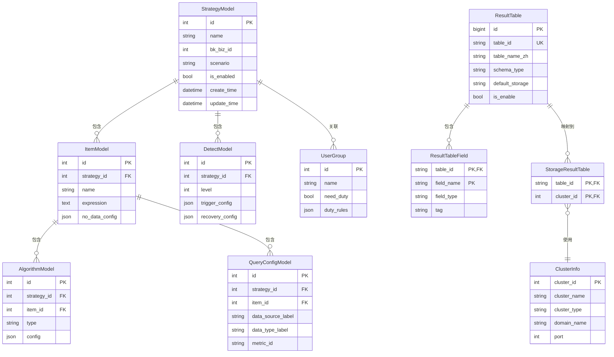

# 表结构设计

<cite>
**本文档中引用的文件**   
- [strategy.py](file://bkmonitor\bkmonitor\models\strategy.py)
- [result_table.py](file://bkmonitor\metadata\models\result_table.py)
- [storage.py](file://bkmonitor\metadata\models\storage.py)
- [common.py](file://bkmonitor\metadata\models\common.py)
- [result_table_manage.py](file://bkmonitor\metadata\models\result_table_manage.py)
- [strategy.py](file://bkmonitor\constants\strategy.py)
- [result_table.py](file://bkmonitor\constants\result_table.py)
</cite>

## 目录
1. [引言](#引言)
2. [核心表结构分析](#核心表结构分析)
3. [策略表设计](#策略表设计)
4. [结果表设计](#结果表设计)
5. [范式化与反范式化权衡](#范式化与反范式化权衡)
6. [实体关系图](#实体关系图)
7. [时序数据分区与归档](#时序数据分区与归档)
8. [分表与查询性能优化](#分表与查询性能优化)
9. [字段命名规范与业务含义](#字段命名规范与业务含义)

## 引言

本文档旨在详细阐述蓝鲸监控平台的数据库表结构设计，重点分析核心表如`result_table`和`strategy`的字段定义、数据类型选择、主外键关系及约束条件。文档将解释范式化设计与反范式化权衡，展示实体关系图（ER图）并说明各表之间的关联关系。此外，将详细描述时序数据表的分区策略（按时间分区）和归档机制，以及如何通过分表提升查询性能。最后，提供实际建表示例，并说明字段命名规范和业务含义。

## 核心表结构分析

通过对项目代码库的分析，我们识别出两个核心模块：`bkmonitor.models.strategy` 和 `metadata.models.result_table`。前者定义了监控策略相关的数据模型，后者定义了数据采集和存储的核心逻辑结果表。这些模型共同构成了监控系统数据持久化的基础。

**Section sources**
- [strategy.py](file://bkmonitor\bkmonitor\models\strategy.py)
- [result_table.py](file://bkmonitor\metadata\models\result_table.py)

## 策略表设计

### StrategyModel (策略表)

`StrategyModel` 是策略配置的核心表，存储了策略的基本信息。

**字段定义与数据类型：**
- `id` (BigAutoField): 主键，自增ID。
- `name` (CharField): 策略名称，最大长度128字符，建立索引。
- `bk_biz_id` (IntegerField): 业务ID，建立索引。
- `source` (CharField): 来源系统，最大长度32字符。
- `scenario` (CharField): 监控场景，最大长度32字符。
- `type` (CharField): 策略类型，从预定义的 `StrategyType.Choices` 中选择，建立索引。
- `is_enabled` (BooleanField): 是否启用，布尔值，默认为True。
- `is_invalid` (BooleanField): 是否失效，布尔值，默认为False。
- `invalid_type` (CharField): 失效类型，从 `InvalidType.Choices` 中选择，最大长度32字符。
- `create_user`, `update_user` (CharField): 创建人和最后修改人，最大长度32字符。
- `create_time`, `update_time` (DateTimeField): 创建时间和最后修改时间，`update_time` 使用 `auto_now=True` 自动更新。
- `priority` (IntegerField): 优先级，可为空。
- `priority_group_key` (CharField): 优先级分组键，最大长度64字符，可为空。

**约束与索引：**
- **主键**: `id`
- **唯一约束**: 无
- **索引**: `name`, `bk_biz_id`, `scenario`, `type`, `is_enabled` 字段均建立索引。`is_enabled`, `bk_biz_id`, `scenario` 三个字段建立联合索引以优化查询。
- **外键**: 无直接外键，但通过 `strategy_id` 在其他表（如 `ItemModel`）中建立关联。

**业务含义：**
该表是策略的顶层容器，定义了策略的名称、所属业务、应用场景、启用状态和优先级等全局属性。

### ItemModel (监控项表)

`ItemModel` 存储了策略下的具体监控项配置。

**字段定义与数据类型：**
- `strategy_id` (IntegerField): 关联的策略ID，建立索引。
- `name` (CharField): 监控项名称，最大长度256字符。
- `expression` (TextField): 计算公式，文本类型。
- `functions` (JSONField): 计算函数，JSON格式，默认为空列表。
- `origin_sql` (TextField): 原始查询语句，文本类型。
- `no_data_config` (JSONField): 无数据配置，JSON格式，包含 `is_enabled`, `continuous`, `agg_dimension` 等字段。
- `target` (JSONField): 监控目标，JSON格式，默认为 `[[]]`。
- `meta` (JSONField): 查询配置元数据，JSON格式，默认为空列表。
- `metric_type` (CharField): 指标类型，最大长度32字符。
- `time_delay` (IntegerField): 策略等待时间，整数，默认为0。

**约束与索引：**
- **主键**: `id` (隐式)
- **外键**: `strategy_id` 是 `StrategyModel` 的外键，通过应用逻辑维护。
- **索引**: `strategy_id` 建立索引。

**业务含义：**
一个策略可以包含多个监控项。此表定义了具体的监控指标、计算逻辑、监控目标和无数据处理规则。

### DetectModel (检测配置表)

`DetectModel` 定义了告警的触发和恢复条件。

**字段定义与数据类型：**
- `strategy_id` (IntegerField): 关联的策略ID，建立索引。
- `level` (IntegerField): 告警级别，从1（致命）到3（提醒），建立索引。
- `expression` (TextField): 计算公式，文本类型，默认为空。
- `trigger_config` (JSONField): 触发条件配置，JSON格式。
- `recovery_config` (JSONField): 恢复条件配置，JSON格式。
- `connector` (CharField): 同级别算法连接符，`"and"` 或 `"or"`，最大长度4字符，默认为 `"and"`。

**约束与索引：**
- **主键**: `id` (隐式)
- **外键**: `strategy_id` 是 `StrategyModel` 的外键。
- **索引**: `strategy_id`, `level`, `connector` 建立索引。

**业务含义：**
此表为每个告警级别配置了触发和恢复的阈值或条件，以及多个算法之间的连接逻辑。

### AlgorithmModel (检测算法表)

`AlgorithmModel` 存储了具体的告警检测算法。

**字段定义与数据类型：**
- `strategy_id` (IntegerField): 关联的策略ID，建立索引。
- `item_id` (IntegerField): 关联的监控项ID，建立索引。
- `level` (IntegerField): 告警级别，建立索引。
- `type` (CharField): 算法类型，从 `ALGORITHM_CHOICES` 中选择，建立索引。
- `unit_prefix` (CharField): 算法单位前缀，最大长度32字符。
- `config` (JSONField): 算法配置，JSON格式。

**约束与索引：**
- **主键**: `id` (隐式)
- **外键**: `strategy_id` 和 `item_id` 分别关联 `StrategyModel` 和 `ItemModel`。
- **索引**: `strategy_id`, `item_id`, `level`, `type` 建立索引。

**业务含义：**
此表将具体的算法（如静态阈值、环比、同比、智能检测等）应用到监控项上，并配置其参数。

### QueryConfigModel (查询配置表)

`QueryConfigModel` 定义了数据查询的来源和配置。

**字段定义与数据类型：**
- `strategy_id` (IntegerField): 关联的策略ID，建立索引。
- `item_id` (IntegerField): 关联的监控项ID，建立索引。
- `alias` (CharField): 别名，最大长度12字符。
- `data_source_label` (CharField): 数据来源标签，如 `"bk_monitor_collector"`。
- `data_type_label` (CharField): 数据类型标签，如 `"time_series"`。
- `metric_id` (CharField): 指标ID，最大长度128字符。
- `config` (JSONField): 查询配置，JSON格式。

**约束与索引：**
- **主键**: `id` (隐式)
- **外键**: `strategy_id` 和 `item_id`。
- **索引**: `data_source_label` 和 `data_type_label` 建立联合索引。

**业务含义：**
此表指定了监控项从哪个数据源（如蓝鲸采集器、自定义上报）和哪种数据类型（时序、事件、日志）中获取数据，并关联具体的指标。

**Section sources**
- [strategy.py](file://bkmonitor\bkmonitor\models\strategy.py)

## 结果表设计

### ResultTable (逻辑结果表)

`ResultTable` 是元数据管理的核心，定义了逻辑上的数据表。

**字段定义与数据类型：**
- `id` (BigAutoField): 主键，自增ID。
- `table_id` (CharField): 结果表名，格式为 `DB.TABLE_NAME`，建立索引，最大长度128字符。
- `bk_tenant_id` (CharField): 租户ID，最大长度256字符。
- `table_name_zh` (CharField): 结果表中文名，最大长度128字符。
- `is_custom_table` (BooleanField): 是否为自定义结果表。
- `schema_type` (CharField): schema配置方案，从 `SCHEMA_TYPE_CHOICES` 中选择（`free`, `dynamic`, `fixed`）。
- `default_storage` (CharField): 默认存储方案，从 `ClusterInfo.CLUSTER_TYPE_CHOICES` 中选择（如 `influxdb`, `elasticsearch`）。
- `creator`, `last_modify_user` (CharField): 创建者和最后更新者，最大长度32字符。
- `create_time`, `last_modify_time` (DateTimeField): 创建时间和最后更新时间。
- `bk_biz_id` (IntegerField): 结果表所属业务，全业务为0。
- `is_deleted`, `is_enable` (BooleanField): 是否已删除和是否启用。
- `label` (CharField): 结果表标签，如 `"OS"`, `"host"`。
- `data_label` (CharField): 数据标签，最大长度128字符。
- `is_builtin` (BooleanField): 是否为内置表。

**约束与索引：**
- **主键**: `id`
- **唯一约束**: (`table_id`, `bk_tenant_id`) 组合唯一。
- **索引**: `table_id` 建立索引。

**业务含义：**
此表是逻辑上的数据表，它不直接存储数据，而是作为数据源和物理存储之间的映射。一个 `ResultTable` 可以对应多个物理存储实例。

### ResultTableField (结果表字段)

`ResultTableField` 定义了逻辑结果表的字段。

**字段定义与数据类型：**
- `table_id` (CharField): 所属结果表ID，建立索引。
- `field_name` (CharField): 字段名，建立索引。
- `field_type` (CharField): 字段类型，从 `ResultTableField` 类中的常量选择（`int`, `long`, `float`, `string`, `boolean`, `object`, `nested`, `timestamp`）。
- `tag` (CharField): 字段标签，`"metric"` (指标), `"dimension"` (维度), `"timestamp"` (时间戳)。
- `description` (TextField): 字段描述。
- `is_config_by_user` (BooleanField): 是否由用户配置。
- `creator`, `last_modify_user` (CharField): 创建者和最后更新者。
- `create_time`, `last_modify_time` (DateTimeField): 创建时间和最后更新时间。

**约束与索引：**
- **主键**: (`table_id`, `field_name`)
- **外键**: `table_id` 关联 `ResultTable`。
- **索引**: `table_id`, `field_name` 建立索引。

**业务含义：**
此表定义了 `ResultTable` 的具体字段，包括字段名、数据类型、是指标还是维度等元信息。

### ClusterInfo (集群信息)

`ClusterInfo` 存储了物理存储集群的配置信息。

**字段定义与数据类型：**
- `cluster_id` (AutoField): 集群ID，主键。
- `cluster_name` (CharField): 集群名称，最大长度128字符。
- `cluster_type` (CharField): 集群类型，如 `influxdb`, `kafka`, `elasticsearch`，建立索引。
- `domain_name`, `extranet_domain_name` (CharField): 集群域名和外网域名。
- `port`, `extranet_port` (IntegerField): 端口和外网端口。
- `description` (CharField): 集群备注。
- `is_default_cluster` (BooleanField): 是否为默认集群。
- `username`, `password` (CharField): 用户名和密码（`password` 为加密字段）。
- `version` (CharField): 存储集群版本。
- `schema` (CharField): 访问协议，如 `http`, `https`。
- `is_ssl_verify`, `ssl_verification_mode` 等: SSL/TLS 相关配置。
- `is_auth` (BooleanField): 是否开启鉴权。
- `registered_system` (CharField): 注册来源系统。

**约束与索引：**
- **主键**: `cluster_id`
- **索引**: `cluster_type` 建立索引。

**业务含义：**
此表管理了所有物理存储集群（InfluxDB, Kafka, ES等）的连接信息和配置。

### 存储模型 (Storage Models)

根据 `ClusterInfo` 的 `cluster_type`，系统定义了不同的存储模型，如 `InfluxDBStorage`, `ESStorage`, `KafkaStorage` 等。这些模型继承自 `StorageResultTable`，并包含特定于该存储类型的配置。

**业务含义：**
这些模型将一个 `ResultTable` 映射到一个具体的物理存储实例（由 `cluster_id` 指定），并存储该映射的特定配置。

**Section sources**
- [result_table.py](file://bkmonitor\metadata\models\result_table.py)
- [storage.py](file://bkmonitor\metadata\models\storage.py)
- [common.py](file://bkmonitor\metadata\models\common.py)

## 范式化与反范式化权衡

本系统在设计上采用了**混合范式**，在保证数据一致性和可维护性的同时，也考虑了查询性能。

### 范式化设计

1.  **高内聚、低耦合**: 将策略、监控项、检测配置、算法、查询配置等拆分为独立的表。这遵循了第三范式（3NF），避免了数据冗余。例如，`StrategyModel` 只存储策略的全局信息，而具体的监控逻辑分散在 `ItemModel` 和 `AlgorithmModel` 中。
2.  **元数据与数据分离**: `ResultTable` 和 `ResultTableField` 作为元数据表，与实际存储数据的物理表（如InfluxDB中的measurement）分离。这使得元数据的变更不会直接影响历史数据，提高了系统的灵活性和可维护性。
3.  **枚举值集中管理**: 使用常量文件（如 `constants/strategy.py`）来定义枚举值（如 `ALGORITHM_CHOICES`），避免在数据库中硬编码，便于统一管理和修改。

### 反范式化权衡

1.  **JSON字段的使用**: 在 `ItemModel`, `DetectModel`, `AlgorithmModel`, `QueryConfigModel` 等表中大量使用 `JSONField` 来存储配置。这牺牲了部分查询灵活性（无法对JSON内部字段进行高效索引），但极大地提高了配置的灵活性和可扩展性。例如，不同算法的配置参数差异巨大，使用JSON可以轻松容纳。
2.  **冗余字段**: `StrategyModel` 中的 `priority_group_key` 字段是根据查询配置生成的，属于派生数据，存在冗余。但这样设计是为了避免在查询时进行复杂的计算，直接通过该字段进行分组，提升了查询性能。
3.  **逻辑表与物理表的映射**: `ResultTable` 作为逻辑表，允许一个逻辑表映射到多个物理存储（如同时写入InfluxDB和Kafka）。这种设计在写入时可能需要多次操作，但在读取时可以根据查询需求选择最优的存储后端，是一种为读取性能优化的反范式设计。

**结论**: 系统在核心业务逻辑上保持了较高的范式化，确保了数据的清晰和一致性。而在配置存储和性能优化方面，明智地采用了反范式化设计，以适应监控系统配置复杂、查询频繁的特点。

**Section sources**
- [strategy.py](file://bkmonitor\bkmonitor\models\strategy.py)
- [result_table.py](file://bkmonitor\metadata\models\result_table.py)

## 实体关系图

**Diagram sources **
- [strategy.py](file://bkmonitor\bkmonitor\models\strategy.py)
- [result_table.py](file://bkmonitor\metadata\models\result_table.py)
- [storage.py](file://bkmonitor\metadata\models\storage.py)

## 时序数据分区与归档

### 分区策略

系统主要依赖底层存储引擎（如InfluxDB, Elasticsearch）来实现时序数据的分区，而非在数据库层面进行分区。

1.  **InfluxDB**:
    *   **按时间分区**: InfluxDB原生支持按时间切分shard。在 `InfluxDBStorage` 模型中，可以通过配置 `retention_policy` (保留策略) 来定义shard的持续时间（如1天、7天）。数据会根据时间自动写入对应的shard中。
    *   **按Series分区**: InfluxDB的Series由measurement、tag set和field key组成。不同的Series会被分散存储，这本身就是一种基于维度的分区。

2.  **Elasticsearch**:
    *   **按日期创建索引**: 系统通过 `ESStorage` 模型的 `make_index_name` 方法，根据 `ResultTable` 的 `table_id` 和当前日期（如 `YYYY-MM-DD`）动态生成索引名称（例如 `2_system_cpu_detail_2023-10-27`）。这是最典型的按时间分区策略。
    *   **索引生命周期管理 (ILM)**: 结合Elasticsearch的ILM功能，可以自动化地管理索引的生命周期，包括热、温、冷阶段的流转和最终的删除。

### 归档机制

1.  **数据保留策略 (Retention Policy)**:
    *   **InfluxDB**: 通过 `retention_policy` 配置数据的保留时长。超过保留期限的数据会由InfluxDB的TSM引擎自动清理。
    *   **Elasticsearch**: 通过ILM策略，可以将旧索引从高性能的热节点迁移到低成本的冷节点，最终在达到保留期限后删除。

2.  **逻辑删除标记**:
    *   在元数据层面，`ResultTable` 表中的 `is_deleted` 和 `is_enable` 字段用于标记结果表的逻辑状态。当一个结果表被禁用或删除时，新的数据将不再写入，但历史数据会根据存储引擎的保留策略自然过期。

3.  **Consul配置刷新**:
    *   当 `ResultTable` 被禁用时，`refresh_consul_influxdb_tableinfo` 方法会清理Consul中的相关配置，确保查询服务不再将请求路由到已禁用的结果表。

**Section sources**
- [result_table.py](file://bkmonitor\metadata\models\result_table.py)
- [storage.py](file://bkmonitor\metadata\models\storage.py)

## 分表与查询性能优化

### 分表策略

1.  **按时间分表 (Time-based Sharding)**:
    *   如上所述，Elasticsearch通过按日期创建索引实现了天然的分表。这极大地提升了查询性能，因为查询特定时间范围的数据时，可以只扫描相关的几个索引，而不是全量扫描。

2.  **按业务分表 (Business-based Sharding)**:
    *   `ResultTable` 的 `table_id` 格式为 `DB.TABLE_NAME`，其中 `DB` 通常代表业务范围（如 `system`, `docker`）。这相当于将不同业务的数据逻辑上分开了，有助于管理和权限控制。

3.  **结果表拆分 (Result Table Split)**:
    *   代码中存在 `create_result_table_metric_split` 的API调用，表明系统支持将一个大的结果表按特定维度（如CMDB层级）拆分成多个子表。这可以将查询压力分散到多个物理表上。

### 查询性能优化

1.  **索引优化**:
    *   在 `StrategyModel`, `ItemModel` 等核心表上，对高频查询字段（如 `strategy_id`, `bk_biz_id`, `is_enabled`）建立了数据库索引。
    *   在Elasticsearch中，对 `ResultTableField` 中标记为 `dimension` 的字段会自动创建倒排索引，加速基于维度的过滤查询。

2.  **Consul缓存**:
    *   `ResultTable` 的 `refresh_consul_influxdb_tableinfo` 方法将结果表的元信息（如是否为pivot表、分段查询开关）写入Consul。查询服务可以直接从Consul获取这些信息，避免了频繁查询数据库，降低了延迟。

3.  **哈希环 (HashRing)**:
    *   在实时数据处理流程中，使用了 `HashRing` 算法将Kafka的topic分区分配到不同的处理主机上。这确保了负载均衡，避免了单点瓶颈。

**Section sources**
- [result_table.py](file://bkmonitor\metadata\models\result_table.py)
- [storage.py](file://bkmonitor\metadata\models\storage.py)
- [strategy.py](file://bkmonitor\bkmonitor\strategy\strategy.py)

## 字段命名规范与业务含义

| 模块 | 表名 | 字段名 | 命名规范 | 业务含义 |
| :--- | :--- | :--- | :--- | :--- |
| 策略 | StrategyModel | `name` | 小写，下划线分隔 | 策略的名称，用于标识和搜索 |
| 策略 | StrategyModel | `bk_biz_id` | `bk_`前缀，`biz`缩写 | 策略所属的业务ID，0代表全业务 |
| 策略 | StrategyModel | `is_enabled` | `is_`前缀 | 布尔值，表示策略当前是否处于激活状态 |
| 策略 | ItemModel | `expression` | 小写 | 监控项的计算公式，如 `a + b` |
| 策略 | AlgorithmModel | `type` | 小写 | 算法类型，如 `Threshold`, `SimpleRingRatio` |
| 策略 | QueryConfigModel | `data_source_label` | `_label`后缀 | 数据来源的标签，如 `bk_monitor_collector` |
| 结果表 | ResultTable | `table_id` | 小写，`_id`后缀 | 逻辑结果表的唯一标识，格式为 `DB.TABLE_NAME` |
| 结果表 | ResultTable | `table_name_zh` | `_zh`后缀 | 结果表的中文名称，用于前端展示 |
| 结果表 | ResultTable | `schema_type` | 小写，`_type`后缀 | Schema的配置方案：`free`(无固定字段), `dynamic`(动态字段), `fixed`(固定字段) |
| 结果表 | ResultTableField | `field_name` | 小写，`_name`后缀 | 字段的名称 |
| 结果表 | ResultTableField | `field_type` | 小写，`_type`后缀 | 字段的数据类型：`int`, `float`, `string`, `timestamp` 等 |
| 结果表 | ResultTableField | `tag` | 小写 | 字段的标签：`metric`(指标), `dimension`(维度), `timestamp`(时间戳) |
| 存储 | ClusterInfo | `cluster_type` | 小写，`_type`后缀 | 物理集群的类型：`influxdb`, `elasticsearch`, `kafka` |
| 存储 | ClusterInfo | `domain_name` | 小写，`_name`后缀 | 集群的域名 |
| 存储 | ClusterInfo | `is_default_cluster` | `is_`前缀 | 布尔值，表示该集群是否为默认集群 |

**Section sources**
- [strategy.py](file://bkmonitor\bkmonitor\models\strategy.py)
- [result_table.py](file://bkmonitor\metadata\models\result_table.py)
- [storage.py](file://bkmonitor\metadata\models\storage.py)