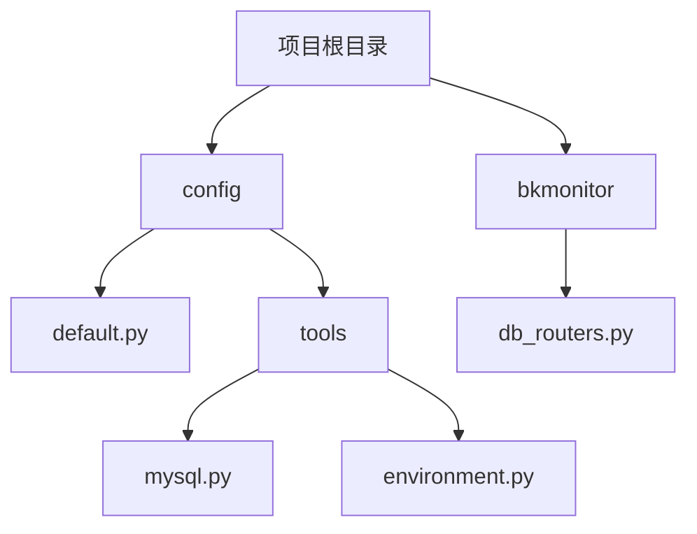
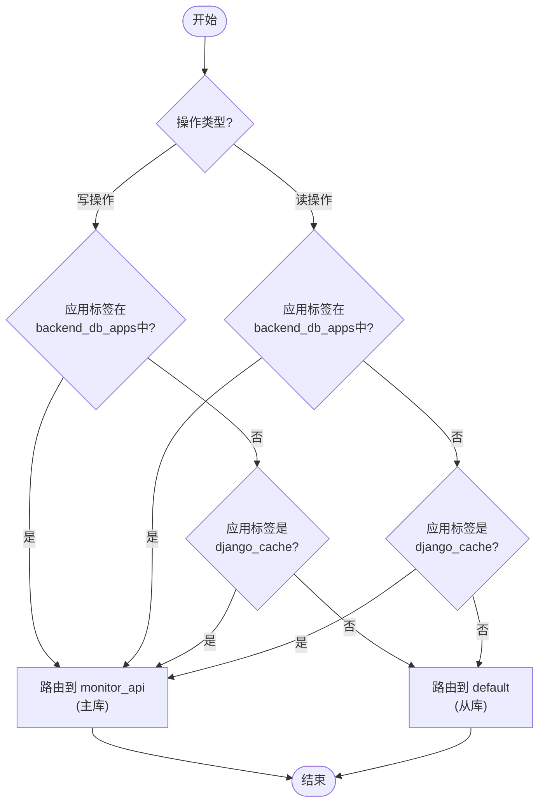
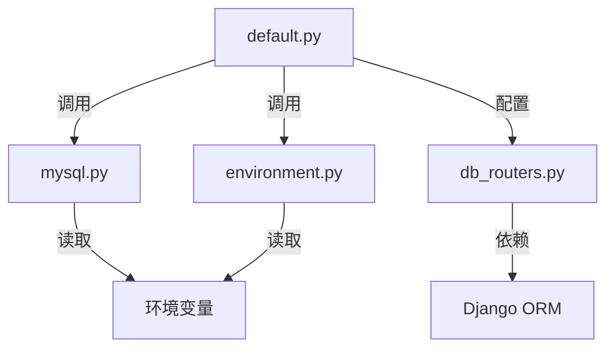

# 读写分离架构

<cite>
**本文档引用的文件**   
- [default.py](file://bkmonitor/config/default.py#L1000-L1631)
- [mysql.py](file://bkmonitor/config/tools/mysql.py#L1-L79)
- [environment.py](file://bkmonitor/config/tools/environment.py#L1-L82)
- [db_routers.py](file://bkmonitor/bkmonitor/db_routers.py#L1-L144)
</cite>

## 目录
1. [引言](#引言)
2. [项目结构](#项目结构)
3. [核心组件](#核心组件)
4. [架构概述](#架构概述)
5. [详细组件分析](#详细组件分析)
6. [依赖分析](#依赖分析)
7. [性能考量](#性能考量)
8. [故障排除指南](#故障排除指南)
9. [结论](#结论)

## 引言
本文档旨在深入分析蓝鲸监控平台（BlueKing Monitor）中的读写分离架构。该架构通过将数据库的读操作和写操作路由到不同的数据库实例，以提升系统的整体性能和可扩展性。文档将详细阐述主从复制的数据同步流程、读写分离的路由策略、数据一致性保证机制、主库故障时的切换与恢复流程，并讨论延迟问题的应对方案。

## 项目结构
蓝鲸监控平台的项目结构遵循模块化设计，核心功能被划分为多个独立的包（package），如 `ai_agent`, `bkmonitor`, `api`, `apm` 等。数据库相关的配置和路由逻辑主要集中在 `bkmonitor/config` 和 `bkmonitor/bkmonitor` 目录下。



**图源**
- [default.py](file://bkmonitor/config/default.py#L1000-L1631)
- [mysql.py](file://bkmonitor/config/tools/mysql.py#L1-L79)
- [environment.py](file://bkmonitor/config/tools/environment.py#L1-L82)
- [db_routers.py](file://bkmonitor/bkmonitor/db_routers.py#L1-L144)

**节源**
- [default.py](file://bkmonitor/config/default.py#L1000-L1631)
- [mysql.py](file://bkmonitor/config/tools/mysql.py#L1-L79)
- [environment.py](file://bkmonitor/config/tools/environment.py#L1-L82)

## 核心组件
实现读写分离架构的核心组件包括：
1.  **数据库配置模块** (`config/tools/mysql.py`): 负责从环境变量中读取并解析主库（后台）和从库（SaaS）的数据库连接信息。
2.  **环境配置模块** (`config/tools/environment.py`): 确定当前应用的运行环境（如开发、测试、生产）和角色（web、worker），为数据库配置提供上下文。
3.  **数据库路由模块** (`bkmonitor/db_routers.py`): 核心逻辑所在，根据模型的应用标签（app_label）和操作类型（读/写）动态决定使用哪个数据库。
4.  **主配置文件** (`config/default.py`): 集成上述模块，定义全局的 `DATABASES` 配置和 `DATABASE_ROUTERS`，将路由规则应用到整个Django应用。

**节源**
- [mysql.py](file://bkmonitor/config/tools/mysql.py#L1-L79)
- [environment.py](file://bkmonitor/config/tools/environment.py#L1-L82)
- [db_routers.py](file://bkmonitor/bkmonitor/db_routers.py#L1-L144)
- [default.py](file://bkmonitor/config/default.py#L1000-L1631)

## 架构概述
该读写分离架构基于Django的数据库路由（Database Router）机制实现。系统配置了两个MySQL数据库连接：`default`（通常为从库，用于SaaS应用的读写）和 `monitor_api`（通常为主库，用于后台服务的写操作）。通过 `BackendRouter` 类，系统能够智能地将不同应用的数据操作路由到正确的数据库。

```mermaid
graph LR
subgraph "应用层"
A[Web请求] --> B[Django ORM]
C[Worker任务] --> B
end
subgraph "数据库路由层"
B --> D[BackendRouter]
end
subgraph "数据存储层"
D --> E[主库<br/>(monitor_api)]
D --> F[从库<br/>(default)]
end
style E fill:#f9f,stroke:#333
style F fill:#bbf,stroke:#333
classDef primary fill:#f9f,stroke:#333;
classDef replica fill:#bbf,stroke:#333;
class E primary
class F replica
linkStyle 2 stroke:#f00,stroke-width:2px;
linkStyle 3 stroke:#00f,stroke-width:2px;
click E "主库负责写入和关键后台读取"
click F "从库负责大部分前端读取"
```

**图源**
- [db_routers.py](file://bkmonitor/bkmonitor/db_routers.py#L1-L144)
- [default.py](file://bkmonitor/config/default.py#L1000-L1631)

## 详细组件分析

### 数据库配置与路由机制分析
读写分离的实现依赖于精确的数据库配置和灵活的路由策略。

#### 数据库连接配置
数据库连接信息并非硬编码，而是通过 `config/tools/mysql.py` 中的函数从环境变量动态获取。`get_backend_mysql_settings()` 函数用于获取主库（后台）的配置，而 `get_saas_mysql_settings()` 函数用于获取从库（SaaS）的配置。这保证了配置的灵活性和环境隔离。

```python
# 示例：获取后台数据库配置
def get_backend_mysql_settings():
    # ... 从环境变量 BK_MONITOR_MYSQL_HOST, BK_MONITOR_MYSQL_USER 等获取
    return name, host, port, user, password
```

**图源**
- [mysql.py](file://bkmonitor/config/tools/mysql.py#L1-L79)

#### 读写分离路由策略
路由的核心逻辑在 `bkmonitor/db_routers.py` 的 `BackendRouter` 类中。其策略如下：

1.  **写操作路由** (`db_for_write`): 所有对 `backend_db_apps` 列表中应用（如 `monitor_api`, `metadata`）的写操作，以及对 `django_cache` 应用的操作，都会被路由到 `monitor_api` 数据库（主库）。
2.  **读操作路由** (`db_for_read`): 读操作的路由策略与写操作基本一致。对于 `backend_db_apps` 中的应用，读操作也优先路由到 `monitor_api` 数据库。这表明该架构并非简单的“所有读走从库”，而是根据应用的重要性，将关键应用的读写都集中在主库，以保证数据一致性。
3.  **动态覆盖** (`UsingDB`): 通过 `using_db` 装饰器或上下文管理器，开发者可以在代码中强制指定使用某个数据库，覆盖默认的路由规则，提供了极大的灵活性。



**图源**
- [db_routers.py](file://bkmonitor/bkmonitor/db_routers.py#L1-L144)

**节源**
- [db_routers.py](file://bkmonitor/bkmonitor/db_routers.py#L1-L144)

### 数据一致性与主从同步
文档中并未直接描述主从数据库之间的复制和同步机制。这通常是由底层的MySQL数据库自身通过二进制日志（binlog）和复制线程来实现的，属于数据库运维层面的配置，而非应用代码的职责。应用层通过读写分离路由，假设主从同步是可靠且低延迟的。

### 主库故障切换与恢复
文档中未提及自动化的主库故障切换（Failover）和数据恢复流程。这表明该架构可能依赖于外部的高可用（HA）解决方案，例如：
*   **MySQL Group Replication** 或 **InnoDB Cluster**: 提供自动的主从切换。
*   **云服务商的托管数据库服务**: 如腾讯云的CDB，提供高可用和自动故障转移。
*   **手动干预**: 在发生故障时，由运维人员手动提升一个从库为主库，并更新应用的配置。

### 延迟问题应对方案
读写分离的主要挑战是主从延迟（Replication Lag），可能导致用户在写入后立即读取时看到旧数据。

1.  **路由策略规避**: 该架构通过将关键应用（`monitor_api`等）的读写操作都路由到主库，从根本上避免了这些应用的数据延迟问题。只有非关键的SaaS应用读取可能会遇到延迟。
2.  **最终一致性**: 对于允许一定延迟的场景，系统接受最终一致性模型。用户界面可能需要设计为告知用户“数据正在同步中”。
3.  **监控与告警**: 应建立对主从延迟的监控，当延迟超过阈值时发出告警，以便及时处理。

## 依赖分析
读写分离架构的实现依赖于以下几个关键模块的协同工作：



**图源**
- [default.py](file://bkmonitor/config/default.py#L1000-L1631)
- [mysql.py](file://bkmonitor/config/tools/mysql.py#L1-L79)
- [environment.py](file://bkmonitor/config/tools/environment.py#L1-L82)
- [db_routers.py](file://bkmonitor/bkmonitor/db_routers.py#L1-L144)

**节源**
- [default.py](file://bkmonitor/config/default.py#L1000-L1631)
- [mysql.py](file://bkmonitor/config/tools/mysql.py#L1-L79)
- [environment.py](file://bkmonitor/config/tools/environment.py#L1-L82)
- [db_routers.py](file://bkmonitor/bkmonitor/db_routers.py#L1-L144)

## 性能考量
*   **优点**: 通过将读负载分散到从库，有效减轻了主库的压力，提升了系统的整体吞吐量和响应速度，特别是在读多写少的场景下效果显著。
*   **缺点**: 增加了系统的复杂性，需要管理多个数据库实例。主从延迟是固有的问题，需要在应用设计上进行权衡。

## 故障排除指南
1.  **数据库连接失败**: 检查 `default.py` 中的 `DATABASES` 配置是否正确，确认环境变量（如 `BK_MONITOR_MYSQL_HOST`）已正确设置。
2.  **数据不一致**: 检查主从数据库的复制状态（`SHOW SLAVE STATUS`），确认是否存在延迟或错误。检查应用日志，确认读写操作是否被正确路由。
3.  **路由失效**: 确认 `DATABASE_ROUTERS` 设置中包含了 `BackendRouter`，并检查 `backend_db_apps` 列表是否包含了需要特殊路由的应用。

**节源**
- [default.py](file://bkmonitor/config/default.py#L1000-L1631)
- [db_routers.py](file://bkmonitor/bkmonitor/db_routers.py#L1-L144)

## 结论
蓝鲸监控平台的读写分离架构通过Django的数据库路由机制，结合动态的配置管理，实现了对不同应用数据操作的精细化控制。其核心策略是将关键后台服务的读写操作集中于主库，而非简单地将所有读操作导向从库，这种设计在保证高性能的同时，优先确保了核心业务的数据一致性。该架构的稳定运行依赖于底层MySQL主从复制的可靠性，对于主库故障的处理则需要依赖外部的高可用方案。