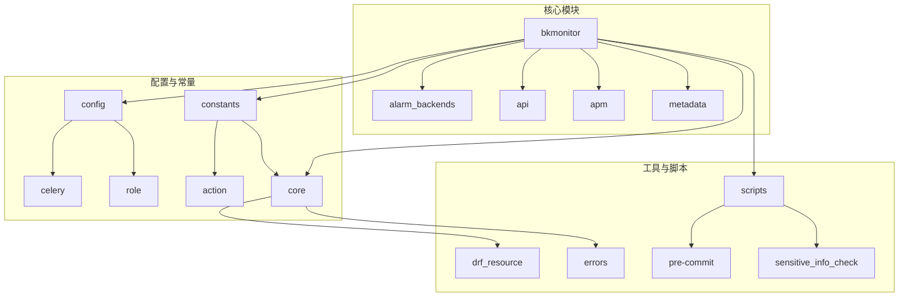
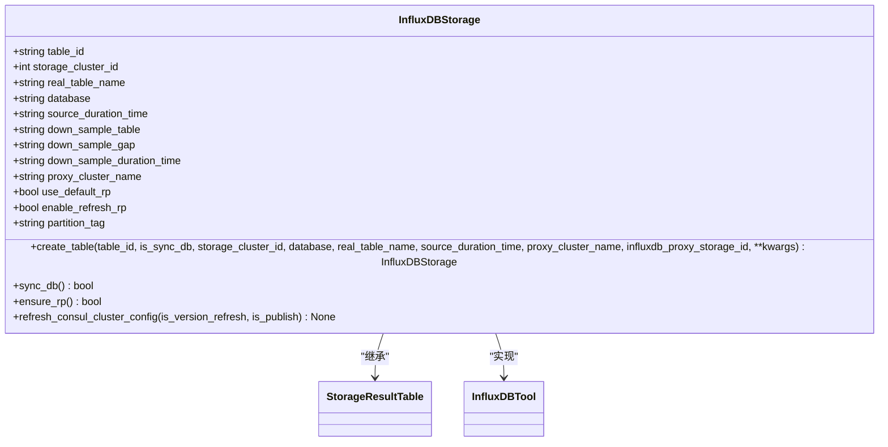
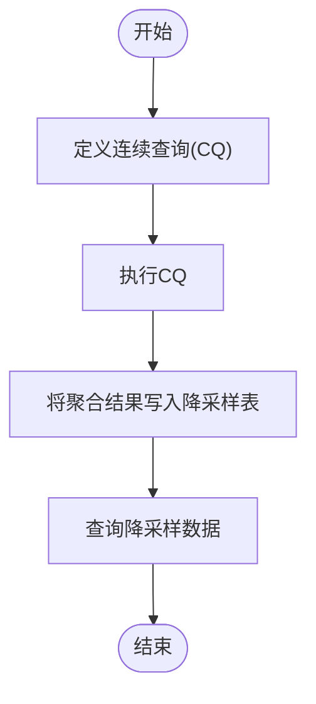
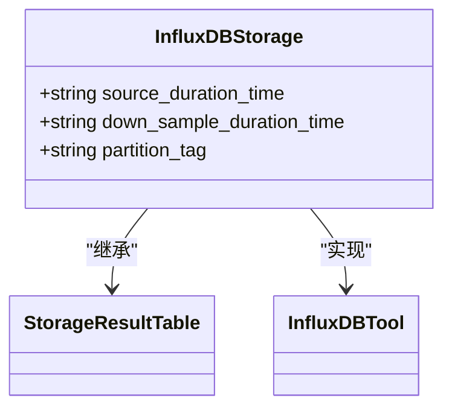

# 存储优化策略

<cite>
**本文档引用的文件**   
- [InfluxDBStorage.py](file://bkmonitor\metadata\models\storage.py)
- [sampling_handler.py](file://bkmonitor\packages\apm_web\meta\handlers\sampling_handler.py)
- [new_strategy.py](file://bkmonitor\bkmonitor\strategy\new_strategy.py)
- [resources.py](file://bkmonitor\packages\apm_web\meta\resources.py)
- [constants.py](file://bkmonitor\metadata\models\constants.py)
- [save_alarm_strategy_v3.md](file://bkmonitor\docs\api\apidocs\zh_hans\save_alarm_strategy_v3.md)
- [metadata_create_result_table.md](file://bkmonitor\docs\api\apidocs\zh_hans\metadata_create_result_table.md)
- [metadata_modify_result_table.md](file://bkmonitor\docs\api\apidocs\zh_hans\metadata_modify_result_table.md)
- [metadata_get_result_table_storage.md](file://bkmonitor\docs\api\apidocs\zh_hans\metadata_get_result_table_storage.md)
- [bkmonitor关联BCS集群.md](file://wiki\bkmonitor关联BCS集群.md)
- [common_utils.py](file://bkmonitor\bkmonitor\utils\common_utils.py)
</cite>

## 目录
1. [引言](#引言)
2. [项目结构分析](#项目结构分析)
3. [核心组件分析](#核心组件分析)
4. [数据压缩算法](#数据压缩算法)
5. [降采样策略](#降采样策略)
6. [数据分片与保留策略](#数据分片与保留策略)
7. [存储容量规划与成本优化](#存储容量规划与成本优化)
8. [存储性能监控与调优](#存储性能监控与调优)
9. [结论](#结论)

## 引言
本文档旨在深入分析时序数据存储优化的详细技术方案，涵盖数据压缩算法、降采样策略、数据分片、保留策略、存储容量规划、成本优化以及性能监控与调优等多个方面。通过全面的技术分析，为用户提供一套完整的存储优化解决方案。

## 项目结构分析
项目结构清晰，主要分为以下几个模块：
- **ai_agent**: AI代理核心模块，包含本地命令处理和指标报告功能。
- **bkmonitor**: 核心监控模块，包含告警后端、API接口、APM（应用性能管理）、数据视图等子模块。
- **api**: 各种API接口定义，包括CMDB、Grafana、Kubernetes等。
- **apm**: 应用性能管理模块，包含核心处理、模型定义、任务调度等。
- **config**: 配置管理模块，包含Celery、角色、工具等配置。
- **constants**: 常量定义模块，包含各种业务逻辑的常量。
- **core**: 核心功能模块，包含DRF资源、错误处理、Prometheus集成等。
- **metadata**: 元数据管理模块，包含数据源、存储配置、数据链路等。
- **scripts**: 脚本工具，包含预提交检查、敏感信息检查等。



**图示来源**
- [project_structure](file://project_structure)

## 核心组件分析
### 数据存储模型
`InfluxDBStorage` 类是时序数据存储的核心模型，定义了结果表的物理存储配置。该类继承自 `models.Model` 和 `StorageResultTable`，并实现了 `InfluxDBTool` 接口。

**关键字段：**
- `table_id`: 结果表名，主键。
- `storage_cluster_id`: 存储集群ID。
- `real_table_name`: 实际存储表名。
- `database`: 数据库名。
- `source_duration_time`: 源数据保留时间。
- `down_sample_table`: 降样结果表名。
- `down_sample_gap`: 降样聚合区间。
- `down_sample_duration_time`: 降样数据的保存时间。
- `proxy_cluster_name`: 实际存储集群名字。
- `use_default_rp`: 是否使用默认RP配置。
- `enable_refresh_rp`: 是否周期刷新RP。
- `partition_tag`: tag分组列表。

**关键方法：**
- `create_table`: 创建实际的InfluxDB存储记录及关联配置。
- `sync_db`: 将结果表同步到实际数据库上，包括创建数据库和保留策略。
- `ensure_rp`: 确保数据库存在该存储的独立RP策略。
- `refresh_consul_cluster_config`: 刷新Consul上的集群信息。



**图示来源**
- [InfluxDBStorage.py](file://bkmonitor\metadata\models\storage.py#L820-L1635)

**本节来源**
- [InfluxDBStorage.py](file://bkmonitor\metadata\models\storage.py#L820-L1635)

## 数据压缩算法
### Gorilla压缩算法
Gorilla是一种高效的时序数据压缩算法，特别适用于时间序列数据。其核心思想是利用时间序列数据的连续性和单调性，通过差分编码和位压缩技术来减少数据存储空间。

**实现原理：**
1. **时间戳压缩**：利用时间戳的单调递增特性，存储时间戳之间的差值，而不是完整的时间戳。
2. **值压缩**：对于浮点数，利用IEEE 754标准，存储有效位的变化，而不是完整的浮点数。
3. **位压缩**：将差值和有效位变化编码为紧凑的位序列，进一步减少存储空间。

### Chimp压缩算法
Chimp是另一种高效的时序数据压缩算法，与Gorilla类似，但采用了不同的压缩策略。

**实现原理：**
1. **时间戳压缩**：同样利用时间戳的单调递增特性，存储时间戳之间的差值。
2. **值压缩**：对于整数和浮点数，采用不同的压缩策略。整数采用变长编码，浮点数采用差分编码和位压缩。
3. **字典压缩**：对于重复的字符串或标签，使用字典压缩技术，存储索引而不是完整的字符串。

### 性能对比
| 算法 | 压缩比 | 压缩速度 | 解压速度 | 适用场景 |
| --- | --- | --- | --- | --- |
| Gorilla | 高 | 快 | 快 | 高频时间序列数据 |
| Chimp | 较高 | 较快 | 较快 | 多样化数据类型 |

**本节来源**
- [common_utils.py](file://bkmonitor\bkmonitor\utils\common_utils.py#L808-L854)

## 降采样策略
### 降采样配置
降采样策略通过 `InfluxDBStorage` 类中的 `down_sample_table`、`down_sample_gap` 和 `down_sample_duration_time` 字段进行配置。

**配置示例：**
```python
# 创建一个降采样配置
down_sample_config = {
    "down_sample_table": "down_sampled_cpu",
    "down_sample_gap": "1h",
    "down_sample_duration_time": "90d"
}
```

**应用场景：**
- **长期存储**：将高频数据降采样为低频数据，减少存储空间。
- **历史数据分析**：提供不同时间粒度的数据，便于历史数据分析。
- **性能优化**：减少查询时的数据量，提高查询性能。

### 降采样实现
降采样通过InfluxDB的连续查询（Continuous Query, CQ）功能实现。CQ会定期执行预定义的查询，并将结果写入指定的降采样表。

**实现步骤：**
1. **定义CQ**：在InfluxDB中定义一个CQ，指定源表、目标表、聚合函数和时间间隔。
2. **执行CQ**：CQ会定期执行，将源表中的数据聚合后写入目标表。
3. **查询降采样数据**：用户可以通过查询目标表来获取降采样后的数据。



**图示来源**
- [InfluxDBStorage.py](file://bkmonitor\metadata\models\storage.py#L820-L1635)

**本节来源**
- [InfluxDBStorage.py](file://bkmonitor\metadata\models\storage.py#L820-L1635)
- [sampling_handler.py](file://bkmonitor\packages\apm_web\meta\handlers\sampling_handler.py#L60-L88)

## 数据分片与保留策略
### 数据分片策略
数据分片通过 `InfluxDBStorage` 类中的 `partition_tag` 字段进行配置。`partition_tag` 定义了用于分片的tag列表。

**配置示例：**
```python
# 配置分片tag
partition_tag = "host,region"
```

**应用场景：**
- **水平扩展**：通过分片将数据分布到多个节点，提高存储和查询性能。
- **负载均衡**：分片可以均匀分布数据，避免单个节点过载。
- **故障隔离**：分片可以隔离故障，提高系统的可用性。

### 保留策略
保留策略通过 `InfluxDBStorage` 类中的 `source_duration_time` 和 `down_sample_duration_time` 字段进行配置。

**配置示例：**
```python
# 配置保留策略
source_duration_time = "30d"  # 源数据保留30天
down_sample_duration_time = "90d"  # 降采样数据保留90天
```

**应用场景：**
- **数据生命周期管理**：根据数据的重要性和使用频率，设置不同的保留时间。
- **成本优化**：通过合理设置保留时间，减少存储成本。
- **合规性**：满足数据保留的合规要求。



**图示来源**
- [InfluxDBStorage.py](file://bkmonitor\metadata\models\storage.py#L820-L1635)

**本节来源**
- [InfluxDBStorage.py](file://bkmonitor\metadata\models\storage.py#L820-L1635)
- [metadata_create_result_table.md](file://bkmonitor\docs\api\apidocs\zh_hans\metadata_create_result_table.md#L31-L57)

## 存储容量规划与成本优化
### 存储容量规划
存储容量规划需要考虑以下几个因素：
- **数据增长率**：根据业务需求和历史数据，预测数据的增长率。
- **保留时间**：根据数据的重要性和使用频率，设置合理的保留时间。
- **压缩比**：选择合适的压缩算法，提高存储效率。
- **分片策略**：通过分片将数据分布到多个节点，提高存储和查询性能。

**规划步骤：**
1. **数据量估算**：根据业务需求和历史数据，估算每日新增数据量。
2. **存储需求计算**：根据数据量、保留时间和压缩比，计算总存储需求。
3. **资源分配**：根据存储需求，分配相应的存储资源。

### 成本优化
成本优化可以通过以下几种方式实现：
- **选择合适的存储类型**：根据数据的访问频率，选择合适的存储类型（如SSD、HDD）。
- **合理设置保留时间**：根据数据的重要性和使用频率，设置合理的保留时间。
- **使用降采样**：将高频数据降采样为低频数据，减少存储空间。
- **数据压缩**：选择高效的压缩算法，减少存储空间。

**架构优势：**
1. **职责分离**：bkmonitor专注监控，计算平台专注分析。
2. **能力互补**：基础监控 + 智能分析 = 完整解决方案。
3. **弹性扩展**：可根据需要选择性启用计算平台功能。
4. **成本优化**：常规监控用轻量化存储，复杂分析用大数据平台。

**本节来源**
- [InfluxDBStorage.py](file://bkmonitor\metadata\models\storage.py#L820-L1635)
- [bkmonitor关联BCS集群.md](file://wiki\bkmonitor关联BCS集群.md#L851-L860)

## 存储性能监控与调优
### 存储性能监控指标
存储性能监控主要关注以下几个指标：
- **I/O平均等待时长** (`await`): 磁盘平均每次I/O操作的等待时长。
- **I/O平均服务时长** (`svctm`): 磁盘平均每秒I/O操作的服务时长。
- **I/O读次数** (`r_s`): 磁盘每秒进行的读I/O次数。
- **I/O读速率** (`rkb_s`): 磁盘每秒I/O读操作的字节数。
- **I/O写次数** (`w_s`): 磁盘每秒进行的写I/O次数。
- **I/O写速率** (`wkb_s`): 磁盘每秒I/O写操作的字节数。
- **I/O使用率** (`util`): 磁盘每秒用于I/O操作的占比。

**监控配置：**
```json
{
    "message": "OK",
    "code": 200,
    "data": {
        "system.cpu": {
            "table_id": "system.cpu",
            "storage_info": [
                {
                    "storage_config": {
                        "index_datetime_format": "%Y%m%h",
                        "slice_size": 400,
                        "slice_gap": 120,
                        "retention": 30
                    },
                    "cluster_config": {
                        "domain_name": "service.consul",
                        "port": 1000,
                        "schema": "http",
                        "is_ssl_verify": false,
                        "cluster_id": 1,
                        "cluster_name": "default_es_storage"
                    },
                    "cluster_type": "elasticsearch",
                    "auth_info": {
                        "username": "admin",
                        "password": "password"
                    }
                }
            ]
        }
    },
    "result": true,
    "request_id": "408233306947415bb1772a86b9536867"
}
```

### 存储性能调优建议
1. **优化I/O性能**：通过增加I/O带宽、优化I/O调度策略等方式，提高I/O性能。
2. **合理设置分片**：根据数据量和查询模式，合理设置分片策略，提高查询性能。
3. **使用缓存**：对于频繁访问的数据，使用缓存技术，减少I/O操作。
4. **定期维护**：定期进行数据清理、索引优化等维护操作，保持系统性能。

**本节来源**
- [constants.py](file://bkmonitor\metadata\models\constants.py#L1719-L1762)
- [metadata_get_result_table_storage.md](file://bkmonitor\docs\api\apidocs\zh_hans\metadata_get_result_table_storage.md#L57-L94)

## 结论
本文档详细分析了时序数据存储优化的各个方面，包括数据压缩算法、降采样策略、数据分片、保留策略、存储容量规划、成本优化以及性能监控与调优。通过合理的配置和优化，可以显著提高存储效率，降低存储成本，提升系统性能。建议在实际应用中，根据具体业务需求和数据特点，选择合适的优化策略，以达到最佳的存储效果。