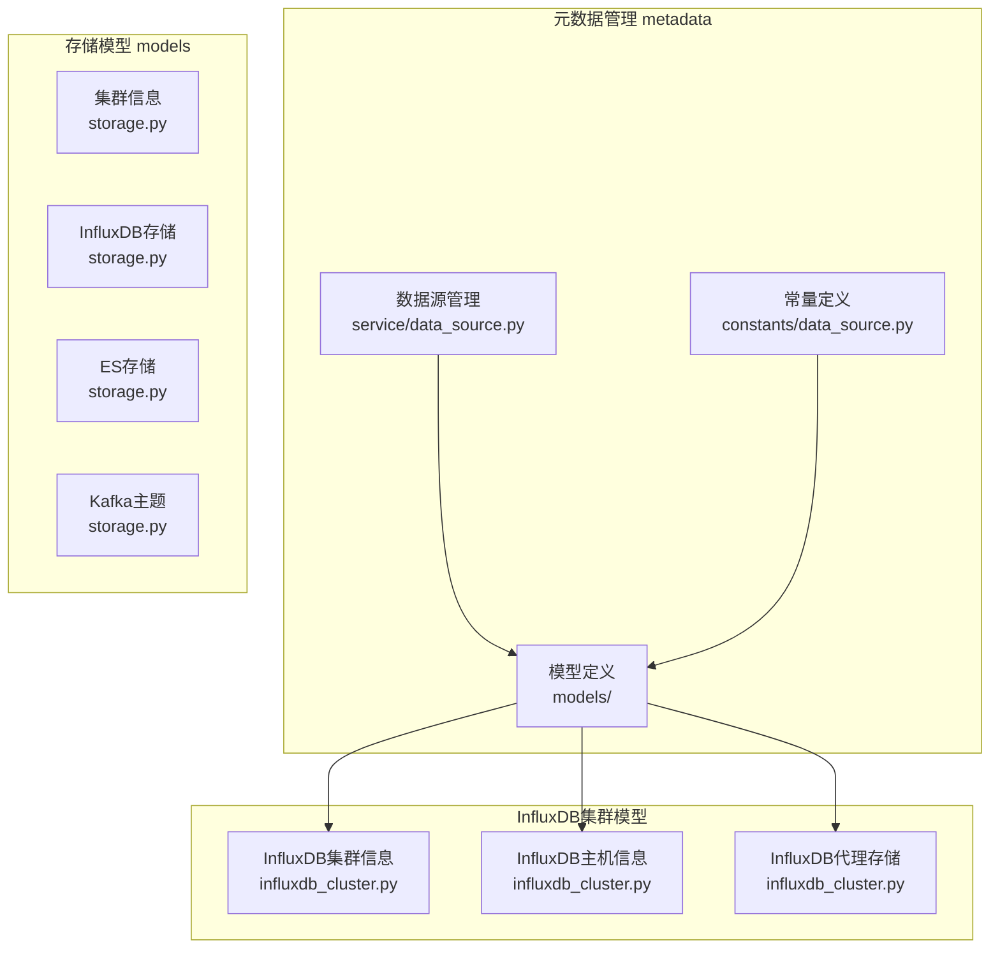
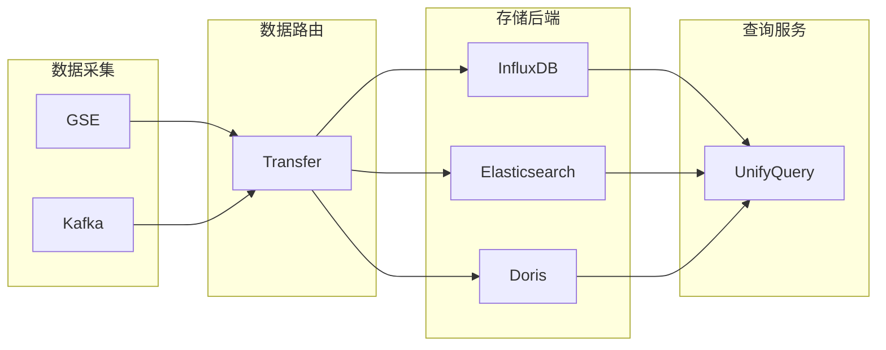
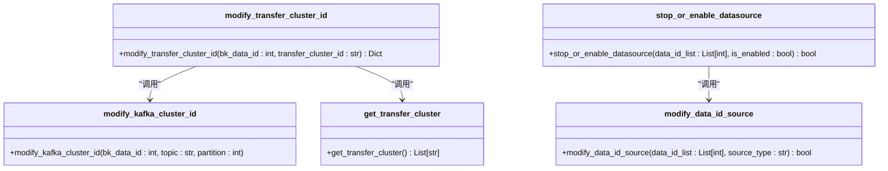
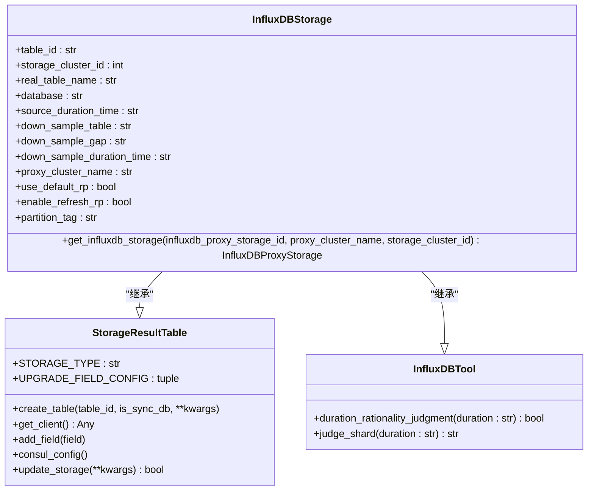
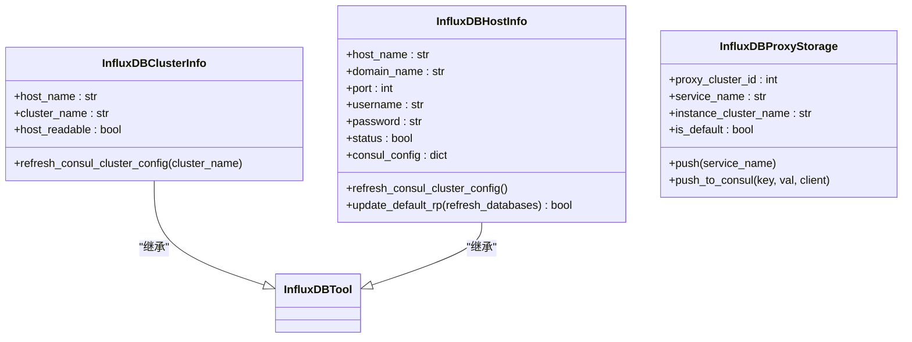
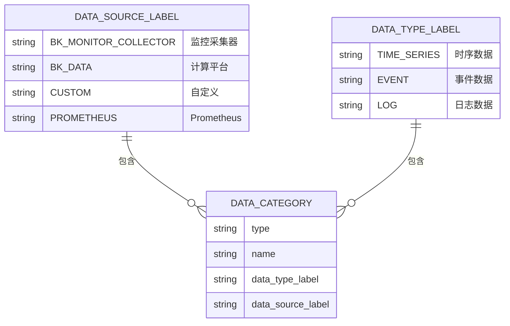
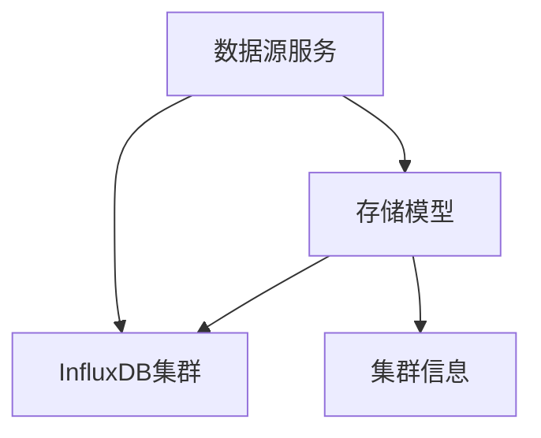

# 时序数据存储

<cite>
**本文档引用文件**   
- [data_source.py](file://bkmonitor\metadata\service\data_source.py)
- [data_source.py](file://bkmonitor\constants\data_source.py)
- [storage.py](file://bkmonitor\metadata\models\storage.py)
- [influxdb_cluster.py](file://bkmonitor\metadata\models\influxdb_cluster.py)
</cite>

## 目录
1. [引言](#引言)
2. [项目结构](#项目结构)
3. [核心组件](#核心组件)
4. [架构概述](#架构概述)
5. [详细组件分析](#详细组件分析)
6. [依赖分析](#依赖分析)
7. [性能考虑](#性能考虑)
8. [故障排除指南](#故障排除指南)
9. [结论](#结论)

## 引言
本文档旨在深入分析蓝鲸监控平台（BlueKing - Monitor）中的时序数据存储架构。该系统专为大规模监控数据管理而设计，通过集成多种时序数据库和分析引擎，实现了高效的数据采集、存储、查询与分析。文档将详细阐述其数据模型、存储选型、高基数问题处理、数据保留与降采样策略等核心功能，为系统运维和优化提供全面的技术指导。

## 项目结构
蓝鲸监控平台的时序数据存储功能主要分布在`bkmonitor`目录下的`metadata`子模块中。该模块负责管理数据源、存储集群、结果表等元数据信息，是整个监控数据流的配置中心。

**图示来源**
- [data_source.py](file://bkmonitor\metadata\service\data_source.py)
- [data_source.py](file://bkmonitor\constants\data_source.py)
- [storage.py](file://bkmonitor\metadata\models\storage.py)
- [influxdb_cluster.py](file://bkmonitor\metadata\models\influxdb_cluster.py)

**本节来源**
- [data_source.py](file://bkmonitor\metadata\service\data_source.py)
- [data_source.py](file://bkmonitor\constants\data_source.py)
- [storage.py](file://bkmonitor\metadata\models\storage.py)
- [influxdb_cluster.py](file://bkmonitor\metadata\models\influxdb_cluster.py)

## 核心组件
时序数据存储的核心组件包括数据源管理、存储后端管理、结果表模型和InfluxDB集群管理。这些组件协同工作，确保监控数据能够被正确采集、路由、存储和查询。

**本节来源**
- [data_source.py](file://bkmonitor\metadata\service\data_source.py)
- [storage.py](file://bkmonitor\metadata\models\storage.py)
- [influxdb_cluster.py](file://bkmonitor\metadata\models\influxdb_cluster.py)

## 架构概述
系统采用分层架构，将数据源、消息队列、存储后端和查询服务解耦。数据首先通过GSE或Kafka采集，然后根据配置路由到不同的存储后端，如InfluxDB（时序数据）或Elasticsearch（日志与事件数据）。统一查询服务（UnifyQuery）提供对所有后端的抽象访问。

**图示来源**
- [storage.py](file://bkmonitor\metadata\models\storage.py)
- [influxdb_cluster.py](file://bkmonitor\metadata\models\influxdb_cluster.py)

## 详细组件分析

### 数据源管理分析
数据源管理模块负责定义和管理所有数据输入的配置，包括数据来源、类型和路由信息。

#### 数据源服务功能
`data_source.py` 文件中的服务函数提供了对数据源的增删改查操作，是运维管理的核心接口。

**图示来源**
- [data_source.py](file://bkmonitor\metadata\service\data_source.py)

**本节来源**
- [data_source.py](file://bkmonitor\metadata\service\data_source.py)

### 存储后端分析
存储后端管理模块定义了对不同数据库的抽象和操作，确保系统可以灵活地支持多种存储技术。

#### InfluxDB存储模型
`InfluxDBStorage` 模型是时序数据在InfluxDB中存储的核心配置，它定义了数据保留、降采样等关键策略。

**图示来源**
- [storage.py](file://bkmonitor\metadata\models\storage.py)

**本节来源**
- [storage.py](file://bkmonitor\metadata\models\storage.py)

#### InfluxDB集群管理
`influxdb_cluster.py` 文件定义了对InfluxDB物理集群、主机和代理的管理模型，实现了集群的动态配置和高可用。

**图示来源**
- [influxdb_cluster.py](file://bkmonitor\metadata\models\influxdb_cluster.py)

**本节来源**
- [influxdb_cluster.py](file://bkmonitor\metadata\models\influxdb_cluster.py)

### 数据类型与标签分析
`data_source.py` 常量文件定义了系统中所有数据的分类和标签体系，是数据模型设计的基础。

#### 数据源与数据类型标签
系统通过`DataSourceLabel`和`DataTypeLabel`两个枚举类对数据进行分类，确保数据处理逻辑的清晰和一致。

**图示来源**
- [data_source.py](file://bkmonitor\constants\data_source.py)

**本节来源**
- [data_source.py](file://bkmonitor\constants\data_source.py)

## 依赖分析
各组件之间存在明确的依赖关系。`data_source.py` 服务依赖于 `storage.py` 和 `influxdb_cluster.py` 中定义的模型来执行具体的数据库操作。`InfluxDBStorage` 模型依赖于 `InfluxDBProxyStorage` 来确定数据的实际存储位置。这种分层依赖确保了代码的模块化和可维护性。

**图示来源**
- [data_source.py](file://bkmonitor\metadata\service\data_source.py)
- [storage.py](file://bkmonitor\metadata\models\storage.py)
- [influxdb_cluster.py](file://bkmonitor\metadata\models\influxdb_cluster.py)

**本节来源**
- [data_source.py](file://bkmonitor\metadata\service\data_source.py)
- [storage.py](file://bkmonitor\metadata\models\storage.py)
- [influxdb_cluster.py](file://bkmonitor\metadata\models\influxdb_cluster.py)

## 性能考虑
系统的性能关键在于数据写入的吞吐量和查询的响应速度。通过使用Kafka作为消息队列，实现了数据采集与存储的解耦，保证了高吞吐量。InfluxDB的分片（shard）策略和降采样机制有效管理了数据生命周期，确保了长期存储的性能。Elasticsearch的索引别名和快照功能则保障了日志数据的高效查询和灾备。

## 故障排除指南
当遇到数据写入失败或查询超时等问题时，应首先检查相关组件的Consul配置是否正确。`InfluxDBHostInfo` 和 `InfluxDBProxyStorage` 的配置错误是常见原因。其次，检查Kafka主题的分区和消费速率设置。最后，通过日志文件（如`data_source.py`中的`logger`）追踪具体的错误信息。

**本节来源**
- [data_source.py](file://bkmonitor\metadata\service\data_source.py)
- [storage.py](file://bkmonitor\metadata\models\storage.py)
- [influxdb_cluster.py](file://bkmonitor\metadata\models\influxdb_cluster.py)

## 结论
蓝鲸监控平台的时序数据存储架构设计精良，通过灵活的元数据管理和对多种存储后端的支持，满足了复杂监控场景的需求。其核心优势在于对InfluxDB集群的精细化管理，以及通过统一查询服务实现的多数据源抽象。未来可进一步优化高基数标签的处理和跨集群的数据聚合查询性能。