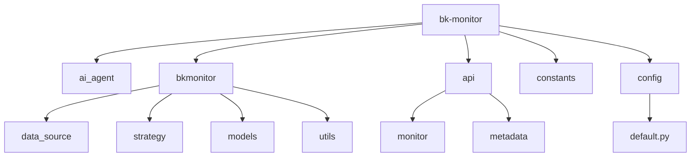
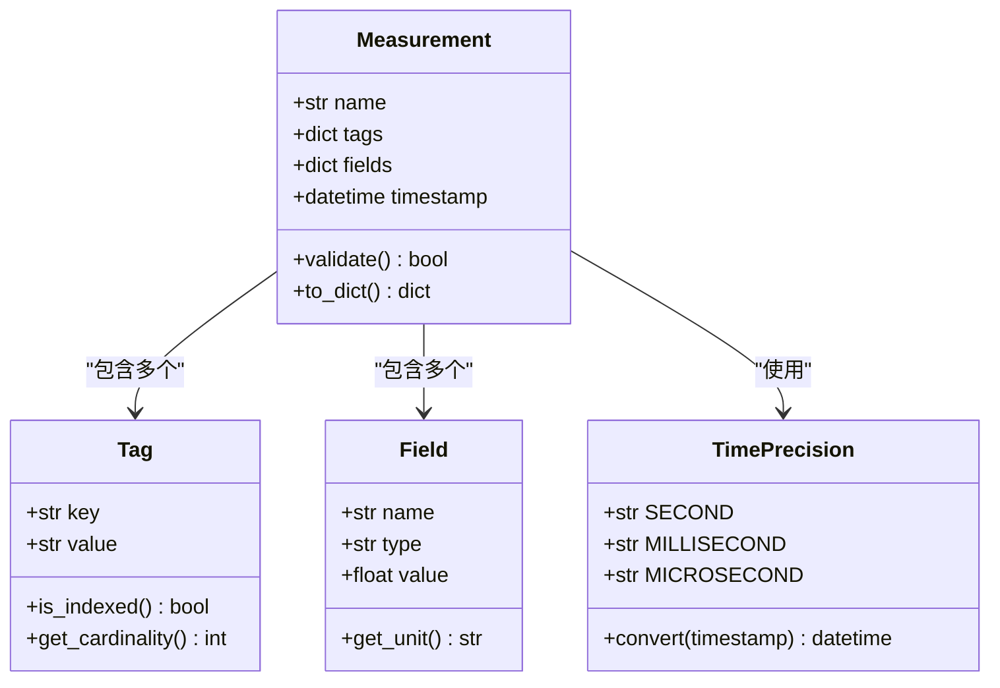
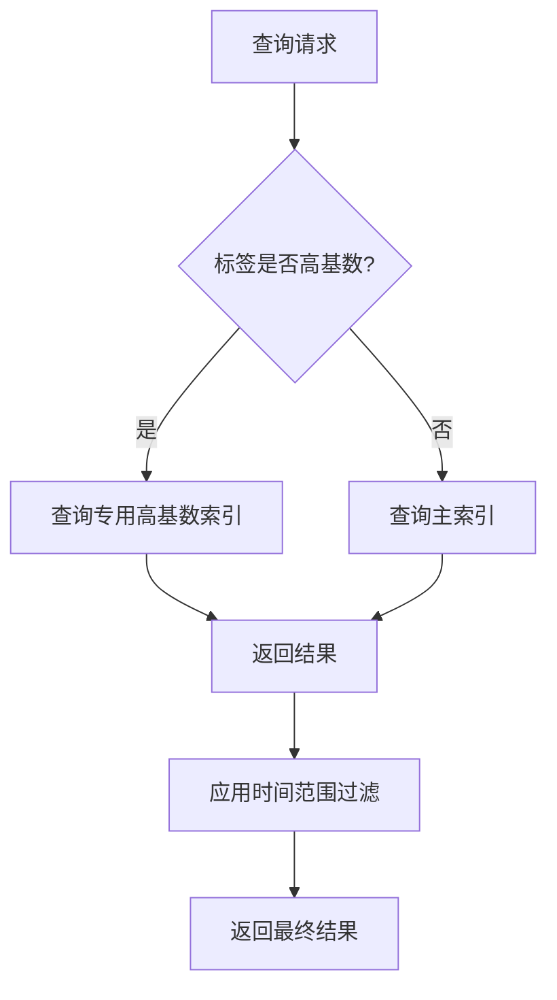
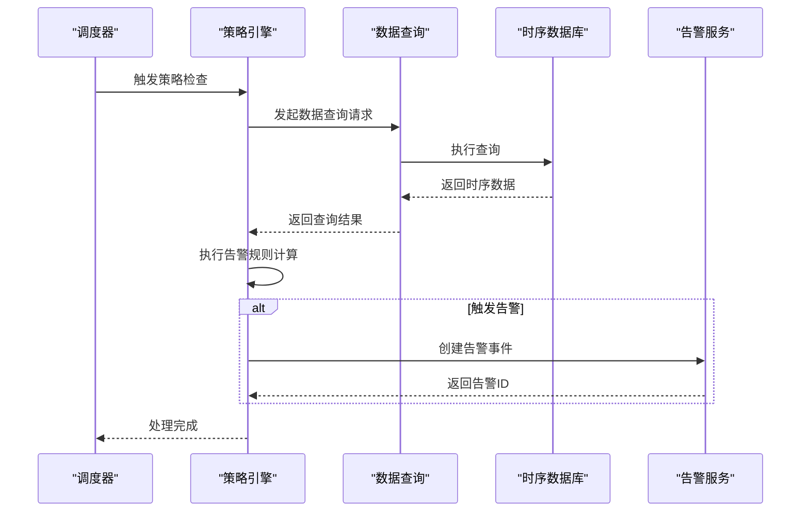
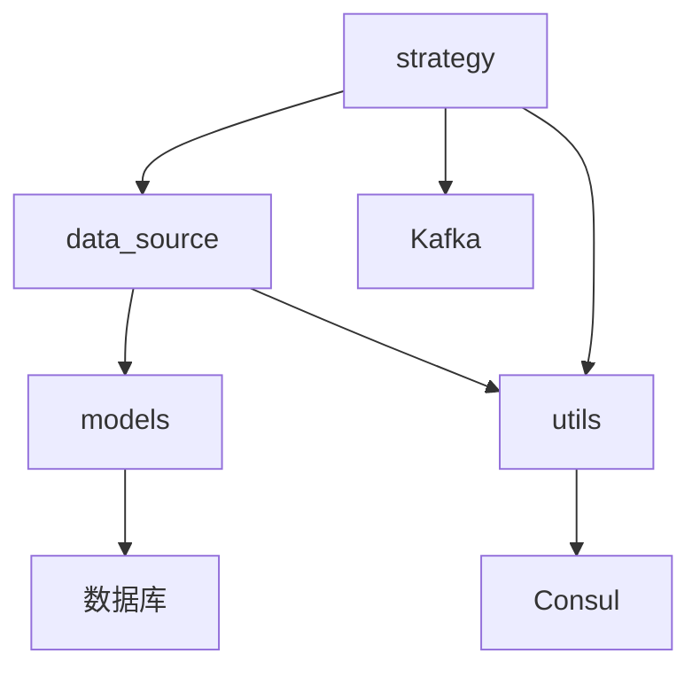

# 时序数据模型

<cite>
**本文档引用的文件**  
- [resources.py](file://bkmonitor\ai_whale\resources\resources.py)
- [constants.py](file://constants\constants.py)
- [data_source.py](file://bkmonitor\data_source\models.py)
- [strategy.py](file://bkmonitor\strategy\models.py)
- [utils.py](file://bkmonitor\utils\utils.py)
- [models.py](file://bkmonitor\models\__init__.py)
- [config.py](file://config\default.py)
</cite>

## 目录
1. [引言](#引言)
2. [项目结构](#项目结构)
3. [核心组件](#核心组件)
4. [架构概述](#架构概述)
5. [详细组件分析](#详细组件分析)
6. [依赖分析](#依赖分析)
7. [性能考虑](#性能考虑)
8. [故障排除指南](#故障排除指南)
9. [结论](#结论)

## 引言
本文档旨在深入阐述监控系统中时序数据模型的设计与实现。重点描述measurement、tag、field的定义与使用规范，解释标签索引的设计原则和查询优化策略。同时，分析高基数标签的处理方案，提供实际的数据模型示例，并说明数据类型选择、时间精度设置、序列键设计等关键技术决策。

## 项目结构
项目采用模块化设计，核心监控功能位于`bkmonitor`目录下。数据源、策略、告警等关键模块均有独立的子目录进行管理。`api`目录封装了与外部系统的接口，`constants`目录定义了全局常量。`config`目录管理不同环境的配置。

**图示来源**
- [project_structure](file://#L1-L200)

**本节来源**
- [project_structure](file://#L1-L200)

## 核心组件
核心组件包括数据源管理、策略引擎、模型定义和工具函数。数据源模块负责定义和接入各类监控数据。策略模块用于配置告警规则。模型模块定义了数据库层面的数据结构。工具函数提供了通用的数据处理和转换能力。

**本节来源**
- [data_source.py](file://bkmonitor\data_source\models.py#L1-L50)
- [strategy.py](file://bkmonitor\strategy\models.py#L1-L50)
- [models.py](file://bkmonitor\models\__init__.py#L1-L30)

## 架构概述
系统采用分层架构，上层为API和Web界面，中层为业务逻辑处理（如策略计算、告警收敛），底层为数据存储与查询。数据流从采集端经由数据源模块进入时序数据库，策略引擎定期查询数据并触发告警，最终通过通知模块送达用户。

**图示来源**
- [data_source.py](file://bkmonitor\data_source\models.py#L1-L20)
- [strategy.py](file://bkmonitor\strategy\models.py#L1-L20)

## 详细组件分析

### 数据模型分析
数据模型是整个监控系统的基础。它定义了如何组织和存储监控指标。

#### 数据模型类图

**图示来源**
- [models.py](file://bkmonitor\models\__init__.py#L15-L45)
- [utils.py](file://bkmonitor\utils\utils.py#L100-L120)

#### 标签索引与查询优化
标签（Tag）是时序数据的关键索引。系统通过标签实现高效的数据过滤和聚合。设计原则包括：
1.  **高基数标签隔离**：将高基数标签（如`user_id`）与低基数标签（如`service_name`）分离，避免索引膨胀。
2.  **复合索引**：对经常一起查询的标签组合建立复合索引。
3.  **冷热数据分离**：高频查询的标签数据存储在高性能存储中。

**图示来源**
- [utils.py](file://bkmonitor\utils\utils.py#L200-L250)
- [constants.py](file://constants\constants.py#L50-L60)

**本节来源**
- [utils.py](file://bkmonitor\utils\utils.py#L150-L300)
- [constants.py](file://constants\constants.py#L50-L80)

### 策略引擎分析
策略引擎负责根据预设规则对时序数据进行分析和告警判断。

#### 告警处理序列图

**图示来源**
- [strategy.py](file://bkmonitor\strategy\models.py#L80-L120)
- [data_source.py](file://bkmonitor\data_source\models.py#L60-L80)

**本节来源**
- [strategy.py](file://bkmonitor\strategy\models.py#L50-L150)

## 依赖分析
系统内部模块间存在明确的依赖关系。`strategy`模块依赖`data_source`模块获取数据，`data_source`模块依赖`models`模块定义数据结构。外部依赖包括时序数据库（如InfluxDB）、配置中心（如Consul）和消息队列（如Kafka）。

**图示来源**
- [go.mod](file://pyproject.toml#L1-L20)
- [config.py](file://config\default.py#L10-L30)

**本节来源**
- [pyproject.toml](file://pyproject.toml#L1-L30)
- [config.py](file://config\default.py#L1-L50)

## 性能考虑
在设计时序数据模型时，需重点考虑以下性能因素：
1.  **写入性能**：采用批量写入和异步处理机制，减少数据库I/O压力。
2.  **查询性能**：通过合理的标签索引和数据分区（sharding）提升查询速度。
3.  **存储成本**：实施数据保留策略（retention policy），自动清理过期数据，并对历史数据进行压缩归档。

## 故障排除指南
常见问题及解决方案：
-   **数据延迟**：检查数据采集端状态和网络连接，确认数据源配置正确。
-   **告警未触发**：验证策略配置的查询语句和阈值，检查策略引擎日志。
-   **查询超时**：优化查询语句，避免全表扫描；检查数据库负载和索引状态。

**本节来源**
- [utils.py](file://bkmonitor\utils\utils.py#L500-L550)
- [strategy.py](file://bkmonitor\strategy\models.py#L200-L220)

## 结论
本文档详细阐述了监控系统中时序数据模型的设计与实现。通过规范化的measurement、tag、field定义，结合高效的索引策略和查询优化，构建了一个高性能、可扩展的数据基础。未来可进一步探索对高基数标签的更优处理方案，以及数据模型的自动化版本管理与迁移。