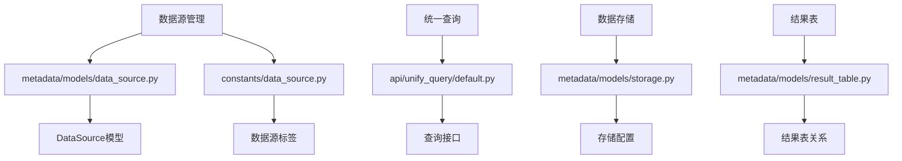
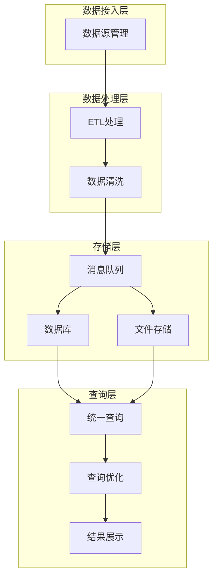
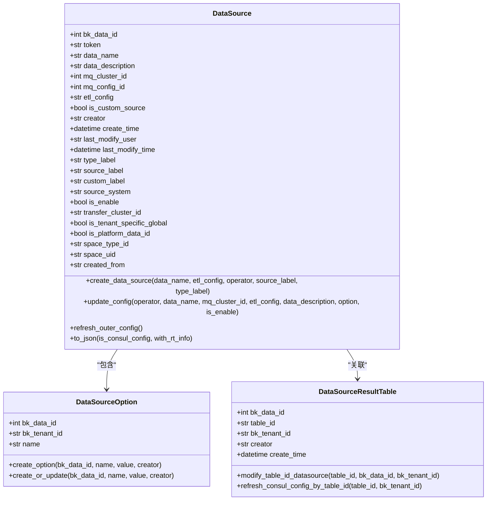
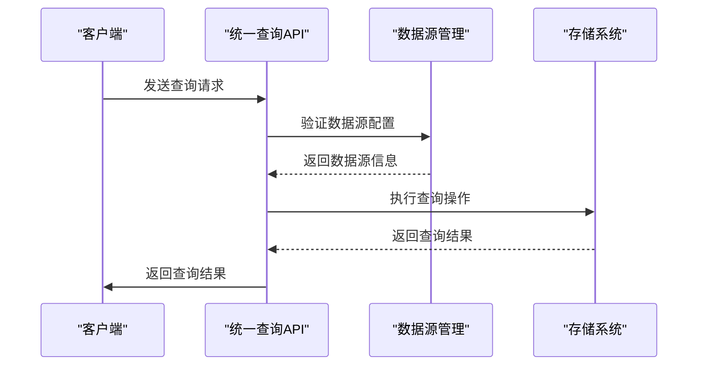
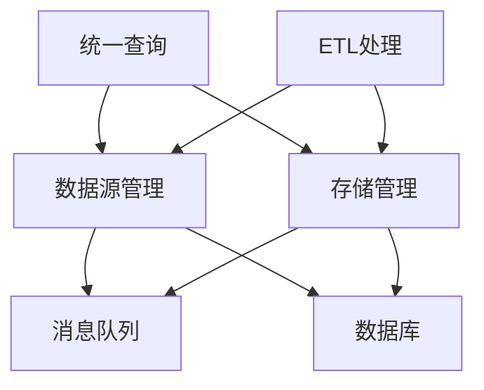

# 查询性能优化

<cite>
**本文档引用的文件**   
- [data_source.py](file://bkmonitor/constants/data_source.py)
- [data_source.py](file://bkmonitor/metadata/models/data_source.py)
- [data_source.py](file://bkmonitor/metadata/service/data_source.py)
- [default.py](file://bkmonitor/api/unify_query/default.py)
- [data_source.py](file://bkmonitor/core/errors/bkmonitor/data_source.py)
- [bcs_cluster.py](file://bkmonitor/bkmonitor/models/bcs_cluster.py)
- [storage.py](file://bkmonitor/metadata/models/storage.py)
- [result_table.py](file://bkmonitor/metadata/models/result_table.py)
- [time_series.py](file://bkmonitor/metadata/models/custom_report/time_series.py)
- [v2.py](file://bkmonitor/packages/monitor_web/strategies/resources/v2.py)
- [content.py](file://bkmonitor/alarm_backends/core/context/content.py)
</cite>

## 目录
1. [引言](#引言)
2. [项目结构](#项目结构)
3. [核心组件](#核心组件)
4. [架构概述](#架构概述)
5. [详细组件分析](#详细组件分析)
6. [依赖分析](#依赖分析)
7. [性能考虑](#性能考虑)
8. [故障排除指南](#故障排除指南)
9. [结论](#结论)

## 引言
本文档旨在全面分析时序数据查询性能优化方案，系统性地阐述查询效率提升策略。文档将深入探讨查询缓存机制、预计算聚合、索引优化等关键技术实现，详细说明查询重写和执行计划优化策略。同时提供复杂查询的性能分析方法，展示慢查询诊断和优化案例，并解释查询限流、资源隔离等系统保护机制。

## 项目结构
通过对项目结构的分析，可以发现数据源管理和统一查询是监控平台的核心功能模块。`bkmonitor/metadata/models/data_source.py`文件定义了数据源的核心模型，而`bkmonitor/api/unify_query/default.py`则提供了统一查询的接口定义。

**图示来源**
- [data_source.py](file://bkmonitor/metadata/models/data_source.py)
- [data_source.py](file://bkmonitor/constants/data_source.py)
- [default.py](file://bkmonitor/api/unify_query/default.py)
- [storage.py](file://bkmonitor/metadata/models/storage.py)
- [result_table.py](file://bkmonitor/metadata/models/result_table.py)

**本节来源**
- [data_source.py](file://bkmonitor/metadata/models/data_source.py)
- [default.py](file://bkmonitor/api/unify_query/default.py)

## 核心组件
核心组件主要包括数据源管理、统一查询服务和存储管理。`DataSource`模型是数据源管理的核心，负责定义数据源的配置和属性。`unify_query`模块提供了统一的查询接口，支持多种数据源的查询操作。

**本节来源**
- [data_source.py](file://bkmonitor/metadata/models/data_source.py)
- [default.py](file://bkmonitor/api/unify_query/default.py)

## 架构概述
系统架构采用分层设计，包括数据接入层、数据处理层、存储层和查询层。数据源管理模块负责数据接入和配置，统一查询模块提供标准化的查询接口，存储管理模块负责数据的持久化和检索。

**图示来源**
- [data_source.py](file://bkmonitor/metadata/models/data_source.py)
- [default.py](file://bkmonitor/api/unify_query/default.py)

## 详细组件分析

### 数据源管理分析
数据源管理组件负责数据源的创建、配置和管理。`DataSource`模型定义了数据源的核心属性，包括数据源ID、名称、描述、消息队列配置等。

#### 类图分析

**图示来源**
- [data_source.py](file://bkmonitor/metadata/models/data_source.py)

**本节来源**
- [data_source.py](file://bkmonitor/metadata/models/data_source.py)

### 统一查询分析
统一查询组件提供标准化的查询接口，支持多种数据源的查询操作。`unify_query`模块定义了查询接口，允许用户通过统一的方式查询不同数据源的数据。

#### 序列图分析

**图示来源**
- [default.py](file://bkmonitor/api/unify_query/default.py)
- [data_source.py](file://bkmonitor/metadata/models/data_source.py)
- [storage.py](file://bkmonitor/metadata/models/storage.py)

**本节来源**
- [default.py](file://bkmonitor/api/unify_query/default.py)

## 依赖分析
系统各组件之间存在紧密的依赖关系。数据源管理模块依赖于存储管理模块，统一查询模块依赖于数据源管理和存储管理模块。

**图示来源**
- [data_source.py](file://bkmonitor/metadata/models/data_source.py)
- [default.py](file://bkmonitor/api/unify_query/default.py)
- [storage.py](file://bkmonitor/metadata/models/storage.py)

**本节来源**
- [data_source.py](file://bkmonitor/metadata/models/data_source.py)
- [default.py](file://bkmonitor/api/unify_query/default.py)
- [storage.py](file://bkmonitor/metadata/models/storage.py)

## 性能考虑
在设计和实现查询性能优化方案时，需要考虑以下几个方面：
1. 查询缓存机制：通过缓存频繁查询的结果，减少数据库访问次数。
2. 预计算聚合：对常用查询进行预计算，提高查询效率。
3. 索引优化：合理设计数据库索引，加快数据检索速度。
4. 查询重写：优化查询语句，减少不必要的计算和数据传输。
5. 执行计划优化：选择最优的查询执行计划，提高查询性能。

## 故障排除指南
当遇到查询性能问题时，可以按照以下步骤进行排查：
1. 检查查询语句是否合理，是否存在不必要的计算和数据传输。
2. 检查数据库索引是否合理，是否需要添加或优化索引。
3. 检查查询缓存是否生效，是否需要调整缓存策略。
4. 检查系统资源使用情况，是否存在资源瓶颈。
5. 检查数据源配置是否正确，是否存在配置错误。

**本节来源**
- [data_source.py](file://bkmonitor/metadata/models/data_source.py)
- [default.py](file://bkmonitor/api/unify_query/default.py)

## 结论
本文档系统性地分析了时序数据查询性能优化方案，详细阐述了查询效率提升策略。通过深入探讨查询缓存机制、预计算聚合、索引优化等关键技术实现，以及查询重写和执行计划优化策略，为提升查询性能提供了全面的指导。同时，文档还提供了复杂查询的性能分析方法和慢查询诊断案例，帮助用户更好地理解和优化查询性能。