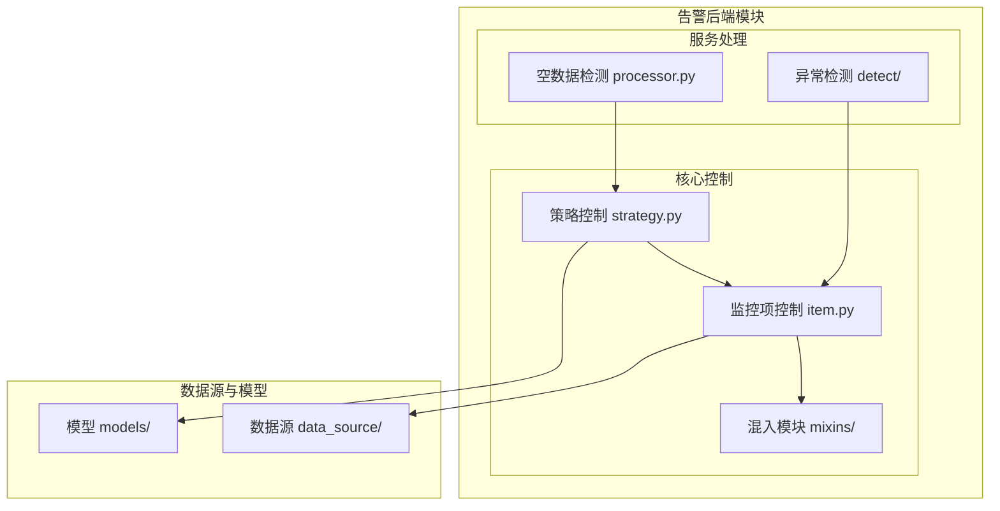
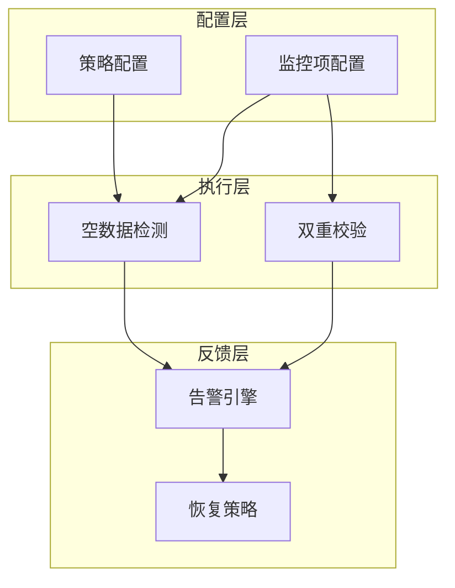
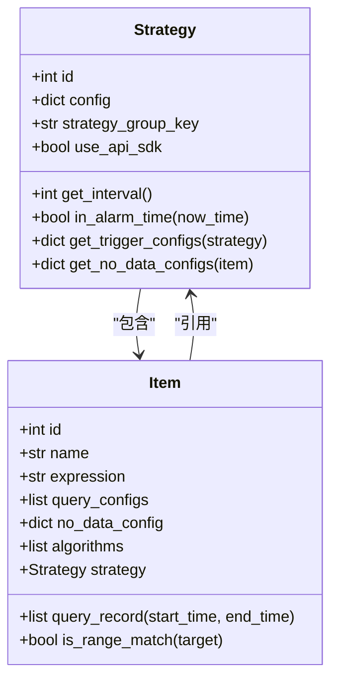
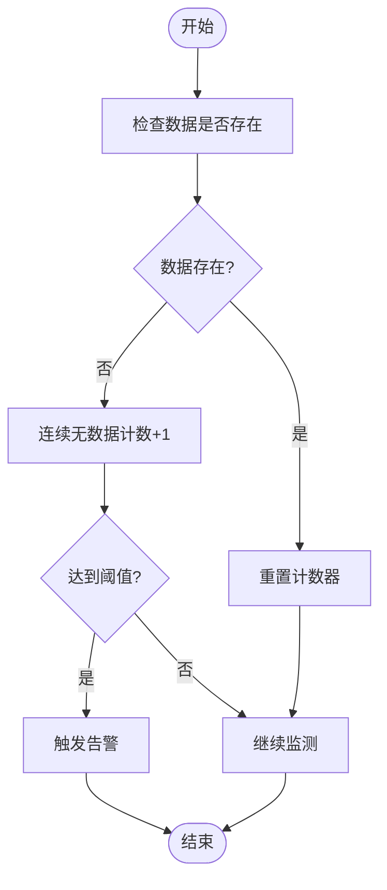
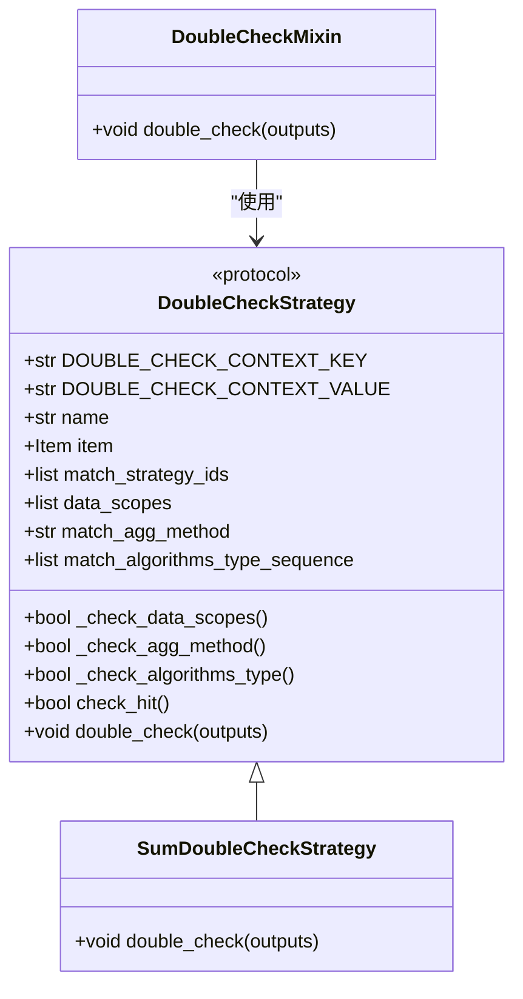
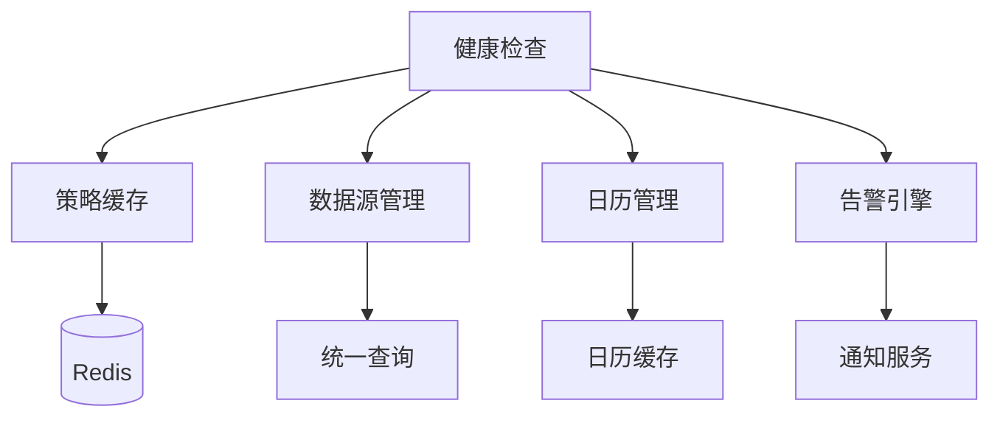

# 健康检查机制

<cite>
**本文档引用的文件**  
- [strategy.py](file://bkmonitor/alarm_backends/core/control/strategy.py)
- [item.py](file://bkmonitor/alarm_backends/core/control/item.py)
- [double_check.py](file://bkmonitor/alarm_backends/core/control/mixins/double_check.py)
- [sum.py](file://bkmonitor/alarm_backends/service/detect/double_check_strategies/sum.py)
- [processor.py](file://bkmonitor/alarm_backends/service/nodata/processor.py)
</cite>

## 目录
1. [引言](#引言)
2. [项目结构](#项目结构)
3. [核心组件](#核心组件)
4. [架构概览](#架构概览)
5. [详细组件分析](#详细组件分析)
6. [依赖分析](#依赖分析)
7. [性能考量](#性能考量)
8. [故障排查指南](#故障排查指南)
9. [结论](#结论)

## 引言
本文档全面阐述了蓝鲸监控平台中控制模块的健康检查与高可用保障机制。重点说明心跳检测、空数据检测（NoData）和双重校验（DoubleCheck）等核心健康检查策略的工作原理，以及在服务异常时的自动故障转移、熔断降级和恢复策略。同时，文档还解释了健康检查与其他模块（如告警引擎、数据采集）的联动机制，并提供了通过配置实现自定义健康检查逻辑的方法。

## 项目结构
蓝鲸监控平台的项目结构清晰，主要分为多个功能模块，包括AI代理、告警后端、API接口、APM（应用性能管理）、数据视图等。健康检查机制主要集中在`alarm_backends`模块中，特别是`service/nodata`和`core/control`子模块。

**图示来源**
- [strategy.py](file://bkmonitor/alarm_backends/core/control/strategy.py)
- [item.py](file://bkmonitor/alarm_backends/core/control/item.py)
- [processor.py](file://bkmonitor/alarm_backends/service/nodata/processor.py)

**本节来源**
- [strategy.py](file://bkmonitor/alarm_backends/core/control/strategy.py)
- [item.py](file://bkmonitor/alarm_backends/core/control/item.py)

## 核心组件
健康检查机制的核心组件包括策略管理（Strategy）、监控项管理（Item）、空数据检测处理器（NoData Processor）和双重校验机制（DoubleCheck）。这些组件协同工作，确保监控系统的稳定性和可靠性。

**本节来源**
- [strategy.py](file://bkmonitor/alarm_backends/core/control/strategy.py)
- [item.py](file://bkmonitor/alarm_backends/core/control/item.py)
- [processor.py](file://bkmonitor/alarm_backends/service/nodata/processor.py)

## 架构概览
健康检查机制的架构分为三层：配置层、执行层和反馈层。配置层负责定义健康检查的策略和参数；执行层负责实际的健康检查操作；反馈层负责将检查结果上报并触发相应的告警或恢复动作。

**图示来源**
- [strategy.py](file://bkmonitor/alarm_backends/core/control/strategy.py)
- [item.py](file://bkmonitor/alarm_backends/core/control/item.py)
- [processor.py](file://bkmonitor/alarm_backends/service/nodata/processor.py)

## 详细组件分析

### 策略与监控项分析
策略（Strategy）是健康检查的基本单位，每个策略包含一个或多个监控项（Item）。策略定义了检查的周期、优先级、生效时间等全局属性，而监控项则定义了具体的检查逻辑和数据源。

#### 策略类结构

**图示来源**
- [strategy.py](file://bkmonitor/alarm_backends/core/control/strategy.py#L0-L365)
- [item.py](file://bkmonitor/alarm_backends/core/control/item.py#L0-L245)

**本节来源**
- [strategy.py](file://bkmonitor/alarm_backends/core/control/strategy.py#L0-L365)
- [item.py](file://bkmonitor/alarm_backends/core/control/item.py#L0-L245)

### 空数据检测分析
空数据检测（NoData）是健康检查的重要组成部分，用于检测数据源是否在预期时间内上报数据。当检测到连续多个周期无数据时，系统会触发告警。

#### 空数据检测流程

**图示来源**
- [processor.py](file://bkmonitor/alarm_backends/service/nodata/processor.py)

**本节来源**
- [processor.py](file://bkmonitor/alarm_backends/service/nodata/processor.py)

### 双重校验机制分析
双重校验（DoubleCheck）是一种高级健康检查策略，用于在初步检测到异常后，进行二次确认，以减少误报。该机制通过定义不同的校验策略，对数据进行更深入的分析。

#### 双重校验类结构

**图示来源**
- [double_check.py](file://bkmonitor/alarm_backends/core/control/mixins/double_check.py#L0-L195)
- [sum.py](file://bkmonitor/alarm_backends/service/detect/double_check_strategies/sum.py#L123-L304)

**本节来源**
- [double_check.py](file://bkmonitor/alarm_backends/core/control/mixins/double_check.py#L0-L195)
- [sum.py](file://bkmonitor/alarm_backends/service/detect/double_check_strategies/sum.py#L123-L304)

## 依赖分析
健康检查机制依赖于多个核心模块，包括策略缓存、数据源管理、日历管理等。这些模块通过清晰的接口进行交互，确保系统的稳定性和可扩展性。

**图示来源**
- [strategy.py](file://bkmonitor/alarm_backends/core/control/strategy.py)
- [item.py](file://bkmonitor/alarm_backends/core/control/item.py)
- [processor.py](file://bkmonitor/alarm_backends/service/nodata/processor.py)

**本节来源**
- [strategy.py](file://bkmonitor/alarm_backends/core/control/strategy.py)
- [item.py](file://bkmonitor/alarm_backends/core/control/item.py)
- [processor.py](file://bkmonitor/alarm_backends/service/nodata/processor.py)

## 性能考量
健康检查机制在设计时充分考虑了性能因素。通过缓存策略、异步处理和批量操作，确保在大规模监控场景下仍能保持高效运行。例如，策略配置通过Redis缓存，避免频繁的数据库查询；双重校验采用异步任务，减少对主流程的影响。

## 故障排查指南
当健康检查机制出现问题时，可以按照以下步骤进行排查：
1. 检查策略配置是否正确，特别是检测周期和阈值。
2. 查看日志文件，定位具体的错误信息。
3. 验证数据源是否正常上报数据。
4. 检查缓存服务（如Redis）是否正常运行。
5. 确认告警引擎是否能够正常接收和处理告警。

**本节来源**
- [strategy.py](file://bkmonitor/alarm_backends/core/control/strategy.py)
- [item.py](file://bkmonitor/alarm_backends/core/control/item.py)
- [processor.py](file://bkmonitor/alarm_backends/service/nodata/processor.py)

## 结论
蓝鲸监控平台的健康检查机制通过心跳检测、空数据检测和双重校验等多种策略，实现了对监控系统的全面保障。该机制不仅能够及时发现和处理异常，还能通过灵活的配置满足不同场景的需求。未来，可以通过引入更多智能化的检测算法，进一步提升系统的准确性和效率。