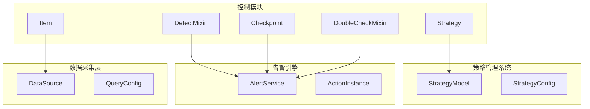
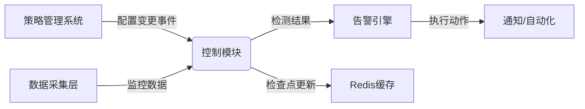
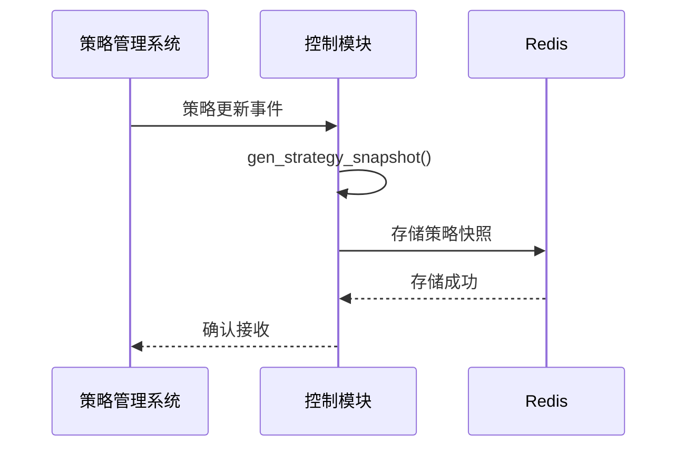
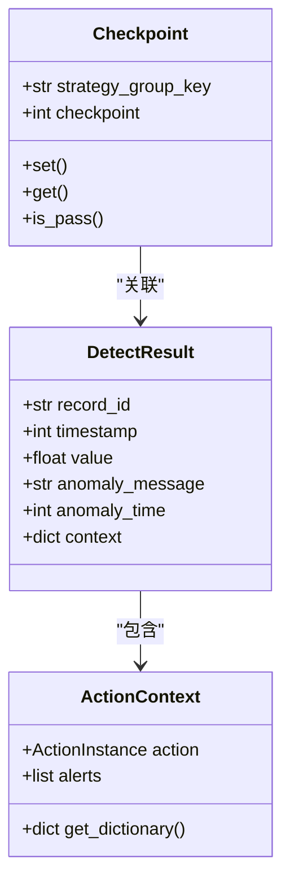
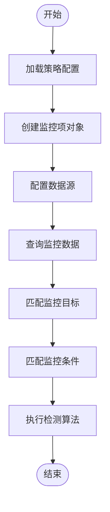
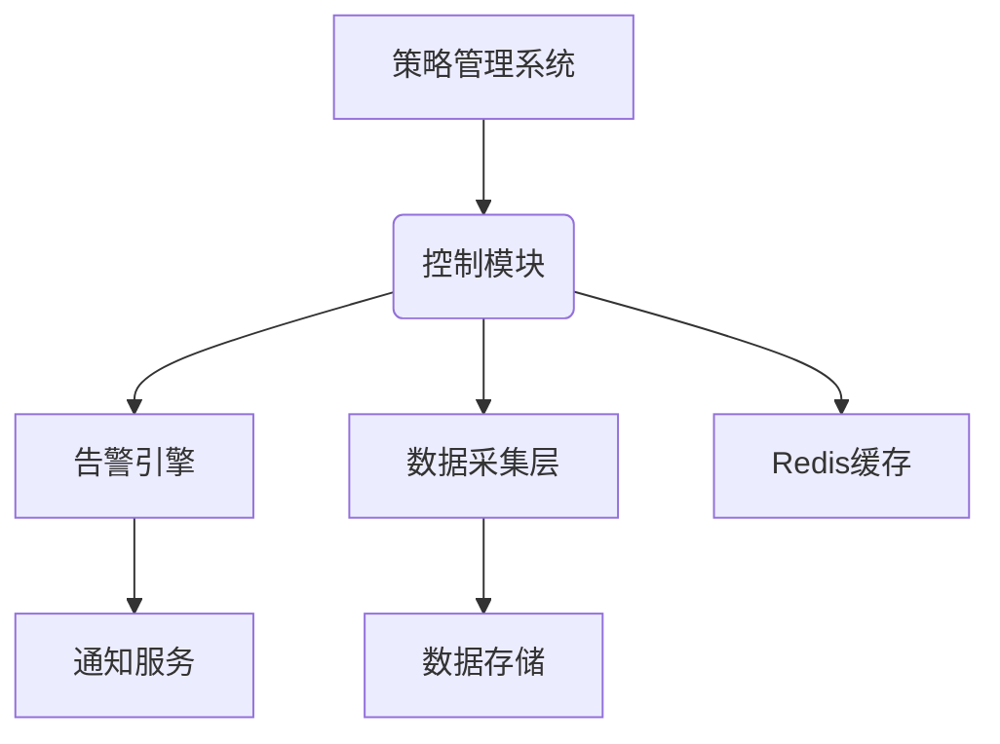

# 控制交互协议

<cite>
**本文档引用文件**   
- [detect.py](file://bkmonitor/alarm_backends/core/control/mixins/detect.py)
- [checkpoint.py](file://bkmonitor/alarm_backends/core/control/checkpoint.py)
- [double_check.py](file://bkmonitor/alarm_backends/core/control/mixins/double_check.py)
- [strategy.py](file://bkmonitor/alarm_backends/core/control/strategy.py)
- [item.py](file://bkmonitor/alarm_backends/core/control/item.py)
- [__init__.py](file://bkmonitor/alarm_backends/core/context/__init__.py)
</cite>

## 目录
1. [引言](#引言)
2. [项目结构](#项目结构)
3. [核心组件](#核心组件)
4. [架构概述](#架构概述)
5. [详细组件分析](#详细组件分析)
6. [依赖分析](#依赖分析)
7. [性能考虑](#性能考虑)
8. [故障排除指南](#故障排除指南)
9. [结论](#结论)

## 引言
本文档详细说明了蓝鲸监控平台中控制模块与其他核心组件的交互协议和接口规范。重点解析了控制模块与策略管理系统之间的配置同步机制、与告警引擎的数据交换格式和通信方式，以及与数据采集层的协同工作机制。通过分析关键代码文件，揭示了系统内部的事件驱动流程、错误处理策略和版本兼容性设计。

## 项目结构
蓝鲸监控平台的项目结构遵循模块化设计原则，核心功能分布在不同的目录中。控制模块位于`alarm_backends/core/control`目录下，包含检测、检查、策略管理等核心逻辑。策略管理系统通过`bkmonitor/models/strategy.py`管理策略配置，而告警引擎的相关逻辑分布在`alarm_backends/service/alert`等目录中。数据采集层的配置和管理则通过`packages/monitor_web/collecting`等模块实现。

**图源**
- [detect.py](file://bkmonitor/alarm_backends/core/control/mixins/detect.py)
- [strategy.py](file://bkmonitor/alarm_backends/core/control/strategy.py)
- [item.py](file://bkmonitor/alarm_backends/core/control/item.py)

## 核心组件
控制模块的核心组件包括检测混入（DetectMixin）、检查点管理（Checkpoint）、双重检查混入（DoubleCheckMixin）、策略（Strategy）和监控项（Item）。这些组件协同工作，实现监控数据的检测、异常发现和告警触发。检测混入负责执行具体的检测算法，检查点管理确保数据处理的连续性，双重检查混入提供额外的验证逻辑，策略和监控项则封装了配置信息和业务逻辑。

**节源**
- [detect.py](file://bkmonitor/alarm_backends/core/control/mixins/detect.py#L1-L212)
- [checkpoint.py](file://bkmonitor/alarm_backends/core/control/checkpoint.py#L1-L59)
- [double_check.py](file://bkmonitor/alarm_backends/core/control/mixins/double_check.py#L1-L195)

## 架构概述
系统采用分层架构设计，控制模块作为核心协调者，与策略管理系统、告警引擎和数据采集层进行交互。策略管理系统负责策略的创建、更新和删除，通过事件驱动机制通知控制模块。控制模块从数据采集层获取监控数据，执行检测算法，并将结果传递给告警引擎。告警引擎根据检测结果执行相应的动作，如发送通知或触发自动化处理。

**图源**
- [strategy.py](file://bkmonitor/alarm_backends/core/control/strategy.py#L1-L365)
- [item.py](file://bkmonitor/alarm_backends/core/control/item.py#L1-L245)

## 详细组件分析

### 控制模块与策略管理系统的交互
控制模块通过策略类（Strategy）与策略管理系统进行交互。当策略创建、更新或删除时，策略管理系统会触发相应的事件，控制模块通过`gen_strategy_snapshot`方法生成策略配置的快照，并存储在Redis中。`get_strategy_snapshot_by_key`方法用于从缓存中获取策略快照，确保配置的一致性。

**图源**
- [strategy.py](file://bkmonitor/alarm_backends/core/control/strategy.py#L200-L365)

**节源**
- [strategy.py](file://bkmonitor/alarm_backends/core/control/strategy.py#L1-L365)

### 控制模块与告警引擎的交互
控制模块与告警引擎通过数据交换格式和通信方式进行交互。检测结果以特定格式传递给告警引擎，包括异常点信息、上下文数据和策略快照。通信方式主要基于Redis消息队列，确保异步处理和高吞吐量。错误处理策略包括重试机制和日志记录，确保系统的可靠性。

**图源**
- [detect.py](file://bkmonitor/alarm_backends/core/control/mixins/detect.py#L1-L212)
- [checkpoint.py](file://bkmonitor/alarm_backends/core/control/checkpoint.py#L1-L59)
- [__init__.py](file://bkmonitor/alarm_backends/core/context/__init__.py#L1-L603)

### 控制模块与数据采集层的协同
控制模块与数据采集层通过监控项类（Item）进行协同工作。监控项类封装了查询配置和数据源信息，确保检测规则与采集配置的一致性。`query_record`方法用于从数据采集层获取监控数据，`is_range_match`方法用于匹配监控目标和条件。

**图源**
- [item.py](file://bkmonitor/alarm_backends/core/control/item.py#L1-L245)

**节源**
- [item.py](file://bkmonitor/alarm_backends/core/control/item.py#L1-L245)

## 依赖分析
控制模块与策略管理系统、告警引擎和数据采集层之间存在紧密的依赖关系。策略管理系统通过事件驱动机制通知控制模块，控制模块依赖数据采集层获取监控数据，告警引擎依赖控制模块提供检测结果。这些依赖关系通过接口和数据格式进行解耦，确保系统的可维护性和扩展性。

**图源**
- [strategy.py](file://bkmonitor/alarm_backends/core/control/strategy.py#L1-L365)
- [detect.py](file://bkmonitor/alarm_backends/core/control/mixins/detect.py#L1-L212)
- [item.py](file://bkmonitor/alarm_backends/core/control/item.py#L1-L245)

**节源**
- [strategy.py](file://bkmonitor/alarm_backends/core/control/strategy.py#L1-L365)
- [detect.py](file://bkmonitor/alarm_backends/core/control/mixins/detect.py#L1-L212)
- [item.py](file://bkmonitor/alarm_backends/core/control/item.py#L1-L245)

## 性能考虑
系统在设计时充分考虑了性能因素。通过Redis缓存策略快照和检查点，减少数据库查询次数。检测算法采用批量处理和并行执行，提高处理效率。错误处理策略包括重试机制和日志记录，确保系统的稳定性和可靠性。版本兼容性通过策略快照和配置转换实现，支持向后兼容。

## 故障排除指南
常见问题包括策略配置不生效、检测结果延迟和告警通知失败。排查步骤包括检查策略快照是否正确生成、验证检查点是否更新、确认数据采集层是否正常工作。日志文件位于`logs/core.control.log`，记录详细的执行信息和错误信息。

**节源**
- [detect.py](file://bkmonitor/alarm_backends/core/control/mixins/detect.py#L1-L212)
- [checkpoint.py](file://bkmonitor/alarm_backends/core/control/checkpoint.py#L1-L59)
- [double_check.py](file://bkmonitor/alarm_backends/core/control/mixins/double_check.py#L1-L195)

## 结论
本文档详细分析了蓝鲸监控平台中控制模块与其他核心组件的交互协议和接口规范。通过解析代码实现，揭示了系统内部的事件驱动流程、数据交换格式和协同工作机制。这些设计确保了系统的高效性、可靠性和可扩展性，为监控平台的稳定运行提供了坚实的基础。