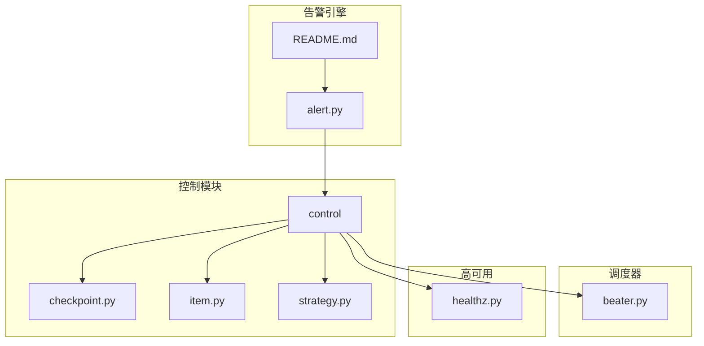
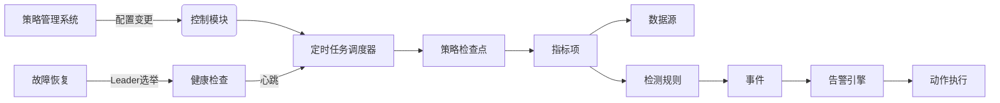
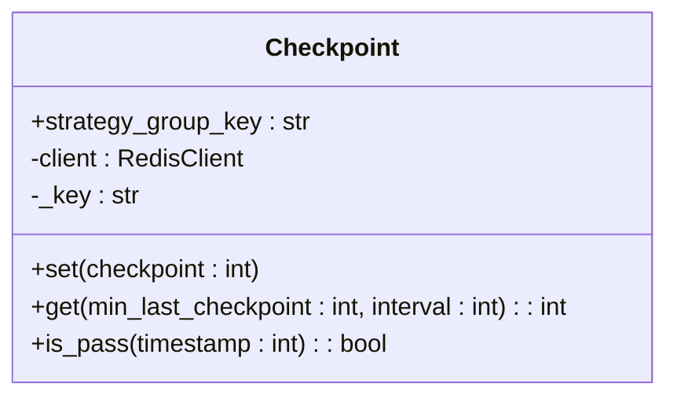
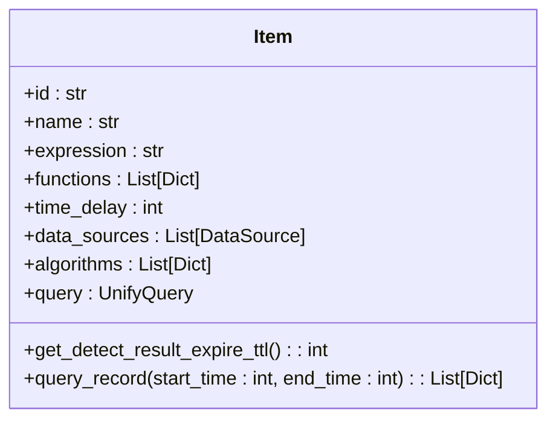
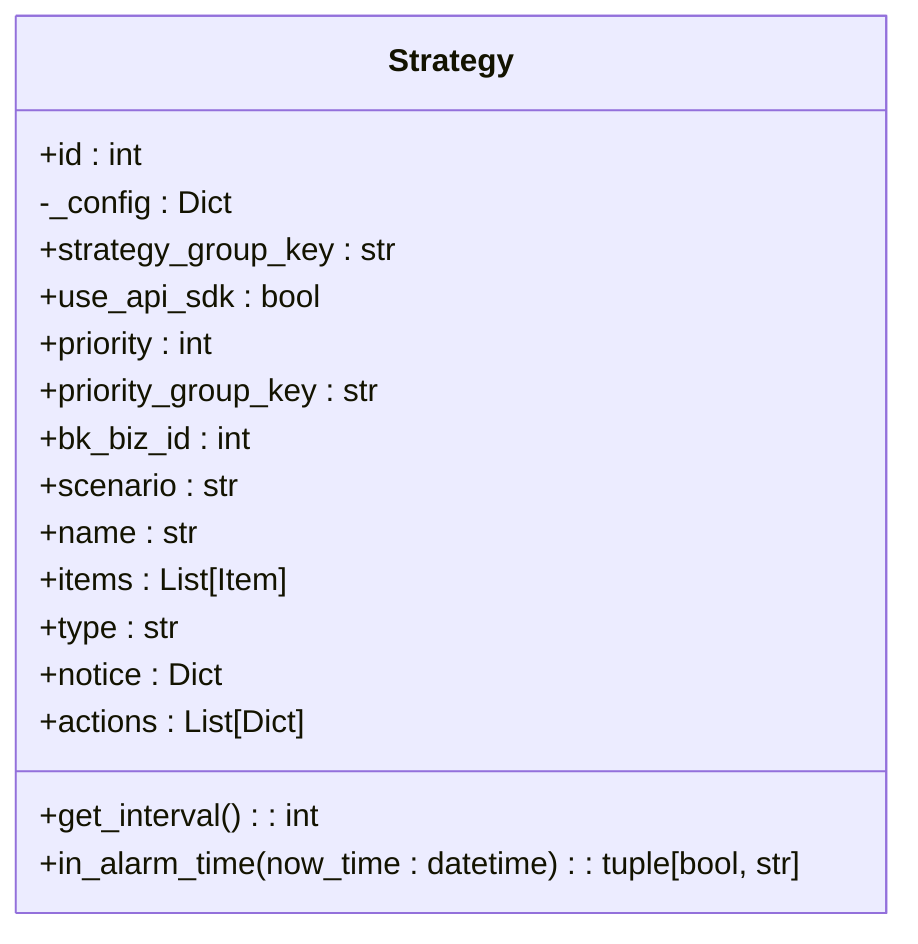
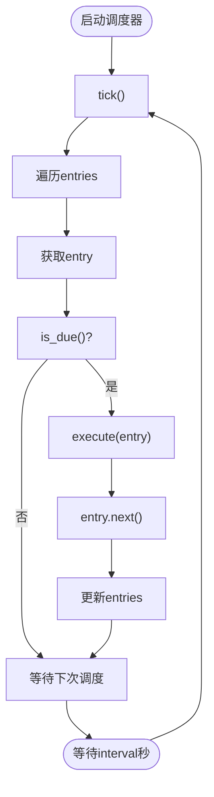
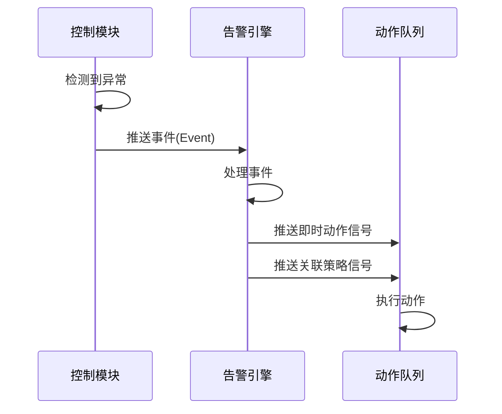
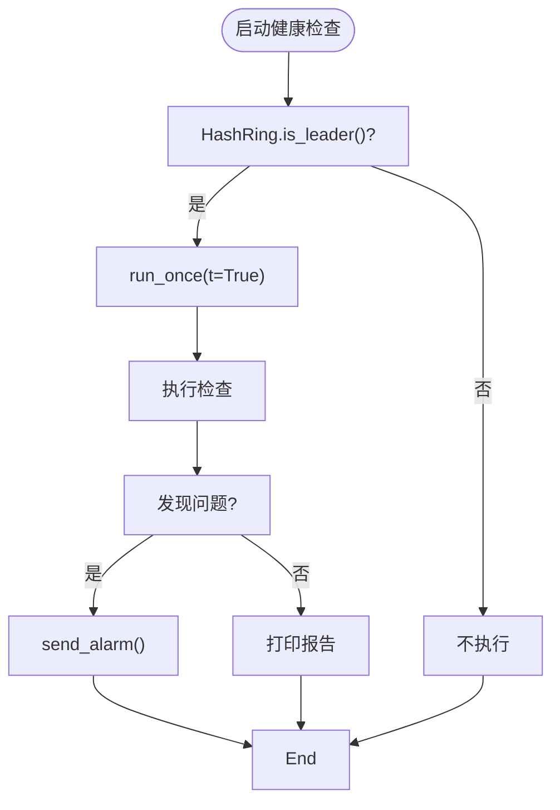
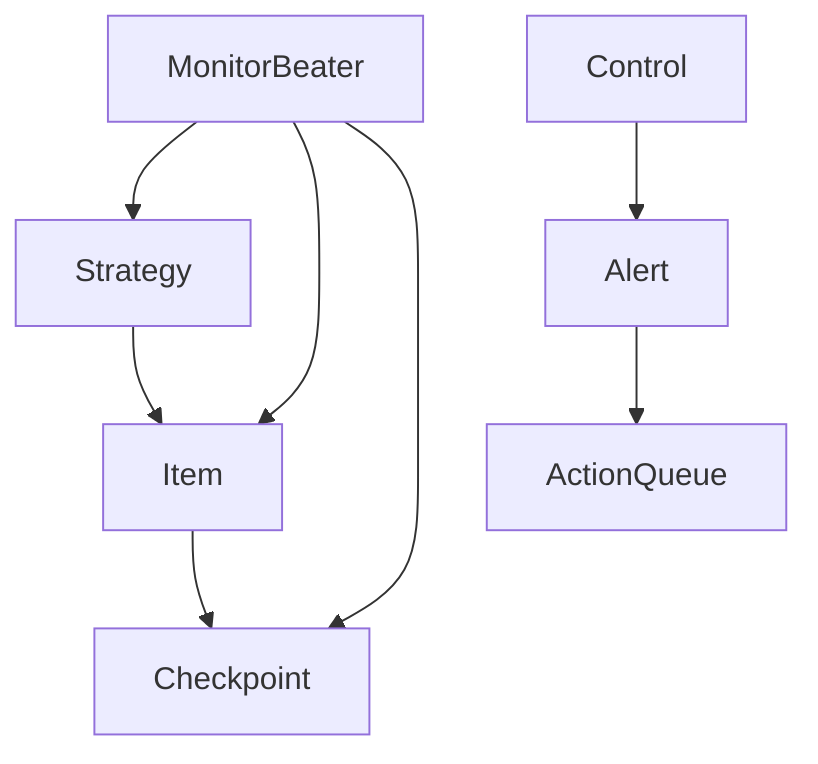

# 控制模块架构

<cite>
**本文档引用的文件**   
- [checkpoint.py](file://bkmonitor/alarm_backends/core/control/checkpoint.py)
- [item.py](file://bkmonitor/alarm_backends/core/control/item.py)
- [strategy.py](file://bkmonitor/alarm_backends/core/control/strategy.py)
- [beater.py](file://bkmonitor/bkmonitor/utils/beater.py)
- [healthz.py](file://bkmonitor/alarm_backends/management/commands/healthz.py)
- [alert.py](file://bkmonitor/alarm_backends/core/alert/alert.py)
- [README.md](file://bkmonitor/alarm_backends/service/alert/README.md)
</cite>

## 目录
1. [引言](#引言)
2. [项目结构](#项目结构)
3. [核心组件](#核心组件)
4. [架构概览](#架构概览)
5. [详细组件分析](#详细组件分析)
6. [依赖分析](#依赖分析)
7. [性能考量](#性能考量)
8. [故障排查指南](#故障排查指南)
9. [结论](#结论)

## 引言
本文档旨在深入分析蓝鲸监控平台的控制模块架构，重点解析其调度机制、状态管理、策略检查点生命周期、指标项与检测规则管理，以及与告警引擎、策略管理系统的交互协议。文档详细阐述了定时任务调度器的工作原理，并通过序列图展示从配置变更到任务调度的完整处理流程。同时，解释了心跳检测、健康检查、故障恢复等高可用机制的实现方式，为开发者和运维人员提供全面的技术参考。

## 项目结构
控制模块的核心代码位于 `bkmonitor/alarm_backends/core/control` 目录下，主要包含策略检查点（checkpoint）、指标项（item）和策略（strategy）的管理。调度器实现位于 `bkmonitor/utils/beater.py`，负责定时任务的执行。高可用机制通过 `alarm_backends/management/commands/healthz.py` 实现健康检查。与告警引擎的交互则通过 `alarm_backends/core/alert/alert.py` 和 `alarm_backends/service/alert/README.md` 中定义的协议进行。

**图示来源**
- [checkpoint.py](file://bkmonitor/alarm_backends/core/control/checkpoint.py)
- [item.py](file://bkmonitor/alarm_backends/core/control/item.py)
- [strategy.py](file://bkmonitor/alarm_backends/core/control/strategy.py)
- [beater.py](file://bkmonitor/bkmonitor/utils/beater.py)
- [healthz.py](file://bkmonitor/alarm_backends/management/commands/healthz.py)
- [alert.py](file://bkmonitor/alarm_backends/core/alert/alert.py)
- [README.md](file://bkmonitor/alarm_backends/service/alert/README.md)

## 核心组件
控制模块的核心组件包括策略检查点（Checkpoint）、指标项（Item）和策略（Strategy）。策略检查点用于记录和管理策略监控项的最后处理时间，确保数据拉取的连续性和一致性。指标项封装了具体的监控配置和数据源，负责执行数据查询和检测逻辑。策略则作为更高层次的抽象，管理一组指标项，并定义其生效时间、优先级等全局属性。这些组件协同工作，构成了监控策略执行的基础。

**组件来源**
- [checkpoint.py](file://bkmonitor/alarm_backends/core/control/checkpoint.py#L1-L60)
- [item.py](file://bkmonitor/alarm_backends/core/control/item.py#L1-L246)
- [strategy.py](file://bkmonitor/alarm_backends/core/control/strategy.py#L1-L366)

## 架构概览
控制模块的架构围绕策略的生命周期管理展开。策略管理系统通过配置变更触发控制模块的更新。控制模块利用定时任务调度器（MonitorBeater）周期性地检查和执行策略。调度器通过心跳和健康检查机制确保高可用性。当检测到异常时，控制模块会生成事件并推送给告警引擎，告警引擎根据预设的规则执行相应的动作，如通知、收敛等。

**图示来源**
- [strategy.py](file://bkmonitor/alarm_backends/core/control/strategy.py)
- [beater.py](file://bkmonitor/bkmonitor/utils/beater.py)
- [checkpoint.py](file://bkmonitor/alarm_backends/core/control/checkpoint.py)
- [item.py](file://bkmonitor/alarm_backends/core/control/item.py)
- [alert.py](file://bkmonitor/alarm_backends/core/alert/alert.py)
- [healthz.py](file://bkmonitor/alarm_backends/management/commands/healthz.py)

## 详细组件分析

### 策略检查点分析
策略检查点（Checkpoint）是控制模块中用于追踪策略执行进度的关键组件。它通过Redis缓存存储每个策略组的最后处理时间戳，确保在服务重启或故障后能够从断点继续处理，避免数据丢失或重复处理。

#### 策略检查点类图

**图示来源**
- [checkpoint.py](file://bkmonitor/alarm_backends/core/control/checkpoint.py#L1-L60)

**组件来源**
- [checkpoint.py](file://bkmonitor/alarm_backends/core/control/checkpoint.py#L1-L60)

### 指标项与检测规则分析
指标项（Item）是监控策略的最小执行单元，它封装了数据查询配置（query_configs）、检测表达式（expression）和算法配置（algorithms）。控制模块通过`Item`类加载和管理这些配置，并执行实际的数据查询和异常检测。

#### 指标项类图

**图示来源**
- [item.py](file://bkmonitor/alarm_backends/core/control/item.py#L1-L246)

**组件来源**
- [item.py](file://bkmonitor/alarm_backends/core/control/item.py#L1-L246)

### 策略管理分析
策略（Strategy）是控制模块的顶层管理单元，它包含一个或多个指标项（Item），并定义了策略的全局属性，如生效时间（uptime）、优先级（priority）和通知配置（notice）。

#### 策略类图

**图示来源**
- [strategy.py](file://bkmonitor/alarm_backends/core/control/strategy.py#L1-L366)

**组件来源**
- [strategy.py](file://bkmonitor/alarm_backends/core/control/strategy.py#L1-L366)

### 定时任务调度器分析
定时任务调度器（MonitorBeater）是控制模块的执行引擎，它负责周期性地触发策略检查和执行。

#### 调度器工作流程图

**图示来源**
- [beater.py](file://bkmonitor/bkmonitor/utils/beater.py#L1-L197)

**组件来源**
- [beater.py](file://bkmonitor/bkmonitor/utils/beater.py#L1-L197)

### 控制模块与告警引擎交互分析
控制模块与告警引擎通过事件（Event）和信号（Signal）进行交互。当检测到异常时，控制模块生成事件并推送到告警队列，告警引擎消费这些事件并执行后续动作。

#### 交互序列图

**图示来源**
- [alert.py](file://bkmonitor/alarm_backends/core/alert/alert.py#L1-L1169)
- [README.md](file://bkmonitor/alarm_backends/service/alert/README.md#L26-L36)

**组件来源**
- [alert.py](file://bkmonitor/alarm_backends/core/alert/alert.py#L1-L1169)
- [README.md](file://bkmonitor/alarm_backends/service/alert/README.md#L26-L36)

### 高可用机制分析
高可用机制通过健康检查（healthz）命令实现，采用基于HashRing的Leader选举机制，确保集群中只有一个节点执行健康检查任务。

#### 健康检查流程图

**图示来源**
- [healthz.py](file://bkmonitor/alarm_backends/management/commands/healthz.py#L1-L252)

**组件来源**
- [healthz.py](file://bkmonitor/alarm_backends/management/commands/healthz.py#L1-L252)

## 依赖分析
控制模块的组件之间存在紧密的依赖关系。`Strategy` 依赖 `Item` 来获取具体的监控配置，`Item` 依赖 `Checkpoint` 来管理数据拉取的进度。调度器（`MonitorBeater`）依赖于这些组件来执行周期性任务。告警引擎（`Alert`）接收来自控制模块的事件，形成一个完整的监控闭环。

**图示来源**
- [strategy.py](file://bkmonitor/alarm_backends/core/control/strategy.py)
- [item.py](file://bkmonitor/alarm_backends/core/control/item.py)
- [checkpoint.py](file://bkmonitor/alarm_backends/core/control/checkpoint.py)
- [beater.py](file://bkmonitor/bkmonitor/utils/beater.py)
- [alert.py](file://bkmonitor/alarm_backends/core/alert/alert.py)

## 性能考量
控制模块的性能主要受数据查询频率、数据量大小和检测算法复杂度的影响。通过使用Redis缓存策略检查点和策略配置，可以有效减少数据库查询压力。调度器支持线程池执行模式，可以并行处理多个策略，提高处理效率。然而，在高并发场景下，需要合理配置线程池大小，避免资源竞争。

## 故障排查指南
当控制模块出现异常时，应首先检查健康检查日志（`healthz.py`），确认节点是否为Leader以及是否存在系统级问题。其次，检查调度器日志（`beater.py`），确认任务是否正常调度。对于具体的策略执行问题，应检查策略检查点（`checkpoint.py`）的缓存状态和指标项（`item.py`）的数据查询结果。

**组件来源**
- [healthz.py](file://bkmonitor/alarm_backends/management/commands/healthz.py#L1-L252)
- [beater.py](file://bkmonitor/bkmonitor/utils/beater.py#L1-L197)
- [checkpoint.py](file://bkmonitor/alarm_backends/core/control/checkpoint.py#L1-L60)
- [item.py](file://bkmonitor/alarm_backends/core/control/item.py#L1-L246)

## 结论
本文档详细分析了蓝鲸监控平台控制模块的架构和实现。控制模块通过策略检查点、指标项和策略三个核心组件，实现了对监控策略的精细化管理。定时任务调度器确保了策略的周期性执行，而健康检查和Leader选举机制保障了系统的高可用性。与告警引擎的清晰交互协议，使得整个监控系统能够高效、可靠地运行。未来可以进一步优化调度算法和数据查询性能，以应对更大规模的监控需求。