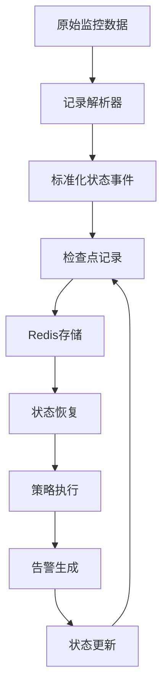
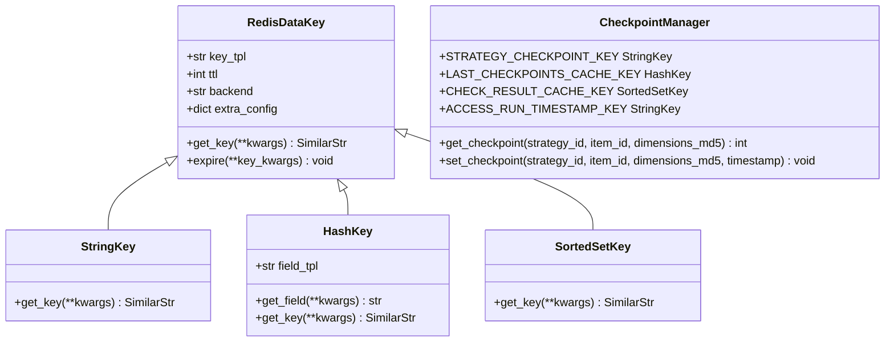
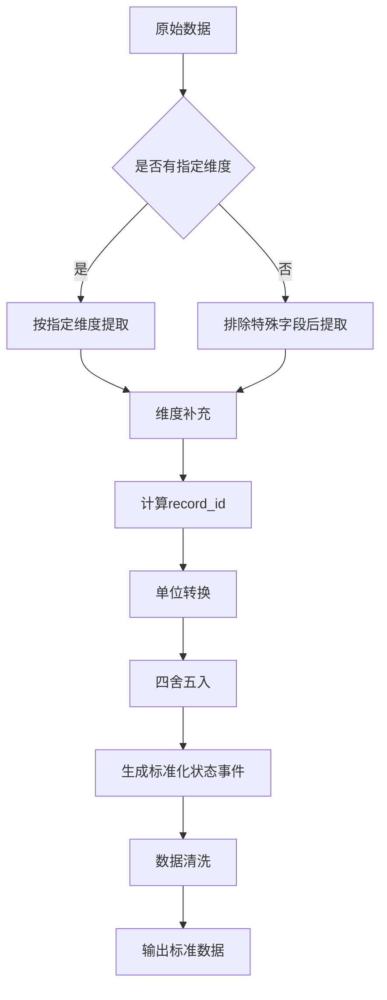
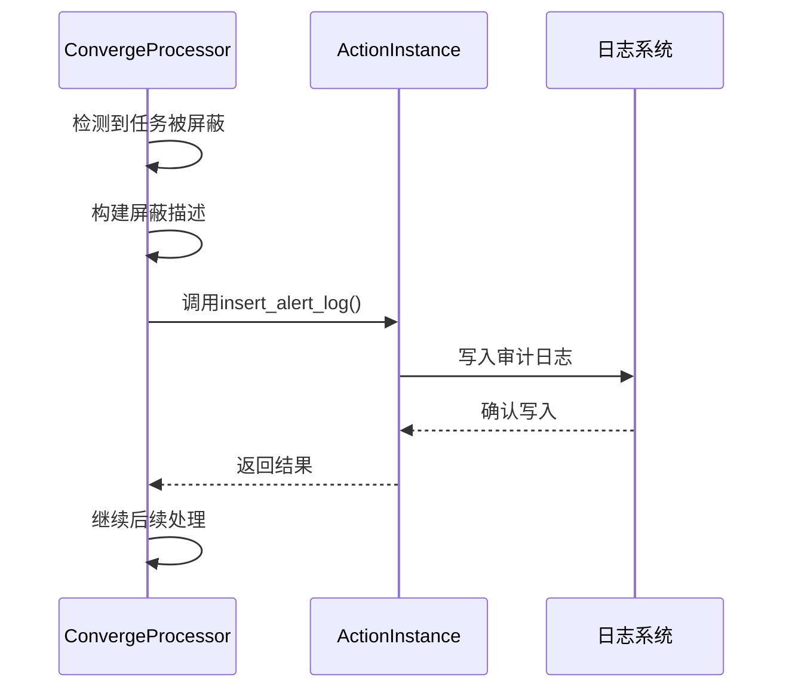
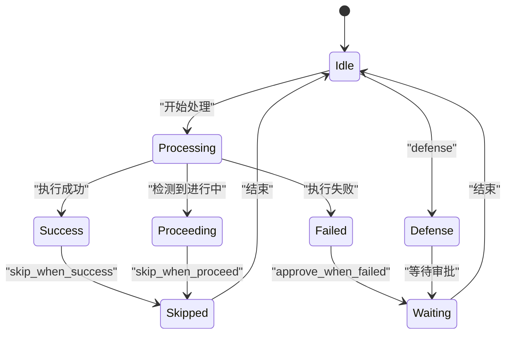
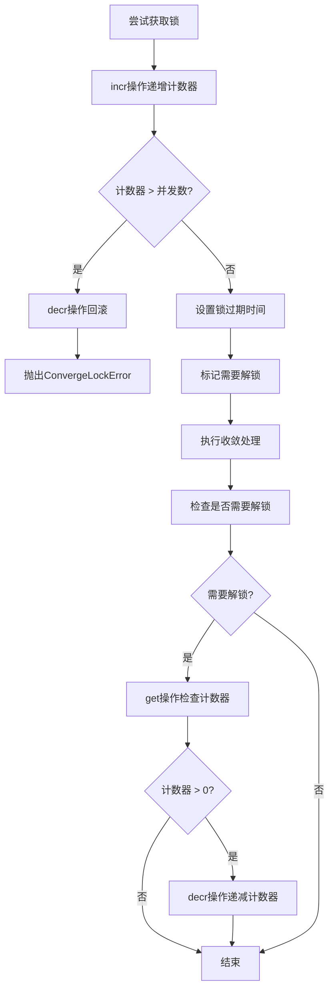

# 状态管理

<cite>
**本文档引用的文件**   
- [processor.py](file://bkmonitor/alarm_backends/service/converge/processor.py)
- [key.py](file://bkmonitor/alarm_backends/core/cache/key.py)
- [converge_func.py](file://bkmonitor/alarm_backends/service/converge/converge_func.py)
- [records.py](file://bkmonitor/alarm_backends/service/access/data/records.py)
</cite>

## 目录
1. [检查点设计与实现](#检查点设计与实现)
2. [记录解析器与状态事件转换](#记录解析器与状态事件转换)
3. [状态变更审计日志](#状态变更审计日志)
4. [状态冲突解决策略](#状态冲突解决策略)
5. [分布式并发控制](#分布式并发控制)

## 检查点设计与实现

### 检查点的作用与功能

检查点（Checkpoint）机制在监控系统的状态管理中扮演着核心角色，主要实现状态持久化、断点续传和一致性保证三大功能。该机制通过在Redis中存储关键状态信息，确保系统在异常重启或故障恢复后能够从最近的稳定状态继续执行，避免数据丢失和重复处理。

检查点在策略执行过程中作为关键的断点标识，记录了数据拉取的最后位置、最后检测时间点等核心状态。当系统重启或任务恢复时，可以基于这些检查点快速定位到中断位置，实现无缝续传，极大地提高了系统的可靠性和容错能力。

**图示来源**
- [records.py](file://bkmonitor/alarm_backends/service/access/data/records.py)
- [key.py](file://bkmonitor/alarm_backends/core/cache/key.py)

**本节来源**
- [key.py](file://bkmonitor/alarm_backends/core/cache/key.py)

### 检查点数据结构与存储策略

检查点的数据结构设计采用了分层的键值存储模式，通过精心设计的键名模板（key_tpl）和标签（label）来组织和管理不同类型的状态信息。系统主要使用Redis的String、Hash和SortedSet三种数据结构来存储检查点数据。

String类型用于存储简单的状态值，如`STRATEGY_CHECKPOINT_KEY`用于记录策略数据拉取的最后一条数据时间，`ACCESS_RUN_TIMESTAMP_KEY`用于记录access任务的运行时间。Hash类型用于存储复杂的结构化数据，如`LAST_CHECKPOINTS_CACHE_KEY`用于缓存最后检测时间点，其field_tpl与CHECK_RESULT_CACHE_KEY的key_tpl保持一致，确保数据一致性。

**图示来源**
- [key.py](file://bkmonitor/alarm_backends/core/cache/key.py)

**本节来源**
- [key.py](file://bkmonitor/alarm_backends/core/cache/key.py)

### 检查点过期清理机制

检查点的过期清理机制通过Redis的TTL（Time To Live）功能实现，不同类型的检查点根据其业务重要性和更新频率设置了不同的过期时间。系统在定义检查点键时，通过`ttl`参数明确指定其生命周期，确保状态数据不会无限期占用内存资源。

关键检查点如`STRATEGY_CHECKPOINT_KEY`和`ACCESS_RUN_TIMESTAMP_KEY`设置了1小时的过期时间（CONST_ONE_HOUR），而临时性或高频更新的检查点如`ACCESS_DUPLICATE_KEY`则设置了较短的10分钟过期时间。对于需要长期保留的状态，系统使用`TTL_NOT_SET`常量表示不设置过期时间。

系统还通过`register_key_with_config`函数动态注册和管理所有检查点键，确保了键定义的一致性和可维护性。该函数根据配置字典自动创建对应的Redis数据类型键对象，并统一处理键的前缀、TTL和后端存储等属性。

**本节来源**
- [key.py](file://bkmonitor/alarm_backends/core/cache/key.py)

## 记录解析器与状态事件转换

### 原始数据到状态事件的转换流程

记录解析器（record_parser）是监控系统数据处理管道的核心组件，负责将原始监控数据转换为标准化的、可处理的状态事件。该转换流程始于`DataRecord`类的初始化，接收原始数据记录（raw_data）和关联的监控项（item）作为输入。

转换过程首先通过`_origin_dimension`方法提取原始数据的维度信息，根据查询配置中的dimensions字段决定提取哪些维度。对于未指定dimensions的情况，系统会自动排除_time_、_result_等特殊字段，提取所有其他字段作为维度。转换后的状态事件包含record_id、value、values、dimensions和time等标准化字段，为后续的检测和告警处理提供了统一的数据格式。

**图示来源**
- [records.py](file://bkmonitor/alarm_backends/service/access/data/records.py)

**本节来源**
- [records.py](file://bkmonitor/alarm_backends/service/access/data/records.py)

### 数据标准化与清洗

数据标准化过程包括值的单位转换和精度控制。`_convert`方法负责将原始值进行格式化处理，使用`number_format`函数统一数值格式，并根据系统配置`POINT_PRECISION`进行四舍五入，保留指定的小数位数。对于实时告警场景，系统会从指定的field字段获取值，而非标准的_result_字段。

数据清洗阶段通过`clean`方法完成，该方法调用一系列以`clean_`为前缀的方法，将标准化后的属性填充到数据字典中。清洗过程还包括记录当前处理时间（access_time），用于SLI（Service Level Indicator）统计各模块间的处理延迟，为系统性能监控提供数据支持。

**本节来源**
- [records.py](file://bkmonitor/alarm_backends/service/access/data/records.py)

## 状态变更审计日志

### 日志记录机制与实现

状态变更的审计日志记录主要通过`insert_alert_log`方法实现，该方法在`ConvergeProcessor`类中被调用，用于记录收敛处理过程中的关键状态变更。日志记录包含描述信息（description）、状态变更原因等关键信息，为系统运维和故障排查提供了重要依据。

当检测到任务被屏蔽或已收敛时，系统会调用`insert_alert_log`方法插入相应的日志记录。例如，在任务被屏蔽的情况下，日志会记录"套餐处理【{}】已屏蔽， 屏蔽原因：{}"；在任务被收敛的情况下，日志会记录"套餐【{}】已收敛， 收敛原因：{}"。这些日志信息不仅记录了状态变更的事实，还包含了变更的具体原因，极大地提高了日志的可读性和实用性。

**图示来源**
- [processor.py](file://bkmonitor/alarm_backends/service/converge/processor.py)

**本节来源**
- [processor.py](file://bkmonitor/alarm_backends/service/converge/processor.py)

## 状态冲突解决策略

### 收敛规则与冲突处理

状态冲突解决策略主要通过多种收敛规则实现，这些规则定义了在特定条件下如何处理并发或重复的状态变更请求。系统提供了多种内置的收敛函数，如`skip_when_success`、`approve_when_failed`、`skip_when_proceed`等，每种规则针对不同的业务场景。

`skip_when_success`规则用于处理"成功后跳过"的场景，当检测到相同收敛条件的其他实例已成功执行时，当前实例将被跳过，避免重复处理。`approve_when_failed`规则则在失败时触发审批流程，需要人工干预决定是否继续执行。`skip_when_proceed`规则用于避免重复告警，当有相同条件的告警正在处理时，新告警将被直接跳过。

**图示来源**
- [converge_func.py](file://bkmonitor/alarm_backends/service/converge/converge_func.py)

**本节来源**
- [converge_func.py](file://bkmonitor/alarm_backends/service/converge/converge_func.py)

### 异常防御与汇总通知

`defense`规则实现了异常防御机制，当满足规则的其他告警数量达到预设阈值时，系统不会自动处理，而是进入等待审批状态，需要人工判断是否处理。这种机制可以有效防御大规模告警风暴，如发布未屏蔽、网络问题等导致的异常情况。

`collect`和`collect_alarm`规则实现了汇总通知功能，在一段时间内汇集所有满足条件的告警，并在收敛窗口结束时统一发送通知。这种策略避免了短时间内频繁发送告警通知，提高了告警信息的可读性和处理效率。

**本节来源**
- [converge_func.py](file://bkmonitor/alarm_backends/service/converge/converge_func.py)

## 分布式并发控制

### 分布式锁实现机制

分布式环境下的并发控制通过Redis实现的分布式锁来保证。`ConvergeProcessor`类中的`get_dimension_lock`和`unlock`方法构成了完整的锁管理机制。系统使用`ACTION_CONVERGE_KEY_PROCESS_LOCK`作为锁键模板，通过`incr`和`decr`操作实现计数器式的并发控制。

当获取锁时，系统首先调用`incr`方法递增计数器，如果计数器值超过预设的并发数（parallel_converge_count），则抛出`ConvergeLockError`异常。获取锁成功后，系统会设置锁的过期时间（expire），防止死锁。释放锁时，系统会检查当前计数器值，只有在大于0时才执行`decr`操作，确保锁的正确释放。

**图示来源**
- [processor.py](file://bkmonitor/alarm_backends/service/converge/processor.py)

**本节来源**
- [processor.py](file://bkmonitor/alarm_backends/service/converge/processor.py)

### 并发控制流程

并发控制流程在`run_converge`方法中得到完整体现。该方法首先进行屏蔽状态和任务状态的校验，然后根据`need_get_lock`判断是否需要获取锁。只有在没有生成收敛记录或关联数量不足的情况下，才需要进行分布式锁控制。

系统通过`max(int(self.converge_count) // 2, 1)`计算最大并发数，确保即使在高并发场景下也能保持系统的稳定性。当获取锁失败时，系统会将任务推入收敛等待队列，并抛出异常，由上层调度器决定重试策略。

**本节来源**
- [processor.py](file://bkmonitor/alarm_backends/service/converge/processor.py)