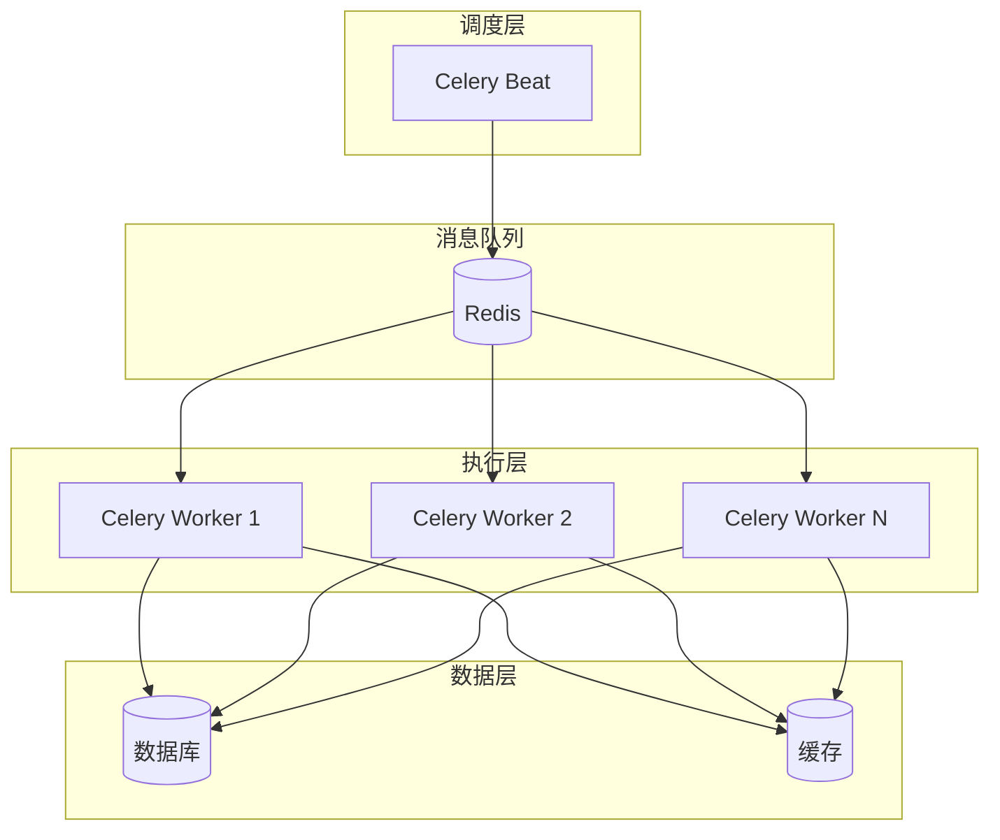
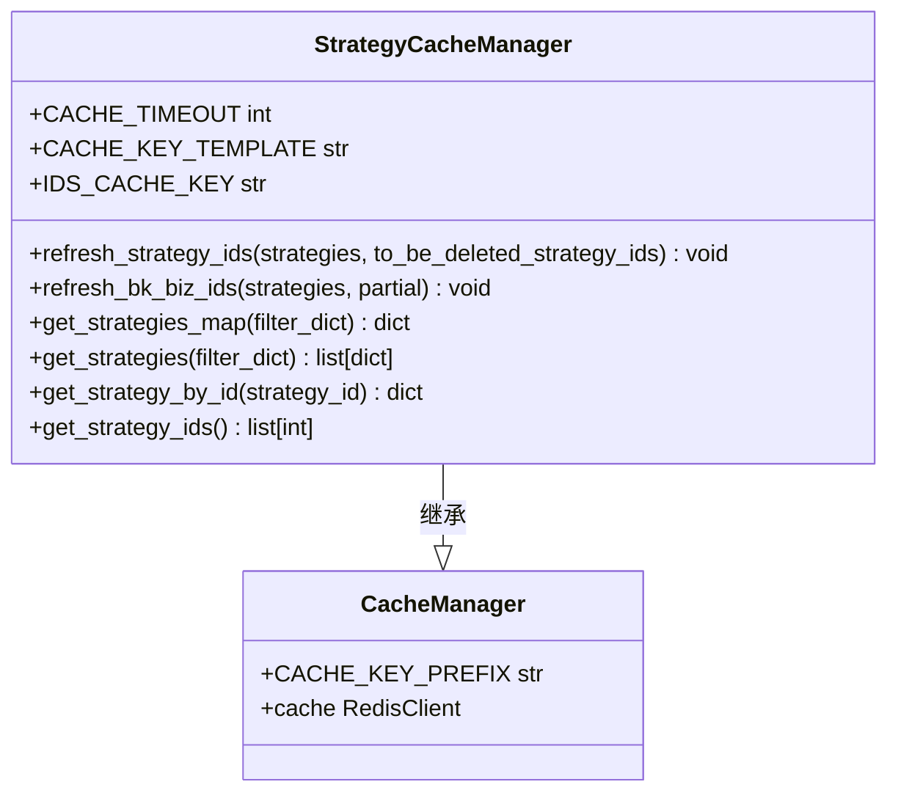
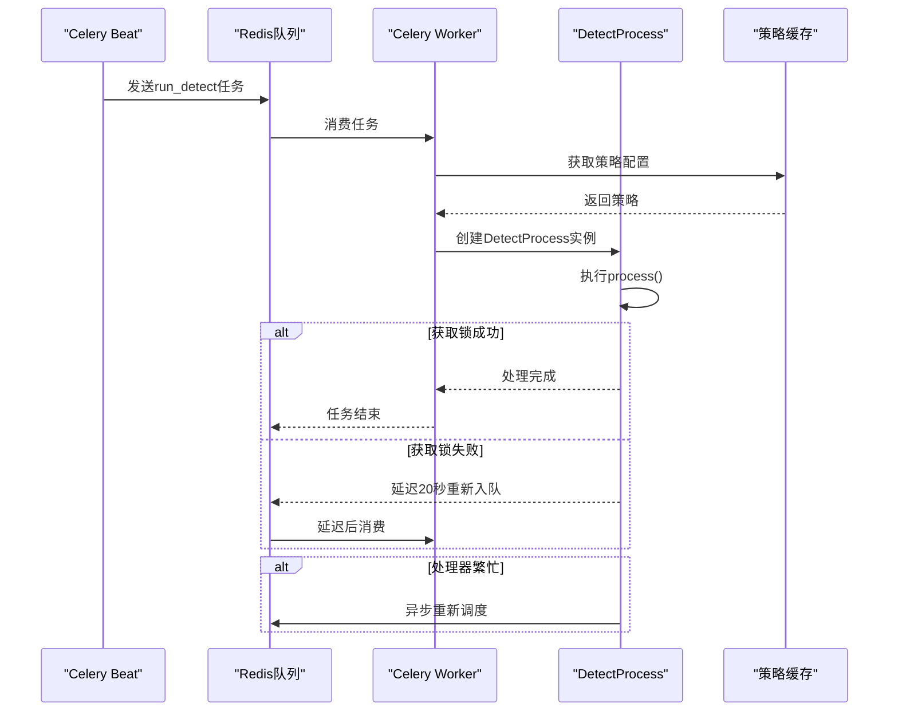
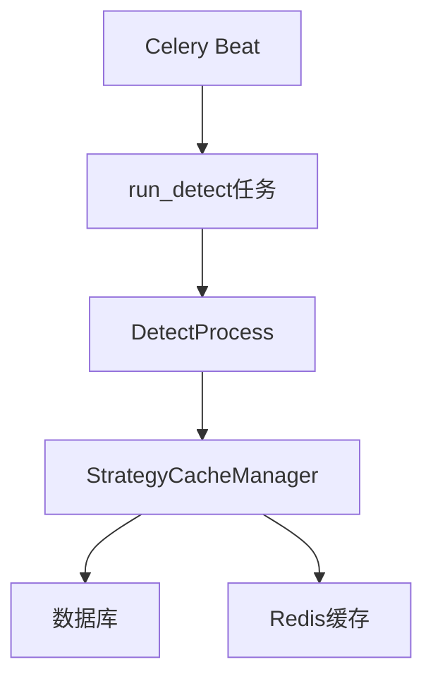

# 调度器机制

<cite>
**本文档引用的文件**   
- [strategy.py](file://bkmonitor/alarm_backends/core/cache/strategy.py)
- [tasks.py](file://bkmonitor/alarm_backends/service/detect/tasks.py)
- [celery.py](file://bkmonitor/config/celery/celery.py)
</cite>

## 目录
1. [引言](#引言)
2. [项目结构](#项目结构)
3. [核心组件](#核心组件)
4. [架构概述](#架构概述)
5. [详细组件分析](#详细组件分析)
6. [依赖分析](#依赖分析)
7. [性能考量](#性能考量)
8. [故障排除指南](#故障排除指南)
9. [结论](#结论)

## 引言
本文档深入分析了蓝鲸监控平台中基于Celery Beat的定时任务调度架构，重点阐述了策略检查任务（strategy_check）的实现机制。文档详细说明了调度器的触发条件、执行周期、并发控制策略、任务分片、负载均衡以及与策略存储层的交互细节。通过代码示例，解释了如何动态调整调度频率和任务超时设置，并描述了调度异常的重试机制和告警通知流程。

## 项目结构
蓝鲸监控平台的项目结构遵循模块化设计，核心调度功能主要分布在`alarm_backends`和`config/celery`目录下。`alarm_backends`模块负责告警处理的核心逻辑，其中`core/cache/strategy.py`文件定义了策略缓存管理器，而`service/detect/tasks.py`则包含了具体的Celery任务。Celery的配置文件位于`config/celery/celery.py`，用于定义任务的调度计划和队列配置。

## 核心组件
本系统的核心组件包括`StrategyCacheManager`类，它负责管理告警策略的缓存，以及`run_detect`和`run_detect_with_sdk` Celery任务，它们是实际执行策略检测的单元。`StrategyCacheManager`通过与数据库和缓存系统交互，确保策略配置的实时性和一致性，而Celery任务则负责周期性地触发策略检查。

**Section sources**
- [strategy.py](file://bkmonitor/alarm_backends/core/cache/strategy.py#L0-L1511)
- [tasks.py](file://bkmonitor/alarm_backends/service/detect/tasks.py#L0-L53)

## 架构概述
该调度系统采用Celery作为分布式任务队列，结合Redis作为消息代理和结果后端，实现了高可用和可扩展的定时任务调度。系统架构分为三层：调度层（Celery Beat）、执行层（Celery Worker）和数据层（数据库与缓存）。Celery Beat根据预设的周期向消息队列发送任务信号，Celery Worker从队列中消费任务并执行具体的策略检测逻辑。

**Diagram sources**
- [celery.py](file://bkmonitor/config/celery/celery.py)
- [tasks.py](file://bkmonitor/alarm_backends/service/detect/tasks.py#L0-L53)

## 详细组件分析

### 策略缓存管理器分析
`StrategyCacheManager`是调度系统的核心，它负责策略配置的加载、验证和缓存。该类通过`get_strategies_map`方法从数据库中获取所有启用的策略，并进行一系列有效性检查，包括业务存在性、指标有效性、目标有效性等。

#### 类图

**Diagram sources**
- [strategy.py](file://bkmonitor/alarm_backends/core/cache/strategy.py#L0-L1511)

### 任务执行器分析
`run_detect`任务是策略检查的实际执行者，它被设计为幂等且可重试。当任务执行失败时，系统会根据错误类型采取不同的重试策略。

#### 序列图

**Diagram sources**
- [tasks.py](file://bkmonitor/alarm_backends/service/detect/tasks.py#L0-L53)

## 依赖分析
系统的主要依赖关系如下图所示，`StrategyCacheManager`依赖于数据库和缓存系统来获取和存储策略信息，而`run_detect`任务则依赖于`DetectProcess`类来执行具体的检测逻辑。

**Diagram sources**
- [strategy.py](file://bkmonitor/alarm_backends/core/cache/strategy.py#L0-L1511)
- [tasks.py](file://bkmonitor/alarm_backends/service/detect/tasks.py#L0-L53)

## 性能考量
调度系统在设计时充分考虑了性能因素。通过将策略ID列表和详细配置分别缓存，减少了数据库查询的开销。同时，任务被分配到不同的队列（如`celery_service`和`celery_service_aiops`）以实现负载均衡。对于处理繁忙的策略，系统会自动进行异步重试，避免阻塞其他任务的执行。

## 故障排除指南
当调度系统出现异常时，应首先检查Celery Worker的日志，特别是`detect`和`cache`日志。常见的问题包括锁获取失败、数据库连接超时和缓存失效。对于锁获取失败的情况，系统已内置了20秒的延迟重试机制。对于数据库或缓存问题，则需要检查相应的服务状态和网络连接。

**Section sources**
- [tasks.py](file://bkmonitor/alarm_backends/service/detect/tasks.py#L0-L53)
- [strategy.py](file://bkmonitor/alarm_backends/core/cache/strategy.py#L0-L1511)

## 结论
蓝鲸监控平台的调度器机制通过Celery Beat和Worker的协同工作，实现了高效、可靠的定时任务调度。`StrategyCacheManager`确保了策略配置的实时性和一致性，而`run_detect`任务则通过幂等设计和重试机制保证了任务的最终完成。整个系统具有良好的可扩展性和容错能力，能够满足大规模监控场景下的需求。