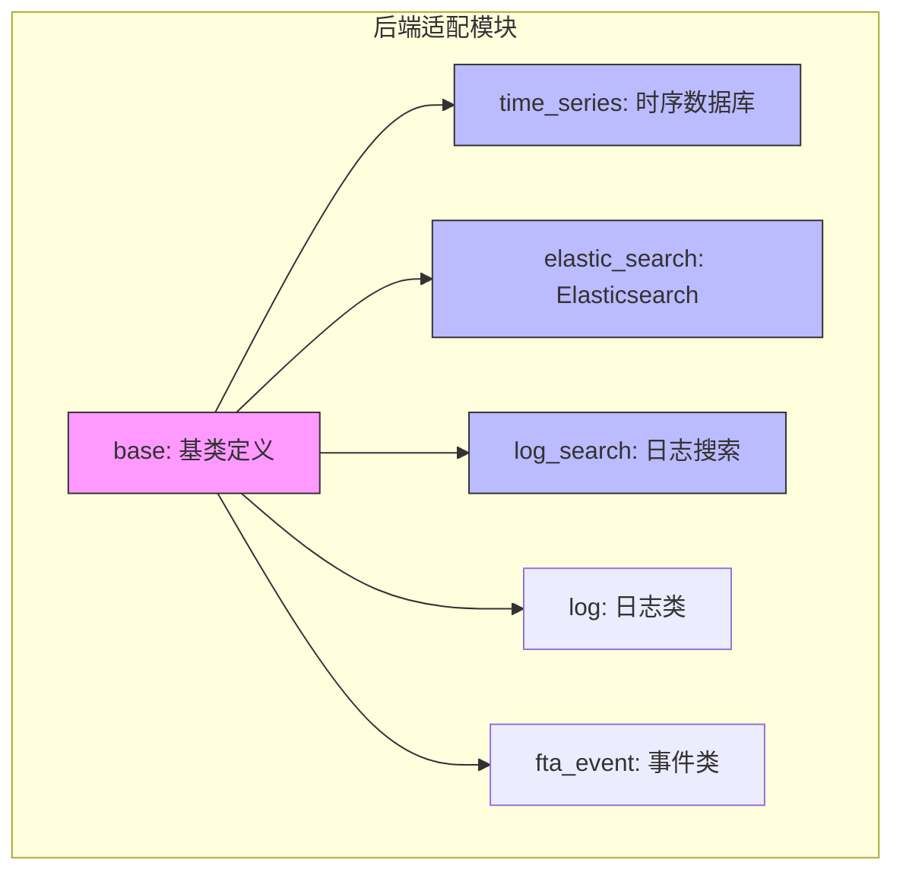
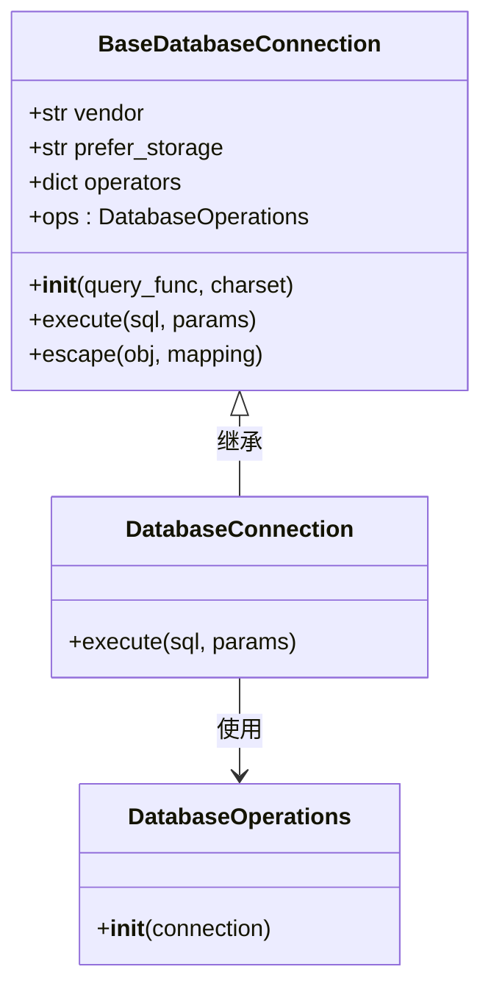
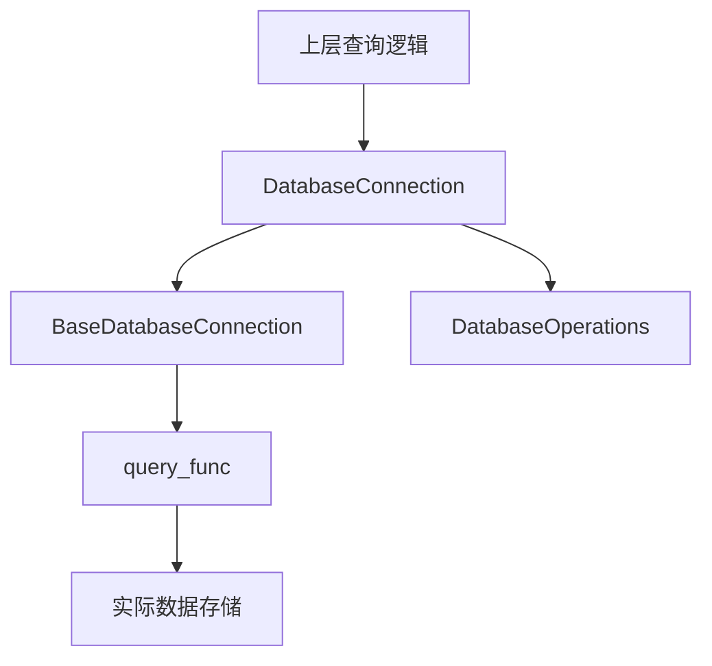

# 数据源后端适配

<cite>
**本文档引用文件**  
- [connection.py](file://bkmonitor/bkmonitor/data_source/backends/base/connection.py)
- [time_series/connection.py](file://bkmonitor/bkmonitor/data_source/backends/time_series/connection.py)
- [elastic_search/connection.py](file://bkmonitor/bkmonitor/data_source/backends/elastic_search/connection.py)
- [log_search/connection.py](file://bkmonitor/bkmonitor/data_source/backends/log_search/connection.py)
- [operations.py](file://bkmonitor/bkmonitor/data_source/backends/base/operations.py)
- [backends/README.md](file://bkmonitor/bkmonitor/data_source/backends/README.md)
</cite>

## 目录

1. [引言](#引言)  
2. [项目结构](#项目结构)  
3. [核心组件](#核心组件)  
4. [架构概览](#架构概览)  
5. [详细组件分析](#详细组件分析)  
6. [依赖分析](#依赖分析)  
7. [性能考量](#性能考量)  
8. [故障排查指南](#故障排查指南)  
9. [结论](#结论)

## 引言

本文档深入分析蓝鲸监控平台中数据源后端适配层的设计与实现。该层作为连接上层查询逻辑与底层数据存储的核心抽象，支持多种数据类型（如时序数据、日志数据、Elasticsearch 检索等）的统一访问接口。通过定义清晰的基类契约与模块化实现，系统实现了对多类型后端的灵活扩展与统一管理。文档将重点解析 `BaseDatabaseConnection` 抽象基类的设计、各类后端的具体实现机制、连接管理、查询执行流程，并提供扩展新后端的指导。

## 项目结构

数据源后端适配模块位于 `bkmonitor/data_source/backends` 目录下，采用模块化设计，每个子目录代表一种后端类型。整体结构清晰，遵循单一职责原则。



**图示来源**  
- [backends/README.md](file://bkmonitor/bkmonitor/data_source/backends/README.md)

**本节来源**  
- [backends/README.md](file://bkmonitor/bkmonitor/data_source/backends/README.md)

## 核心组件

数据源后端适配层的核心是 `BaseDatabaseConnection` 抽象基类，它定义了所有后端必须实现的接口契约。该类位于 `backends/base/connection.py`，是所有具体后端连接类的父类。其主要职责包括：

- **统一接口定义**：通过 `execute` 方法提供统一的查询执行入口。
- **操作符映射**：通过 `operators` 字典定义查询条件的操作符语法。
- **连接管理**：封装与具体数据存储的交互逻辑。
- **扩展性设计**：允许子类通过重写方法或注入 `ops` 对象来定制行为。

具体后端（如 `time_series`, `elastic_search`）通过继承 `BaseDatabaseConnection` 并实现其特定逻辑来完成适配。

**本节来源**  
- [connection.py](file://bkmonitor/bkmonitor/data_source/backends/base/connection.py)
- [operations.py](file://bkmonitor/bkmonitor/data_source/backends/base/operations.py)

## 架构概览

整个后端适配层采用典型的模板方法与依赖注入模式。`BaseDatabaseConnection` 定义了骨架，而具体实现则由子类和 `DatabaseOperations` 对象完成。



**图示来源**  
- [connection.py](file://bkmonitor/bkmonitor/data_source/backends/base/connection.py)
- [time_series/connection.py](file://bkmonitor/bkmonitor/data_source/backends/time_series/connection.py)
- [elastic_search/connection.py](file://bkmonitor/bkmonitor/data_source/backends/elastic_search/connection.py)

## 详细组件分析

### 基类设计分析

`BaseDatabaseConnection` 类是整个适配层的基石。它通过类属性 `vendor` 和 `prefer_storage` 标识后端类型，`operators` 字典统一了查询条件的语法映射。构造函数接收一个 `query_func`，实现了对底层查询服务的依赖注入，增强了灵活性和可测试性。

```python
class BaseDatabaseConnection:
    ops = None
    vendor = "unknown"
    prefer_storage = "unknown"
```

该设计使得上层逻辑无需关心具体的数据存储细节，只需通过统一的接口进行调用。

**本节来源**  
- [connection.py](file://bkmonitor/bkmonitor/data_source/backends/base/connection.py)

### 时序数据库后端实现

时序数据库后端（`time_series`）用于处理 BKSQL 格式的时序数据查询。其实现类 `DatabaseConnection` 继承自 `BaseDatabaseConnection`，并重写了 `execute` 方法。

关键实现细节：
- **查询函数注入**：`query_func` 用于执行 BKSQL 查询。
- **参数处理**：自动剥离租户 ID 并对查询参数进行转义，防止注入攻击。
- **日志与追踪**：集成日志记录和 OpenTelemetry 追踪，便于监控和调试。
- **SQL 拼接**：使用 Python 的 `%` 操作符进行 SQL 拼接。

```python
def execute(self, sql, params: tuple):
    bk_tenant_id: str = params[-1]
    params = params[:-1]
    params = tuple(self.escape(arg) for arg in params)
    sql_str = sql % params
    logger.info(f"BKSQL QUERY: {sql_str}")
    with tracer.start_as_current_span("bksql") as span:
        span.set_attribute("bk.system", "bksql")
        span.set_attribute("bk.bksql.statement", sql_str)
        result = self.query_func(sql=sql_str, prefer_storage="", bk_tenant_id=bk_tenant_id)
        return result.get("list")
```

**本节来源**  
- [time_series/connection.py](file://bkmonitor/bkmonitor/data_source/backends/time_series/connection.py)

### Elasticsearch 后端实现

Elasticsearch 后端（`elastic_search`）用于处理基于 DSL 的日志检索。其 `execute` 方法接收结果表 ID（rt_id）和查询参数字典。

关键实现细节：
- **参数提取**：从 `params` 中提取 `use_full_index_names` 和 `bk_tenant_id` 等额外参数。
- **JSON 序列化**：将查询参数字典序列化为 JSON 字符串用于日志记录。
- **灵活调用**：通过 `**extra` 将额外参数传递给底层查询函数。

```python
def execute(self, rt_id, params):
    extra: dict[str, Any] = {
        "use_full_index_names": params.pop("use_full_index_names", False),
        "bk_tenant_id": params.pop("bk_tenant_id", DEFAULT_TENANT_ID),
    }
    query_body: str = json.dumps(params)
    logger.info(f"ES QUERY: rt_id is {rt_id}, query body is {query_body}")
    with tracer.start_as_current_span("es_query") as span:
        span.set_attribute("bk.system", "es_query")
        span.set_attribute("bk.es_query.statement", query_body)
        return self.query_func(table_id=rt_id, query_body=params, **extra)
```

**本节来源**  
- [elastic_search/connection.py](file://bkmonitor/bkmonitor/data_source/backends/elastic_search/connection.py)

### 日志搜索后端实现

日志搜索后端（`log_search`）的实现与 Elasticsearch 后端类似，同样处理日志类查询。其结构遵循相同的继承模式，通过 `connection.py` 定义连接逻辑，`compiler.py` 负责查询构造，`operations.py` 处理数据库操作。这种一致性设计降低了学习和维护成本。

**本节来源**  
- [log_search/connection.py](file://bkmonitor/bkmonitor/data_source/backends/log_search/connection.py)

## 依赖分析

后端适配层的依赖关系清晰，体现了良好的分层设计。



- **内部依赖**：具体后端依赖于 `base` 模块中的基类和操作类。
- **外部依赖**：通过 `query_func` 注入，依赖于具体的查询服务（如 BKSQL 服务、ES 查询服务）。
- **工具依赖**：使用 `opentelemetry` 进行分布式追踪，`pymysql.converters` 进行 SQL 转义。

**图示来源**  
- [time_series/connection.py](file://bkmonitor/bkmonitor/data_source/backends/time_series/connection.py)
- [elastic_search/connection.py](file://bkmonitor/bkmonitor/data_source/backends/elastic_search/connection.py)

## 性能考量

该设计在性能方面有以下考量：
- **连接复用**：`DatabaseConnection` 实例可被复用，避免了频繁创建连接的开销。
- **日志级别**：使用 `INFO` 级别记录查询语句，便于调试但需注意生产环境日志量。
- **追踪开销**：OpenTelemetry 追踪提供了宝贵的性能洞察，但会带来一定的性能开销，建议在生产环境中合理配置采样率。
- **参数转义**：对所有参数进行转义，保证了安全性，但增加了少量处理时间。

## 故障排查指南

常见问题及排查方法：
- **查询失败**：检查 `query_func` 是否正确注入，确认底层服务是否正常。
- **参数错误**：检查 `params` 的结构是否符合预期，特别是租户 ID 的位置。
- **日志未记录**：确认日志配置是否正确，`logger` 名称是否匹配。
- **追踪信息缺失**：检查 OpenTelemetry 配置，确认追踪器已正确初始化。

**本节来源**  
- [time_series/connection.py](file://bkmonitor/bkmonitor/data_source/backends/time_series/connection.py)
- [elastic_search/connection.py](file://bkmonitor/bkmonitor/data_source/backends/elastic_search/connection.py)

## 结论

数据源后端适配层通过 `BaseDatabaseConnection` 抽象基类，成功实现了对多种数据存储后端的统一访问。其设计简洁、扩展性强，通过继承和依赖注入模式，使得新增后端类型变得简单可靠。各具体实现（如时序数据库、Elasticsearch）遵循相同的契约，保证了代码的一致性和可维护性。该架构为监控平台提供了强大的数据查询能力，是系统灵活性和可扩展性的关键所在。