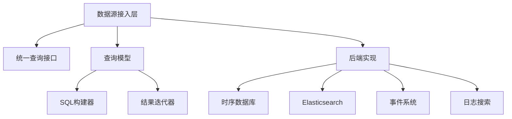
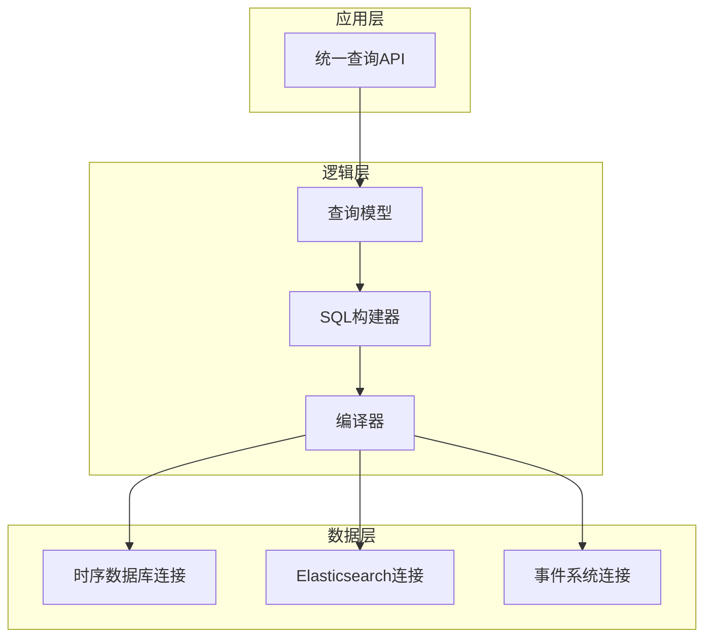
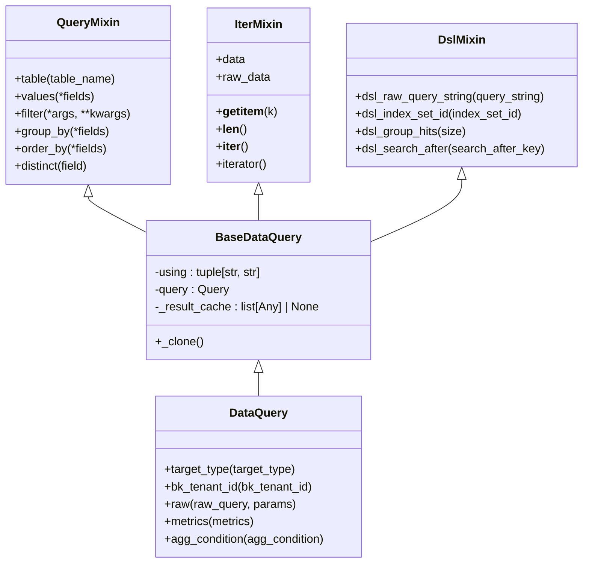
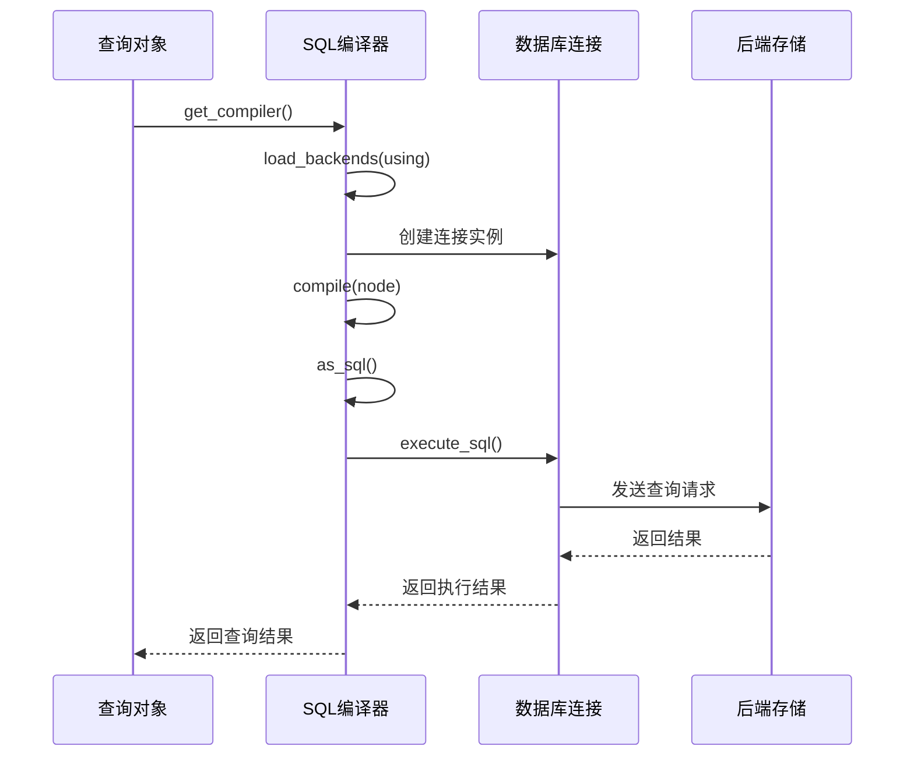
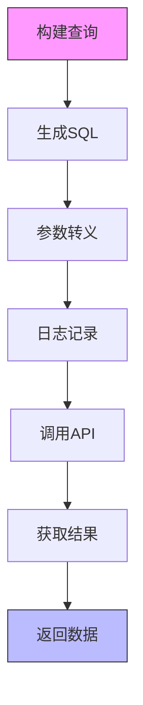
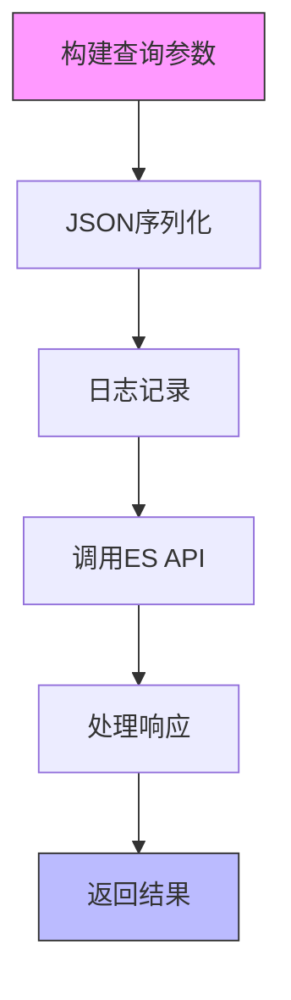
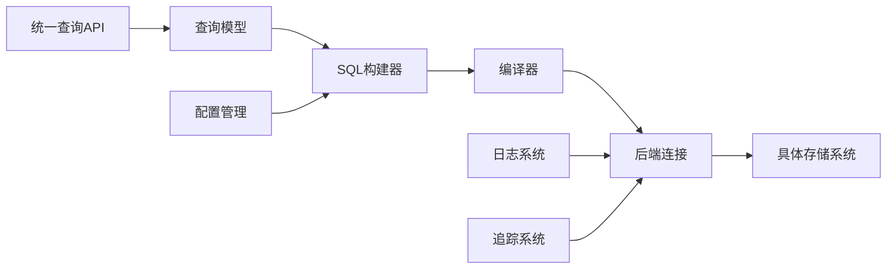

# 数据源接入架构

<cite>
**本文档引用的文件**  
- [operations.py](file://bkmonitor/bkmonitor/data_source/backends/base/operations.py)
- [query.py](file://bkmonitor/bkmonitor/data_source/models/query.py)
- [sql/query.py](file://bkmonitor/bkmonitor/data_source/models/sql/query.py)
- [base/compiler.py](file://bkmonitor/bkmonitor/data_source/backends/base/compiler.py)
- [time_series/connection.py](file://bkmonitor/bkmonitor/data_source/backends/time_series/connection.py)
- [elastic_search/connection.py](file://bkmonitor/bkmonitor/data_source/backends/elastic_search/connection.py)
- [fta_event/connection.py](file://bkmonitor/bkmonitor/data_source/backends/fta_event/connection.py)
</cite>

## 目录
1. [引言](#引言)
2. [项目结构](#项目结构)
3. [核心组件](#核心组件)
4. [架构概览](#架构概览)
5. [详细组件分析](#详细组件分析)
6. [依赖分析](#依赖分析)
7. [性能考虑](#性能考虑)
8. [故障排查指南](#故障排查指南)
9. [结论](#结论)

## 引言
本文档旨在深入解析蓝鲸监控平台的数据源接入层架构，重点分析其抽象设计、多数据源支持机制、统一查询引擎的设计原理以及不同类型数据源的接入流程。通过详细的技术剖析，帮助开发者和运维人员全面理解系统内部工作机制。

## 项目结构
蓝鲸监控平台的数据源接入模块采用分层架构设计，主要包含以下几个核心目录：

- `data_source/backends`：各类数据源后端实现，包括时序数据库、Elasticsearch、事件系统等
- `data_source/models`：数据查询模型与SQL构建器
- `data_source/handler`：数据源处理逻辑
- `data_source/unify_query`：统一查询接口

该结构实现了良好的关注点分离，便于扩展新的数据源类型。

**图示来源**  
- [query.py](file://bkmonitor/bkmonitor/data_source/models/query.py)
- [sql/query.py](file://bkmonitor/bkmonitor/data_source/models/sql/query.py)

## 核心组件
数据源接入层的核心组件包括：

1. **统一查询模型**：提供一致的API接口
2. **SQL构建器**：动态生成查询语句
3. **后端连接器**：与具体存储系统交互
4. **编译器**：查询语句解析与优化
5. **操作模块**：数据库特定操作实现

这些组件共同构成了灵活、可扩展的数据接入框架。

**本节来源**  
- [query.py](file://bkmonitor/bkmonitor/data_source/models/query.py#L1-L280)
- [sql/query.py](file://bkmonitor/bkmonitor/data_source/models/sql/query.py#L1-L432)

## 架构概览
整个数据源接入架构采用典型的分层模式，从上至下分为：

**图示来源**  
- [query.py](file://bkmonitor/bkmonitor/data_source/models/query.py)
- [sql/query.py](file://bkmonitor/bkmonitor/data_source/models/sql/query.py)
- [base/compiler.py](file://bkmonitor/bkmonitor/data_source/backends/base/compiler.py)

## 详细组件分析

### 统一查询引擎分析
统一查询引擎是整个数据源接入层的核心，它通过一系列Mixin类组合实现丰富的查询功能。

#### 查询功能实现

**图示来源**  
- [query.py](file://bkmonitor/bkmonitor/data_source/models/query.py#L1-L280)

**本节来源**  
- [query.py](file://bkmonitor/bkmonitor/data_source/models/query.py#L1-L280)

### 查询DSL解析与优化
查询DSL的解析和优化过程由SQL编译器负责，采用策略模式实现不同数据库的适配。

#### 编译器工作流程

**图示来源**  
- [sql/query.py](file://bkmonitor/bkmonitor/data_source/models/sql/query.py#L1-L432)
- [base/compiler.py](file://bkmonitor/bkmonitor/data_source/backends/base/compiler.py#L1-L86)

**本节来源**  
- [sql/query.py](file://bkmonitor/bkmonitor/data_source/models/sql/query.py#L1-L432)
- [base/compiler.py](file://bkmonitor/bkmonitor/data_source/backends/base/compiler.py#L1-L86)

### 数据源接入流程分析
不同类型的数据源通过统一的接口接入，但具体实现各有特点。

#### 时序数据接入

**图示来源**  
- [time_series/connection.py](file://bkmonitor/bkmonitor/data_source/backends/time_series/connection.py#L1-L72)

#### 日志与事件数据接入

**图示来源**  
- [elastic_search/connection.py](file://bkmonitor/bkmonitor/data_source/backends/elastic_search/connection.py#L1-L55)

**本节来源**  
- [time_series/connection.py](file://bkmonitor/bkmonitor/data_source/backends/time_series/connection.py#L1-L72)
- [elastic_search/connection.py](file://bkmonitor/bkmonitor/data_source/backends/elastic_search/connection.py#L1-L55)
- [fta_event/connection.py](file://bkmonitor/bkmonitor/data_source/backends/fta_event/connection.py)

## 依赖分析
数据源接入层的依赖关系清晰，采用松耦合设计。

**图示来源**  
- [sql/query.py](file://bkmonitor/bkmonitor/data_source/models/sql/query.py)
- [base/compiler.py](file://bkmonitor/bkmonitor/data_source/backends/base/compiler.py)
- [time_series/connection.py](file://bkmonitor/bkmonitor/data_source/backends/time_series/connection.py)

**本节来源**  
- [sql/query.py](file://bkmonitor/bkmonitor/data_source/models/sql/query.py#L1-L432)
- [base/compiler.py](file://bkmonitor/bkmonitor/data_source/backends/base/compiler.py#L1-L86)

## 性能考虑
系统在性能方面做了多项优化：

1. **连接复用**：通过连接池管理数据库连接
2. **查询缓存**：结果集缓存减少重复查询
3. **异步执行**：支持异步查询提高吞吐量
4. **参数转义**：安全的参数处理防止注入攻击
5. **分布式追踪**：集成OpenTelemetry便于性能分析

这些优化确保了系统在高并发场景下的稳定性和响应速度。

## 故障排查指南
常见问题及解决方案：

1. **查询超时**：检查网络连接和后端存储性能
2. **语法错误**：验证查询DSL格式是否正确
3. **权限问题**：确认API密钥和访问权限配置
4. **数据缺失**：检查数据源配置和采集状态
5. **性能下降**：查看分布式追踪信息定位瓶颈

建议结合日志系统和监控指标进行综合分析。

**本节来源**  
- [time_series/connection.py](file://bkmonitor/bkmonitor/data_source/backends/time_series/connection.py#L1-L72)
- [elastic_search/connection.py](file://bkmonitor/bkmonitor/data_source/backends/elastic_search/connection.py#L1-L55)

## 结论
蓝鲸监控平台的数据源接入架构设计精良，具有以下优势：

- **统一接口**：提供一致的查询体验
- **灵活扩展**：易于接入新的数据源类型
- **高性能**：优化的查询执行路径
- **可维护性**：清晰的代码结构和分层设计
- **可观测性**：完善的日志和追踪支持

该架构为构建企业级监控系统提供了坚实的基础。