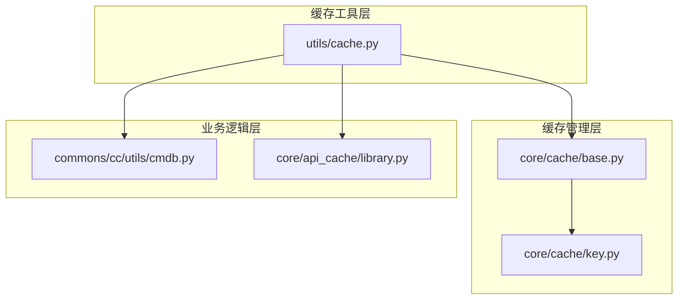
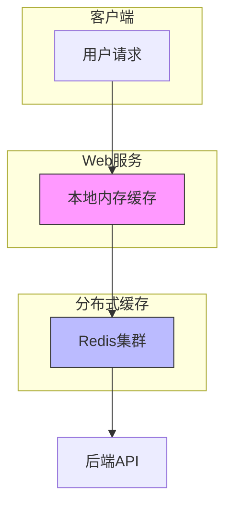
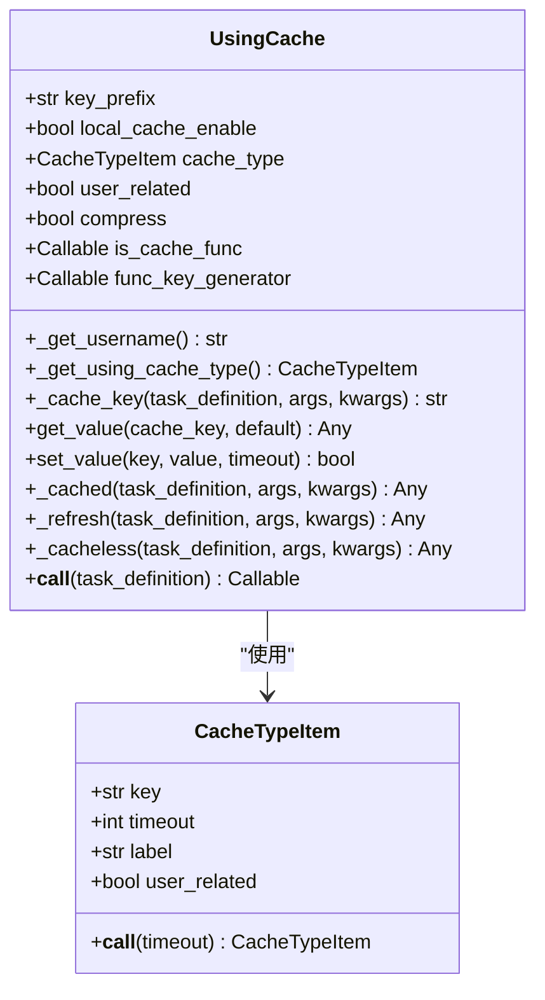
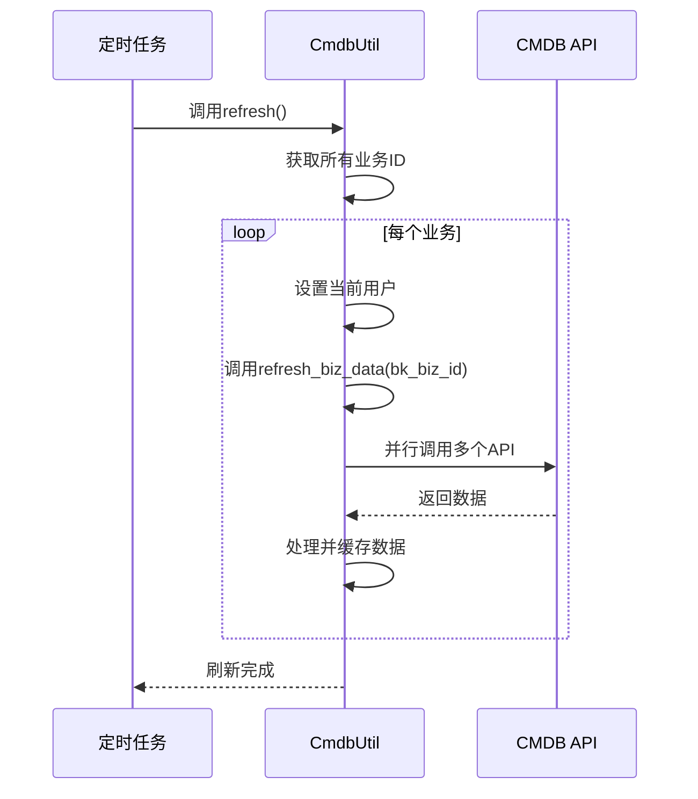
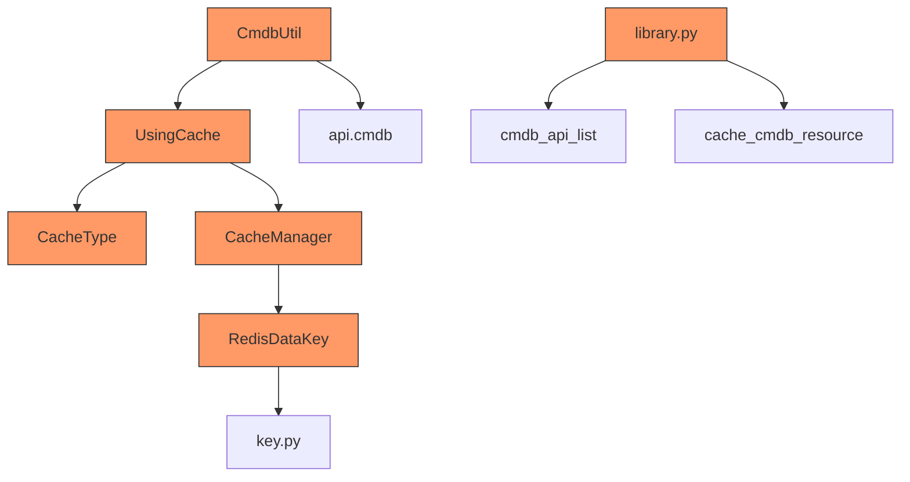

# 数据源缓存机制

<cite>
**本文档引用的文件**   
- [cache.py](file://bkmonitor/bkmonitor/utils/cache.py)
- [base.py](file://bkmonitor/alarm_backends/core/cache/base.py)
- [cmdb.py](file://bkmonitor/packages/monitor_web/commons/cc/utils/cmdb.py)
- [key.py](file://bkmonitor/alarm_backends/core/cache/key.py)
- [library.py](file://bkmonitor/alarm_backends/core/api_cache/library.py)
</cite>

## 目录
1. [引言](#引言)
2. [项目结构](#项目结构)
3. [核心组件](#核心组件)
4. [架构概述](#架构概述)
5. [详细组件分析](#详细组件分析)
6. [依赖分析](#依赖分析)
7. [性能考量](#性能考量)
8. [故障排除指南](#故障排除指南)
9. [结论](#结论)

## 引言
本文档详细阐述了蓝鲸监控平台的数据源缓存系统的设计原理与实现细节。该系统采用多级缓存架构，结合本地内存缓存和分布式Redis缓存，旨在提升数据访问性能并降低后端服务压力。文档将深入分析缓存键的生成策略、命名规范、失效机制以及针对缓存穿透、雪崩、击穿等问题的解决方案。

## 项目结构
蓝鲸监控平台的项目结构清晰，模块化程度高。与缓存相关的代码主要分布在以下几个目录：
- `bkmonitor/bkmonitor/utils/cache.py`：通用缓存工具模块，提供缓存装饰器和基础功能。
- `bkmonitor/alarm_backends/core/cache/`：告警后端核心缓存模块，包含缓存管理基类和具体缓存实现。
- `bkmonitor/alarm_backends/core/api_cache/`：API缓存模块，负责外部API调用结果的缓存。
- `bkmonitor/packages/monitor_web/commons/cc/utils/cmdb.py`：CMDB工具模块，实现了与配置管理数据库相关的缓存逻辑。



**图示来源**
- [cache.py](file://bkmonitor/bkmonitor/utils/cache.py)
- [base.py](file://bkmonitor/alarm_backends/core/cache/base.py)
- [key.py](file://bkmonitor/alarm_backends/core/cache/key.py)
- [cmdb.py](file://bkmonitor/packages/monitor_web/commons/cc/utils/cmdb.py)
- [library.py](file://bkmonitor/alarm_backends/core/api_cache/library.py)

## 核心组件
数据源缓存系统的核心组件包括：
- **UsingCache类**：提供缓存装饰器功能，支持多种缓存模式（默认缓存、强制刷新、忽略缓存）。
- **CacheTypeItem和CacheType类**：定义缓存类型及其超时时间、用户关联性等属性。
- **CacheManager基类**：缓存管理的抽象基类，定义了刷新缓存的接口。
- **RedisDataKey类**：封装Redis键的生成、过期策略和存储后端配置。
- **CmdbUtil类**：具体业务场景下的缓存实现，用于获取CMDB节点信息。

**组件来源**
- [cache.py](file://bkmonitor/bkmonitor/utils/cache.py#L150-L416)
- [base.py](file://bkmonitor/alarm_backends/core/cache/base.py#L15-L46)
- [key.py](file://bkmonitor/alarm_backends/core/cache/key.py#L150-L799)
- [cmdb.py](file://bkmonitor/packages/monitor_web/commons/cc/utils/cmdb.py#L25-L422)

## 架构概述
数据源缓存系统采用多级缓存架构，结合了本地内存缓存和分布式Redis缓存。这种设计既保证了单次请求内的高性能访问，又实现了跨服务实例的数据共享。



**图示来源**
- [cache.py](file://bkmonitor/bkmonitor/utils/cache.py#L150-L416)
- [base.py](file://bkmonitor/alarm_backends/core/cache/base.py#L15-L46)

## 详细组件分析

### UsingCache类分析
`UsingCache`类是缓存系统的核心，它通过装饰器模式为函数提供缓存功能。该类支持三种调用模式：`cached`（默认缓存）、`refresh`（强制刷新）和`cacheless`（忽略缓存）。

#### 缓存键生成策略
缓存键的生成遵循严格的命名规范，确保唯一性和可读性。生成规则如下：
```
{key_prefix}:{cache_type_key}:{func_module}.{func_name}:{args_md5},{kwargs_md5}[{username}]{lang}
```



**图示来源**
- [cache.py](file://bkmonitor/bkmonitor/utils/cache.py#L150-L416)

**组件来源**
- [cache.py](file://bkmonitor/bkmonitor/utils/cache.py#L150-L416)

### CmdbUtil类分析
`CmdbUtil`类展示了如何在具体业务场景中应用缓存机制。该类用于获取CMDB节点信息，并通过缓存减少对后端API的调用频率。

#### 缓存刷新机制
`CmdbUtil`类的缓存刷新机制采用后台定时任务的方式，定期调用`refresh`方法更新所有业务的缓存数据。



**图示来源**
- [cmdb.py](file://bkmonitor/packages/monitor_web/commons/cc/utils/cmdb.py#L25-L422)

**组件来源**
- [cmdb.py](file://bkmonitor/packages/monitor_web/commons/cc/utils/cmdb.py#L25-L422)

## 依赖分析
缓存系统各组件之间的依赖关系清晰，形成了一个层次化的架构。



**图示来源**
- [cache.py](file://bkmonitor/bkmonitor/utils/cache.py)
- [base.py](file://bkmonitor/alarm_backends/core/cache/base.py)
- [key.py](file://bkmonitor/alarm_backends/core/cache/key.py)
- [cmdb.py](file://bkmonitor/packages/monitor_web/commons/cc/utils/cmdb.py)
- [library.py](file://bkmonitor/alarm_backends/core/api_cache/library.py)

## 性能考量
多级缓存架构显著提升了系统的性能表现。本地内存缓存在单次请求内提供了亚毫秒级的响应速度，而分布式Redis缓存则实现了跨实例的数据共享。压缩机制有效减少了网络传输开销，特别是在处理大型数据结构时。

## 故障排除指南
当遇到缓存相关问题时，可以参考以下步骤进行排查：
1. 检查缓存键是否正确生成。
2. 验证缓存超时时间设置是否合理。
3. 确认Redis连接是否正常。
4. 查看日志中是否有缓存操作失败的记录。
5. 检查后台定时任务是否正常运行。

**故障排除来源**
- [cache.py](file://bkmonitor/bkmonitor/utils/cache.py#L150-L416)
- [base.py](file://bkmonitor/alarm_backends/core/cache/base.py#L15-L46)
- [cmdb.py](file://bkmonitor/packages/monitor_web/commons/cc/utils/cmdb.py#L25-L422)

## 结论
蓝鲸监控平台的数据源缓存系统通过多级缓存架构、灵活的缓存策略和完善的刷新机制，有效提升了系统的性能和稳定性。该系统的设计充分考虑了实际业务需求，为大规模监控场景下的数据访问提供了可靠的解决方案。