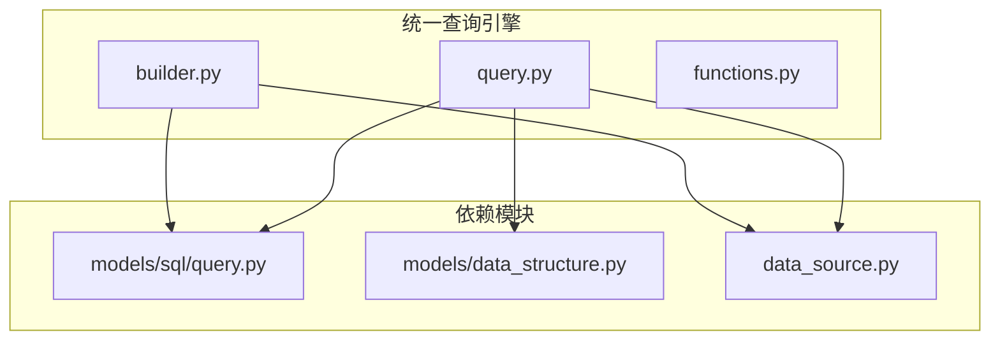
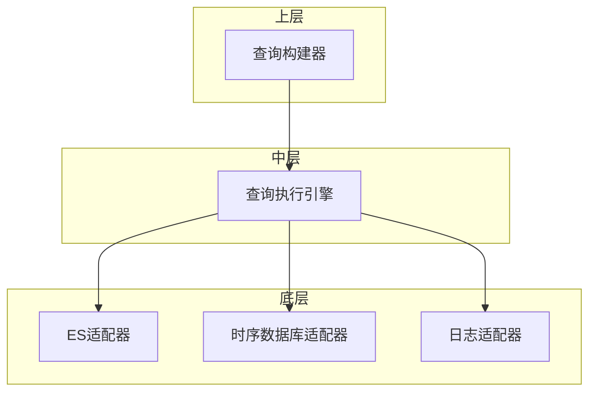
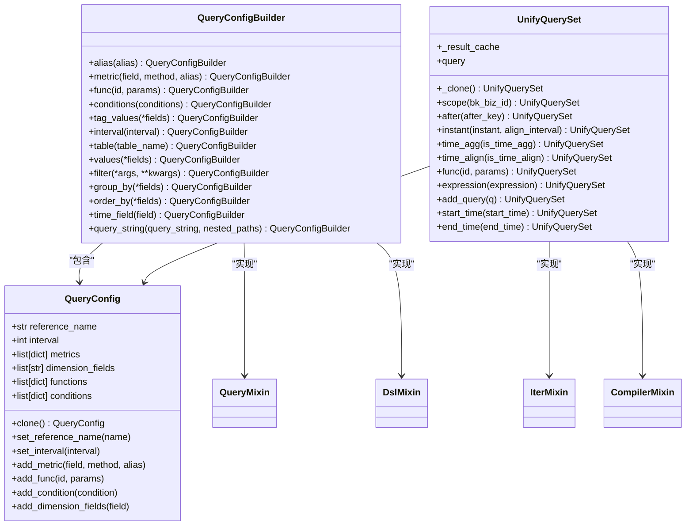
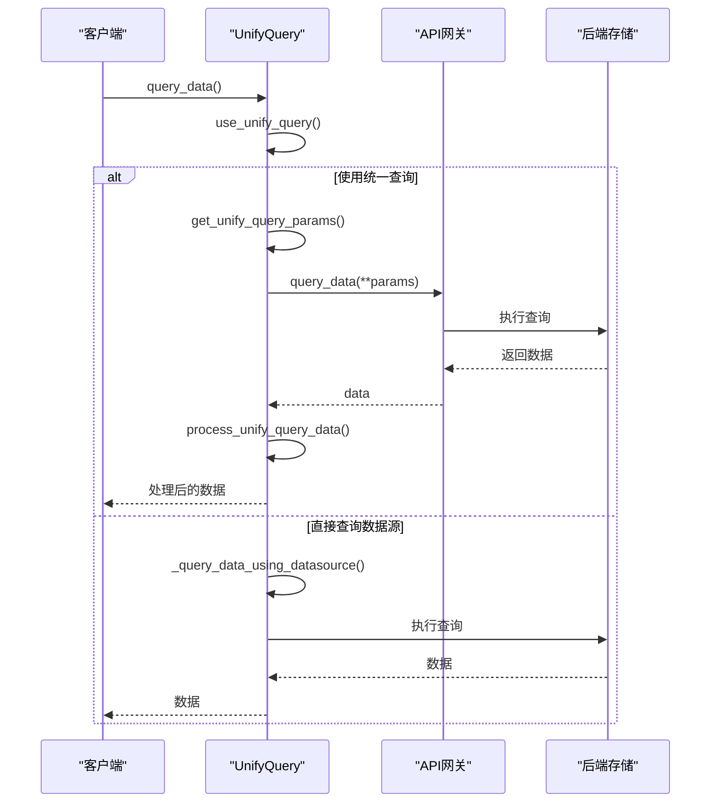
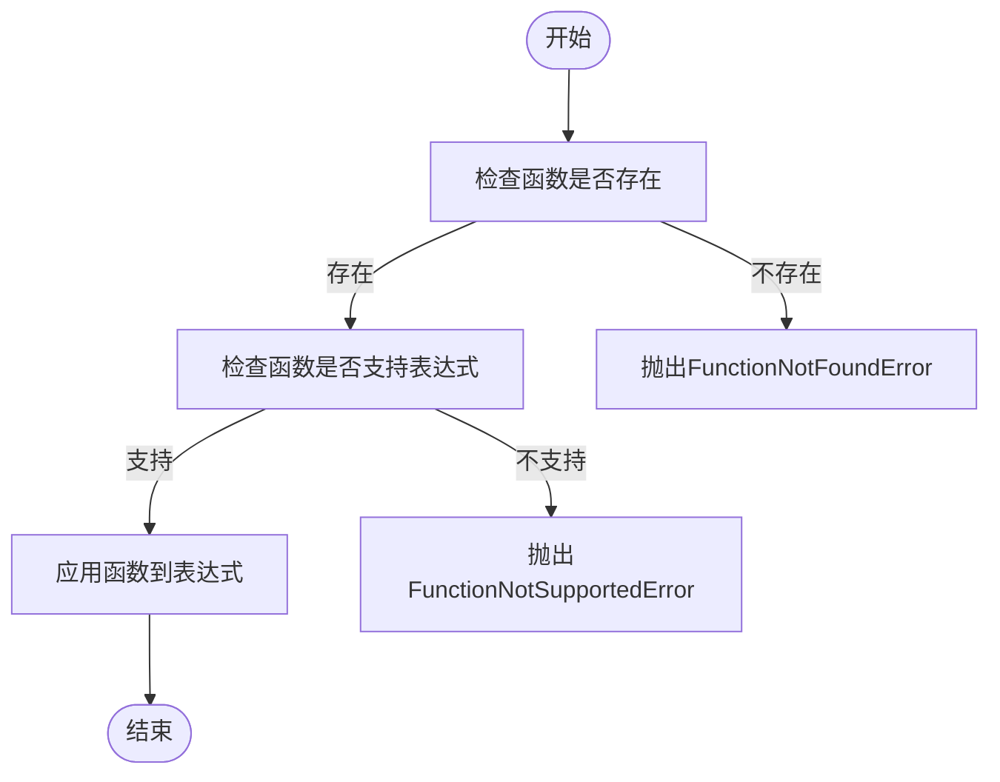
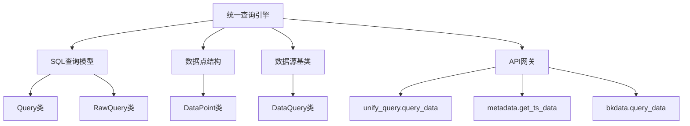

# 统一查询引擎

<cite>
**本文档引用的文件**   
- [builder.py](file://bkmonitor/bkmonitor/data_source/unify_query/builder.py)
- [query.py](file://bkmonitor/bkmonitor/data_source/unify_query/query.py)
- [functions.py](file://bkmonitor/bkmonitor/data_source/unify_query/functions.py)
- [query.py](file://bkmonitor/bkmonitor/data_source/models/sql/query.py)
- [data_structure.py](file://bkmonitor/bkmonitor/data_source/models/data_structure.py)
- [__init__.py](file://bkmonitor/bkmonitor/data_source/__init__.py)
- [data_source.py](file://bkmonitor/bkmonitor/data_source/data_source.py)
</cite>

## 目录
1. [简介](#简介)
2. [项目结构](#项目结构)
3. [核心组件](#核心组件)
4. [架构概述](#架构概述)
5. [详细组件分析](#详细组件分析)
6. [依赖分析](#依赖分析)
7. [性能考量](#性能考量)
8. [故障排除指南](#故障排除指南)
9. [结论](#结论)

## 简介
统一查询引擎是蓝鲸监控平台的核心数据查询模块，旨在为前端数据检索、告警配置以及后台复杂查询场景（如APM服务接口统计）提供统一、高效的数据访问接口。该引擎通过类ORM的查询构建器，将高层查询意图转换为底层存储系统的原生查询语句，支持对多结果表进行聚合查询。其设计目标是提升查询逻辑的可维护性和可读性，通过复用已有数据源模块，实现ES和UnifyQuery的统一查询能力。

## 项目结构
统一查询引擎位于`bkmonitor/data_source/unify_query`目录下，主要由三个核心Python文件构成：`builder.py`、`query.py`和`functions.py`。`builder.py`负责查询构建器的实现，提供类ORM的查询语法；`query.py`包含查询执行引擎和调度策略；`functions.py`定义了查询优化器支持的函数和优化机制。该引擎依赖于`bkmonitor/data_source/models/sql/query.py`中的SQL查询模型和`bkmonitor/data_source/models/data_structure.py`中的数据点结构。

**图源**
- [builder.py](file://bkmonitor/bkmonitor/data_source/unify_query/builder.py)
- [query.py](file://bkmonitor/bkmonitor/data_source/unify_query/query.py)
- [functions.py](file://bkmonitor/bkmonitor/data_source/unify_query/functions.py)
- [query.py](file://bkmonitor/bkmonitor/data_source/models/sql/query.py)
- [data_structure.py](file://bkmonitor/bkmonitor/data_source/models/data_structure.py)
- [data_source.py](file://bkmonitor/bkmonitor/data_source/data_source.py)

## 核心组件
统一查询引擎的核心组件包括查询构建器（QueryBuilder）、查询执行引擎（Query Engine）和查询优化器（Query Optimizer）。查询构建器提供类ORM的API，允许用户以链式调用的方式构建查询；查询执行引擎负责调度查询到不同的数据源，并处理查询结果；查询优化器则通过谓词下推、字段裁剪等技术优化查询性能。这些组件协同工作，实现了从高层查询意图到底层存储系统原生查询语句的转换。

**组件源**
- [builder.py](file://bkmonitor/bkmonitor/data_source/unify_query/builder.py#L159-L533)
- [query.py](file://bkmonitor/bkmonitor/data_source/unify_query/query.py#L407-L441)
- [functions.py](file://bkmonitor/bkmonitor/data_source/unify_query/functions.py#L1-L510)

## 架构概述
统一查询引擎的架构采用分层设计，上层是类ORM的查询构建器，中层是查询执行引擎，底层是与具体数据源交互的适配器。查询构建器将用户输入的查询条件转换为内部查询配置对象，查询执行引擎根据配置决定使用统一查询模块还是直接查询数据源，并将查询请求分发到相应的数据源适配器。查询结果经过统一的处理和格式化后返回给调用者。这种架构实现了查询逻辑与数据源细节的解耦，提高了系统的可扩展性和可维护性。

**图源**
- [builder.py](file://bkmonitor/bkmonitor/data_source/unify_query/builder.py)
- [query.py](file://bkmonitor/bkmonitor/data_source/unify_query/query.py)

## 详细组件分析

### 查询构建器分析
查询构建器是统一查询引擎的入口，提供类ORM的API。用户可以通过链式调用`metric()`、`filter()`、`group_by()`等方法构建查询。`QueryConfigBuilder`类继承自`BaseDataQuery`、`QueryMixin`和`DslMixin`，复用了已有的查询功能。`QueryConfig`类用于存储单个查询配置，包括指标、条件、分组等信息。`UnifyQuerySet`类是查询的最终执行对象，封装了查询配置和执行方法。

#### 类图

**图源**
- [builder.py](file://bkmonitor/bkmonitor/data_source/unify_query/builder.py#L1-L534)

### 查询执行引擎分析
查询执行引擎负责调度查询到不同的数据源。`UnifyQuery`类是查询执行的核心，其`use_unify_query()`方法根据查询条件判断是否使用统一查询模块。如果查询涉及多指标、表达式或特定函数，则使用统一查询模块；否则直接查询数据源。`_query_unify_query()`、`_query_reference_using_unify_query()`和`_query_log_using_unify_query()`方法分别处理不同类型的数据查询。查询结果通过`process_unify_query_data()`和`process_unify_query_log()`方法进行统一处理。

#### 序列图

**图源**
- [query.py](file://bkmonitor/bkmonitor/data_source/unify_query/query.py#L407-L441)

### 查询优化器分析
查询优化器通过支持多种函数和优化机制来提升查询性能。`functions.py`文件定义了`Function`、`Params`、`AggMethod`等数据类，用于描述函数的元信息。`Functions`字典包含了所有支持的函数，如`rate`、`irate`、`increase`等时间聚合函数，`topk`、`bottomk`等排序函数，以及`abs`、`ceil`等数学计算函数。`add_expression_functions()`函数负责将函数应用到表达式上，实现查询优化。

#### 流程图

**图源**
- [functions.py](file://bkmonitor/bkmonitor/data_source/unify_query/functions.py#L1-L510)

## 依赖分析
统一查询引擎依赖于多个模块，包括`bkmonitor/data_source/models/sql/query.py`中的SQL查询模型，`bkmonitor/data_source/models/data_structure.py`中的数据点结构，以及`bkmonitor/data_source/data_source.py`中的数据源基类。`load_backends()`函数根据数据源和数据类型动态加载相应的后端模块，实现了与具体数据源的解耦。`UnifyQuery`类通过`api.unify_query.query_data`等API与后端存储交互，确保了查询的灵活性和可扩展性。

**图源**
- [query.py](file://bkmonitor/bkmonitor/data_source/unify_query/query.py)
- [query.py](file://bkmonitor/bkmonitor/data_source/models/sql/query.py)
- [data_structure.py](file://bkmonitor/bkmonitor/data_source/models/data_structure.py)
- [data_source.py](file://bkmonitor/bkmonitor/data_source/data_source.py)

## 性能考量
统一查询引擎通过多种机制优化查询性能。首先，通过`use_unify_query()`方法智能选择查询策略，避免不必要的统一查询开销。其次，支持谓词下推和字段裁剪，减少数据传输量。再者，通过`ThreadPool().map_ignore_exception()`实现并行查询，提高查询效率。最后，使用`metrics.DATASOURCE_QUERY_TIME`和`metrics.DATASOURCE_QUERY_COUNT`监控查询性能，为性能调优提供数据支持。

## 故障排除指南
当查询失败时，首先检查`use_unify_query()`方法的返回值，确认查询策略是否正确。其次，查看`UNIFY_QUERY`日志，确认查询参数是否正确。如果查询涉及函数，检查函数名称和参数是否正确。对于性能问题，可以通过`metrics`监控查询时间和次数，定位瓶颈。对于数据源问题，检查`load_backends()`函数是否正确加载了后端模块。

**组件源**
- [query.py](file://bkmonitor/bkmonitor/data_source/unify_query/query.py#L407-L441)
- [builder.py](file://bkmonitor/bkmonitor/data_source/unify_query/builder.py#L159-L533)

## 结论
统一查询引擎通过类ORM的查询构建器、灵活的查询执行引擎和强大的查询优化器，为蓝鲸监控平台提供了高效、统一的数据查询能力。其分层架构和模块化设计确保了系统的可扩展性和可维护性。通过深入理解其架构设计和执行流程，开发者可以更好地利用该引擎，实现复杂的数据查询需求。